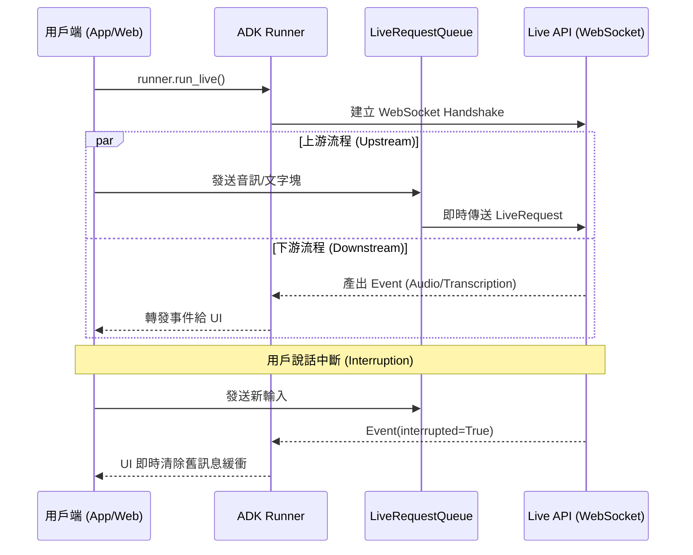

# WebSocket (WS) 雙向通訊

在現代生成式 AI 應用中，低延遲與實時互動是區分「工具」與「夥伴」的關鍵。傳統 HTTP 請求或 Server-Sent Events (SSE) 雖然能處理 Token 串流，但本質上仍受到「一問一答」或「單向傳輸」的限制。WebSocket (WS) 透過建立持久化的 TCP 連接，實現了全雙工 (Full-duplex) 的通訊通道，讓用戶與 AI 能夠同時說話、傾聽並隨時中斷對話。Google ADK 的 `StreamingMode.BIDI` 封裝了這些複雜性，讓開發者能以極低門檻構建具備人類反應速度的語音與多模態應用。

---

### 情境 1：在實時語音與中斷控制場景下優先選用 BIDI 模式

**核心概念**：
當應用需要支持語音通話或視覺即時分析時，單向的串流已不足夠。BIDI 模式允許用戶在 AI 正在生成回應時發送新的音訊或文字，而 Live API 會立即偵測到此行為並返回 `interrupted=True` 標記。這對於構建自然的語音對話系統至關重要，因為它模擬了人類對話中的「插話」機制。

**程式碼範例**：

```python
# ❌ Bad: 使用單向 SSE 模式，無法在 AI 回應期間接收用戶控制訊號或中斷
run_config = RunConfig(streaming_mode=StreamingMode.SSE) # 僅能單向接收
async for event in runner.run(..., run_config=run_config):
    process_text(event) # 無法處理語音中斷

# ✅ Better: 使用 BIDI 模式配合 LiveRequestQueue 實現全雙工互動
run_config = RunConfig(
    streaming_mode=StreamingMode.BIDI,
    response_modalities=["AUDIO"] # 啟用語音回應
)
live_queue = LiveRequestQueue()

# 應用程序可以同時執行 upstream (發送) 與 downstream (接收) 任務
async def downstream_handler():
    async for event in runner.run_live(..., live_request_queue=live_queue, run_config=run_config):
        if event.interrupted: # 即時偵測用戶插話
            stop_audio_playback() # 停止播放舊音訊
        process_event(event)
```

**為什麼 (Rationale)**：
BIDI 模式建立了雙向的數據流，解決了傳統 HTTP 模型中「發送請求後必須等待」的阻塞問題。透過 `LiveRequestQueue` 緩衝上游請求，AI 可以在處理先前輸入的同時接收新數據，這在處理連續音訊流或影像影格時尤為高效。

---

### 情境 2：在 `finally` 區塊中顯式調用 `close()` 確保連線釋放

**核心概念**：
WebSocket 是狀態化 (Stateful) 的連接。在 Google ADK 中，`LiveRequestQueue` 是會話特定的資源。如果應用在連線結束或出錯時未顯式調用 `close()`，後端的 Live API 會話可能不會立即釋放，導致「喪屍會話 (Zombie Sessions)」佔用併發配額，最終引發 `RESOURCE_EXHAUSTED` 錯誤。

**程式碼範例**：

```python
# ❌ Bad: 僅依賴 for 迴圈結束，未處理異常情況下的資源清理
async def run_chat():
    async for event in runner.run_live(..., live_request_queue=live_queue):
        yield event
    # 如果中間發生網路異常，close() 將永遠不會被執行

# ✅ Better: 使用 try...finally 結構保證 close 訊號的發送
try:
    await asyncio.gather(
        upstream_task(live_queue), # 處理發送
        downstream_task(runner.run_live(..., live_request_queue=live_queue)) # 處理接收
    )
finally:
    # 顯式發送關閉訊號給 Live API 以釋放配額
    live_queue.close()
```

**適用場景與規則**：
*   **拇指法則**：只要使用 `StreamingMode.BIDI`，手動關閉 `LiveRequestQueue` 是非編程要求中的最高準則。
*   **例外情況**：在 `StreamingMode.SSE` 中，ADK 會在收到 `turn_complete=True` 後自動清理，不需手動干預。

---

### 情境 3：利用 `gather` 模式分離併發的上游與下游處理

**核心概念**：
WebSocket 通訊本質上是高度併發的。為了充分發揮 BIDI 的效能，必須將「從用戶端接收並轉發給 AI (Upstream)」與「從 AI 接收並轉發給用戶端 (Downstream)」的邏輯分離為兩個並行的任務。

**比較與整合 (SSE vs BIDI)**：

| 特性         | SSE (StreamingMode.SSE)      | BIDI (StreamingMode.BIDI)    |
| :----------- | :--------------------------- | :--------------------------- |
| **通訊協定** | 標準 HTTP 串流               | WebSocket (Full-duplex)      |
| **互動模式** | 用戶發送完畢後才開始串流回應 | 雙向同時傳輸，支持隨時中斷   |
| **最佳用途** | 文字聊天、簡單摘要           | 語音對話、視頻分析、實時協作 |
| **延遲等級** | 秒級 (受 HTTP 限制)          | 毫秒級 (TCP 連接優化)        |

#### BIDI 雙向流動生命週期流程圖


---

### 底層原理探討與權衡

*   **二進位影格效能 (Binary Frames)**：WebSocket 支援傳送 `Blob` (二進位影格)，這比將音訊進行 Base64 編碼後封裝在 JSON 中快約 33% 且節省頻寬。在生產環境中，應優先選擇傳送二進位音訊數據。
*   **會話恢復 (Session Resumption)**：Live API 通常有約 10 分鐘的連線時間限制。ADK 透過 `SessionResumptionConfig` 自動緩存恢復句柄 (Handle)，在連線斷開時能夠在不遺失對話歷史的情況下透明地重新連線。
*   **VAD (語音活動檢測)**：預設情況下 Live API 具備自動 VAD 功能，能判斷用戶何時說完話。若在嘈雜環境下，開發者應在 `RunConfig` 中關閉自動 VAD，改採「按鍵發話 (Push-to-talk)」模式並手動發送 `activity_start/end` 訊號。

---

### 延伸思考

**1️⃣ 問題一**：為什麼 BIDI 模式不支持同時返回 `TEXT` 與 `AUDIO`？

**👆 回答**：這源於 Live API 的架構限制，每個會話必須鎖定一個主要回應模式。然而，您可以啟用「音訊轉錄 (Audio Transcription)」功能。這樣即便在 `AUDIO` 模式下，模型仍會異步返回 `output_transcription` 事件，讓 UI 同時顯示文字與播放聲音。

---

**2️⃣ 問題二**：在 BIDI 模式下，如果我的自定義工具執行非常緩慢會發生什麼？

**👆 回答**：ADK 在 streaming 模式下會並行執行多個工具調用。因為是異步的，緩慢的工具調用不會阻塞音訊流的播放。AI 可以一邊說「正在幫您查詢數據...」一邊在背景執行耗時任務。

---

**3️⃣ 問題三**：針對多租戶應用，如何確保各連線的 Quota (配額) 不會互相干擾？

**👆 回答**：Vertex AI Live API 的併發上限通常為 1,000 個會話。資深架構師應實施「會話池管理 (Session Pooling)」或「請求排隊 (Queueing)」模式，在連線數接近上限時，於 `Phase 2: Session Initialization` 階段就將用戶放入等待隊列，避免觸發後端的硬性拒絕連線。