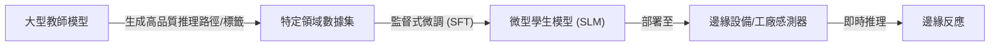

# 小語言模型 (SLM) 邊緣部署

在軟體架構的演進中，我們正經歷從「雲端集中化」向「邊緣分散化」的範式轉移。對於生成式 AI，雖然強大的旗艦模型（如 Gemini 2.5 Pro）具備驚人的推理能力，但其高昂的硬體成本、網路延遲以及資料隱私風險，使得它在某些工業與行動場景中顯得力不從心。小語言模型（Small Language Models, SLM）透過減少參數量（通常為數百萬至數十億級別），在犧牲部分通用知識的同時，換取了在邊緣設備上運行的可能性。

作為一名架構師，你的目標不是選擇「最強」的模型，而是選擇「最適合特定約束」的模型。

---

### 情境 1：在即時互動場景中優先選用 SLM 以降低首字時間 (TTFT)

**核心概念**：
用戶對於互動式應用的耐心極其有限。研究顯示，如果首字時間（Time to First Token, TTFT）超過 10 秒，用戶往往會放棄該會話。SLM 因為參數量小，計算壓力低，能顯著降低延遲，提供近乎瞬時的反應，這對於語音助理或實時翻譯至關重要。

**程式碼範例**：

```python
# ❌ Bad: 依賴雲端旗艦模型處理簡單的互動任務，導致網路延遲不穩定
# 每次請求都需要等待雲端 API 往返
agent = Agent(
    model="gemini-2.5-pro", # 雖然強大但延遲較高
    name="slow_assistant",
    instruction="你是一個簡單的歡迎助手。"
)

# ✅ Better: 使用 Google ADK 配合 LiteLlm 調用本地運行的 SLM (如 Gemma 2B)**
from google.adk.agents import Agent
from google.adk.models.lite_llm import LiteLlm

# 使用本地 Ollama 託管的 Gemma 3，消除網路延遲
root_agent = Agent(
    model=LiteLlm(model="ollama_chat/gemma3:2b"),
    name="fast_edge_assistant",
    instruction="你是一個運行在邊緣設備的快速助手，負責即時回應。",
    tools=[get_local_time, check_device_status]
)
```

**底層原理探討與權衡**：
*   **為什麼（Rationale）**：SLM 可以在資源受限的環境（如手機或嵌入式設備）中運行，繞過了雲端推理所需的佇列等待與網路傳輸時間。
*   **權衡**：SLM 的通識能力較弱，但在特定任務（如簡單對話或 API 調用）上，其效能與成本比極高。

---

### 情境 2：實施模型量化 (Quantization) 以克服邊緣設備的內存障礙

**核心概念**：
邊緣設備面臨最嚴峻的挑戰是「記憶體牆」。一個 7B 參數模型使用 FP32 精度需要 28GB VRAM，這超出了大多數消費級 GPU 的極限。量化技術（如 4-bit 量化）能將參數大小壓縮至原本的 1/4 甚至 1/8，使模型能嵌入小型設備中。

**比較與整合 (SLM vs. LLM)**：

| 特性         | 小語言模型 (SLM)      | 大語言模型 (LLM)             |
| :----------- | :-------------------- | :--------------------------- |
| **參數量**   | 百萬至數十億          | 數十億至數兆                 |
| **計算成本** | 極低 (適合邊緣/手機)  | 極高 (需要專用 GPU/TPU 叢集) |
| **延遲**     | 非常低 (適合即時互動) | 較高 (受限於網路與複雜計算)  |
| **主要優勢** | 速度、隱私、離線存取  | 強大的推理、創造力與通識     |

---

### 情境 3：透過模型蒸餾 (Distillation) 補足 SLM 的專業推理能力

**核心概念**：
如果你發現 SLM 無法處理複雜的邏輯（如生成高品質的程式碼註解），不應直接切換回 LLM，而應考慮「蒸餾」。這是一種教師-學生架構，讓大型模型產出的高品質資料來訓練小型模型，使其在特定領域的表現逼近大型模型。

**推理流程圖**：


**拇指法則 (Rule of Thumb)**：
*   如果應用需要在斷網環境下運作（如工業感測器、救災現場），**SLM 是唯一的選擇**。
*   如果任務是單一且明確的（如擷取發票中的日期），**應優先使用經蒸餾的 SLM** 以節省營運成本。
*   **例外情況**：當任務涉及高度模糊的跨領域推理或需要極強的零樣本（Zero-shot）生成能力時，仍需依賴雲端 LLM。

---

### 延伸思考

**1️⃣ 問題一**：量化模型後的性能損失 (Accuracy Loss) 是否會影響生產環境？

**👆 回答**：在實務中，4-bit 量化（如 GPTQ 或 nf4 格式）對於模型性能的影響微乎其微，通常僅在複雜推理的指標上略有下降，但換取的顯存節省與速度提升完全足以補償這點損失。資深架構師會優先通過「量化」讓模型「跑得起來」，再透過「提示工程」來優化產出。

---

**2️⃣ 問題二**：如何確保邊緣部署的模型不會洩漏企業敏感資料？

**👆 回答**：這正是邊緣部署的最大優勢。由於推理完全在本地硬體執行，資料不需要離開防火牆或傳輸至第三方供應商的雲端。你可以進一步配合 VPC Service Controls (VPC-SC) 與 Model Armor，在邊緣端就攔截敏感內容的生成。

---

**3️⃣ 問題三**：Google ADK 如何簡化 SLM 的開發流程？

**👆 回答**：ADK 提供了 `BaseLlm` 抽象層，讓你可以無痛切換底層引擎。開發時你可以使用雲端的 Gemini Pro 快速驗證邏輯，生產部署時只需更改環境變數 `DEMO_AGENT_MODEL` 並切換至 `LiteLlm` 對接本地量化後的 Gemma 模型，即可完成邊緣轉型，完全不需要改動核心 Agent 邏輯。