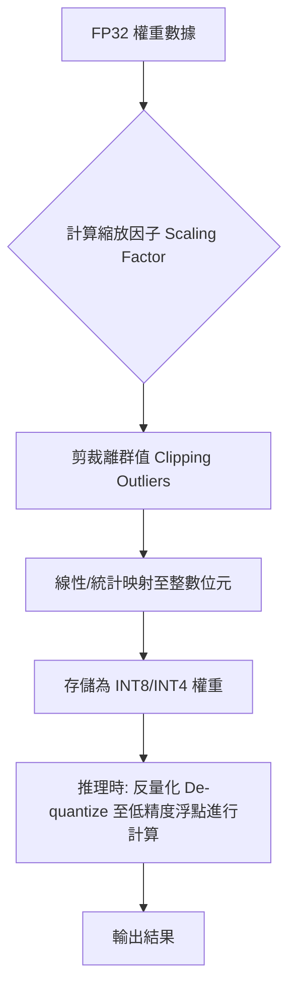

# 模型量化技術

在構建生產級 AI 系統時，架構師面臨的最大挑戰往往不是「模型夠不夠聰明」，而是「硬體能不能跑得動」。大型語言模型 (LLM) 動輒數十億甚至數千億的參數，這帶來了沉重的內存負擔與推理延遲。**量化技術 (Quantization)** 透過將高精度的浮點數（如 FP32）映射到低位元的數值（如 INT8 或 INT4），有效地縮小了模型體積並提升了運算效率。這不僅是性能優化，更是讓模型從昂貴的 GPU 集群走向消費級硬體與邊緣設備的關鍵。

---

### 情境 1：優先使用 4-bit 量化 (INT4) 克服單 GPU 內存限制

**核心概念**：
LLM 通常以 FP32 格式存儲權重，每參數佔用 4 Bytes。一個 70B 參數的模型需要約 280GB 內存，遠超單張 H100 (80GB) 的極限。量化到 4-bit (INT4) 則可將需求降至約 35GB，使其能在單張 80GB GPU 上運行，甚至留有空間處理 KV 快取。

**程式碼範例**：

```python
# ❌ Bad: 嘗試加載全精度模型，在標準 GPU 上會導致 Out-Of-Memory (OOM)
from transformers import AutoModelForCausalLM
model = AutoModelForCausalLM.from_pretrained("llama-70b") # 預設 FP32/FP16，極易崩潰

# ✅ Better: 使用 BitsAndBytesConfig 實現 4-bit 量化加載 (QLoRA 風格)
import torch
from transformers import AutoModelForCausalLM, BitsAndBytesConfig

# 配置 4-bit 量化參數以節省 75% 以上的 VRAM
quantization_config = BitsAndBytesConfig(
    load_in_4bit=True,
    bnb_4bit_compute_dtype=torch.float16, # 計算時轉回 FP16 以保持穩定性
    bnb_4bit_quant_type="nf4",            # 使用 Normal Float 4 優化統計屬性
    bnb_4bit_use_double_quant=True        # 對量化常數再次量化，進一步節省空間
)

model = AutoModelForCausalLM.from_pretrained(
    "llama-70b",
    quantization_config=quantization_config,
    device_map="auto" # ADK 與 Transformers 會自動跨卡分配
)
```

**底層原理探討與權衡**：
*   **為什麼 (Rationale)**：內存頻寬 (Memory Bandwidth) 往往是推理速度的真正瓶頸。處理器從內存讀取權重的速度跟不上計算速度。量化減少了需要移動的數據量，從而打破了「內存牆」。
*   **權衡**：量化是有損壓縮。雖然研究顯示 4-bit 量化的精確度損失通常可以忽略不計，但在極端複雜的邏輯推理中，仍可能出現微小性能下滑。

---

### 情境 2：針對邊緣設備部署，優先選用 GGUF 格式

**核心概念**：
當需要在手機或個人電腦 (CPU/GPU 混合環境) 上運行模型時，傳統的 PyTorch 格式過於臃腫。GGUF 是目前邊緣部署的最佳實踐，它支持模型量化後的跨平台、跨硬體運行，並允許將部分層分配到 GPU，剩餘部分留在 CPU 執行。

**比較與整合 (精度 vs 內存空間)**：

根據來源提供的 Llama 模型數據，我們可以整理出量化對資源需求的影響：

| 格式 | 每參數位元數 (bits) | 70B 模型大小 (約略) | 推薦硬體 |
| :--- | :--- | :--- | :--- |
| **FP32** | 32 bits | 280 GB | 多卡 GPU 集群 (H100 x 4) |
| **FP16** | 16 bits | 140 GB | 雙卡 80GB GPU |
| **INT8** | 8 bits | 70 GB | 單卡 80GB GPU |
| **INT4 (Q4_K_M)** | 4 bits | 35-40 GB | 單卡 40GB GPU 或 高階 Mac/PC |
| **INT2** | 2 bits | ~28 GB | 邊緣設備 (精度損耗較明顯) |

**拇指法則 (Rule of Thumb)**：
*   如果內存足夠，**INT8 是兼顧精確度與性能的「金髮姑娘」平衡點**。
*   對於資源極度受限的環境，**4-bit (Q4) 是目前的工程標準**，能在最小損失下獲得最大回報。

---

### 情境 3：在多代理人 (Multi-agent) 系統中對非核心 Agent 進行量化優化

**核心概念**：
在 Google ADK 的 `ParallelAgent` 或 `Agent Swarm` 架構中，系統可能同時啟動多個專家代理人。若所有代理人都使用全精度模型，會導致顯存迅速耗盡。架構師應識別「意圖分類器」或「總結代理人」等輔助角色，並對其模型進行量化。

**ADK 應用範例 (Google ADK 環境)**：

```python
from google.adk.agents import Agent
from google.adk.models.lite_llm import LiteLlm

# ✅ Better: 對輔助代理人使用本地量化模型 (如透過 Ollama 或 vLLM 加載的 4-bit 模型)
# 這能顯著降低整個代理人團隊的運行成本與啟動時間
intent_agent = Agent(
    model=LiteLlm(model="ollama/gemma3:2b-q4_K_M"), # 使用 Q4 量化版本
    name="intent_classifier",
    instruction="你負責分析用戶意圖並分配任務，請保持極速回應。"
)
```

---

### 更多說明 (量化流程圖)

量化本質上是將連續的浮點分布「壓縮」到離散的整數槽位中。



---

### 延伸思考

**1️⃣ 問題一**：量化感知訓練 (QAT) 與後訓練量化 (PTQ) 有何不同？

**👆 回答**：PTQ 是在模型訓練完成後直接進行權重轉換，速度快但不考慮精度補償。QAT 則是在訓練過程中就模擬低精度損耗，讓模型在權重更新時主動適應量化誤差，因此 QAT 產生的模型精度通常優於 PTQ，特別是在 INT4 以下的極低位元場景。

---

**2️⃣ 問題二**：為什麼在 Transformer 架構中，KV Cache 的量化同樣重要？

**👆 回答**：在長對話 (Long Context) 場景中，KV Cache 的增長是內存壓力的主因。例如 13B 模型每 Token 需佔用大量 VRAM。ADK 支持的 **PagedAttention** 技術結合 KV Cache 量化，能將快取切分為更小的頁面並壓縮存儲，從而支持更高併發的用戶請求而不崩潰。

---

**3️⃣ 問題三**：量化會影響模型的「幻覺 (Hallucination)」機率嗎？

**👆 回答**：適度的量化 (INT8/INT4) 通常不會顯著增加幻覺。然而，若過度壓縮（如 2-bit 或 1-bit），模型的統計分布會嚴重失真，導致語意邏輯斷裂或產生無意義的內容。對於高敏感任務，應搭配 ADK 的 `hallucinations_v1` 評估準則或 **Self-Check** 模式來監控量化後的回應質量。