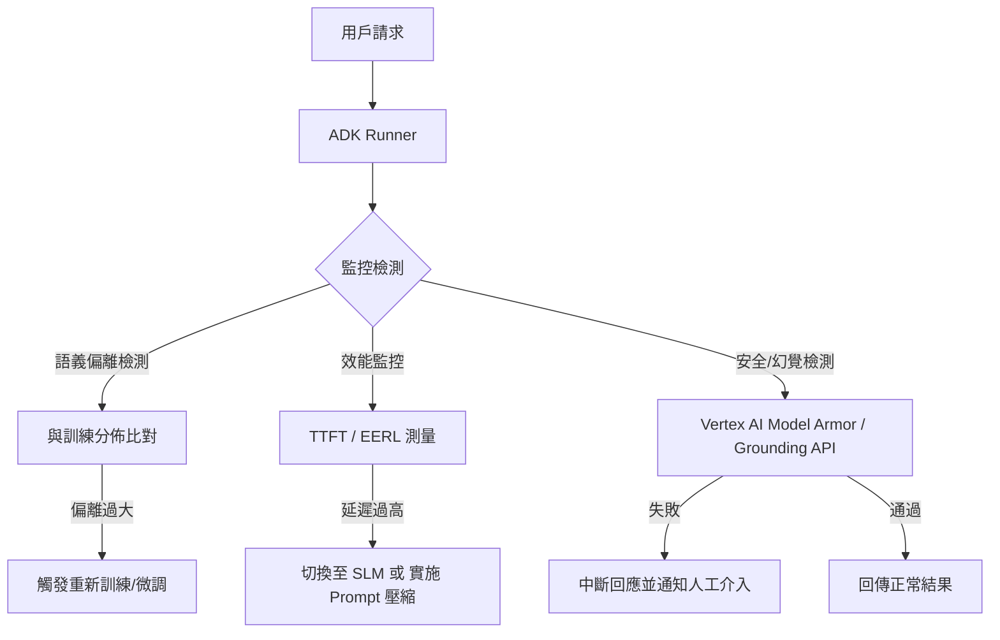

# 推論分佈測試與退化監控

在生成式 AI 的生產環境中，**「部署即完成」是一個危險的幻覺**。模型推論品質會隨著時間因用戶行為改變、語言演進或底層 API 的靜默更新而產生**退化（Degradation）**或**偏離（Drift）**。資深架構師必須建立一套嚴密的監控體系，確保 Agent 保持完整與一致性的高品質輸出。

---

### 情境 1：優先監控語義偏離 (Semantic Drift) 而非僅追蹤錯誤率

**核心概念**：
傳統監控專注於 HTTP 500 錯誤或延遲，但在 AI 領域，模型可能在不報錯的情況下給出無意義的回答。語義偏離監控要求我們測量用戶輸入與原始訓練/評估分佈之間的距離，及早發現模型進入「未知領域」的情形。

**程式碼範例**：

```python
# ❌ Bad: 僅監控異常錯誤，忽略了模型回答品質的靜默下滑
try:
    response = runner.run(user_id, session_id, prompt)
except Exception as e:
    log_error(e) # 只有當系統崩潰時才會發現問題

# ✅ Better: 使用 ADK Callback 記錄語義特徵與評分，檢測 Concept Drift
from google.adk.agents import Agent
from google.adk.events import Event

def monitor_quality_callback(ctx, event: Event):
    # 利用 ADK 內建的 hallucinations_v1 準則進行即時檢測
    if event.is_final_response():
        # 記錄 Token 使用量與延遲，作為成本與效能退化的基礎指標
        usage = event.usage_metadata
        latency = event.latency_ms
        save_to_telemetry(
            prompt=ctx.session.events[-1].content,
            response=event.content,
            tokens=usage.total_token_count,
            latency=latency.total_ms
        )

agent = Agent(
    name="monitored_agent",
    after_agent_callbacks=[monitor_quality_callback] # 非侵入式監控
)
```

**為什麼 (Rationale)**：
語義偏離通常早於任務失敗出現。透過監控 **首字時間 (TTFT)** 與 **端到端延遲 (EERL)** 的分佈，我們可以識別是否因為 context 增長或後端過載導致用戶體驗退化。

---

### 情境 2：建立「金標數據集」(Golden Dataset) 實施定期回歸測試

**核心概念**：
模型版本更新（例如從 Gemini 2.0 升級至 2.5）可能會引發回歸（Regression），原本能解的問題突然失效。必須針對核心業務場景建立一套固定的測試案例集，並使用 `adk eval` 工具定期跑測。

**比較表：監控指標與退化訊號**

| 指標名稱 | 退化訊號 (Signal) | 修正行動 |
| :--- | :--- | :--- |
| **TTFT (首字時間)** | 超過 10 秒導致用戶流失 | 實施 Prompt 壓縮或切換至 SLM |
| **幻覺率 (hallucinations_v1)** | 數值上升，正確性下降 | 更新 RAG 知識庫或重新調整 Prompt |
| **軌跡匹配 (tool_name_match)** | Agent 開始選錯工具 | 檢查工具定義描述（Docstring）是否模糊 |
| **語義相似度 (BERTScore)** | 回答偏離預期範例 | 重新執行微調 (Fine-tuning) |

---

### 情境 3：使用「斷路器」(Circuit Breaker) 防止成本與品質崩潰

**核心概念**：
當監控偵測到異常偏離（例如模型開始在 loop 中反覆執行無效工具）時，系統應自動觸發斷路機制，將請求轉向備援模型或人工處理。

**底層原理探討與權衡**：
*   **數據漂移 (Data Drift)**：用戶輸入的分佈改變（例如購物節期間流量劇增且問題集中化），會導致緩存命中率上升但模型泛化能力受限。
*   **災難性遗忘 (Catastrophic Forgetting)**：過度微調（Fine-tuning）雖然提升了特定領域表現，但可能損害模型原有的通用推理能力。
*   **權衡**：即時監控（Real-time monitoring）會增加推論延遲與 API 成本。資深架構師會對 100% 的請求進行技術監控（延遲/Token），但僅對 5%~10% 的請求執行昂貴的「LLM-as-Judge」品質評估。

#### 監控與自動修正流程圖


---

### 延伸思考

**1️⃣ 問題一**：為什麼 ROUGE 或 BLEU 等傳統 NLP 指標在監控 Agent 退化時往往失效？

**👆 回答**：這些指標是「邏輯盲（Logic-blind）」的。它們只測量字詞重疊，無法辨識邏輯順序錯誤（例如：先刪除資料再備份）。在監控 Agent 時，應優先使用 **軌跡評分 (Trajectory Score)** 或 **步進評分 (STEPScore)**，專注於工具呼叫的正確順序與參數準確性。

---

**2️⃣ 問題二**：當模型表現下滑時，應如何決定是「更新 Prompt」還是「重新微調 (Retraining)」？

**👆 回答**：這取決於錯誤的性質。如果錯誤是關於「事實性」或「新知識」的缺失，應更新 RAG 知識庫；如果是「風格不一致」或「指令遵循度下降」，應優化 Prompt。只有當這些方法都達到瓶頸，且錯誤源於複雜的「判斷直覺」或「專用術語」無法被規則描述時，才考慮微調模型。

---

**3️⃣ 問題三**：Google ADK 的 `is_final_response()` 在監控中扮演什麼角色？

**👆 回答**：這對於處理串流（Streaming）回應至關重要。監控邏輯應忽略 `partial=True` 的中間 Token 事件，僅針對 `is_final_response()` 為真的完整內容進行品質與幻覺檢測，以節省不必要的計費與計算資源。