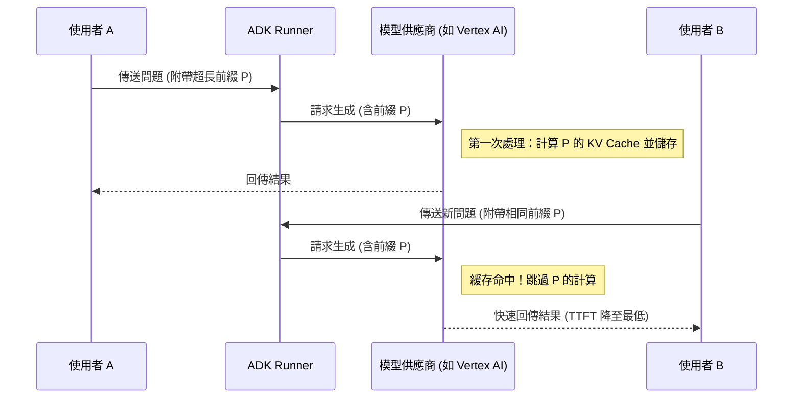

# 提示詞緩運

在軟體工程中，「緩存」是提升系統效能最有效的手段之一。而在 Generative AI 架構設計中，**提示詞緩存 (Prompt Caching)** 則是優化營運成本與使用者體驗的核心利器。這項技術允許模型服務提供商重用先前處理過的提示詞片段（通常是長前綴，如系統指令、大型文件或少樣本範例），避免重複計算**注意力機制 (Attention Mechanisms)** 的內部狀態。這不僅能節省高達 90% 的輸入成本，還能將**首字延遲 (TTFT)** 縮短 85% 以上。

---

### 情境 1：穩定提示詞結構，將「動態變數」置於最末端

**核心概念**：
提示詞緩存是基於**精確前綴匹配**的。如果你的提示詞結構在開頭包含動態內容（如使用者名稱或當前時間），那麼後續即使是非常長的靜態規則或文件內容也無法被緩存，因為前綴已經改變。資深架構師的準則是：**靜態前綴越長、越穩定，緩存的經濟效益就越高**。

**程式碼範例**：

```python
# ❌ Bad: 將變數放在開頭，導致後續所有靜態規則無法被緩存
# 每次呼叫時，開頭的變數都會導致緩存失效
prompt = f"""
當前使用者：{user_name}
系統時間：{current_time}

以下是 10 頁長的企業規範文件 (靜態內容)...
"""

# ✅ Better: 將穩定、重複性高的內容置於前綴，動態內容置於末尾**
# 確保緩存命中率的最大化，靜態長文本在前
prompt = f"""
以下是 10 頁長的企業規範文件 (靜態內容)...

---
[當前任務上下文]
使用者：{user_name}
時間：{current_time}
問題：{user_query}
"""
# 這樣模型可以重用文件前綴的預計算 KV Cache
```

**為什麼 (Rationale)**：
模型處理提示詞時是順序處理的。緩存機制通常會保留一段長度超過門檻值（如 1,024 tokens）的連續前綴。任何微小的字元變動（甚至是多餘的空格）都會導致緩存失效。

---

### 情境 2：在 Google ADK 中透過 `ContextCacheConfig` 明確配置緩存策略

**核心概念**：
當使用 Google ADK 構建應用程式時，開發者不應依賴黑盒機制，而應主動控制緩存的行為。透過 `ContextCacheConfig`，你可以針對特定應用（App）定義最小緩存門檻、過期時間 (TTL) 等參數，以達到成本控制的最佳化。

**程式碼範例**：

```python
# ❌ Bad: 讓每個請求都重新處理相同的超長指令，浪費 token
agent = Agent(
    model="gemini-2.5-flash",
    instruction="""你是一個高級法律顧問，請參考以下 5000 字的合約條款..."""
)

# ✅ Better: 使用 ADK `ContextCacheConfig` 開啟系統級緩存**
from google.adk.apps import App
from google.adk.apps.context_cache_config import ContextCacheConfig

# 配置緩存：僅針對超過 1024 tokens 的大型指令啟用
cache_config = ContextCacheConfig(
    min_tokens=1024,
    ttl_seconds=1800, # 緩存保留 30 分鐘
    cache_intervals=5 # 該緩存最多可被重用 5 次
)

app = App(
    name="legal_advisor_app",
    agents=[legal_agent],
    context_cache_config=cache_config # 在 App 層級全局套用緩存策略
)
```

**適用場景 (Rule of Thumb)**：
*   **拇指法則**：如果你的系統提示詞（System Instruction）超過 1,000 tokens，或者你在對話中反覆引用相同的大型 Artifact（如 PDF 或影片），請務必啟用 Prompt Caching。
*   **例外情況**：對於極短的對話或高度動態且不重複的單次查詢，緩存帶來的管理開銷可能超過其節省的成本。

---

### 情境 3：區分伺服器端緩存 (KV Cache) 與客戶端語義緩存 (Response Cache)

**核心概念**：
架構師必須理解兩種緩存的不同層次：
1.  **伺服器端前綴緩存**：重用 KV Cache 以降低處理提示詞的運算量（節省 TTFT 與輸入費用）。
2.  **客戶端/語義緩存**：對完全相同的查詢直接回傳已生成的結果（節省輸出費用與生成延遲）。

**比較表：兩類緩存的技術權衡**

| 特性 | 伺服器端前綴緩存 (Context Cache) | 客戶端/語義緩存 (Semantic Cache) |
| :--- | :--- | :--- |
| **目標** | 節省輸入 Token 成本與 TTFT | 節省輸出 Token 成本與總延遲 |
| **精確度要求** | 極高 (字元級匹配) | 較低 (語義相近即可匹配) |
| **對創意度的影響** | 無影響 (模型仍會生成新內容) | 極高 (回傳固定舊結果) |
| **最佳用途** | 多回合對話、長文件檢索 | FAQ、常見重複查詢 |

---

### 底層原理與流程圖

Prompt Caching 的本質是**共享注意力矩陣**。當多個使用者共享同一個「法律合約前綴」時，底層硬體不需要為每個請求重新跑一遍該文件的矩陣運算。

#### 前綴緩存運作流程


---

### 延伸思考

**1️⃣ 問題一**：提示詞緩存是否會導致模型的回應變得「呆板」或「重複」？

**👆 回答**：不會。這是與傳統 Response Caching 最本質的區別。Prompt Caching 緩存的是**輸入的計算狀態**，而非**輸出的文字**。模型仍然會根據溫度 (Temperature) 等設定，針對當前的新問題生成全新的、多樣化的回覆。它只是「讀得更快更省錢」，並沒有「停止思考」。

---

**2️⃣ 問題二**：在多租戶 (Multi-tenant) 環境下，使用緩存是否有資訊洩漏風險？

**👆 回答**：是的，必須謹慎處理。如果緩存是針對特定的系統指令（App-level），則安全；但如果緩存包含使用者的私有文件，架構師必須確保緩存鍵 (Cache Key) 包含 `user_id`。在 ADK 中，建議將私有資料儲存為 Artifact，並利用 `user:` 前綴來進行隔離。

---

**3️⃣ 問題三**：Google ADK 的 `output_key` 與緩存有什麼關係？

**👆 回答**：`output_key` 提供了一種「隱性緩存」機制。它將 Agent 的最後回應寫入 `session.state`，這讓後續 Agent 可以直接從 State 讀取結果，而不需要重新向 LLM 詢問先前已經討論過的內容。這在邏輯層面上減少了對模型的呼叫次數，從架構頂端節省了成本。