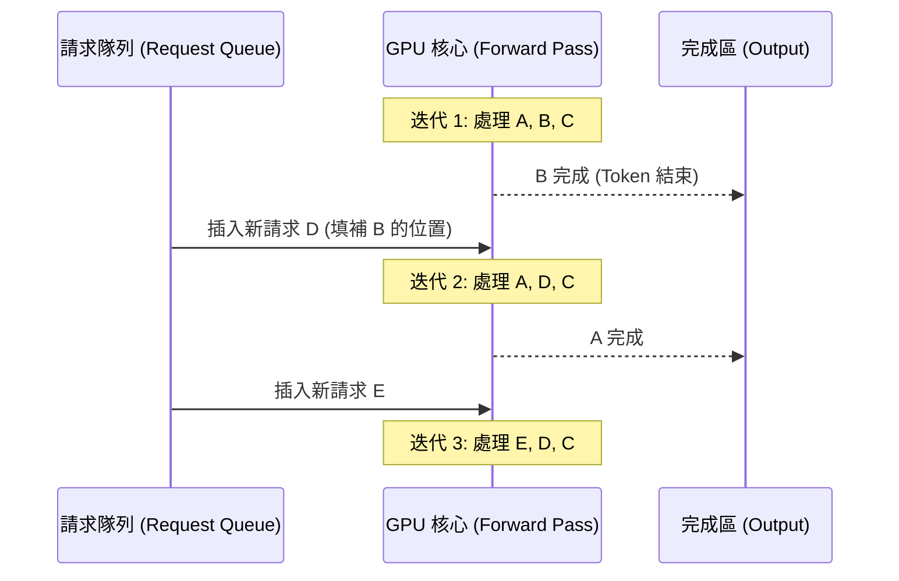

# 連續批處理

在生成式 AI 的生產環境中，**GPU 資源的利用率**直接決定了系統的營運成本與可擴展性。傳統的「靜態批處理（Static Batching）」由於必須等待批次中所有的請求都生成完畢後才能處理下一組，導致 GPU 在處理長短不一的請求時會出現嚴重的空轉現象。**連續批處理 (Continuous Batching)** 透過在單個「前向傳遞（Forward Pass）」層級動態插入新請求與移除已完成請求，徹底打破了這個瓶頸，將吞吐量提升了 10 倍甚至更多。

---

### 情境 1：優先使用連續批處理框架而非手動處理靜態 Padding

**核心概念**：
靜態批處理要求將所有請求填充（Padding）到相同的長度，這會導致 GPU 花費大量運算資源在處理無意義的補位 Token 上。資深架構師應將推理邏輯委託給具備「動態調整注意力矩陣」能力的伺服器（如 vLLM），以確保 GPU 核心始終處於滿載工作狀態。

**程式碼範例**：

```python
# ❌ Bad: 逐一發送請求，或手動實施靜態 Batching，導致 GPU 大量閒置
# 低效的循序處理方式
for prompt in prompts:
    response = await llm.generate(prompt) # 每次僅使用 GPU 一小部分能力
    yield response

# ✅ Better: 透過 ADK 配置串接支援 Continuous Batching 的 vLLM 後端**
from google.adk.runners import Runner
from google.adk.agents.run_config import RunConfig, StreamingMode

# vLLM 等框架會在後端自動實施連續批處理
# 開發者只需確保請求是併發發送的
run_config = RunConfig(
    streaming_mode=StreamingMode.SSE,
    max_llm_calls=100
)

async def handle_high_traffic(user_id, prompts):
    # 透過非同步呼叫，Runner 能將請求堆疊至後端推理引擎的隊列中
    # 後端會自動將這些請求進行「連續批處理」優化
    tasks = [runner.run_async(user_id, f"session_{i}", p, run_config=run_config)
             for i, p in enumerate(prompts)]
    return await asyncio.gather(*tasks)
```

**為什麼 (Rationale)**：
連續批處理允許請求在迭代間隙隨時加入或離開。這意味著如果一個短請求在 5 個 Token 後結束，它所佔用的 GPU 顯存與運算位（Slot）會立即釋放給隊列中的下一個請求，而不需要等待同批次的其他長請求完成。

---

### 情境 2：搭配 PagedAttention 優化顯存碎片化

**核心概念**：
顯存（VRAM）是連續批處理的關鍵物理限制。傳統 KV Cache 預留大塊連續空間會造成嚴重浪費。採用 **PagedAttention** 技術（vLLM 的核心），將 KV Cache 分割為非連續的「頁面」，能顯著減少顯存碎片，讓單張顯卡能容納更多併發的連續批處理任務。

**適用場景與規則**：
*   **拇指法則 (Rule of Thumb)**：當預期用戶請求的長度變化劇烈（例如：同時處理單句翻譯與長文本摘要）時，**必須**使用連續批處理。
*   **例外情況**：如果所有請求的長度高度固定（如特定格式的資料提取），靜態批處理的邊際開銷較小且實施難度較低。

---

### 批處理技術對比表

| 特性 | 靜態批處理 (Static Batching) | 連續批處理 (Continuous Batching) |
| :--- | :--- | :--- |
| **運作機制** | 批次內最長者完成後才釋放資源 | 每個 Token 生成後即可動態換入請求 |
| **GPU 利用率** | 較低 (常有空轉等待期) | 極高 (接近飽和) |
| **首字延遲 (TTFT)** | 受批次中其他請求阻塞而增加 | 最小化 (新請求可立即插入下一次迭代) |
| **显存管理** | 預分配大塊連續顯存，易碎片化 | 搭配 PagedAttention 分頁管理 |
| **吞吐量提升** | 基準線 | 通常可達 2.5x 至 23x 提升 |

#### 連續批處理任務流轉流程圖


---

### 底層原理探討與權衡

*   **動態計算負擔**：連續批處理雖然極大化了利用率，但也增加了推理伺服器的排程負擔。伺服器必須實時管理多個不同長度的上下文矩陣。
*   **分階段推理 (Prefill vs. Decode)**：推理過程分為 Prefill（處理輸入）與 Decode（生成輸出）。 Prefill 是運算密集型，而 Decode 是內存帶寬密集型。進階架構會將這兩者分離，在不同的 GPU 上實施不同的連續批處理策略。
*   **搶佔機制 (Preemption)**：當顯存耗盡時，伺服器必須決定暫停哪些請求並將其緩存至 CPU 記憶體，待顯存可用時再恢復，這也是連續批處理複雜但高效的展現。

---

### 延伸思考

**1️⃣ 問題一**：為什麼說連續批處理能有效降低成本？

**👆 回答**：根據來源分析，連續批處理大幅減少了處理單個請求所需的硬體佔用時間。當 TPS（每秒 Token 數）提升時，單個 Token 的攤提成本隨之下降。對於高流量應用，這可能意味著從需要 10 張 H100 降至僅需 2 張。

---

**2️⃣ 問題二**：連續批處理與 `RunConfig.max_llm_calls` 有衝突嗎？

**👆 回答**：不衝突。`max_llm_calls` 是應用層的安全閥，防止 Agent 陷入無限循環而消耗過多 Token。連續批處理是**基礎設施層**的優化技術。無論你的限制是多少，連續批處理都能確保在限制範圍內的這些呼叫能以最快、最省資源的方式被 GPU 執行。

---

**3️⃣ 問題三**：在 Google ADK 環境下，如何觀察連續批處理的成效？

**👆 回答**：可以透過 ADK 的分佈測試功能。使用 `Cloud Trace` 觀察多個併發請求的處理時長。你會發現當併發數增加時，單個請求的 **EERL (端到端延遲)** 並未如預期般呈倍數增長，這正是連續批處理在後端發揮作用的證據。