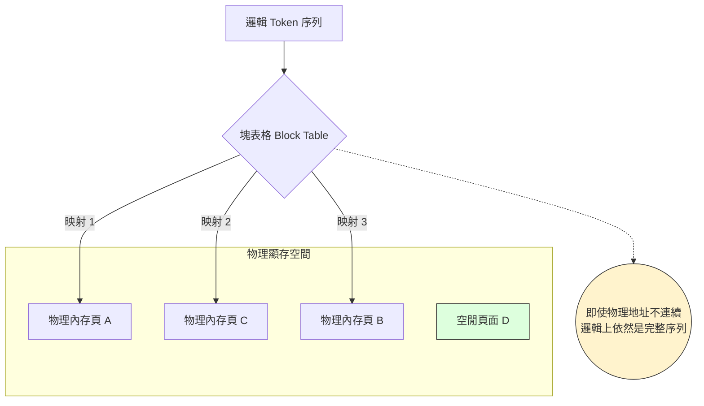

# 分段注意力機制

在大型語言模型 (LLM) 的生產環境中，內存管理的核心挑戰在於 **KV 快取 (Key-Value Cache)**。隨著對話長度增加，KV 快取會呈線性增長，傳統做法要求預留大塊連續的顯存 (VRAM) 空間來存放這些數據，這導致了嚴重的「內存碎片化」與資源浪費。**分段注意力機制 (PagedAttention)** 借鑒了作業系統的「虛擬記憶體」概念，將 KV 快取劃分為固定大小的「分頁 (Pages)」，允許在非連續的物理內存中存儲 Token，從而徹底解決了內存利用率不足的問題。

---

### 情境 1：避免「預先分配」導致的顯存碎片化與浪費

**核心概念**：
傳統推理引擎通常會根據模型的最大上下文長度（如 2048 Tokens）預先為每個請求分配一個連續的顯存塊。然而，大多數請求在完成時遠未達到最大長度，這導致大部分已分配的顯存處於閒置狀態，且無法被其他併發請求使用。分段注意力則採取「隨用隨取」的按需分配策略。

**程式碼範例**：

```python
# ❌ Bad: 傳統靜態分配，為每個請求預留最大顯存塊，導致顯存迅速耗盡 (OOM)
# 概念性偽代碼：模擬傳統引擎行為
def handle_request_bad(prompt, max_len=2048):
    # 預先在 GPU 上「切」出一塊足以容納 2048 tokens 的連續顯存
    # 即使 prompt 只有 10 tokens，剩下的空間也無法給他人使用
    gpu_memory_block = reserve_contiguous_vram(max_len)
    response = model.generate(prompt, kv_cache=gpu_memory_block)
    return response

# ✅ Better: 使用 vLLM 啟動 PagedAttention 引擎，實現按需分頁分配**
from vllm import LLM, SamplingParams

# vLLM 內部實作了 PagedAttention
# 它將 KV 快取切分為分頁 (通常為 16 或 32 tokens)
# 僅在需要生成新 token 時才分配新分頁
llm = LLM(model="facebook/opt-13b", gpu_memory_utilization=0.9)

sampling_params = SamplingParams(temperature=0.7, top_p=0.95, max_tokens=512)
prompts = ["請解釋分段注意力機制的原理"]

# 引擎會自動跨請求管理分頁，消除內存碎片
outputs = llm.generate(prompts, sampling_params)
```

**底層原理探討與權衡**：
*   **邏輯與物理分離**：PagedAttention 通過一個「邏輯塊表格 (Block Table)」將邏輯上的 Token 序列映射到物理上的非連續內存頁面。
*   **提升吞吐量**：這項創新讓單張 GPU 能夠處理的併發請求數量提升了 2.5 倍以上，並將吞吐量 (Throughput) 提高了高達 23 倍。

---

### 情境 2：在長上下文 (Long Context) 任務中優化內存牆限制

**核心概念**：
當對話長度達到數萬個 Token 時，KV 快取的大小甚至會超過模型參數本身。分段注意力機制允許系統僅載入當前計算所需的頁面，並在多個並行序列（如在 `ParallelAgent` 中）之間共享相同的初始前綴頁面。

**適用場景與規則**：
*   **拇指法則 (Rule of Thumb)**：如果你的應用涉及 **長文件摘要** 或 **多輪複雜對話**，PagedAttention 是不可或缺的基礎設施層優化。
*   **例外情況**：對於輸入與輸出長度都極短（如 10 Tokens 內的分類任務）且併發量極低的情況，PagedAttention 的管理開銷（Lookup Table 維護）可能大於其節省的空間利益。

---

### 內存管理技術對比表

| 特性 | 傳統連續快取 (Contiguous Cache) | 分段注意力 (PagedAttention) |
| :--- | :--- | :--- |
| **內存分配** | 預先分配最大連續塊 | 動態按需分配固定大小頁面 |
| **碎片化 (Fragmentation)** | 嚴重（內部與外部碎片） | 幾乎為零（內存利用率接近 100%） |
| **併發能力** | 低，受顯存塊數量限制 | 高，受總 Token 頁數限制 |
| **共享前綴優化** | 難以實作，需大量數據複製 | 天然支援，多個邏輯塊映射至同一物理頁面 |

#### PagedAttention 記憶體映射流程圖

---

### 延伸思考

**1️⃣ 問題一**：分段注意力機制如何與 Google ADK 的 `SequentialAgent` 協作優化效能？

**👆 回答**：在 ADK 的 `SequentialAgent` 流程中，多個 Agent 依序處理同一個 Session。如果底層推理引擎支援 PagedAttention 與 **前綴快取 (Prefix Caching)**，那麼第一個 Agent 生成的 KV 快取頁面可以被標記為可重用。當第二個 Agent 啟動時，它能直接從顯存載入已處理好的歷史頁面，將 **首字延遲 (TTFT)** 降低高達 80% 以上。

---

**2️⃣ 問題二**：分頁的大小（例如 16 vs 32 tokens）會如何影響效能？

**👆 回答**：這是一個權衡問題。較小的分頁（如 8 或 16）能最大程度減少最後一個分頁的浪費，但會增加塊表格 (Block Table) 的查詢與管理開銷。較大的分頁（如 32 或 64）則能提升計算密集度並更好地利用 GPU 的顯存帶寬。vLLM 等框架通常預設為 16，這在大多數長度變動劇烈的場景下是性能最優解。

---

**3️⃣ 問題三**：這項技術是否只能用於 NVIDIA GPU？

**👆 回答**：雖然 PagedAttention 最早是在 CUDA 環境下實作，但根據來源資料，現代服務框架如 vLLM 已經擴展支援多種硬體，包括 Google 的 **TPU (Tensor Processing Units)**。不論硬體類型，分頁管理邏輯在軟體層面是通用的，都能有效打破「內存牆」的限制。