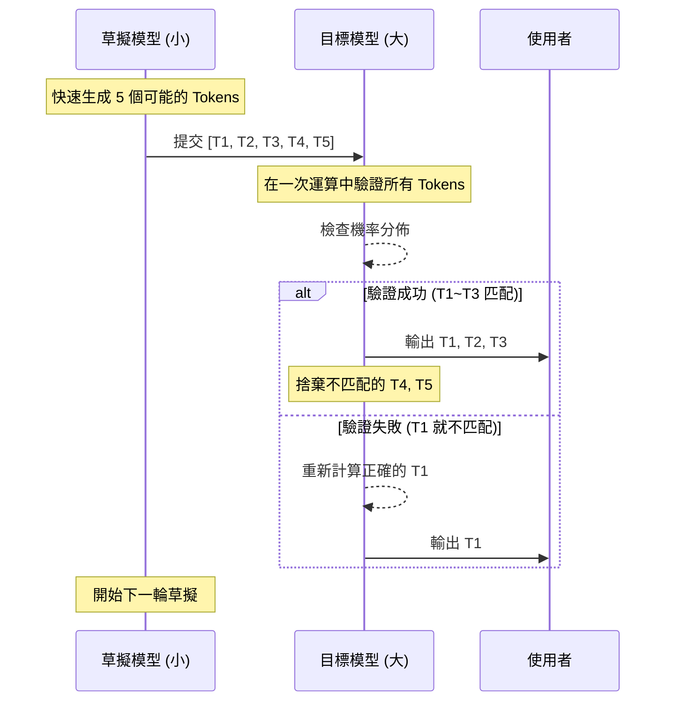

# 投機解碼 (Speculative Decoding) 加速

在生產級 AI 系統中，大型語言模型 (LLM) 的推理速度往往受限於**記憶體頻寬 (Memory Bandwidth)** 而非運算能力。每生成一個 Token，系統都必須從記憶體載入完整的模型權重，對於 70B 以上的模型來說，這會導致極高的延遲。**投機解碼 (Speculative Decoding)** 是一種突破性的優化技術，它利用一個輕量級的小模型（草擬模型，Draft Model）先行快速預測多個 Token，再交由大模型（目標模型，Target Model）在一次前向傳遞中進行並行驗證。這種方式能顯著提升吞吐量並降低延遲，且不損害輸出品質。

---

### 情境 1：針對高頻率、高延遲的長文本生成優先配置投機解碼

**核心概念**：
並非所有 Token 都需要數十億參數的運算實力。常見的連詞、標點符號或預測性極強的短語，由 1B 級別的小模型與 70B 大模型生成的結果往往一致。投機解碼的核心在於「預先猜測」：小模型連續生成 $K$ 個 Token，大模型則驗證這 $K$ 個 Token 是否符合其機率分佈。若一致，則一次性跳過 $K$ 次記憶體載入週期。

**程式碼範例**：

```python
# ❌ Bad: 直接調用巨型模型進行逐字生成，受限於記憶體頻寬限制
from vllm import LLM, SamplingParams

# 僅使用大模型 (如 Llama-3-70B)，每個 token 都需完整權重載入，速度緩慢
llm = LLM(model="meta-llama/Llama-3-70B")
params = SamplingParams(temperature=0.7)
outputs = llm.generate("請撰寫一份詳細的市場分析報告...", params)

# ✅ Better: 使用 vLLM 配置投機解碼，以小模型輔助大模型加速**
from vllm import LLM, SamplingParams

# 配置投機解碼：大模型 (Target) 搭配小模型 (Draft)
# 小模型負責快速草擬，大模型負責並行驗證
llm = LLM(
    model="meta-llama/Llama-3-70B",
    speculative_model="meta-llama/Llama-3-8B", # 草擬模型
    num_speculative_tokens=5, # 每次投機預測 5 個 token
    use_v2_block_manager=True
)

params = SamplingParams(temperature=0.7)
outputs = llm.generate("請撰寫一份詳細的市場分析報告...", params)
```

**底層原理探討與權衡**：
*   **為什麼 (Rationale)**：大模型驗證 $K$ 個 Token 的時間幾乎等同於生成 1 個 Token 的時間（因為權重只需載入一次）。只要草擬模型的準確率足夠高，系統就能在相同的時間內產出數倍的 Token。
*   **權衡**：如果草擬模型與目標模型的分佈差異過大（例如小模型太笨），導致驗證失敗，系統必須退回並重新計算，這反而會增加些微的額外開銷。

---

### 情境 2：動態調整 `num_speculative_tokens` 以平衡準確率與開銷

**核心概念**：
投機步數 $K$ 是一個關鍵變數。如果 $K$ 設定過大，草擬模型在長序列結尾出錯的機率會呈指數增長，導致大模型頻繁捨棄草擬結果；若 $K$ 過小，則加速效果不明顯。

**拇指法則 (Rule of Thumb)**：
*   對於**邏輯嚴密、結構固定**的任務（如程式碼生成、格式化 JSON），建議設定較大的 $K$ 值 (5-8)，因為小模型較容易預測這類模式。
*   對於**高創意、開放式**對話，建議設定較小的 $K$ 值 (2-4)，以減少因驗證失敗導致的無效運算。

---

### 情境 3：在邊緣設備部署時，結合量化 (Quantization) 與投機解碼

**核心概念**：
邊緣設備（如手機或工業電腦）的 VRAM 極其珍貴。單純運行大模型可能導致 OOM (Out of Memory)，而投機解碼能讓設備在維持大模型精度（目標模型）的前提下，透過極小體積的量化模型（草擬模型）來實現流暢的互動感。

**效能對比表：模型規模與加速成效**

| 指標                    | 單一大型模型 (Target Only) | 投機解碼 (Target + Draft)            |
| :---------------------- | :------------------------- | :----------------------------------- |
| **推理模式**            | 逐字生成 (Serial)          | 草擬 -> 批次驗證 (Parallel Validate) |
| **吞吐量 (Throughput)** | 1.0x (基準)                | 通常可提升 1.5x ~ 2.5x               |
| **品質損失**            | 無                         | **完全無損** (最終由大模型核准)      |
| **主要限制**            | 記憶體頻寬頻頸             | 兩個模型的權重皆需佔用 VRAM          |

#### 投機解碼流程圖


---

### 延伸思考

**1️⃣ 問題一**：投機解碼是否會增加 Token 的使用成本？

**👆 回答**：如果你是使用如 OpenAI 或 Gemini 的「計量收費」API，這類優化通常由廠商在後端實施，對你來說成本不變但 TTFT 降低。如果你是「自託管 (Self-hosted)」模型，投機解碼會略微增加 GPU 的總功耗（因為多跑了一個小模型），但由於處理相同請求的時間大幅縮短，整體的能源效率與硬體攤提成本通常是下降的。

---

**2️⃣ 問題二**：草擬模型必須是目標模型的「縮小版」嗎？

**👆 回答**：不一定，但這是最常見的作法。來源指出，草擬模型可以是經過**蒸餾 (Distillation)** 的學生模型，其目的是模仿大模型的行為模式。只要兩者的 Tokenizer 是一致的（即它們對文字的切分方式相同），任何小模型都可以作為草擬模型。

---

**3️⃣ 問題三**：投機解碼與「連續批處理 (Continuous Batching)」可以併用嗎？

**👆 回答**：可以且強烈建議併用。在 Google Cloud GKE 或 vLLM 服務中，投機解碼負責加速「單個請求」的生成，而連續批處理負責優化「多個並發請求」的調度，兩者結合能使硬體利用率接近 100% 的極限。