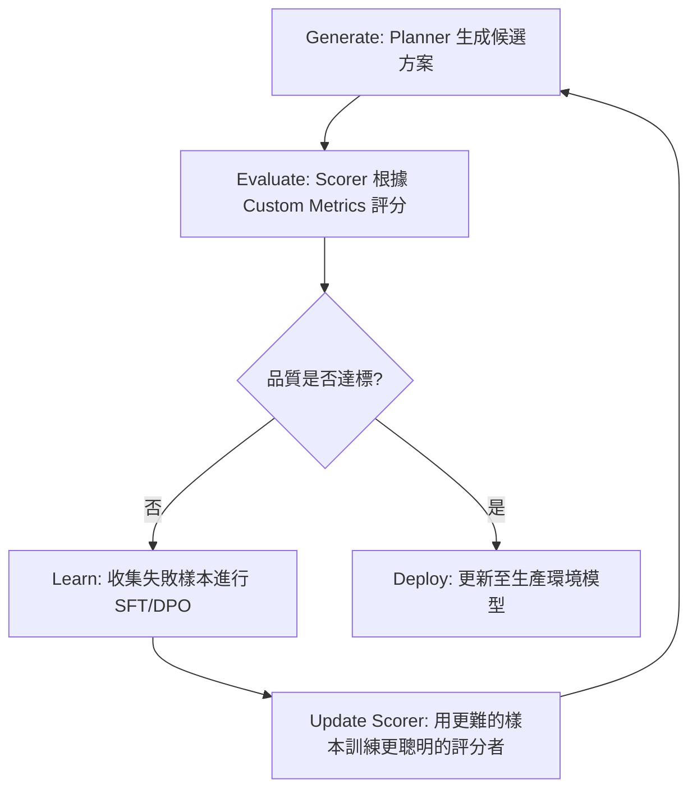

# 自改進飛輪

在軟體架構的演進中，我們正從「部署即完成」的靜態模型，轉向「部署即開始」的動態生態系統。對於資深架構師而言，一個無法從自身錯誤中學習的系統是具備技術債的。**自改進飛輪 (Self-Improvement Flywheel)** 是一個閉環模型，它允許 Agent 在運行過程中生成方案、評估品質，並將這些經驗反饋至模型訓練中，實現能力的指數級成長。

---

### 情境 1：解耦「生成」與「評估」以消除認知偏差

**核心概念**：
正如 Joshua Bloch 在 *Effective Java* 中強調的權責分離，我們不應讓同一個 Agent 既當「考生」又當「閱卷老師」。Agent 往往會為自己的錯誤辯解（Self-rationalization），導致邏輯崩潰或幻覺循環。我們必須架構一個「混合（規劃者 + 評分者）架構」，透過外部的客觀評價來打破這個僵局。

**程式碼範例**：

```python
# ❌ Bad: 單一 Agent 自我評估，容易產生認知偏誤與幻覺強化
# 依賴單一 Agent 同時負責生成與檢核，無法提供客觀的反饋
agent = LlmAgent(
    name="monolithic_agent",
    instruction="生成程式碼並檢查其正確性。如果你覺得沒問題，就直接回傳。"
)
# 模型往往會忽略自身邏輯缺陷

# ✅ Better: 採用 Hybrid (Planner + Scorer) 架構實現「反思 (Reflect)」原則**
from google.adk.agents import LlmAgent, SequentialAgent

# 1. 規劃者 (Planner/Generator)：專注於創意與任務達成
planner = LlmAgent(
    name="code_generator",
    instruction="根據需求生成 Python 程式碼，追求功能完整性。",
    output_key="candidate_code"
)

# 2. 評分者 (Scorer/Evaluator)：專注於批判性分析與安全
# 這裡可以選擇更強大或更專業的模型（如 Gemini 2.5 Pro）
scorer = LlmAgent(
    name="code_critic",
    instruction="評估 {{candidate_code}} 的安全性與效率，並給予 1-5 分的評分與改進建議。",
    output_key="evaluation_report"
)

# 透過流程編排強制執行評估步驟
improvement_pipeline = SequentialAgent(
    name="self_improvement_step",
    sub_agents=[planner, scorer]
)
```

**底層原理探討與權衡**：
*   **為什麼 (Rationale)**：這實踐了 R5 模型中的 **Reflect（內部檢核）** 與 **Report（量化指標）**。分開角色允許我們為評分者配置更嚴格的 Prompt 或是更昂貴的推理模型，而規劃者則可以使用低延遲模型以優化成本。
*   **權衡**：這種架構會增加 Token 消耗與延遲，但能顯著提升高風險決策的準確性。

---

### 情境 2：利用「偏好控制」合成數據克服冷啟動瓶頸

**核心概念**：
建立飛輪最大的挑戰是缺乏大量的標籤數據（Labeled Data）。架構師應利用 **偏好控制合成數據生成 (Preference-Controlled Synthetic Data Generation)** 技術。透過程式化地控制輸入環境（例如：一個給予高品質上下文，另一個給予雜訊），我們可以自動產出「較佳」與「較差」的成對樣本，用於 DPO (Direct Preference Optimization) 訓練。

**程式碼範例**：

```python
# ❌ Bad: 依賴人工標記訓練數據，成本高昂且擴展緩慢
# 等待數千名人工審核員為 Agent 的回應打分
training_data = load_human_labels("manual_audit.json")

# ✅ Better: 透過 ADK 模擬環境自動生成「偏好對」進行強化學習**
# 同步生成「高品質」與「低品質」上下文的回應來建立偏好
def generate_synthetic_pair(query, rich_context, poor_context):
    # 高品質樣本 (Chosen)
    good_resp = model.generate(query, context=rich_context)
    # 故意弱化上下文產生的樣本 (Rejected)
    bad_resp = model.generate(query, context=poor_context)

    return {
        "prompt": query,
        "chosen": good_resp,
        "rejected": bad_resp
    }
# 這種方式能以機器速度規模化產生 DPO 訓練集
```

**適用場景與規則**：
*   **拇指法則 (Rule of Thumb)**：當業務領域具備高度專業性（如醫療、法律）且人類專家昂貴時，應優先考慮此模式。
*   **注意**：合成數據可能會放大模型原有的偏差，必須定期引入人工抽驗（Golden Dataset）進行校準。

---

### 情境 3：實施「協同演進」訓練防止系統能力平原化

**核心概念**：
如果「規劃者」進步了，但「評分者」維持原樣，飛輪就會停滯。資深架構師會設計 **協同演進 (Coevolved Agent Training)** 模式，讓兩者同步升級：更強的規劃者產出更難的樣本來訓練評分者，而更聰明的評分者則反過來提供更細膩的指導給規劃者。

**飛輪生命週期流程圖**：


**比較與整合 (R5 原則與自改進模式)**：

| R5 原則              | 自改進飛輪中的體現                       | 關鍵模式                  |
| :------------------- | :--------------------------------------- | :------------------------ |
| **Reflect (反思)**   | Agent 生成後的自我檢查與評分             | Hybrid (Planner + Scorer) |
| **Retry (重試)**     | 根據評分失敗，在訓練層級進行「系統重試」 | Coevolved Agent Training  |
| **Report (報告)**    | 量化事實性與邏輯品質                     | Custom Evaluation Metrics |
| **Relax (放鬆)**     | 透過壓縮上下文維持推理效能               | Synthetic Data Generation |
| **Reference (引用)** | 在評分中附帶事實來源，確保可稽核性       | Grounding & Attribution   |

---

### 底層原理探討與權衡

*   **DPO 效應**：不同於傳統 SFT 僅是模仿，DPO 直接調整模型的概率分佈，使其「遠離」錯誤答案，這在 Agent 決策優化中非常穩定且高效。
*   **財務治理**：自改進飛輪極其消耗 Token（訓練倍數可達 10x-100x）。必須實施 **Tokenomics (成本管理)** 模式，設定每回合訓練的硬性預算限制，防止雲端帳單爆表。

---

### 延伸思考

**1️⃣ 問題一**：如果評分者 Agent 出現幻覺，誤將錯的改進建議給了規劃者，會發生什麼？

**👆 回答**：這會導致「失控發散 (Runaway Divergence)」，模型會為了滿足評分者的偏好而逐漸偏離業務目標。解決方案是實施 **Adversarial Testing (紅隊測試)**，定期讓專門的攻擊型 Agent 尋找系統漏洞，並強制引入 **ROI (業務指標)** 作為最終的錨點，確保飛輪是為了業務價值而轉動，而非僅僅是模型分數。

---

**2️⃣ 問題二**：Google ADK 的 `after_agent_callback` 如何支援此飛輪？

**👆 回答**：這是數據收集的關鍵鉤子。架構師應在 `after_agent_callback` 中自動將該 Session 的對話、工具調用軌跡 (Trajectory) 與最終結果寫入 **Vertex AI ML Metadata** 或 **Memory Bank**。這為「學習」階段提供了持續的、帶有真實環境數據的訓練語料，免去了手動導出日誌的麻煩。

---

**3️⃣ 問題三**：什麼時候應該停止「自改進」的循環？

**👆 回答**：當達到「能力飽和點」或 **Cost-per-Value (CPV)** 門檻時應停止。架構師應監控 **信任衰減 (Trust Decay)** 指標，如果新版本的模型在 Canary Testing 中無法提供顯著的效能提升，或者推理成本增加超過了業務帶來的收益，則應終止該輪優化。