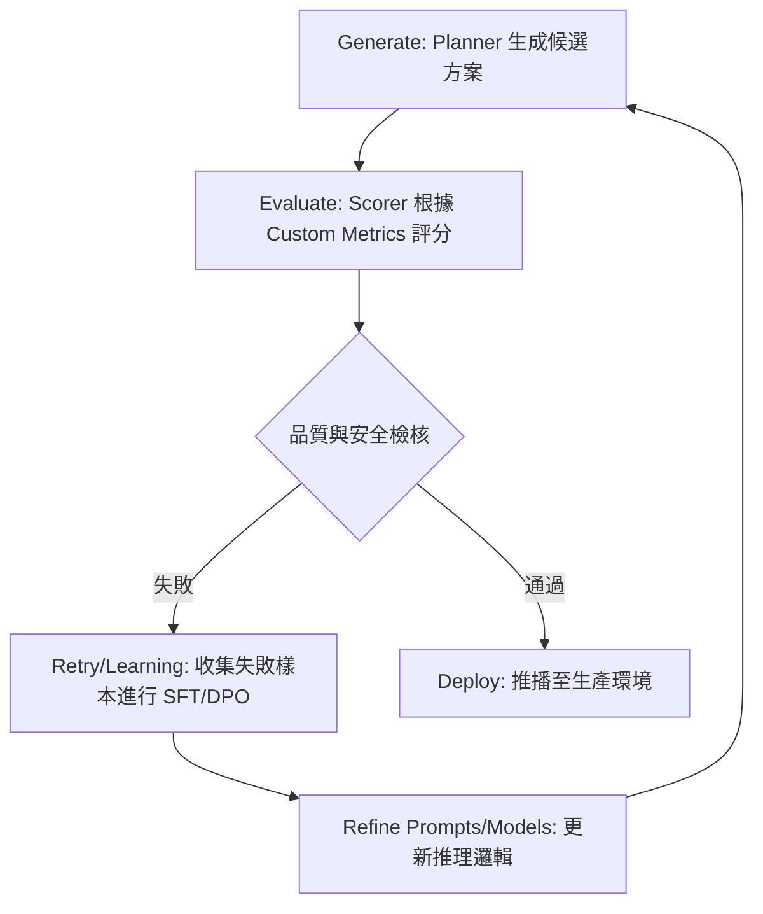

# AgentOps 與生命週期管理

在軟體架構的演進中，我們正從管理「靜態程式碼」轉向管理「動態推理」。一個成功的 Agent 應用，其原型開發僅占 10% 的工作量，剩下的 90% 則取決於如何使其在生產環境中具備可靠性、可觀測性與可維護性。**AgentOps (Agent Operations)** 是 MLOps 的進階延伸，專注於管理 Agent 的感知、推理與行動迴圈（Sense-Reason-Act Loop）。

身為架構師，你的任務是建立一個「自改進飛輪」，讓系統在運行中學習，而不是在崩潰時才重啟。

---

### 情境 1：優先使用分散式追蹤 (Tracing) 而非雜亂的日誌 (Logging)

**核心概念**：
在多代理人系統（MAS）中，一個請求可能跨越數個 Agent 與工具調用。傳統的 `print()` 或單機日誌會導致訊息碎片化，難以重建完整的推理路徑。分散式追蹤能將每一次 LLM 思考、工具執行與 Agent 委派串聯在同一個 Trace ID 下。

**程式碼範例**：

```python
# ❌ Bad: 依賴分散的日誌，難以在多 Agent 環境下追蹤因果關係
async def handle_request_bad(prompt):
    print(f"User input: {prompt}") # 雜亂無章，無法與特定會話關聯
    # ... 執行複雜的 Agent 邏輯 ...
    print("Agent thinking...")

# ✅ Better: 透過 AdkApp 啟用內建追蹤，自動集成 Google Cloud Trace
from vertexai.preview import reasoning_engines
import vertexai

# 初始化 Vertex AI 環境
vertexai.init(project="your-project-id", location="us-central1")

# 在部署或準備生產環境時啟用追蹤標記
# AdkApp 的 enable_tracing=True 會自動配置 OpenTelemetry Exporter 並發送至 Cloud Trace
app = reasoning_engines.AdkApp(
    agent=root_agent,
    enable_tracing=True, # 自動生成與導出 OpenTelemetry 跨度 (Spans)
)

# 每一層級的調用 (LLM, Tool, Sub-agent) 都會自動掛載於同一個 Trace ID
```

**為什麼 (Rationale)**：
Agent 的決策過程通常是非線性的。透過追蹤，你可以看到「瀑布流」式的視圖，精確定位是哪一個工具調用導致了延遲，或是哪一步 Reasoning 出現了邏輯偏差。這對於處理「沉默失敗（Silent Failure）」至關重要。

---

### 情境 2：將提示詞 (Prompts) 視為版本化的數據資產

**核心概念**：
提示詞定義了 Agent 的行為。將提示詞硬編碼在程式碼中會導致版本混亂，且難以進行 A/B 測試。架構良好的系統應將提示詞視為獨立的「Managed Artifacts」，實施如同數據資產般的嚴格治理。

**程式碼範例**：

```python
# ❌ Bad: 硬編碼提示詞，難以維護且無法追蹤邏輯變動
agent = Agent(
    instruction="你是一個客服機器人，請回答用戶問題...", # 修正邏輯需要重新部署整個服務
    model="gemini-2.0-flash"
)

# ✅ Better: 使用 Agent Config 或外部註冊表管理版本化提示詞
# 在 root_agent.yaml 中定義，並通過 MLOps 管道進行版本控制
name: assistant_agent
model: gemini-2.5-flash
version: "2.1.0" # 顯式標註版本
instruction: >
  你是一位高級財務顧問。
  請遵循 [v2.1 安全準則] 進行推理。
```

**適用場景與法則**：
*   **拇指法則 (Rule of Thumb)**：始終保持「提示詞、模型、數據」三者的關聯追蹤。當你更新模型版本時，通常需要同步更新提示詞以維持性能。

---

### 情境 3：使用「插件 (Plugins)」實施全域治理而非局部檢驗

**核心概念**：
當你需要對所有 Agent 實施統一政策（如 PII 去識別化、成本限制或安全防禦）時，不應在每個 Agent 內部重複撰寫邏輯。ADK 的插件機制允許你在 `Runner` 層級註冊全域勾子，確保系統邊界的一致性。

**程式碼範例**：

```python
# ✅ Better: 實作自定義插件處理全域 PII 紅線過濾
from google.adk.plugins import BasePlugin

class PiiRedactionPlugin(BasePlugin):
    async def before_model_callback(self, ctx, request):
        # 在請求發送到 LLM 前過濾敏感數據
        request.prompt = redact_pii(request.prompt)
        return None # 允許流程繼續

# 將插件註冊在 Runner，自動套用於所有 sub-agents
runner = Runner(agent=root_agent, plugins=[PiiRedactionPlugin()])
```

---

### AgentOps 生命週期流程與支柱

AgentOps 的核心在於關閉「生成-評估-學習」的循環。

| 支柱流程                     | 關鍵目標                         | 技術工具 (ADK/GCP)                           |
| :--------------------------- | :------------------------------- | :------------------------------------------- |
| **版本控制 (Versioning)**    | 追蹤模型權重與提示詞的演進       | Vertex AI Model Registry, GitOps             |
| **可觀測性 (Observability)** | 理解 Agent 為何做出該決策        | Cloud Trace, AgentOps.ai Integration         |
| **安全治理 (Security)**      | 防止 Prompt Injection 與權限濫用 | Model Armor, ADK Plugins                     |
| **成本管理 (FinOps)**        | 防止推理迴圈導致的帳單爆炸       | Token Usage Tracking, Budget Circuit Breaker |

#### 自改進飛輪流程圖 (Self-Improvement Flywheel)


---

### 延伸思考

**1️⃣ 問題一**：在 AgentOps 中，為什麼傳統的「損失函數 (Loss)」無法完全代表 Agent 的好壞？

**👆 回答**：來源指出，低的 Loss 僅代表模型「預測文字」準確，但不代表它「執行任務」有效。例如，一個模型可能在對話中表現得非常有禮貌（低 Loss），但卻陷入循環而無法解決用戶問題。因此，AgentOps 必須監控「任務達成率 (Task Success Rate)」與「工具調用準確性 (Tool Use Accuracy)」。

---

**2️⃣ 問題二**：如何防止 Agent 在生產環境中產生「連鎖故障」？

**👆 回答**：應實施 R⁵ 模型中的 **Relax (放鬆)** 與 **Retry (重試)** 原則。透過 `Watchdog Timeout` 限制單次運算的時長，並利用 `Adaptive Retry` 在工具失效時嘗試不同的提示詞策略，而不是直接崩潰。

---

**3️⃣ 問題三**：Google ADK 的 `after_agent_callback` 在生命週期管理中最重要的用途是什麼？

**👆 回答**：最重要的用途是將當前 Session 的數據「回傳至記憶體庫 (Memory Bank)」或「寫入大數據分析表 (BigQuery)」。這為之後的離線評估、故障回溯以及模型微調（Fine-tuning）提供了最真實的現場數據。