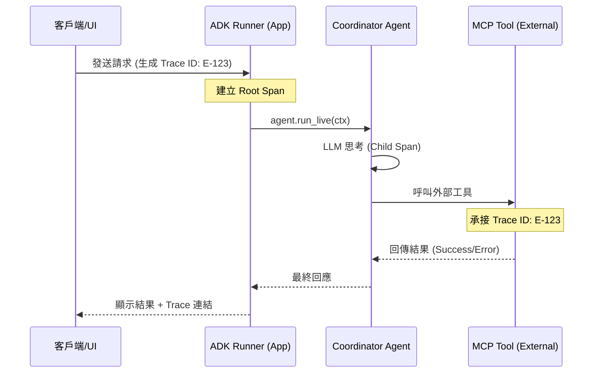

# 分散式追蹤

在多代理人（Multi-Agent）架構中，單一請求往往會跨越多個獨立運行的代理人服務、LLM 呼叫以及外部工具執行。傳統的單機日誌（Logging）在這種分層結構下會面臨「資訊碎片化」的問題，導致開發者難以還原完整的推理路徑。**分散式追蹤 (Distributed Tracing)** 透過在整個呼叫鏈路中傳遞唯一的 `trace_id`，將散落在各處的執行片段（Spans）串聯成一個完整的「瀑布流」視圖，這對於診斷延遲瓶頸與邏輯錯誤至關重要。

---

### 情境 1：優先採用 OpenTelemetry 標記傳遞而非隔離日誌

**核心概念**：
當 `CoordinatorAgent` 委派任務給遠端的 `BillingAgent` 時，兩者可能運行在不同的網路邊界。如果不實施追蹤，請求在進入下一個服務時會失去上下文。資深架構師應確保應用程序支援 **W3C Trace Context** 標準（如 `traceparent`），使每個子任務都能掛載於原始的 Trace ID 之下。

**程式碼範例**：

```python
# ❌ Bad: 依賴隔離的日誌紀錄，在分散式環境下無法關聯因果關係
# 服務 A
logging.info(f"Processing request for user {user_id}")
# 呼叫服務 B 時，日誌與 A 完全脫節，無法透過單一 ID 檢索完整鏈路
response = requests.post("http://billing-service/process")

# ✅ Better: 啟用 ADK 內建的追蹤機制並與雲端服務整合
from google.adk.runners import Runner
from vertexai.preview import reasoning_engines

# 在初始化 App 或 Runner 時，顯式啟用追蹤
# ADK 會自動生成符合 OpenTelemetry 標準的 Spans
adk_app = reasoning_engines.AdkApp(
    agent=root_agent,
    enable_tracing=True, # 自動傳遞 trace_id 並生成跨度 (Spans)
)

# 或者是透過 CLI 部署時啟用
# adk deploy agent_engine --trace_to_cloud ...
```

**為什麼 (Rationale)**：
分散式追蹤解決了「能見度問題」。它不僅紀錄了發生了什麼，還紀錄了「為什麼發生」以及「發生在哪一個階段」。透過 OpenTelemetry 的標準化介面，開發者可以無縫對接 Google Cloud Trace、AgentOps 或 Arize Phoenix 等專業觀測平台。

---

### 情境 2：利用 Span 階層分析診斷工具呼叫的延遲瓶頸

**核心概念**：
一個 Agent 的總回應時間（EERL）可能包含多個步驟：LLM 思考、工具檢索、子代理人執行。透過分散式追蹤生成的 **階層式 Span**（如 Parent Span 代表 Agent 執行，Child Span 代表特定工具呼叫），我們可以精確定位效能瓶頸。

**效能診斷指標對比表**：

| 追蹤項目 | 包含內容 | 診斷價值 |
| :--- | :--- | :--- |
| **Agent Span** | 整個 Agent 運行的起點與終點 | 衡量端到端請求延遲 (EERL) |
| **LLM Span** | Prompt 內容、生成參數、Token 消耗 | 分析推理成本與首字延遲 (TTFT) |
| **Tool Span** | 輸入參數、回傳結果、API 響應時間 | 識別外部依賴（如數據庫或外部 API）的延遲 |
| **Iteration Span** | 循環 Agent (LoopAgent) 的單次執行記錄 | 觀察收斂效率與潛在的無限循環 |

---

### 情境 3：在生產環境中使用 `invocation_id` 實現精準故障回溯

**核心概念**：
在長對話 Session 中，會有多次用戶請求（Invocations）。`trace_id` 通常對應單次 Invocation 的生命週期。資深架構師會利用 `invocation_id` 來隔離單次請求的所有 side effects（如狀態變更、工具失敗），確保審計日誌與追蹤圖表能夠精準對齊。

#### 分散式追蹤資料流 (Mermaid)


---

### 底層原理探討與權衡

*   **自動化補丁 (Intelligent Patching)**：如 AgentOps 等平台會偵測 ADK 的 OpenTelemetry 追蹤器，並智慧化地將其替換或封裝，以避免重複生成 Spans 並確保資料一致性。
*   **成本歸因 (Cost Attribution)**：追蹤資料中會包含 `input_token_count` 與 `output_token_count`。這允許架構師在多代理人系統中實施精確的帳單核銷，計算各個子代理人的個別營運成本。
*   **權衡**：詳細的追蹤會增加網路傳輸的負擔與日誌存儲開銷。建議在生產環境中對 100% 的錯誤請求進行追蹤，但對正常請求實施適度的採樣策略。

---

### 延伸思考

**1️⃣ 問題一**：為什麼傳統的 `logging` 在 Agent 的 `LoopAgent`（循環代理）中會變得混亂？

**👆 回答**：在 `LoopAgent` 中，相同的邏輯會被重複執行。傳統日誌會將所有 Iterations 混合在一起。分散式追蹤則會將每次循環定義為 nested child spans（嵌套子跨度），讓開發者能清楚地看到第 1 次失敗、第 2 次修正、第 3 次成功的演進過程。

---

**2️⃣ 問題二**：ADK 的 `is_final_response()` 與追蹤有何關聯？

**👆 回答**：追蹤器通常在收到 `turn_complete=True` 或 `is_final_response()` 的事件時關閉目前的 Span。這確保了在串流（Streaming）回應中，雖然有上百個小 Token 事件，但追蹤視圖依然保持簡潔，僅呈現一個完整的執行週期。

---

**3️⃣ 問題三**：如果在 GKE 環境中部署 Agent，追蹤標籤應如何配置？

**👆 回答**：來源建議使用 `GkeCodeExecutor` 進行沙盒執行，並透過 `CloudTraceSpanExporter` 將 trace context 注入到 Pod 的環境變數中。這樣即便 Agent 在 Pod A 運行而工具在 Pod B 運行，鏈路依然能夠完整接續。