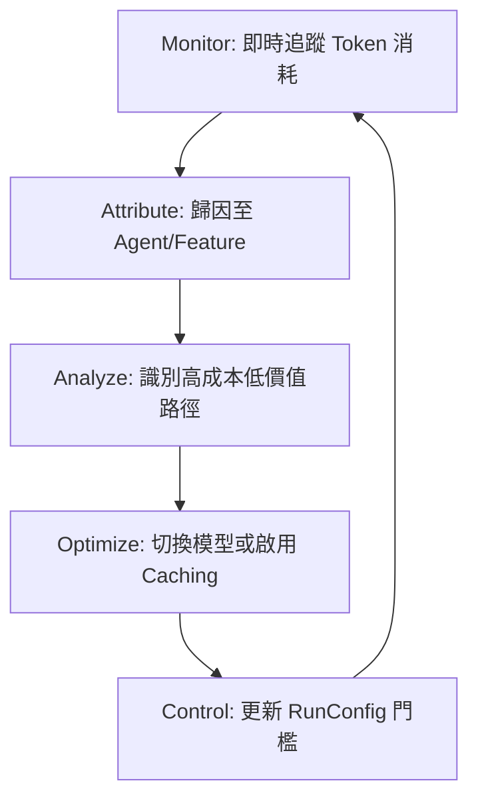

# FinOps 與 Token 成本歸因

在 Generative AI 的生產環境中，自主運行的代理人（Agents）不僅是技術實踐，更是一個**經濟實體**。一個設計不良的循環代理或是一個意外的超長上下文請求，可能在幾分鐘內燒掉數千美元的預算。身為架構師，我們必須將「成本」視為與「準確性」同等重要的技術指標。FinOps（雲端財務管理）在 Agentic 領域的核心在於：**精確歸因（Attribution）**、**主動控制（Spending Controls）**與**持續優化（Optimization）**。

---

### 情境 1：建立顆粒度至「代理人」層級的 Token 歸因機制

**核心概念**：
如果你只能看到月底的一張總帳單，你將無法判斷是哪一個功能導致了超支。在多代理人架構（MAS）中，我們必須利用追蹤（Tracing）與元數據（Metadata），將每一筆 Token 消耗與特定的代理人名稱、使用者 ID 或功能模組綁定。

**程式碼範例**：

```python
# ❌ Bad: 僅紀錄總消耗，無法識別是哪個 Agent 浪費了預算
# 只能在日誌看到總 Token，難以追蹤是 Coordinator 還是 Specialist 的責任
# 且 Runner.run() 回傳的是事件生成器而非單一 response 物件
for event in runner.run(new_message=user_input):
    if event.is_final_response():
        print(f"Total tokens: {event.usage_metadata.total_token_count}")

# ✅ Better: 利用 After Model 回呼實施精確的成本歸因與日誌記錄
from google.adk.agents import CallbackContext
from google.adk.models import LlmResponse

def cost_attribution_callback(ctx: CallbackContext, response: LlmResponse):
    # After Model 回呼會在每次 LLM 回應後觸發，並提供 usage_metadata
    if response.usage_metadata:
        usage = response.usage_metadata
        # 紀錄包含 Invocation ID、Agent 名稱與精確 Token 分佈的數據
        # invocation_id 可串聯單次對話中的所有 Agent 呼叫
        log_to_bigquery({
            "invocation_id": ctx.invocation_id,
            "agent_name": ctx.agent_name,
            "prompt_tokens": usage.prompt_token_count,
            "completion_tokens": usage.candidates_token_count,
            "cached_tokens": usage.cached_content_token_count or 0,
            "model_name": ctx.agent.model # 追蹤模型版本以計算真實金額
        })
    return None # 允許流程繼續

# 在代理層級註冊，精確捕捉該代理的每一次 LLM 互動
agent = LlmAgent(
    name="SpecialistAgent",
    model="gemini-2.5-flash",
    after_model_callback=cost_attribution_callback
)
```

**底層原理探討與權衡**：
*   **為什麼 (Rationale)**：多代理人系統的成本並非線性增長。透過 `trace_id` 串聯，架構師可以發現「無效轉發」或「冗餘推理」導致的隱藏成本。
*   **權衡**：過於精細的日誌紀錄本身也會產生存儲成本（如 BigQuery 寫入費）。**拇指法則**是：對 100% 的請求進行 Token 計數紀錄，但僅對異常（如單次 > $1）的請求進行全上下文日誌紀錄。

---

### 情境 2：實施「技術斷路器」防止失控推理導致帳單爆炸

**核心概念**：
Agent 具備自主決策權，這意味著它們可能陷入「幻覺循環」或是嘗試處理一個遠超預期的超大型檔案。在架構中必須實施「硬性限制」作為保險絲，當預算或呼叫次數超過閾值時，強制中斷操作。

**程式碼範例**：

```python
# ❌ Bad: 允許 Agent 無限制呼叫 LLM，容易在死循環中耗盡額度
# 預設行為下，Agent 可能會不斷重試或在循環中消耗 Token
# 未配置 RunConfig 時，系統將使用預設的高上限 (500)
runner.run_async(user_id, session_id, prompt)

# ✅ Better: 在 App 與 RunConfig 中配置預算門檻與壓縮策略
from google.adk.apps import App, EventsCompactionConfig
from google.adk.runners import RunConfig

# 1. 實施上下文壓縮 (Context Compaction) 防止 Prompt 膨脹
# 每 5 次互動壓縮一次歷史，保留 1 次重疊確保連貫性
compaction_config = EventsCompactionConfig(
    compaction_interval=5,
    overlap_size=1
)

# 2. 設定執行期硬性限制
run_config = RunConfig(
    # 防止 Agent 陷入無限工具調用循環的安全閥 (預設 500 太高，建議設 10-20)
    max_llm_calls=15
)

app = App(
    name="EnterpriseAgent",
    root_agent=root_agent,
    events_compaction_config=compaction_config
)

# 當達到限制時，Runner 會停止並發送錯誤事件，防止進一步產生費用
async for event in runner.run_async(..., run_config=run_config):
    if event.error_code:
        handle_budget_exceeded(event)
```

**適用場景與規則**：
*   **拇指法則 (Rule of Thumb)**：始終為生產環境的 `RunConfig` 設定 `max_llm_calls`。對於開發環境，建議設定更嚴格的 `user-level quotas`。

---

### 情境 3：動態模型路由以優化「價值比 (Cost-per-Value)」

**核心概念**：
並非所有的任務都需要使用旗艦模型。簡單的語法檢查或格式轉換如果使用最強模型，其成本效能比（ROI）極低。架構師應設計「分層路由」，將簡單任務派發給 SLM (Small Language Models) 或 Flash 系列模型，僅將複雜推理交給 Pro 模型。

**成本與效能矩陣表**：

| 任務類型 | 推薦模型 | FinOps 價值 | 關鍵指標 |
| :--- | :--- | :--- | :--- |
| 意圖路由 / 簡單摘要 | Gemini 2.5 Flash | 極低成本、低延遲 | TTFT (首字延遲) |
| 多輪複雜推理 / 規劃 | Gemini 2.5 Pro | 高品質、中等成本 | Task Success Rate |
| 重複性長前綴查詢 | 啟用 Prompt Cache | 節省高達 90% 費用 | Cached Token Count |
| 超長上下文檢索 (RAG) | Gemini Flash (1M+) | 支援大視窗且成本可控 | Retrieval Recall |

#### 成本管理反饋循環 (FinOps Flywheel)


---

### 底層原理探討與權衡

*   **Prompt Caching 的經濟學**：對於長度超過 1,024 tokens 的指令，啟用緩存可將輸入成本降低 90%。然而，緩存有 TTL（生存時間），如果請求過於稀疏，維護緩存的基礎設施開銷可能超過節省的費用。
*   **上下文壓縮 (Context Compression)**：ADK 支援 `target_tokens` 壓縮。這雖然節省了 Token，但可能導致 Agent 遺忘先前的關鍵約束（如：用戶的禁止清單）。這是一個「記憶準確度」與「帳單金額」之間的經典權衡。

---

### 延伸思考

**1️⃣ 問題一**：為什麼 `usage_metadata` 中的 `cached_content_token_count` 對 FinOps 如此重要？

**👆 回答**：這代表了你的「優化績效」。在彙報 ROI 時，這項數據能向財務部門證明你透過架構優化（如前綴快取）節省了多少開銷。在 Google Cloud 中，快取 Token 的成本遠低於標準輸入，這是衡量 AI 架構師優化能力的關鍵 KPI。

---

**2️⃣ 問題二**：如何防止多租戶（Multi-tenant）環境下的「成本鄰居干擾（Noisy Neighbor）」？

**👆 回答**：應實施**使用者等級的配額限制（User-level quotas）**。在 ADK 中，你可以透過 `before_model_callback` 實施攔截：從 `SessionService` 讀取該 `user_id` 的當日累計消耗，若超過閾值則回傳一個模擬的 `LlmResponse`（提示額度已滿）或強制切換模型。

---

**3️⃣ 問題三**：在 Agentic RAG 架構中，最大的「隱藏成本」在哪裡？

**👆 回答**：來源指出是 **「檢索放大（Retrieval Amplification）」與冗餘裝配**。當 Agent 進行多次檢索（Multihop）時，每次都會將檢索結果塞進 Prompt。如果沒有過濾掉重複或低相關的內容，Prompt 會呈線性甚至指數級膨脹。建議實施「上下文壓縮」或在 RAG 鏈路中加入一個廉價的「排序代理 (Reranker)」，確保僅有最有價值的資訊進入高成本的 LLM。
