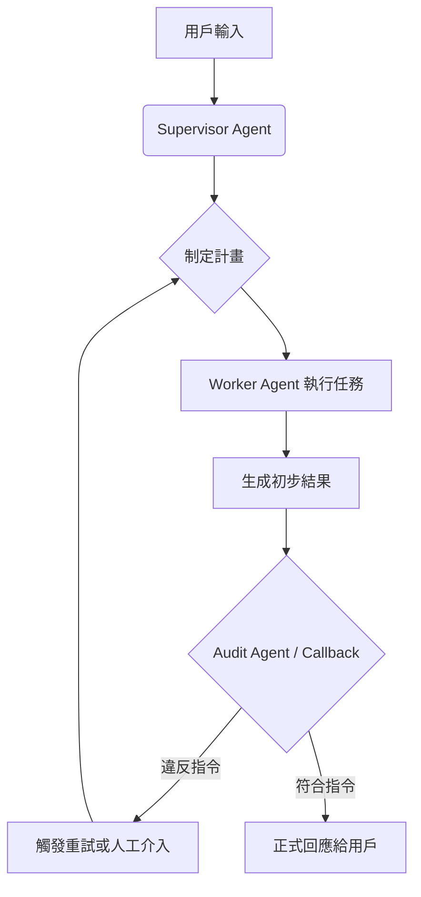

# 指令保真度審核

在複雜的 Agent 系統中，開發者常犯的錯誤是過度信任大型語言模型 (LLM) 的指令遵循能力。隨著對話長度增加，模型容易產生「目標漂移 (Goal Drift)」或陷入「迷失在中間 (Lost in the Middle)」的困境，導致 Agent 雖然執行了任務，卻違反了關鍵的業務約束。指令保真度審核（Instruction Fidelity Auditing）即是為了解決這種「靜默失敗」而設計的架構模式。

---

### 情境 1：引入獨立的「審核代理人」驗證高風險決策

當 Agent 需要執行涉及財務、法務或安全等高風險任務時，絕不能僅依靠單一 Agent 的自我檢查。最穩健的做法是引入一個專門的「審核代理人 (Auditor Agent)」，其唯一職責是比對「原始指令」與「執行結果」之間的保真度。

#### 核心概念
在執行流程中插入一個強制性的驗證環節。審核代理人不參與任務執行，僅負責根據指令契約（Instruction Contract）進行判定，這能有效防止執行代理人為了達成目標而採取「走捷徑」的行為。

#### 程式碼範例 (以貸款審核為例)

```python
# ❌ Bad: 依賴單一 Agent 自行確保合規
# 這種做法容易因為上下文過長，導致 Agent 忽略了「僅限首購族」的約束。
loan_agent = LlmAgent(
    name="LoanAgent",
    instruction="審核貸款申請。約束：僅限首購族提供優惠利率。",
    tools=[check_credit_tool]
)
# 直接執行並輸出結果，缺乏外部監督。
response = runner.run_async("user_123", "session_01", "申請貸款")

# ✅ Better: 實施指令保真度審核模式
# 使用 Google ADK 的架構，將審核邏輯獨立出來
primary_agent = LlmAgent(
    name="DiscountAgent",
    instruction="為訂單套用 15% 折扣，但僅限於用戶的首筆訂單。",
    tools=[apply_discount_tool]
)

audit_agent = LlmAgent(
    name="ComplianceAuditor",
    instruction="""
    你的職責是審核結果。
    將 '原始指令' 與 'Agent 輸出' 進行比對。
    驗證是否滿足所有約束（如：首筆訂單）。
    僅輸出 FAIL 或 SUCCESS 並提供理由。
    """
)

# 在 ADK Runner 中，我們透過邏輯編排確保審核發生在動作完成前
# 1. 執行 Primary Agent
# 2. 將其輸出與原始指令送交 audit_agent
# 3. 根據 audit_agent 的結果決定 Commit 或 Rollback
```

#### 底層原理探討與權衡
*   **為什麼有效 (Rationale)**：執行與監督的分離（Separation of Concerns）是軟體架構的基石。審核代理人擁有獨立的思維上下文，不會受到執行過程中的「推理噪音」干擾。
*   **權衡 (Trade-off)**：這種模式會增加系統延遲與 Token 成本，因為每次任務至少需要兩次 LLM 調用。
*   **拇指法則 (Rule of Thumb)**：僅在關鍵的「交接點」或涉及「不可逆動作」時實施審核，以平衡效能與安全性。

---

### 情境 2：利用 ADK Callback 機制實施即時合規攔截

在生產環境中，我們有時需要非侵入式的審核。Google ADK 提供的回呼 (Callback) 機制，讓我們能在不修改 Agent 核心邏輯的情況下，對輸入輸出進行即時檢查。

#### 核心概念
利用 `after_agent_callback` 攔截 Agent 的輸出事件。這就像是在生產線上安裝感測器，一旦檢測到輸出不符合指令預期（例如：模型輸出了 PII 敏感資訊），系統可以直接終止流程或標記為不合規。

#### 程式碼範例 (Google ADK 實戰)

```python
# ❌ Bad: 在 Tool 內部混合合規檢查邏輯
# 這會導致 Tool 邏輯變得臃腫且難以重複使用。
def process_data(text: str):
    if "敏感詞" in text: # 硬編碼檢查
        return "ERROR"
    return do_work(text)

# ✅ Better: 使用 ADK Callback 實施統一的保真度檢查
async def audit_callback(context: CallbackContext):
    # 取得 Agent 的最終回應內容
    content = context.session.events[-1].content

    # 使用輕量級模型或規則引擎檢查輸出是否違反指令約束
    if " forward-looking statements" in content:
        # 如果違反了指令中的「禁止前瞻性陳述」約束，則強行干預
        return Event(content="回應不合規，已攔截。", actions=Actions(escalate=True))
    return None

agent = LlmAgent(
    name="FinancialReporter",
    instruction="生成季度摘要。嚴格禁止包含任何前瞻性陳述。",
    after_agent_callback=audit_callback # 掛載回呼函數
)
```

#### 流程說明 (Mermaid 流程圖)



---

### 比較：單一 Agent vs. 審核模式

| 特性 | 單一 Agent (Level 3/5) | 審核模式 (Level 4/6) |
| :--- | :--- | :--- |
| **可靠性** | 較低，容易產生指令漂移 | 高，具備外部驗證機制 |
| **透明度** | 黑盒化，難以追蹤決策原因 | 透明，提供完整的審核軌跡 |
| **延遲** | 較低 | 較高（增加檢查環節） |
| **適用場景** | 低風險、簡單任務 | 高風險、法規限制嚴格的任務 |

---

### 延伸思考

**1️⃣ 問題一**：如果審核代理人本身也產生幻覺（Hallucination）怎麼辦？

**👆 回答**：這是典型的「誰來監督監督者」問題。在 Level 6 的進階系統中，我們會採用「多數投票 (Majority Voting Across Agents)」模式，由 3 個獨立的審核代理人進行投票，以消除單一模型的偏差。

---

**2️⃣ 問題二**：指令保真度審核是否可以用 Prompt Engineering（如 FCoT）來替代？

**👆 回答**：FCoT（分形思維鏈）是 Agent 的「內部」自我修正機制，讓它在思考過程中自我檢查；而審核模式是「外部」監督。最穩健的生產級系統會將兩者結合：讓 Worker Agent 使用 FCoT 減少錯誤，並由獨立的 Auditor Agent 進行最終把關，形成多層防禦。