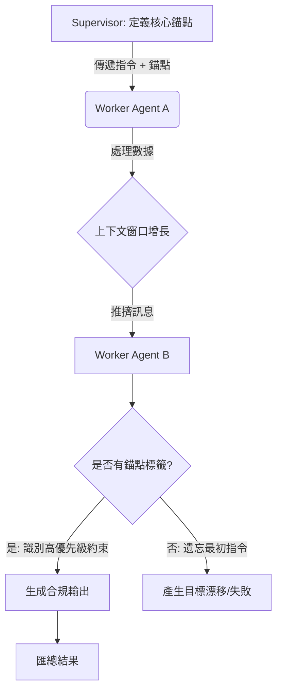

# 持久化指令錨定

在構建複雜的 Agent 系統時，架構師面臨的最大敵人之一就是「上下文稀釋」。隨著對話輪次的增加，核心指令（Mission-critical instructions）會被淹沒在大量的工具輸出和中間推理中，導致所謂的「迷失在中間 (Lost in the Middle)」現象。這不僅僅是性能問題，這是一種行為崩潰。**持久化指令錨定 (Persistent Instruction Anchoring)** 是一種確保 Agent 在深度鏈路或長對話中始終恪守「指令契約 (Instruction Contract)」的設計模式。

---

### 情境 1：使用語義標籤封裝「不可遺忘」的約束

單純將指令放在提示詞開頭是不夠的，因為 LLM 對對話中段的訊息處理能力會顯著下降。我們必須通過顯式的語義標籤（如 `<CONSTRAINT>` 或 `[GOAL]`）來「錨定」這些關鍵訊息，並在 Agent 間傳遞時強制攜帶。

#### 核心概念
將 Agent 的任務定義區分為「動態上下文」與「持久化錨點」。錨點透過特定的標籤包圍，使其在 Token 機制中產生更強的注意權重。

#### 程式碼範例 (以財務報告為例)

```python
# ❌ Bad: 簡單的平鋪指令
# 隨着 DataExtractionAgent 加入大量數據，核心約束會被推向中段而被忽略。
instruction = "生成 Q3 財務摘要。嚴禁包含前瞻性陳述。"

# ✅ Better: 持久化指令錨定模式
# 使用顯式標籤，確保指令在 Agent 鏈路傳遞時依然鮮明。
ANCHORED_GOAL = "<CRITICAL_INSTRUCTION>嚴禁包含任何前瞻性陳述 (No forward-looking statements)</CRITICAL_INSTRUCTION>"

# 在 ADK 中定義 Agent 時，確保指令結構化
summarization_agent = LlmAgent(
    name="FinancialReporter",
    instruction=f"""
    你負責撰寫財務摘要。
    {ANCHORED_GOAL}

    請基於以下提取的數據進行總結，但必須始終遵守上述標籤內的約束。
    """
)
```

#### 底層原理探討與權衡
*   **為什麼有效 (Rationale)**：Transformer 模型雖然具備長上下文處理能力，但其注意力機制在處理雜訊過多的中段訊息時會發生偏移。語義錨定標籤（Semantic Anchors）為 Agent 提供了一個持續回溯的「指北針」，能有效對抗目標漂移 (Goal Drift)。
*   **權衡 (Trade-off)**：錨定標籤會佔用額外的 Token，且若標籤過多，反而會造成 Agent 混淆。
*   **拇指法則 (Rule of Thumb)**：對於超過 3 步以上的 Agent 鏈路或深度層次結構，必須實施錨定模式。

---

### 情境 2：利用 ADK 的 System Instruction 維持全局一致性

在 Google ADK 的架構中，`system_instruction` 被設計為治理性的（Governing）且持久的（Persistent）。它定義了 Agent 的身份與邊界，不應隨用戶輸入而改變。

#### 核心概念
架構師應將「不變量（Invariants）」寫入 `system_instruction`，而將「變量（Variants）」放入對話狀態（State）中。

#### 程式碼範例

```python
# ❌ Bad: 在每一輪對話中重新發送所有規則
# 這樣做會導致 Token 成本激增，且容易產生指令衝突。

# ✅ Better: 利用 ADK 的持久化身份定義
# 定義一個具有「強邊界」的 Agent
compliance_agent = LlmAgent(
    system_instruction="""
    # 核心指令錨點:
    - 必須遵循 Fair Lending 規範。
    - 嚴禁處理未經脫敏的 PII 數據。
    - 發現違規必須立即調用 escalate=True。
    """,
    # 在整個 session 中是持久且具備統治地位的
    name="ComplianceOfficer",
    instruction="""
    你是公司的合規官，負責審核所有輸出是否符合上述規範。
    """,
    # 利用 ADK 的狀態管理來處理動態上下文，而非混入指令中
    output_key="audit_results"
)
```

#### 流程說明
下圖展示了錨定指令如何在 Agent 層次結構中生存，而不被中間數據淹沒。



---

### 延伸思考

**1️⃣ 問題一**：如果 Agent 同時收到多個相互衝突的錨定指令，該如何處理？

**👆 回答**：這是典型的「指令優先級」問題。在架構設計上，應遵循 **"Hierarchy Wins"** 原則。父 Agent 下達的錨定指令（Persistent Instruction Anchoring）應在 `system_instruction` 中標記為最高等級，並配合 `Instruction Fidelity Auditing`（指令保真度審核）來檢測輸出的衝突點。

---

**2️⃣ 問題二**：除了標籤，還有什麼方法可以增強「錨定」效果？

**👆 回答**：**重申與位置策略**。根據「Lost in the Middle」研究，LLM 對開頭和結尾的訊息最敏感。因此，先進的 Agent 框架（如 ADK 的內部處理）會在構造最後的 Prompt 給模型前，自動將標籤內的「持久化錨點」重新插入到上下文的最末端，實施二次提醒。

---

**3️⃣ 問題三**：這與 RAG 有什麼區別？

**👆 回答**：RAG 解決的是「知識（Data）」的獲取問題，而錨定解決的是「行為控制（Control/Behavior）」的持續性問題。RAG 提供的是釣魚所需的資訊，錨定則確保 Agent 始終記得它是來釣魚的，而不是在水邊玩耍。