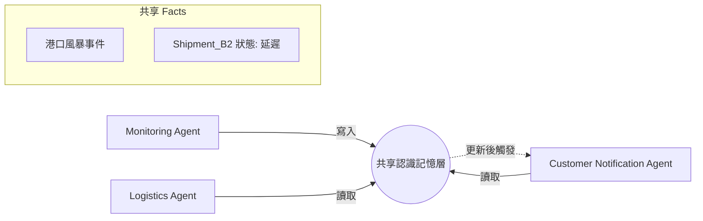

# 共享認識記憶

在分散式 Agent 系統中，架構師面臨最棘手的挑戰不是單個 Agent 的推理能力，而是多個 Agent 之間的「認識協調」。如果 Agent A 觀察到服務器已宕機，但 Agent B 仍基於「服務器運行中」的假設進行決策，整個系統就會陷入「巴別塔效應（Tower of Babel effect）」，導致協作崩潰。**共享認識記憶 (Shared Epistemic Memory)** 模式旨在建立一個存在於單個 Agent 上下文窗口之外的、可變的單一事實來源，確保整個群體共享相同的世界觀。

---

### 情境 1：建立全局單一事實來源以消除語義漂移

當多個 Agent 串聯執行任務時（如鏈式 Agent 結構），若僅靠提示詞傳遞狀態，訊息會隨著處理鏈的增長而產生「噪音」或遺失細節，這稱為損耗性通信。架構師應優先使用獨立的存儲模組作為「全局草稿板」。

#### 核心概念
將狀態從 Agent 的對話歷史中解耦，放入一個所有成員都能讀寫的全局數據庫（如向量數據庫或持久化 Key-Value 存儲）。這能防止訊息在傳遞過程中產生語義漂移。

#### 程式碼範例 (以供應鏈中斷處理為例)

```python
# ❌ Bad: 依賴 Agent 間的對話傳遞關鍵事實
# 這種做法會導致訊息隨著鏈路增加而遺失細節，或是讓上下文窗口因重複事實而爆炸。
agent_a_msg = "檢測到港口風暴，Shipment_B2 可能延遲。"
agent_b_response = runner.run(f"基於以下訊息處理：{agent_a_msg}") # 損耗性傳遞

# ✅ Better: 實施共享認識記憶模式
# 使用 Google ADK 的 session.state 作為會話內的共享記憶層
async def update_shared_truth(context: InvocationContext, shipment_id: str, status: str):
    # 建立權威性的單一參考點
    context.session.state[f"shipment:{shipment_id}:status"] = status
    context.session.state[f"shipment:{shipment_id}:last_update"] = time.time()

# 監控 Agent 更新記憶
await update_shared_truth(ctx, "B2", "Delayed")

# 通知 Agent 直接從共享記憶提取「地面事實 (Ground Truth)」
# 這樣不論 Agent 處於層次結構的哪個位置，其理解都是同步的
```

#### 底層原理探討與權衡
*   **為什麼有效 (Rationale)**：共享記憶提供了「認識一致性」。Agent 不再詢問「有什麼新消息？」，而是由系統確保其感知始終基於最新的權威狀態。這大幅降低了推理錯誤的機率。
*   **權衡 (Trade-off)**：引入中心化存儲會增加架構複雜度，且在高併發下需處理「競態條件 (Race Conditions)」，若多個 Agent 同時寫入同一事實，可能導致狀態衝突。
*   **拇指法則 (Rule of Thumb)**：對於超過 3 個 Agent 協作的長任務，必須實施共享記憶而非僅依賴對話歷史。

---

### 情境 2：利用 ADK 作用域（Scopes）實施跨層級事實共識

在企業級應用中，共識往往分為不同生命週期。有些事實僅限於本次對話，有些事實則是針對特定用戶的長期偏好，有些則是全局業務規則。

#### 核心概念
架構師應根據事實的「性質」選擇正確的存儲作用域。Google ADK 提供了四種狀態作用域（Scopes）來支持這種精確的記憶管理。

#### 程式碼範例

```python
# ✅ Better: 根據共識類別劃分存儲作用域
# 1. 臨時狀態 (temp:)：僅限當前回合，處理中間推理數據
context.state["temp:current_calculation"] = 0.85

# 2. 會話狀態 (無前綴)：本場對話中所有 Agent 的共享事實
context.state["order_id"] = "ABC-123"

# 3. 用戶狀態 (user:)：該用戶跨所有會話的持久共識（如：過敏史、VIP 等級）
context.state["user:preferred_currency"] = "TWD"

# 4. 應用狀態 (app:)：全局 Agent 都必須遵守的業務邊界（如：今日匯率、庫存政策）
context.state["app:inventory_low_threshold"] = 10
```

---

### 比較：對話傳遞 vs. 共享認識記憶

| 特性 | 對話傳遞 (Sequential) | 共享認識記憶 (Shared Epistemic) |
| :--- | :--- | :--- |
| **一致性** | 弱，易產生傳聲筒效應 | 強，同步更新 |
| **上下文負擔** | 高，重複事實佔用 Token | 低，僅提取必要的引用鍵 |
| **存活時間 (TTL)** | 隨對話結束消失 | 可配置持久化 (Redis/MemoryService) |
| **適用範圍** | 2-3 輪的簡單任務 | 複雜的多 Agent 協作 (Level 6) |

---

### 流程說明

下圖展示了不同專長的 Agent 如何透過共享記憶層同步「中斷事件」而不必互相通訊：



---

### 延伸思考

**1️⃣ 問題一**：事實會隨著時間「腐爛 (Rots)」，如何處理過期的共識？

**👆 回答**：這在架構上稱為「認識衰減」。必須為每一條共享事實實施 **存活時間 (TTL)** 或 **時間戳驗證**。在讀取事實時，Agent 應檢查時間標籤；例如：「這份數據是 20 分鐘前的，我應該重新調用工具驗證它，而非盲目信任」。

---

**2️⃣ 問題二**：如果兩個 Agent 對同一個事實寫入了矛盾的更新怎麼辦？

**👆 回答**：這是 **認識衝突 (Epistemic Conflict)**。此時應結合 **共識模式 (Consensus Pattern)**：當檢測到共享記憶中的事實衝突時，系統應觸發一個迭代辯論流程，讓 Agent 們基於證據進行權重評估，直到達成一致的公差範圍內，再更新最終事實。

---

**3️⃣ 問題三**：共享記憶是否會造成數據隱私洩漏？

**👆 回答**：是的，多租戶 Agent 系統必須嚴格隔離共享記憶。應配合 **模型護欄 (Model Armor)** 和 **實時合規監控 (Real-time Compliance Monitoring)**，確保 Agent A 寫入的敏感數據（如 PII）在被 Agent B 讀取前已進行適當的脫敏或訪問授權檢查。