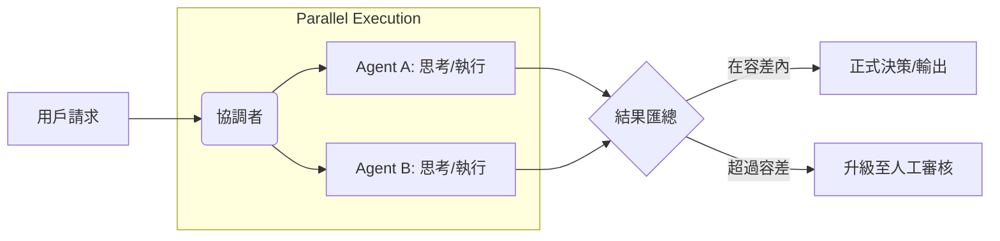

# 並行執行共識

在分散式系統與高風險的決策場景中，單一模型（Single Model）的「非決定性（Non-deterministic）」是架構師最大的隱憂。即便是最強大的大型語言模型（LLM），也可能因為輸入的微小擾動產生幻覺（Hallucination）或決策漂移。**並行執行共識 (Parallel Execution Consensus)** 模式，亦被稱為 **代理人故障切換（Agent Failover to Agent）**，其核心思想是透過「冗餘運算」與「投票驗證」來確保輸出的可靠性。

---

### 情境 1：消除單一模型帶來的「靜默錯誤」

在處理金融信用評等、醫療診斷或合規性審查等高成本決策時，依賴單一 Agent 等同於將系統暴露在單點故障（Single Point of Failure）中。模型的一次誤判可能導致巨大的法律或財務損失。

#### 核心概念
實施自動化冗餘機制。同時呼叫兩個或更多獨立的 Agent 執行相同任務，並由協調者（Orchestrator）比對結果。若結果在容差（Tolerance）範圍內則接受；若存在顯著差異，則升級至人工審核。

#### 程式碼範例 (以信用評分為例)

```python
# ❌ Bad: 過度依賴單一 Agent 的決定
# 如果 PrimaryAgent 產生幻覺提供錯誤評分，系統將直接採用。
async def approve_loan(applicant_id):
    score = await primary_agent.get_credit_score(applicant_id) # 單點風險
    return "Approve" if score > 680 else "Reject"

# ✅ Better: 透過並行執行與共識邏輯驗證
# 引用來源: 使用兩個獨立代理人（可能是不同模型）並比對結果
async def approve_loan_with_consensus(applicant_id):
    # 並行啟動兩路運算
    results = await asyncio.gather(
        primary_agent.get_credit_score(applicant_id),
        backup_agent.get_credit_score(applicant_id)
    )

    score1, score2 = results
    tolerance = 10 # 容差值

    if abs(score1 - score2) <= tolerance:
        final_score = (score1 + score2) / 2
        print(f"共識達成，最終分數: {final_score}")
        return "Approve" if final_score > 680 else "Reject"
    else:
        # 分歧過大，觸發延遲升級模式
        print(f"分歧警告: {score1} vs {score2}")
        return await escalate_to_human(applicant_id, results)
```

#### 底層原理探討與權衡
*   **為什麼有效 (Rationale)**：這借鑑了硬體架構中的「三重模組冗餘 (TMR)」。獨立的 Agent 往往使用不同的 Prompt 模板或基礎模型（如 Gemini Pro vs Flash），這降低了系統性偏見（Systemic Bias）導致同步出錯的機率。
*   **權衡 (Trade-off)**：Token 成本與運算開銷會隨著參與 Agent 的數量成倍增加。
*   **拇指法則 (Rule of Thumb)**：僅針對「不可逆且高成本」的決策點實施。對於一般資訊檢索，單路執行即可。

---

### 情境 2：利用 Google ADK 的 `ParallelAgent` 加速決策流程

在高併發場景下，若串行（Sequential）執行多個 Agent 的共識檢查，會導致延遲（Latency）線性累加。

#### 核心概念
使用 Google ADK 提供的 `ParallelAgent` 原語。這能讓系統在單一 CPU 核心或執行緒上透過非同步 I/O 同時發送多個請求，讓整體耗時受限於最慢的那個 Agent，而非所有 Agent 之和。

#### 程式碼範例

```python
# ✅ Better: 利用 ADK 原生 ParallelAgent 結構實現並行共識
# 引用來源: ParallelAgent 會併發執行所有子代理人
consensus_taskforce = ParallelAgent(
    name="RiskConsensusTeam",
    sub_agents=[
        credit_analyst_pro,   # 使用高品質模型
        credit_analyst_flash, # 使用低延遲模型
        policy_checker        # 檢索事實
    ],
    # 每個 Agent 將結果寫入特定的 state key 以避免競態
    output_keys=["score_pro", "score_flash", "policy_status"]
)

# 執行完畢後，由後續的任務（如 SequentialAgent 的下一步）進行邏輯裁決
```

---

### 更多說明：決策共識模式對比

| 特性 | 單路執行 (L3) | 並行共識 (L4) | 多數決投票 (L5/L6) |
| :--- | :--- | :--- | :--- |
| **Agent 數量** | 1 | 2 | 3 或更多 (奇數) |
| **容錯性** | 無 | 具備檢測分歧能力 | 具備忽略單一離群值能力 |
| **延遲成本** | 最低 | 取決於較慢者 | 取決於最慢者 |
| **適用場景** | 低風險、低成本任務 | 關鍵業務決策驗證 | 極端高風險任務（如醫療決策） |

---

### 流程說明



---

### 延伸思考

**1️⃣ 問題一**：並行執行是否會因為模型同質化（都使用 Gemini）而失效？

**👆 回答**：這確實是一個風險。在架構設計上應追求「異質性」。建議結合 **Prompt 變異（Prompt Mutation）** 與 **異構模型**（如一個模型用 Gemini Pro，另一個用 Llama），以打破相同的認知盲點。

---

**2️⃣ 問題二**：如何設定合理的「容差 (Tolerance)」？

**👆 回答**：容差應根據業務指標定義。如果是數值決策（如評分），可設定百分比（如 5%）；如果是分類決策（如 Approve/Deny），則容差應為零（必須完全一致）。

---

**3️⃣ 問題三**：並行執行共識與 RAG 的 Grounding 有何不同？

**👆 回答**：RAG 的 Grounding 是「對齊事實」，確保 Agent 不說謊；並行共識是「對齊邏輯」，確保 Agent 的判斷準則在多路運算下依然穩健。