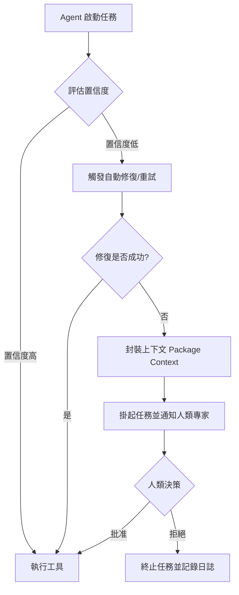

# 延遲升級策略

在生產級 Agent 架構中，最昂貴且最慢的資源永遠是「人類專家」。一個設計不良的系統會在 Agent 遇到任何微小不確定性時立即觸發報警，這會導致嚴重的「警報疲勞 (Alert Fatigue)」，並讓人類專家成為系統吞吐量的瓶頸。**延遲升級策略 (Delayed Escalation Strategy)** 是一種多層次的防禦機制，它要求系統在打擾人類之前，必須先窮盡所有低成本的自動化修復手段。

---

### 情境 1：建立多層次故障轉移，而非「一錯就報」

在處理如合規性檢查或詐騙偵測等任務時，Agent 的置信度 (Confidence Score) 可能因暫時性的數據不完整或模型隨機性而下降。架構師應設計一個「階梯式」的響應路徑，而非二元化的「成功/報警」開關。

#### 核心概念
將人類介入視為最後的手段。當 Agent 置信度低於門檻時，系統應自動觸發：

1. 指令變異重試 (Adaptive Retry)

2. 呼叫更強大的備援模型 (Fallback Model)

3. 只有在這些手段都無效後，才封裝完整上下文並移交人工審核。

#### 程式碼範例 (Bad vs. Better)

```python
# ❌ Bad: 低置信度時立即要求人工介入
# 這種做法無法處理網路抖動或暫時性的 API 延遲，浪費專家資源。
async def check_compliance(transaction):
    result = await primary_agent.analyze(transaction)
    if result.confidence < 0.95:
        # 立即報警，人類必須處理每一個邊緣案例
        return await human_expert.review(transaction)
    return result.decision

# ✅ Better: 實施延遲升級策略
# 只有在自動化手段耗盡後，才升級至人類專家
async def check_compliance_with_delayed_escalation(transaction):
    max_retries = 2
    for attempt in range(max_retries):
        result = await primary_agent.analyze(transaction)
        if result.confidence >= 0.95:
            return result.decision

        # 自動化修復嘗試：例如使用不同的 Prompt 再次測試
        print(f"嘗試 {attempt + 1}: 置信度不足，啟動自動修復...")
        await asyncio.sleep(2) # 等待潛在的暫時性問題消失

    # 窮盡手段，封裝 context 後再升級
    review_packet = {
        "transaction": transaction,
        "history": "已重試 2 次均失敗",
        "reason": "持續性低置信度"
    }
    return await human_expert.review_queue.push(review_packet)
```

#### 底層原理探討與權衡
*   **為什麼有效 (Rationale)**：許多 Agent 的錯誤是暫時性的 (Transient)。延遲升級能有效過濾掉這些雜訊，確保人類只處理真正的「例外」與「高風險」決策。
*   **權衡 (Trade-off)**：這種策略會增加特定任務的「最終解決時間 (Resolution Time)」，因為系統在升級前會先進行重試。
*   **拇指法則 (Rule of Thumb)**：針對高風險、低頻率的任務 (如大額貸款審核) 實施長延遲策略；針對低風險、高頻率任務，則應偏向自動化決策或快速拒絕。

---

### 情境 2：利用 ADK 的工具確認機制實施「關鍵節點暫停」

在 Google ADK 框架中，對於涉及不可逆操作 (如刪除數據、發送正式郵件) 的工具，應強制實施 `Tool Confirmation`，這是一種原生的延遲升級實現方式。

#### 核心概念
Agent 可以自主規劃並執行 90% 的流程，但當它準備調用高風險工具時，ADK 運行環境會自動掛起 (Pause)，並等待一個顯式的 `SUCCESS` 信號才允許執行。這確保了「策略 ambiguity」由 Agent 解決，而「執行安全」由人類把關。

#### 程式碼範例 (Google ADK 實戰)

```python
# ✅ Better: 使用 ADK 的 Tool Confirmation 進行安全升級
from google.adk import FunctionTool

def send_official_refund(order_id: str, amount: float):
    # 執行退款邏輯
    pass

# 定義工具時啟用確認請求
refund_tool = FunctionTool(
    send_official_refund,
    # 核心：要求人工或系統確認
    require_confirmation=True
)

# 當 Agent 執行到此處時，ADK 會拋出一個 Pending 事件
# 系統會暫停並等待 human_decision：VALIDATE_APPRAISAL 或 REJECT
```

#### 流程說明 (Mermaid 流程圖)



---

### 延伸思考

**1️⃣ 問題一**：如何避免人類專家成為系統的「單點故障」或瓶頸？

**👆 回答**：實施 **SLO 監控與超時處置**。如果人類在設定的時間內 (如 10 分鐘) 沒有響應，系統應具備自動退回 (Rollback) 或降級處理的邏輯 (例如：暫時拒絕交易並通知客戶稍後再試)，而非無限期掛起。

---

**2️⃣ 問題二**：傳交給人類專家時，最關鍵的「上下文」應該包含什麼？

**👆 回答**：不僅是原始數據。一個成熟的架構應提供 **「推理軌跡 (Trajectory)」**：包含 Agent 之前的思考步驟、嘗試過的工具調用、以及為什麼它現在感到困惑的具體理由 (如：發現兩個數據源相互矛盾)。這能將專家的審核時間從幾分鐘縮短至幾秒鐘。

---

**3️⃣ 問題三**：延遲升級如何與 RAG 結合？

**👆 回答**：使用 **CRAG (糾正性 RAG)** 模式。當檢測到檢索到的內容不相關或存在衝突時，Agent 應先嘗試透過外部搜尋 (Web Search) 自行糾正。只有當外部資訊仍無法消除歧義時，才升級至人類查核。