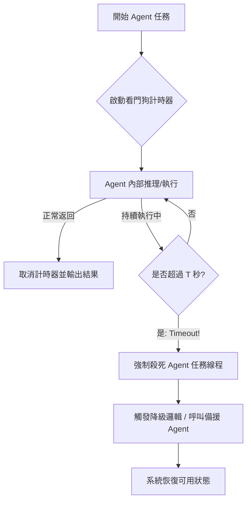

# 看門狗超時主管

在分散式 Agent 架構中，最危險的失敗不是「報錯」，而是「沉默」。當 Agent 呼叫外部 API 遭遇延遲，或是複雜的推理邏輯陷入遞迴死循環時，如果不加以限制，它會無限期地占用線程與內存，最終導致整個系統的級聯失效（Cascading Failure）。作為一名架構師，我始終主張：**沒有超時機制的外部呼叫，都是在對系統穩定性耍流氓。**

---

### 情境 1：將 Agent 呼叫封裝在定時執行塊中

Agent 的任務執行時間往往是非決定性的。開發者常見的錯誤是假設 LLM 總能在幾秒內回應。實施「看門狗」模式，就是為每一個 Agent 呼叫安裝一個強制性的計時炸彈，一旦時間耗盡，監控者（Supervisor）將強制終止任務並觸發復原流程。

#### 核心概念
「看門狗超時主管」模式透過將 Agent 呼叫包裹在一個定時器（Timer）中，確保系統在 Agent 無回應、掛起或陷入死循環時仍能保持可用性。這是一道關鍵的安全網，防止單一阻塞點凍結整個工作流。

#### 程式碼範例 (Bad vs. Better)

```python
# ❌ Bad: 無限期等待 Agent 回應
# 如果 PrimaryAnalysisAgent 因為外部 API 延遲而掛起，這段程式碼將永遠阻塞。
async def process_task(task_input):
    # 缺乏時間邊界，容易導致系統凍結
    result = await primary_agent.run_async(task_input)
    return result

# ✅ Better: 實施看門狗超時監控 (參考 agent-archi.md)
import asyncio

async def watchdog_orchestrator(task_input):
    timeout_seconds = 10.0 # 根據業務定義超時閾值

    try:
        # 使用 asyncio.wait_for 作為看門狗計時器
        result = await asyncio.wait_for(
            primary_agent.run_async(task_input),
            timeout=timeout_seconds
        )
        return result
    except asyncio.TimeoutError:
        # 🐶 看門狗偵測到超時，強制終止並切換至備援路徑
        print(f"警報：Agent 執行超過 {timeout_seconds}s，啟動故障切換。")
        # 執行 Fallback 邏輯：呼叫反應更快的模型或返回降級結果
        return await backup_agent.run_async(task_input)
```

#### 底層原理探討與權衡
*   **為什麼有效 (Rationale)**：它強制為系統性能劃定上限（Upper Bound），讓工作流的執行變得可預測。
*   **權衡 (Trade-off)**：超時設定過短會導致有效任務被誤殺；設定過長則無法及時緩解系統壓力。此外，強制取消任務可能導致資源殘留（如未釋放的數據庫鎖），需配合清理邏輯。
*   **拇指法則 (Rule of Thumb)**：對於所有涉及外部網路呼叫（API）或不受控第三方工具的 Agent，必須設定超時限制。

---

### 情境 2：在 Google ADK 中配置執行限制與防禦

在 Google ADK 的框架下，架構師應利用其內建的執行參數來實施系統級的「看門狗」保護，而非單純依賴業務程式碼。

#### 核心概念
利用 ADK 的 `RunConfig` 與 `max_llm_calls` 參數，從運行時層級限制 Agent 的最大資源消耗。這能有效防止 Agent 為了達成目標而產生過多的遞迴呼叫，造成 Token 成本與時間的雙重爆炸。

#### 程式碼範例

```python
# ✅ Better: 利用 ADK 配置實施資源約束與防禦
from google.adk.agents import LlmAgent, LoopAgent
from google.adk.agents.run_config import RunConfig
from google.adk.runners import Runner

# 1. 針對推理型 Agent：透過指令與 RunConfig 限制 LLM 呼叫次數
analysis_agent = LlmAgent(
    model="gemini-2.0-flash",
    name="SafeAnalyst",
    instruction="進行數據分析。請精簡你的推理步驟，確保在有限次數內完成。"
)

# 2. 針對迭代型 Agent：使用 LoopAgent 內建的 max_iterations 避免死循環
# (參考 loop-agents.md：LoopAgent 是確定性的工作流組件)
iterative_workflow = LoopAgent(
    name="IterativeOptimizer",
    sub_agents=[analysis_agent],
    max_iterations=3  # 硬性限制迭代次數
)

# 3. 執行配置：利用 RunConfig 設定系統級的安全閥
config = RunConfig(
    max_llm_calls=5   # 防止 Agent 陷入無限 Tool-calling 循環，回收僵死資源
)

# 4. 實施雙重保護：ADK 配置 + Python 級別的 Watchdog (asyncio.wait_for)
runner = Runner(agent=iterative_workflow)
try:
    # 啟動外層看門狗監控整個工作流的執行時間
    await asyncio.wait_for(
        runner.run_async(user_id="user_1", session_id="sid_1", input="分析報告", run_config=config),
        timeout=30.0
    )
except asyncio.TimeoutError:
    print("警報：工作流執行超時，已強制終止。")
except Exception as e:
    # 處理因達到 max_llm_calls 或其他異常產生的錯誤
    print(f"執行失敗: {e}")
```

---

### 更多說明 (模式對比表)

| 決策維度 | 簡單重試 (Retry) | 看門狗 (Watchdog) | 延遲升級 (Escalation) |
| :--- | :--- | :--- | :--- |
| **觸發條件** | 收到明確的 Error 報錯 | **完全無回應 (Silence)** | 重試無效或置信度過低 |
| **主要目的** | 解決短暫的網路抖動 | **回收僵死資源，保證系統存活** | 尋求人類專家介入解決複雜問題 |
| **實施難度** | 低 | 中 (需處理非同步取消) | 高 (需 UI 配合) |

---

### 流程說明 (Mermaid 流程圖)



---

### 延伸思考

**1️⃣ 問題一**：超時被觸發後，如何確保 Agent 呼叫的外部工具（如資料庫更新）不會處於「半完成」狀態？

**👆 回答**：這是資料一致性的挑戰。在架構設計上，應盡量確保 Agent 使用的工具具備「等冪性 (Idempotency)」。如果無法做到等冪性，則超時後應觸發「補償動作（Compensating Action）」或進行狀態回滾。

---

**2️⃣ 問題二**：如何動態地設定超時時間，而非寫死一個 `10.0` 秒？

**👆 回答**：進階的做法是實施「自適應超時」。可以根據歷史觀測到的 P95 延遲動態調整。在 Google ADK 中，你可以透過監控 `session.events` 中的時間戳來計算 Agent 的平均回應時間，並動態更新 `RunConfig`。

---

**3️⃣ 問題三**：看門狗模式與「斷路器 (Circuit Breaker)」模式有何區別？

**👆 回答**：看門狗關注的是「單次任務」的逾時回收；斷路器則關注「一段時間內」呼叫特定服務的持續失敗率。兩者應協同工作：當看門狗頻繁偵測到超時，斷路器應自動跳脫，直接拒絕後續請求，給予底層服務恢復的時間。