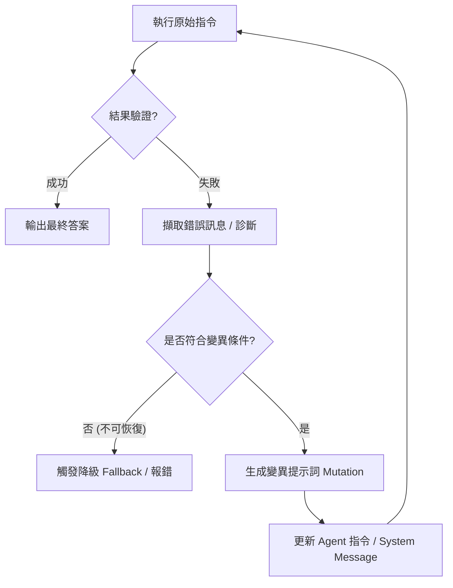

# 具提示變異的自適應重試 (adaptive_prompt_mutation)

在分散式 Agent 系統中，開發者最常犯的低級錯誤就是將「傳統網路重試邏輯」直接套用到 LLM 呼叫上。如果 Agent 因為指令理解偏差而導致輸出格式錯誤，盲目地使用相同的提示詞 (Prompt) 再次重試，通常只會得到相同的錯誤結果，白白浪費 Token 與延遲。**具提示變異的自適應重試 (Adaptive Retry with Prompt Mutation)** 模式強調：每一次重試都必須是「進化」而非「重複」。

作為架構師，我們必須體認到：LLM 的失敗往往不是因為「網路抖動」，而是因為「指令與模型能力的錯位」。

---

### 情境 1：拒絕盲目循環，優先使用「注入式錯誤反饋」而非簡單計數重試

當 Agent 執行失敗（例如：輸出非預期的 JSON 格式或違反安全約束）時，架構師不應僅僅增加 `retry_count`，而應啟動「提示詞診斷器」，將失敗原因注入到下一輪的指令中。

#### 核心概念
將失敗的「負面案例」轉化為「正面約束」。透過在重試時動態修改 `LlmAgent` 的 `instruction`，我們可以強制模型關注前一次失敗的痛點，這在處理複雜邏輯或嚴格格式要求時至關重要。

#### 程式碼範例 (以提取結構化數據為例)

```python
# ❌ Bad: 盲目的 for-loop 重試
# 相同的指令發送三次，模型極大機率會在同一個地方「跌倒」。
for i in range(3):
    try:
        # 每次都使用完全相同的指令，忽視了模型對該指令可能存在的認知偏差
        response = await data_agent.run("從合約中提取日期")
        validate_json(response)
        break
    except ValueError:
        continue

# ✅ Better: 具提示變異的自適應重試
# 每次重試都會根據上一次的錯誤「變異」指令，利用 Google ADK 的動態指令特性。
async def run_with_mutation(task_input):
    base_instruction = "你是一個合約分析官，提取日期並僅輸出 JSON。"
    attempt = 0
    max_attempts = 3
    last_error = ""

    while attempt < max_attempts:
        # 🐶 核心邏輯：動態建構變異指令
        current_instruction = base_instruction
        if last_error:
            # 注入負面反饋，改變 Attention 分佈
            current_instruction += f"\n\n[修正建議] 前次嘗試失敗，錯誤訊息：{last_error}。請確保嚴格遵守 JSON 格式，嚴禁包含 markdown 代碼塊標籤。"

        # 在 ADK 中，我們可以隨時實例化一個帶有新指令的 Agent
        temp_agent = LlmAgent(
            name=f"Retry_Agent_v{attempt}",
            model="gemini-2.0-flash",
            instruction=current_instruction
        )

        response = await runner.run_async(temp_agent, task_input)

        error_msg = validate_json(response)
        if not error_msg:
            return response

        last_error = error_msg
        attempt += 1

    raise Exception("多次變異重試後仍無法達成格式合規")
```

#### 底層原理探討與權衡
*   **為什麼有效 (Rationale)**：LLM 的非決定性（Non-determinism）在固定 Prompt 下是有限的。如果一個 Prompt 在第一次呼叫時觸發了模型的某種「推理幻覺」，相同的輸入有極高機率再次觸發。透過注入錯誤反饋，我們改變了模型內部的推理路徑（Internal reasoning path），強迫模型跳出原有的 Token 預測機率分佈。
*   **權衡 (Trade-off)**：指令會隨重試次數增加而變長，導致 Context Window 消耗上升且可能引入指令衝突（Instruction Conflict）。
*   **拇指法則 (Rule of Thumb)**：僅在發生「可明確診斷」的失敗（如 Schema 驗證失敗、工具調用參數錯誤）時使用變異重試。

---

### 情境 2：利用 Google ADK 的多代理協作實施「自我修復」流程

在進階的架構中，我們不應讓「生病的人給自己開藥」。我們應該設計一個「診斷代理人 (Diagnostician)」，專門負責觀察 Worker Agent 的失敗並產生「修復後的指令」。

#### 核心概念
這是一種「生成器-批評者 (Generator-Critic)」模式的變體。當 Worker 代理人失敗時，由診斷代理人分析失敗結果與原始指令的矛盾點，重新撰寫 Worker 的 `instruction`。這將指令優化的負擔從寫死在代碼中，轉移到了具備推理能力的 LLM 身上。

#### 程式碼範例 (使用 ADK 的 SequentialAgent 邏輯)

```python
# ✅ Better: 使用 ADK 模式實施「執行-診斷-修正」鏈路
from google.adk.agents import LlmAgent, SequentialAgent

async def self_healing_flow(user_input):
    worker = LlmAgent(
        name="Worker",
        model="gemini-2.0-flash",
        instruction="執行複雜的邏輯推理..."
    )

    diagnostician = LlmAgent(
        name="Diagnostician",
        model="gemini-2.0-flash",
        instruction="""
        你是一個資深 Prompt 工程師。
        分析 Worker Agent 的失敗原因，並產出一個改進後的『System Instruction』。
        確保新指令能避免前次的錯誤（例如：格式不符、邏輯跳躍）。
        """
    )

    # 1. 嘗試執行
    result = await runner.run_async(worker, user_input)

    if is_failure(result):
        # 2. 讓診斷代理人介入
        # 傳入：原始指令 + 失敗輸出 + 錯誤原因
        mutation_advice = await diagnostician.run(
            f"原始指令: {worker.instruction}\n失敗結果: {result.output}\n錯誤原因: {get_error(result)}"
        )

        # 3. 變異：應用改進建議並重試
        mutated_worker = LlmAgent(
            name="Worker_V2",
            model="gemini-2.0-flash",
            instruction=mutation_advice # 使用診斷代理人生成的全新指令
        )

        return await runner.run_async(mutated_worker, user_input)
```

#### 更多說明
*   **適用場景**：當錯誤類型多樣且難以用 regex 或簡單規則描述時（如語氣不對、邏輯不嚴密）。

---

### 情境 3：優先使用 ReflectAndRetryToolPlugin 處理工具呼叫的結構化恢復

在 Google ADK 系統中，對於「工具呼叫（Tool Calling）」導致的失敗，不應手動實作重試邏輯，而應優先使用內建的 Plugin 機制。

#### 核心概念
`ReflectAndRetryToolPlugin` 是 ADK 官方提供的標準化重試機制。它能自動攔截工具失敗，為模型提供結構化的引導以進行反思與修正。這比手動變異指令更具備效能與安全性。

#### 程式碼範例

```python
# ❌ Bad: 手動在工具函式內寫 try-except 重試
def get_user_data(user_id):
    for _ in range(3):
        try:
            return call_flaky_api(user_id)
        except:
            continue

# ✅ Better: 在 App 層級配置 ReflectAndRetryToolPlugin
from google.adk.apps.app import App
from google.adk.plugins import ReflectAndRetryToolPlugin

# 初始化 App 並加入自動反思重試外掛
app = App(
    name="Safe_Agent_App",
    root_agent=my_worker_agent,
    plugins=[
        # 自動攔截工具錯誤，並引導模型：「你的工具呼叫失敗了，請分析原因並再次嘗試」
        ReflectAndRetryToolPlugin(max_retries=3),
    ],
)
```

#### 底層原理探討與權衡
*   **優勢**：它是「並行安全」的，且支持細粒度追蹤（按工具追蹤失敗次數）。
*   **侷限**：僅適用於工具呼叫（Tool Calling）失敗，不適用於最終輸出的內容檢核（Content Validation）。

---

### 指令變異策略對比表

| 策略類型 | 適用場景 | 變異方法 (Mutation Method) | 預期效果 |
| :--- | :--- | :--- | :--- |
| **負面約束 (Negative Constraint)** | 格式錯誤、多餘贅字 | 加入 "不要包含任何解釋文字" | 顯著改善 JSON 合規性 |
| **少樣本強化 (Few-shot Injection)** | 邏輯推理錯誤 | 在指令中注入 1 個針對該錯誤的對比範例 | 提升推理邊界情況的穩定度 |
| **思維鏈引導 (CoT Shifting)** | 複雜步驟遺漏 | 強制要求 "Step-by-step" 並列出必要步驟 | 減少推理過程中的跳躍 |
| **反思外掛 (Plugin Reflection)** | 工具呼叫參數錯誤 | 由 Plugin 自動注入 Tool Error 到對話歷史 | 自動修正參數類型或缺失欄位 |

---

### 流程說明 (自適應重試演化循環)



---

### 延伸思考

**1️⃣ 問題一**：如果提示詞越改越亂，最後 Agent 徹底崩潰怎麼辦？

**👆 回答**：這稱為「指令中毒 (Instruction Poisoning)」。在架構上必須設定 **變異回滾 (Mutation Rollback)**。如果變異兩次仍無效，應放棄微調，改為「降級模式（Fallback）」或尋求「延遲升級（Escalation）」由人工介入。絕對不要在一次對話中無限變異指令。

---

**2️⃣ 問題二**：這種動態微調是否會影響緩存（Caching）效能？

**👆 回答**：是的。由於 Prompt 內容改變，基於 Prefix Caching 的優化將會失效。因此，在高並發環境下，建議將常用的變異指令預設為幾個「靜態模板」，根據錯誤類型匹配模板，而非完全由 LLM 動態生成，以平衡重試精度與推理成本。

---

**3️⃣ 問題三**：提示詞變異與微調 (Fine-tuning) 有何區別？

**👆 回答**：這是一個「工作記憶」與「長期記憶」的區別。提示詞變異是為了處理「當下特定請求」的偏差，屬於 In-context Learning。如果某種類型的失敗頻繁發生（例如模型始終無法理解某種專業術語），則應考慮將這些變異後的優質指令沉澱到 RAG 知識庫或進行模型微調。
