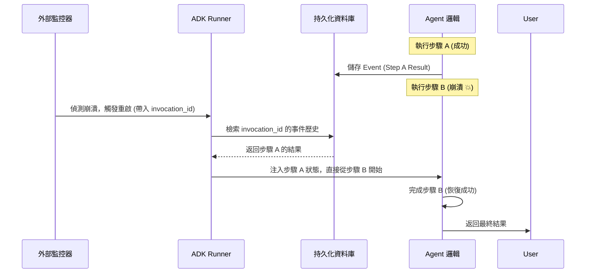

# 自癒代理復甦

在長期運行的分散式 Agent 系統中，Agent 通常被部署為持久化的微服務或守護進程。然而，軟體缺陷、資源耗盡或環境異常都可能導致 Agent 進程崩潰，使其從工作流中消失。如果缺乏自動化的復甦機制，系統將面臨長時間的停機，且必須依賴人工介入進行冷啟動。**自癒代理復甦 (Auto-Healing Agent Resuscitation)** 模式的核心在於將「生存監控」與「執行邏輯」解耦，確保系統能自動偵測失效並恢復到最後已知的正確狀態。

---

### 情境 1：實施「心跳監控」與外部主管機制

對於關鍵的數據處理 Agent，若進程因記憶體洩漏或未捕獲的異常而終止，主管（Supervisor）必須能夠立即感測到這種「沉默的失效」。

#### 核心概念
主管進程應持續監控 Worker Agent 的健康狀態，通常透過「心跳 (Heartbeat)」信號來實現。一旦心跳停止超過設定閾值，主管將自動重啟 Agent，而非等待運維人員報警。

#### 程式碼範例 (Bad vs. Better)

```python
# ❌ Bad: 缺乏外部監控，Agent 崩潰後即成為系統黑洞
class SimpleWorker:
    def run(self):
        try:
            do_complex_task()
        except Exception:
            # 僅僅記錄日誌並退出，系統其餘部分並不知道該 Agent 已消失
            log("Critical failure, exiting.")
            sys.exit(1)

# ✅ Better: 實施外部主管監控與自動重啟機制
import time
import subprocess

class AgentSupervisor:
    def __init__(self, agent_script):
        self.agent_script = agent_script
        self.max_retries = 3
        self.backoff_time = 2 # 指數退避起始時間

    def monitor_and_heal(self):
        attempt = 0
        while attempt < self.max_retries:
            # 啟動 Agent 作為子進程
            process = subprocess.Popen(["python", self.agent_script])
            print(f"Agent 已啟動 (PID: {process.pid})")

            process.wait() # 等待進程結束

            if process.returncode != 0:
                # 🐶 偵測到崩潰，啟動自癒流程
                attempt += 1
                sleep_duration = self.backoff_time ** attempt
                print(f"Agent 崩潰 (Code: {process.returncode})。第 {attempt} 次嘗試修復，等待 {sleep_duration}s...")
                time.sleep(sleep_duration)
            else:
                break # 正常結束則退出監控
```

#### 底層原理探討與權衡
*   **為什麼有效 (Rationale)**：將「執行」與「復原」分離。主管進程不涉及複雜業務，其唯一職責是維持進程存活，這大幅提升了系統的高可用性。
*   **權衡 (Trade-off)**：若 Agent 存在確定性的邏輯 Bug，自癒機制可能導致「崩潰循環 (Crash Loop)」，無端消耗資源。
*   **拇指法則 (Rule of Thumb)**：必須配合**指數退避 (Exponential Backoff)** 策略，在重啟嘗試之間增加間隔，防止對底層資源造成衝擊。

---

### 情境 2：利用 Google ADK 的持久化 Session 與 Resumability 實現狀態化復甦 (stateful_recovery)

單純重啟進程僅能解決「存活」問題，卻無法解決「記憶斷層」。對於一個正在處理複雜貸款審核的 Agent，如果它在執行第 4 個工具呼叫時崩潰，重啟後若從頭開始，不僅浪費資源，更可能導致非冪等性操作的副作用。

#### 核心概念
在 Google ADK 中，高可靠性架構應結合 **`SessionService`** 與 **`ResumabilityConfig`**。
*   **SessionService**: 透過 `DatabaseSessionService` 或 `VertexAiSessionService` 將 `Events` 與 `State` 移出記憶體。
*   **Resumability**: 啟用 `is_resumable=True`，讓系統自動記錄工作流的「增量步驟」。當 Agent 重啟後，只需提供原始的 `invocation_id`，Runner 即可精確地從「上次中斷的那個工具呼叫」恢復，而非僅僅重讀對話歷史。

#### 程式碼範例 (Bad vs. Better)

```python
# ❌ Bad: 使用 InMemorySessionService，進程崩潰等於記憶喪失
from google.adk.apps import App
from google.adk.runners import Runner
from google.adk.sessions import InMemorySessionService

# 記憶體儲存：一旦重啟，所有 session_id 都會失效
session_service = InMemorySessionService()
runner = Runner(session_service=session_service)

# ✅ Better: 結合持久化儲存與可恢復配置 (Resumability)
from google.adk.apps import App, ResumabilityConfig
from google.adk.sessions import DatabaseSessionService
from google.adk.runners import Runner

# 1. 配置持久化後端 (例如 SQLite/PostgreSQL)
db_service = DatabaseSessionService(db_url="sqlite+aiosqlite:///./recovery.db")

# 2. 啟用可恢復性配置
app_config = App(
    name="reliable_loan_agent",
    root_agent=loan_agent,
    resumability_config=ResumabilityConfig(is_resumable=True)
)

runner = Runner(session_service=db_service)

async def handle_request_with_recovery(user_id, session_id, message, last_invocation_id=None):
    if last_invocation_id:
        # 🐶 實施「狀態化復甦」：傳入 invocation_id，ADK 會跳過已完成的步驟
        async for event in runner.run_async(
            user_id=user_id,
            session_id=session_id,
            invocation_id=last_invocation_id
        ):
            yield event
    else:
        # 首次執行
        async for event in runner.run_async(user_id, session_id, message):
            yield event
```

#### 底層原理探討與權衡
*   **為什麼有效 (Rationale)**：ADK 的恢復機制透過記錄 `Event` 中的 `actions.state_delta` 與工具結果。當使用 `invocation_id` 恢復時，Runner 會回溯該調用週期的事件流，自動填充已完成的工具回應，直接觸發尚未執行的逻辑分支。這將「進程修復」提升到了「業務邏輯修復」的高度。
*   **權衡 (Trade-off)**：持久化 `Events` 會增加資料庫 I/O 負擔。在高併發場景下，需確保資料庫具備足夠的寫入吞吐量，或使用高效能的 `VertexAiSessionService`。
*   **適用場景**：
    *   **Rule of Thumb**: 凡是涉及**多步驟工具呼叫**或**長時間運行 (Long-running)** 的工作流，皆應強制啟用 `ResumabilityConfig`。
    *   **例外**: 對於純粹的無狀態查詢（如：問候語、簡單百科問答），使用 `InMemorySessionService` 效能更優且更經濟。

#### 恢復機制對比與流程

| 特性 | 無狀態重啟 (Stateless) | 會話級恢復 (Session-level) | 斷點續傳復甦 (Invocation-level) |
| :--- | :--- | :--- | :--- |
| **恢復深度** | 從 `LlmAgent` 初始指令開始 | 保留對話歷史，但工具需重新執行 | **精確從失敗的工具/步驟恢復** |
| **關鍵配置** | `InMemorySessionService` | `DatabaseSessionService` | `ResumabilityConfig(is_resumable=True)` |
| **適用對象** | 簡單問答 | 一般對話 | 複雜業務工作流、自訂 Agent |



---

### 更多說明 (自癒成熟度對比)

| 特性 | 基礎重啟 (Level 2) | 狀態化復甦 (Level 3/4) |
| :--- | :--- | :--- |
| **恢復機制** | 冷啟動，丟失上下文 | 載入 Checkpoint，恢復 context |
| **持久化層** | 僅限日誌 | 外部資料庫 (Redis/PostgreSQL) |
| **失敗對象** | 無狀態任務 (如圖片處理) | 長期、多輪對話任務 (如理賠審核) |
| **工程複雜度** | 低 | 高 (需確保狀態序列化安全) |

---

### 延伸思考

**1️⃣ 問題一**：如何識別一個事件是否代表「最終回應」，以便在自癒恢復後決定是否需要推播給前端？

**👆 回答**：應利用 ADK 事件物件的 `is_final_response()` 方法。該方法會自動判斷事件是否為面向使用者的最終回覆。在自癒流程中，我們可以透過歷史事件流過濾出最後一個 `is_final_response() == True` 的事件，作為恢復後與使用者對齊的基點。

---

**2️⃣ 問題二**：如何防止 Agent 陷入無窮無盡的「崩潰-重啟」循環 (Crash Loop)？

**👆 回答**：必須實施**斷路器 (Circuit Breaker)** 模式與**重啟配額**。在架構上，如果某個 Agent 在一小時內重啟超過 5 次，主管應放棄自癒並觸發 `Delayed Escalation`（延遲升級），將該實例隔離並通知人工介入分析 Root Cause。

---

**3️⃣ 問題三**：在分散式環境（如 Kubernetes）中，ADK 推薦如何實施自癒？

**👆 回答**：ADK 推薦將 Agent 封裝在 Docker 容器中並由 K8s 管理。K8s 的 Liveness Probe 負責「偵測崩潰」，而 ADK 的 `VertexAiSessionService` 則負責「狀態存儲」。這種組合讓基礎設施處理「進程復甦」，而框架處理「認知復甦」，達成完美的社會技術對齊。

---

**4️⃣ 問題四**：自癒機制是否會造成重複扣款等副作用？

**👆 回答**：這是最關鍵的挑戰。所有被 Agent 調用的工具必須具備**等冪性 (Idempotency)**。這意味著即便 Agent 因為崩潰而重啟並因 `Resumability` 缺失而重複發送相同的「扣款」指令，工具端也應透過 `transaction_id` 識別並拒絕重複執行。而在啟用了 `Resumability` 的情況下，ADK 會記錄工具執行成功事件，重啟後會跳過已完成的工具呼叫，從根本上減少重複執行的風險。
