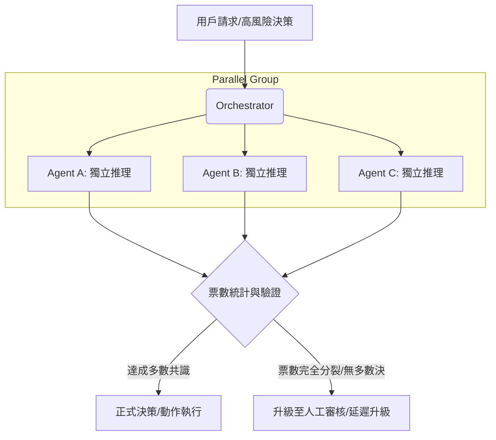

# 大多數表決

在分散式 Agent 系統中，單一模型（Single Model）的「非決定性（Non-deterministic）」是架構師必須直面的技術債。即便是最強大的模型，也可能因輸入的微小擾動而產生幻覺、漂移或特定立場的偏見。**大多數表決 (Majority Voting Across Agents)** 模式，是從「單點決策」演進到「民主化共識」的關鍵里程碑。透過部署三個或更多獨立的 Agent 執行相同任務，系統能有效過濾掉個別代理人的離群值（Outliers），確保最終輸出的穩健性。

---

### 情境 1：在高風險決策點部署奇數個獨立代理集群

當 Agent 負責諸如醫療診斷建議、大額貸款審核或法律合規性判定等任務時，錯誤的成本極高。此時不應依賴單一 Agent 的判斷，而應建立一個「評審團」。

#### 核心概念
實施「自動化冗餘」機制，調用奇數個（3, 5, 7...）獨立 Agent 並行執行任務，由協調者（Orchestrator）統計票數。這種模式能顯著降低因單一模型故障、偏見或過度自信的幻覺所導致的系統性風險。

#### 程式碼範例 (以貸款最終決策為例)

```python
# ❌ Bad: 依賴單一 Agent 的結果
# 即使模型置信度高，仍可能存在訓練數據帶來的隱性偏見或單點幻覺風險。
async def finalize_loan(application_id):
    decision = await primary_loan_agent.process(application_id)
    return decision # 風險：單點失效

# ✅ Better: 實施多數表決模式
# 參考 agent-archi.md: 部署三個獨立代理人並進行票數統計。
from collections import Counter

async def finalize_loan_with_voting(application_id):
    # 1. 並行執行奇數個（3個）獨立代理人
    # 建議：這三個 Agent 應使用異質模型（如 Gemini Pro 與 Llama）以確保偏見不重疊。
    results = await asyncio.gather(
        agent_a.process(application_id), # "Approve"
        agent_b.process(application_id), # "Review"
        agent_c.process(application_id)  # "Approve"
    )

    # 2. 統計投票結果
    votes = Counter(results)
    final_decision, count = votes.most_common(1)

    # 3. 判斷是否達成明確多數 (例如 2/3)
    if count >= 2:
        print(f"達成共識決策: {final_decision} ({count} 票)")
        return final_decision
    else:
        # 4. 若票數分裂（三路均不同），觸發延遲升級至人工審核
        return await escalate_to_human(application_id, results)
```

#### 底層原理探討與權衡
*   **為什麼有效 (Rationale)**：這借鑑了可靠性工程中的「N-版本程式設計」。由於不同模型或 Prompt 模板對邊緣案例的處理方式不同，同時發生相同幻覺的機率極低。
*   **權衡 (Trade-off)**：這是成本最高的冗餘模式。它會成倍增加 Token 消耗，並將整體延遲鎖定在最慢的那個 Agent 上。
*   **拇指法則 (Rule of Thumb)**：始終使用 **奇數** 個代理人以防止平手，且參與投票的代理人必須具備 **異質性**（使用不同的模型、不同的提示詞或不同的微調數據集）。

---

### 更多說明 (決策模式對比)

| 特性 | 單路決策 (L3) | 並行共識 (L4) | 大多數表決 (L5/L6) |
| :--- | :--- | :--- | :--- |
| **Agent 數量** | 1 | 2 | 3 或更多 (推薦奇數) |
| **核心目標** | 快速執行任務 | 偵測不一致性 | **強制達成穩健結論** |
| **容錯能力** | 無 | 發現錯誤但不一定能修正 | **能自動修正單一離群錯誤** |
| **成本/延遲** | 最低 | 中 | 最高 |

---

### 流程說明



---

### 情境 2：利用 ParallelAgent 與 Callback 實作自動化共識機制

在 Google ADK 框架中，手動管理異步請求（asyncio.gather）雖然直觀，但會導致編排邏輯與業務邏輯高度耦合。資深架構師會利用 ADK 的原生組件來封裝這種「共識」行為。

#### 核心概念
使用 `ParallelAgent` 作為執行容器，並掛載 `after_agent_callback` 來擔任「計票員」。這樣可以將決策邏輯從主流程中解耦，讓主程序只需關注「最終共識結果」，而非各個代理的執行細節。

#### 程式碼範例 (以 ADK 實現大多數表決)

```python
# ❌ Bad: 手動在業務邏輯中寫死 asyncio 併行與統計
# 這使得代碼難以測試、維護，且無法輕易抽換參與表決的 Agent。
async def business_logic():
    # 硬編碼併行邏輯
    r1, r2, r3 = await asyncio.gather(a.run(), b.run(), c.run())
    # 硬編碼計票邏輯...

# ✅ Better: 利用 ADK 原生 ParallelAgent 與 Callback
from google.adk.agents import ParallelAgent, LlmAgent, SequentialAgent
from collections import Counter

# 1. 定義「計票回呼」：從 Session State 中提取各 Agent 的 output_key
def majority_vote_callback(callback_context, agent_output):
    state = callback_context.session.state
    # 取得各子 Agent 預先存入 state 的結果
    results = [
        state.get("result_a"),
        state.get("result_b"),
        state.get("result_c")
    ]

    votes = Counter(results)
    final_decision, count = votes.most_common(1)[0]

    # 若達成多數決，覆蓋 ParallelAgent 的最終輸出
    if count >= 2:
        return types.Content(parts=[types.Part.from_text(final_decision)])

    # 若分裂，則回傳特殊標記供後續 SequentialAgent 判斷
    return types.Content(parts=[types.Part.from_text("CONFLICT_DETECTED")])

# 2. 編排代理集群
voter_group = ParallelAgent(
    name="VoterGroup",
    sub_agents=[
        LlmAgent(name="AgentA", output_key="result_a"),
        LlmAgent(name="AgentB", output_key="result_b"),
        LlmAgent(name="AgentC", output_key="result_c")
    ],
    after_agent_callback=majority_vote_callback # 注入投票邏輯
)

# 3. 封裝進工作流
workflow = SequentialAgent(sub_agents=[voter_group, ...])
```

#### 底層原理探討與權衡
*   **解耦 (Decoupling)**：透過 `after_agent_callback`，`ParallelAgent` 的輸出被標準化了。不論內部是 3 個還是 5 個 Agent，對外部而言它就像一個「具備自我修正能力的單一 Agent」。
*   **狀態共享 (State Sharing)**：ADK 的 `ParallelAgent` 子代理共享同一個 `session.state`，這使得計票邏輯能輕易獲取所有並行分支的輸出，而無需複雜的 IPC（進程間通訊）。
*   **拇指法則 (Rule of Thumb)**：當表決結果為 `CONFLICT_DETECTED` 時，應在 `SequentialAgent` 的下一步銜接一個「衝突處理代理」或「人工審核隊列」，而非直接崩潰。

---

### 更多說明 (ADK 實現模式對比)

| 模式 | 手動 `asyncio.gather` | ADK `ParallelAgent` + Callback |
| :--- | :--- | :--- |
| **程式碼複雜度** | 隨 Agent 數量線性增長 | **封裝性強，易於擴展** |
| **可觀測性** | 需自行實作日誌記錄 | **ADK 原生追蹤各 Agent 事件** |
| **解耦程度** | 低（編排與邏輯混雜） | **高（投票邏輯獨立於 Agent 實作）** |
| **適用場景** | 簡單、臨時的腳本 | **正式的生產環境 Agent 工作流** |

---

### 延伸思考

**1️⃣ 問題一**：如果所有代理人都使用相同的基礎模型（例如都是 Gemini 2.5 Pro），投票還有意義嗎？

**👆 回答**：意義會大幅下降。同質化模型往往具有相似的認知偏差。為了讓投票有效，架構師應實施「多樣化策略」：
1.  **模型異質化**：混合使用不同廠商的模型。
2.  **Prompt 變異**：給予不同的角色（如「嚴格審核者」與「寬鬆核貸員」）。
3.  **數據多樣化**：讓不同 Agent 檢索不同的 RAG 知識庫片段。

---

**2️⃣ 問題二**：如何處理「平手」或沒有任何選項超過半數的情況？

**👆 回答**：這就是 **延遲升級策略 (Delayed Escalation)** 介入的時機。在架構上，系統必須預防無限重試。如果多數決失效，應立即封裝所有 Agent 的推理軌跡（Trajectories），並標註為「認知衝突」，移交給人類專家進行最終裁決。

---

**3️⃣ 問題三**：這個模式在 Google ADK 中如何實現？

**👆 回答**：可以利用 ADK 的 `ParallelAgent` 將多個 `LlmAgent` 組合成一隊。協調者可以在 `after_agent_callback` 中獲取所有子 Agent 的 `state` 或 `events` 進行投票邏輯判斷，從而將技術細節從主流程中解耦。