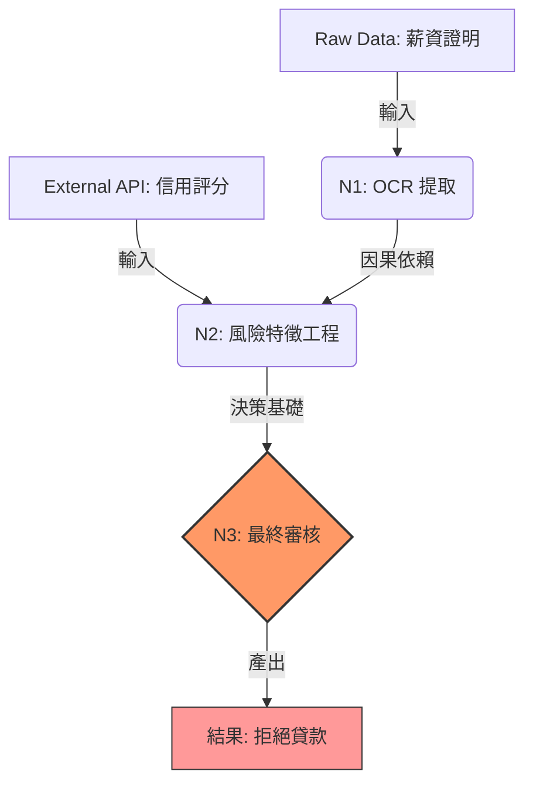

# 因果依賴圖

在受監管的產業（如金融、醫療或公部門）中，AI Agent 的決策「黑盒化」是邁向生產環境的最大阻礙。當一筆貸款申請被拒絕，或一份診斷建議被提出時，審計員或合規官不會滿足於「Agent 說分數不夠」這種模糊的解釋。他們需要看到從原始數據、提取邏輯、外部 API 調用到最終判定之間的完整**因果鏈條**。

**因果依賴圖 (Causal Dependency Graph)** 模式透過建立結構化、機器可讀的決策譜系 (Lineage)，讓每一項產出都能反向追溯其前序依賴項，從而將「隨機的推理」轉化為「可審計的決策」。

---

### 情境 1：優先建立「結構化依賴鏈」，而非「扁平純文字日誌」

傳統開發者習慣使用簡單的文本日誌 (Logging)，但在多 Agent 協作或異步執行的場景中，這些日誌會交織在一起，難以區分具體的因果關係。強健的系統必須顯式記錄每個動作的「父節點」與「數據來源」。

#### 核心概念
為每個 Agent 的執行實例建立一個節點，不僅記錄輸出，還必須記錄它所「消費」的輸入以及它所依賴的前序節點 ID。這使得系統可以從最終結果出發，沿著圖結構反向遍歷至最初的原始數據。

#### 程式碼範例

```python
# ❌ Bad: 使用扁平化的文本日誌
# 這種做法在發生審計爭議時，難以確定 450 分是基於哪個版本的文件或哪個 API 回傳的
import logging
logger = logging.getLogger(__name__)

def evaluate_credit(applicant_id):
    logger.info(f"正在檢查申請人 {applicant_id} 的信用...")
    score = credit_tool.run(applicant_id)
    logger.info(f"信用分數獲取成功: {score}")
    return score

# ✅ Better: 建立具備依賴追蹤的結構化節點
# 顯式記錄輸入與前序節點關係
class DecisionNode:
    def __init__(self, node_id, action, input_data, output_data, parent_ids=None):
        self.node_id = node_id
        self.action = action
        self.input_data = input_data
        self.output_data = output_data
        self.parent_ids = parent_ids or [] # 因果鏈的核心：指向父節點

# 範例：將邏輯封裝在可追蹤的結構中
node_input = DecisionNode("N1", "Data_Ingestion", "Raw_PDF_v1", "Cleaned_JSON", [])
node_credit = DecisionNode("N2", "Credit_Check", "Cleaned_JSON", "Score: 450", ["N1"])
# 當 N2 被質疑時，我們能立即確認它是基於 N1 的輸出做出的決定
```

#### 底層原理探討與權衡
*   **為什麼（Rationale）**：因果依賴圖解決了「歸因問題」。它不僅記錄了「發生了什麼」，還記錄了「為什麼發生」。在多步推理中，如果其中一步出現幻覺 (Hallucination)，因果圖能幫助開發者精確定位受污染的節點。
*   **權衡 (Trade-off)**：維護圖結構會產生額外的存儲開銷。每一筆交易都可能產生數十個節點。
*   **拇指法則 (Rule of Thumb)**：對於涉及「資產轉移」、「法律判斷」或「安全變更」的任務，必須強制實施節點化的依賴追蹤。

---

### 情境 2：善用 ADK 原生 Tracing 機制，實現自動化的「分層決策追蹤」

在分散式系統中，手動維護節點 ID 非常繁瑣且容易出錯。Google ADK 原生支援 OpenTelemetry，能自動在 Agent、工具與模型調用之間建立父子 Span 關係。

#### 核心概念
利用 ADK 的 `enable_tracing=True` 配置。當 Orchestrator 調用 Sub-agents 時，ADK 會在追蹤上下文中傳遞 `trace_id` 並建立層級化的 Spans。這在物理上是分散式追蹤，在邏輯上就是一張完整的因果圖。

#### 程式碼範例

```python
# ✅ Better: 利用 Google ADK 原生追蹤機制建立自動化的因果鏈
# 參考 observability/cloud-trace.md: 使用 AdkApp 封裝並啟用 Tracing
from vertexai.preview import reasoning_engines
from weather_agent.agent import root_agent # 假設已定義好 Agent

# 1. 建立 AdkApp 並啟用追蹤 (enable_tracing=True)
# 這會自動整合 OpenTelemetry 並將 Span 發送到 Cloud Trace
adk_app = reasoning_engines.AdkApp(
    agent=root_agent,
    enable_tracing=True
)

# 2. 部署或執行時，ADK 會自動捕捉完整因果鏈：
# [invocation] -> [agent_run] -> [call_llm] -> [execute_tool]
# 每個 Span 都會記錄其 Parent ID，形成天然的因果依賴圖
```

#### 底層原理探討與權衡
*   **為什麼（Rationale）**：標準化的 OpenTelemetry 協議保證了跨語言與跨平台的相容性。藉由追蹤上下文 (Trace Context) 的傳遞，我們不需要修改業務邏輯即可獲得決策的層級視圖。
*   **拇指法則 (Rule of Thumb)**：在生產環境中，應優先使用 ADK 原生 Tracing 而非自定義紀錄機制，以降低維護成本。

---

### 情境 3：結合 BigQuery 分析外掛，實現「不可篡改」的決策審計

對於合規要求極高的場景，單純的追蹤（Tracing）可能不足以應對法律層面的長期審查。我們需要將因果數據持久化到具備高度可查詢性且安全的存儲中。

#### 核心概念
使用 `BigQueryAgentAnalyticsPlugin`。該外掛會將 Agent 執行的每個事件（包含輸入、輸出、工具結果）轉換為結構化行，並寫入 BigQuery。

#### 程式碼範例

```python
# ✅ Better: 使用 BigQuery 插件持久化決策譜系
# 參考 observability/bigquery-agent-analytics.md
from google.adk.runners import App
from google.adk.plugins import BigQueryAgentAnalyticsPlugin

# 初始化 BigQuery 插件
bq_plugin = BigQueryAgentAnalyticsPlugin(
    project_id="your-gcp-project",
    dataset_id="agent_audit_logs"
)

# 將插件注入應用
app = App(
    root_agent=my_root_agent,
    plugins=[bq_plugin] # 決策過程將被原子化地寫入 BigQuery
)
```

---

### 更多說明

#### 觀測技術對比表

| 特性 | 基礎日誌 (Logging) | 分散式追蹤 (Tracing) | 因果依賴圖 (Causal Graph) |
| :--- | :--- | :--- | :--- |
| **主要目的** | 本地偵錯 / 狀態監控 | 延遲分析 / 故障定位 | **決策歸因 / 合規審計** |
| **數據結構** | 順序列表 (Flat) | 樹狀結構 (Span Tree) | **有向無環圖 (DAG)** |
| **ADK 實作** | `logging` 模組 | `enable_tracing=True` | `BigQueryPlugin` + Trace |
| **保留時效** | 短期 (Log Rotation) | 短期 (Sampling) | **長期 (Audit Store)** |

#### 決策溯源流程圖

下圖展示了貸款決策如何透過因果圖進行反向溯源，確保每個決定都有據可依：



---

### 延伸思考

**1️⃣ 問題一**：如果 Agent 中間修改了數據，因果圖如何保證數據的真實性（Data Integrity）？

**👆 回答**：因果依賴圖應與**不可篡改日誌 (Immutable Logs)** 結合。在架構上，建議將每個節點的輸出與輸入進行雜湊 (Hash) 運算，並連同決策結果一起存儲在具備 WORM (Write Once, Read Many) 特性的存儲中（如 Google Cloud Storage 的 Bucket Lock）。

---

**2️⃣ 問題二**：當圖結構因推理步驟過多而變得龐大時，如何進行有效審核？

**👆 回答**：採用 **"LLM-as-Judge"** 模式。你可以開發一個專門的「合規審計 Agent」，讓它自動遍歷生成的因果圖，尋找潛在的合規風險（例如：檢查 N2 節點是否不當使用了受保護的敏感屬性，如性別或種族，作為輸入）。

---

**3️⃣ 問題三**：這與傳統的「數據血緣 (Data Lineage)」有什麼區別？

**👆 回答**：數據血緣關注的是數據的「流動」（從表 A 到表 B）；因果依賴圖關注的是決策的「理由」（為什麼 Agent 根據數據 X 做出了行為 Y）。它是**數據血緣與邏輯推理路徑**的深層結合體。