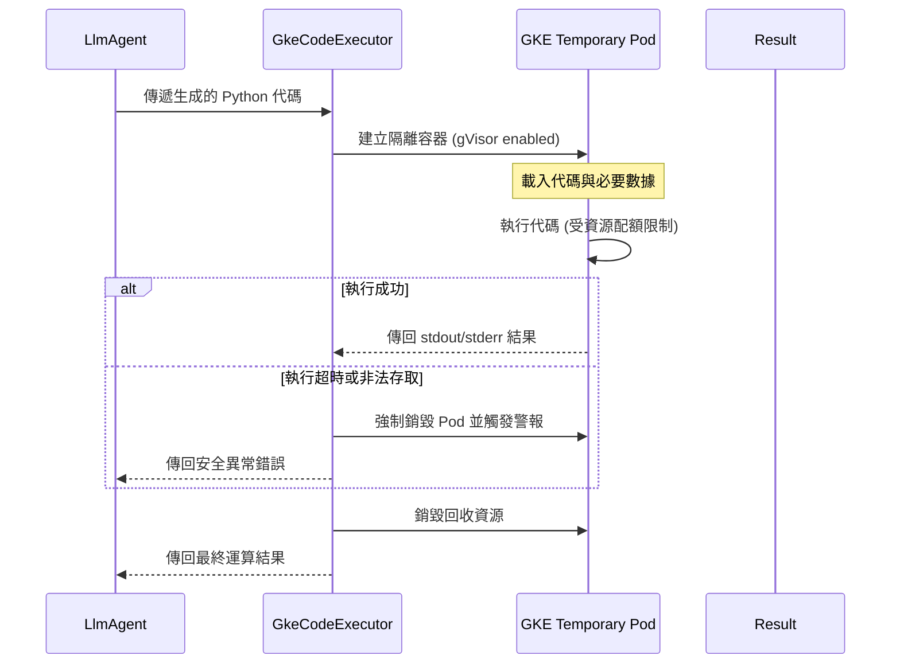

# 執行環境隔離

在現代 Agent 架構中，賦予 Agent「執行程式碼」的能力（Code Execution）是邁向高度自動化的關鍵一步。然而，身為架構師，我們必須時刻保持偏執：LLM 產生的程式碼本質上是「不可信的輸入」。若直接在主機環境執行，Agent 可能會演變成刪除資料庫、洩漏 API 金鑰或耗盡系統資源的災難。執行環境隔離（Sandboxing）不只是安全措施，它是確保系統健壯性的不可踰越之邊界。

---

### 情境 1：絕對禁止在主機環境直接調用 `exec()` 或 `eval()`

開發初期，許多開發者為了快速驗證功能，會直接在 Python 腳本中使用 `exec()` 來執行 Agent 輸出的代碼。這是極其危險的反模式（Antipattern），因為這讓不可信代碼擁有了與應用程式相同的作業系統權限。

#### 核心概念
隔離的核心在於建立一個「拋棄式」且「資源受限」的封閉環境。Agent 生成的程式碼必須在這個環境中運行，且該環境無法訪問主機檔案系統、內部網路，且有硬性的 CPU 與記憶體限制。這就像是在隔離病房中觀察病毒，而非讓其在公共區域走動。

#### 程式碼範例 (Python)

```python
# ❌ Bad: 在主機環境直接執行，極易遭受攻擊
# 如果 Agent 被誘導產生 "import os; os.system('rm -rf /')"，主機將遭受毀滅性打擊。
def unsafe_executor(code_str: str):
    # 警告：這會讓不可信代碼繼承當前進程的所有權限
    exec(code_str)

# ✅ Better: 使用 Google ADK 的 BuiltInCodeExecutor (隔離沙箱)
from google.adk.agents import LlmAgent
from google.adk.code_executors import BuiltInCodeExecutor

# ADK 提供了內建的沙箱執行器，代碼會在受限的隔離環境中執行
# 這能防止代碼存取主機檔案系統或掃描內部網路
code_agent = LlmAgent(
    name="DataAnalyst",
    model="gemini-2.0-flash",
    code_executor=BuiltInCodeExecutor(), # 啟用隔離執行環境
    instruction="根據數據生成 Python 代碼並執行計算。"
)
```

#### 底層原理探討與權衡
*   **為什麼有效 (Rationale)**：隔離環境利用容器化或使用者空間核心技術（如 gVisor）建立安全邊界。即使程式碼試圖執行惡意操作（如修改系統檔案），其請求也會被攔截或僅影響到該臨時的沙箱實例。
*   **權衡 (Trade-off)**：引入沙箱會增加冷啟動延遲。此外，沙箱環境通常不包含所有第三方函式庫，需額外管理依賴項。
*   **適用場景**：開發測試、簡單的數學運算、無網路存取需求的資料處理。
*   **拇指法則 (Rule of Thumb)**：任何來源於 LLM 的代碼皆為「汙染源」，必須在沙箱中「洗滌」後方可獲取結果。

---

### 情境 2：利用 `GkeCodeExecutor` 實現企業級硬體隔離

在企業生產環境中，簡單的進程隔離不足以應對精密的安全挑戰。當處理敏感數據或面臨高併發需求時，我們需要「強隔離」與「資源配額」機制。

#### 核心概念
使用 GKE (Google Kubernetes Engine) 作為執行後端。每段代碼會在一個獨立、短暫的 Pod 中執行。透過 **gVisor** 進行內核級隔離，並結合 Kubernetes 的 **Resource Quotas** 與 **Network Policies**，實施極致的縱深防禦。

#### 程式碼範例 (Google ADK 模式)

```python
# ✅ Better: 生產環境使用具備資源限制的 GkeCodeExecutor
from google.adk.agents import LlmAgent
from google.adk.code_executors import GkeCodeExecutor

# 配置基於 GKE 的生產級沙箱
# 提供硬性限制，防止惡意代碼或邏輯錯誤導致的「拒絕服務 (DoS)」攻擊
safe_executor = GkeCodeExecutor(
    cluster_name="security-sandbox-cluster",
    region="us-central1",
    timeout=30,             # 強制 30 秒超時，防止資源耗盡
    memory_limit="512Mi",   # 限制記憶體，防止 OOM 影響宿主機
    cpu_limit="500m"        # 限制 CPU 使用率
)

agent = LlmAgent(
    name="SecureDataScientist",
    model="gemini-2.0-flash",
    code_executor=safe_executor,
    instruction="處理 CSV 並生成統計摘要。"
)
```

#### 執行生命週期 (Lifecycle)
下圖展示了代碼在生產級隔離環境中的完整生命週期：



---

### 情境 3：結合「反思模式 (Reflection)」處理沙箱執行錯誤

隔離環境不應只是「死胡同」。當代碼在沙箱中因環境限制（如權限不足、缺少套件）或邏輯錯誤而出錯時，正確做法是將詳細錯誤傳回給 Agent，讓其自我修正，而非直接崩潰。

#### 核心概念
實施「閉環調試」。沙箱捕獲的 `stderr` 是極佳的上下文資訊。透過將執行結果反饋給 LLM，Agent 可以像人類開發者一樣，根據報錯（如 `ModuleNotFoundError`）進行邏輯調整或請求額外權限。

#### 程式碼範例 (Python)

```python
# ✅ Better: 實現「沙箱反思」閉環
# 當代碼執行失敗，將沙箱錯誤日誌作為 context 再次詢問 Agent
async def execute_and_reflect(agent, code):
    try:
        # 在沙箱中執行，獲取結構化回應
        # 注意：ADK 會將結果封裝在 event.content.parts 中
        result = await agent.run_code_async(code)
        return result
    except Exception as e:
        # 🐶 關鍵點：將「沙箱報錯」轉化為「修復指令」
        # 參考 Effective GenAI 模式：讓模型從失敗中學習
        error_feedback = (
            f"代碼執行失敗。錯誤資訊如下：\n{str(e)}\n"
            "請檢查：1. 是否使用了沙箱禁止的庫？ 2. 語法是否有誤？"
            "請分析原因並提供修正後的代碼。"
        )
        # 觸發下一輪推理進行自我修復
        return await agent.run_async(error_feedback)
```

---

### 沙箱隔離策略對比表

| 特性 | 進程隔離 (Built-In) | 容器隔離 (GKE) | 硬體隔離 (Firecracker/vM) |
| :--- | :--- | :--- | :--- |
| **隔離強度** | 中 (作業系統 API 限制) | 高 (gVisor / 內核隔離) | 極高 (虛擬化邊界) |
| **效能損耗** | 低 (啟動快) | 中 (需啟動 Pod) | 高 (需啟動 VM) |
| **適用場景** | 個人開發、PoC 驗證 | 企業級多租戶應用 | 敏感金融、軍事級運算 |
| **資源限制** | 依賴 OS Quotas | 原生支援 CPU/Mem 限制 | 硬體層級配額 |

---

### 延伸思考

**1️⃣ 問題一**：沙箱隔離是否能防止所有類型的攻擊，例如「數據外洩」？

**👆 回答**：不完全。沙箱主要防止「向內攻擊」（損害主機）。防止數據外洩（向外攻擊）還需要配合「出向管制 (Egress Control)」。應在沙箱環境禁用網路連結，或僅允許對特定網域的存取，並對沙箱輸出的結果進行敏感詞掃描。

---

**2️⃣ 問題二**：如果多個 Agent 共享同一個沙箱，是否存在「側信道攻擊 (Side-channel)」風險？

**👆 回答**：是的。在多租戶環境中，應實施「一請求一沙箱」原則。Google ADK 的 `GkeCodeExecutor` 會在執行後回收 Pod，這能有效消除狀態殘留導致的跨會話數據洩漏。

---

**3️⃣ 問題三**：這與 RAG 的「接地 (Grounding)」有什麼關係？

**👆 回答**：Code Execution 是邏輯層面的接地。RAG 解決的是「知識幻覺」，而代碼執行解決的是「邏輯幻覺」。例如，計算「2024 年營收增長率」，讓 LLM 推理容易出錯，但讓其產生 Python 在沙箱中運算則能獲取 100% 確定的事實。
