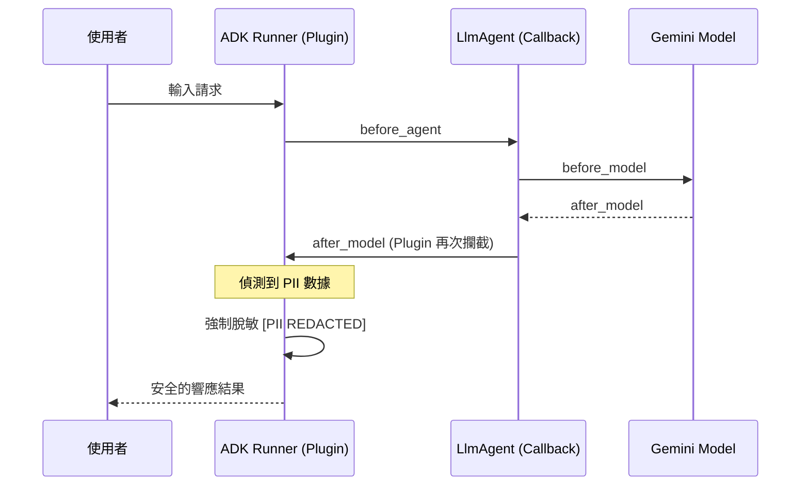

# 安全護欄 (Guardrails)

在分散式 Agent 系統中，賦予 Agent 自主權是一把雙面刃。隨著「代理能力（Agency）」的提升，其潛在的「爆炸半徑（Blast Radius）」也隨之擴大。一個未受保護的 Agent 可能會因為一次提示詞注入（Prompt Injection）而刪除生產資料庫，或向客戶發送包含敏感 PII 的郵件。

身為架構師，我們不能僅依賴 LLM 的「自律」，必須在架構層級實施**安全護欄 (Guardrails)**。這是一種實時攔截有害輸出或不合規行動的「偵測性控制（Detective Controls）」，確保系統在極端情況下仍具備確定性的安全邊界。

---

### 情境 1：優先使用架構級攔截點而非工具內硬編碼邏輯

許多開發者習慣將安全性邏輯寫在工具（Tool）內部，這會導致安全政策與業務邏輯耦合，難以統一管理，且 Agent 仍可能透過繞過工具參數來嘗試非法操作。最健壯的做法是利用 Google ADK 的 `before_tool_callback` 實施「非侵入式」審核。

#### 核心概念
實施「最小權限原則（Least Privilege）」，在 Agent 嘗試調用敏感工具（如轉帳、刪除、存取 PII）時，由獨立的護欄邏輯進行攔截。透過 ADK 的回呼機制，如果護欄函數回傳一個非空字典，框架會立即跳過（Short-circuit）工具的實際執行，並將該字典作為結果回饋給 LLM。

#### 程式碼範例 (以金融轉帳為例)

```python
# ❌ Bad: 將合規邏輯硬編碼在工具內
# 缺點：安全性邏輯散落在各處，且 Agent 仍可能嘗試輸入非法帳號進行測試
def transfer_money(amount: float, to_account: str):
    if amount > 10000: # 硬編碼門檻，難以動態調整
        return {"error": "金額超過限制"}
    # 執行轉帳...

# ✅ Better: 利用 ADK before_tool_callback 實施集中化護欄
# 參考 safety-and-security/index.md 與 callbacks/types-of-callbacks.md
from google.adk.agents import LlmAgent
from google.adk.tools import ToolContext, BaseTool
from typing import Optional, Dict, Any

async def financial_safety_guardrail(
    tool: BaseTool,
    args: Dict[str, Any],
    tool_context: ToolContext
) -> Optional[Dict]:
    """攔截高風險行動：在工具執行前進行外部策略驗證"""

    if tool.name == "transfer_money":
        amount = args.get("amount", 0)
        to_account = args.get("to_account", "")

        # 1. 執行實時行為過濾 (例如：黑名單檢查)
        if is_blacklisted(to_account):
            # 🛑 干預：回傳字典將「阻斷」工具執行，LLM 會收到此錯誤訊息
            return {"error": "操作失敗：目標帳號受限，請聯繫合規部門。"}

        # 2. 實施動態限額檢查
        if amount > 5000:
            return {"error": "操作因違反安全政策被攔截：金額超過單筆限額。"}

    return None # 允許繼續執行

agent = LlmAgent(
    name="BankingAgent",
    tools=[transfer_tool],
    before_tool_callback=financial_safety_guardrail # 注入架構級護欄
)
```

#### 底層原理探討與權衡
*   **為什麼有效 (Rationale)**：這實現了「執行與治理的分離（Separation of Concerns）」。護欄函數在獨立的上下文中運行，不受 Agent 提示詞漂移或幻覺的影響。這與作業系統中的「內核守護」邏輯類似——用戶態程序無法直接操作受保護資源，必須經過系統調用的安全檢查。
*   **權衡 (Trade-off)**：每增加一層回呼都會增加微小的延遲。
*   **適用場景**：對於涉及「不可逆動作」（如刪除、付款）或「存取受控資源」的工具，必須強制掛載攔截護欄。

---

### 情境 2：利用全域 Plugin 實施強制性的 PII 數據脫敏

在生產環境中，防止敏感信息（如身份證號、信用卡號）洩漏是合規的底層要求。我們不應指望單個 Agent 在提示詞中記得脫敏，而應使用系統級的護欄來確保數據「絕不落地」。

#### 核心概念
使用 Google ADK 的 `Plugin` 機制實施「全域偵測」。Plugin 會在 `Runner` 層級註冊，並在所有 Agent 的 `after_model_callback` 點觸發。這比單一 Agent 的 Callback 更具強制性，因為它能跨 Agent 復用，且在執行順序上具有優先權。

#### 程式碼範例 (Google ADK Plugin 實戰)

```python
# ✅ Better: 實施全域 PII 脫敏插件
# 參考 plugins/index.md
from google.adk.plugins import BasePlugin
from google.adk.agents.callback_context import CallbackContext
from google.adk.models import LlmResponse
from google.genai import types
import re

class PIIRedactionPlugin(BasePlugin):
    def __init__(self):
        super().__init__(name="pii_redactor")

    async def after_model_callback(
        self,
        callback_context: CallbackContext,
        llm_response: LlmResponse
    ) -> Optional[LlmResponse]:
        """在模型響應到達 Agent 或用戶前進行掃描與修改"""

        if not llm_response.content or not llm_response.content.parts:
            return None

        original_text = llm_response.content.parts[0].text
        if not original_text:
            return None

        # 實施脫敏邏輯 (範例：屏蔽身分證字號)
        # 實際建議調用 Google Cloud DLP API 以獲得專業級保護
        sanitized_text = re.sub(r'[A-Z][12]\d{8}', " [PII REDACTED] ", original_text)

        if sanitized_text != original_text:
            # 🐶 修正：回傳新的 LlmResponse 覆蓋原始輸出
            new_parts = [types.Part(text=sanitized_text)]
            return LlmResponse(
                content=types.Content(role="model", parts=new_parts)
            )
        return None

# 在 Runner 層級註冊，確保所有受控 Agent 都自動具備此護欄
runner = Runner(
    agent=root_agent,
    plugins=[PIIRedactionPlugin()]
)
```

#### 護欄實施流程圖 (Mermaid)


---

### 更多說明 (護欄實施策略對比)

| 特性 | 基於提示詞的引導 (Soft) | 基於架構的回呼護欄 (Hard) | Google Model Armor (Native) |
| :--- | :--- | :--- | :--- |
| **實施方式** | System Instruction | `before_tool` / `after_model` | 基礎設施級過濾 |
| **可靠性** | 低（容易受 Prompt Injection 繞過） | 高（程式碼級硬約束） | 極高（專門防禦惡意 URL/注入） |
| **維護成本** | 低 | 中 | 高（需配置組織級策略） |
| **效能影響** | 無感 | 微小延遲 | 極低（優化過的硬體路徑） |

---

### 延伸思考

**1️⃣ 問題一**：如果護欄誤攔截了正常的業務請求（False Positive）怎麼辦？

**👆 回答**：這在架構上稱為「安全過載」。建議實施 **「檢查但不攔截 (Inspect Only)」** 模式進行灰度測試。對於高風險動作，可以結合 **「人類在迴圈 (Human-in-the-loop)」**：當護欄懷疑但不確定時，不直接阻斷，而是將狀態改為 `PENDING_APPROVAL` 並通知管理員一鍵批准，平衡安全性與使用者體驗。

---

**2️⃣ 問題二**：護欄是否會降低 Agent 的推理能力？

**👆 回答**：過於嚴格的輸入護欄可能會導致「資訊損耗（Information Loss）」。解決方案是採用 **「分層過濾」**：輸入層僅攔截惡意攻擊（如 Jailbreak），而輸出的工具層則實施精確的語法檢查（Syntax Checks）。這確保了 Agent 擁有足夠的上下文進行思考，但其對外部世界的影響被嚴格限制在安全邊界內。

---

**3️⃣ 問題三**：這與傳統的 WAF（Web 應用防火牆）有什麼不同？

**👆 回答**：傳統 WAF 過濾的是網路協議層的惡意特徵（如 SQLi 特徵碼）；Agent 護欄過濾的是**語義層**與**邏輯層**。Agent 護欄需要理解 LLM 產生的「意圖」是否符合業務規則（例如：檢查 Agent 是否在非交易時間嘗試執行轉帳），這是傳統防火牆無法感知的。
