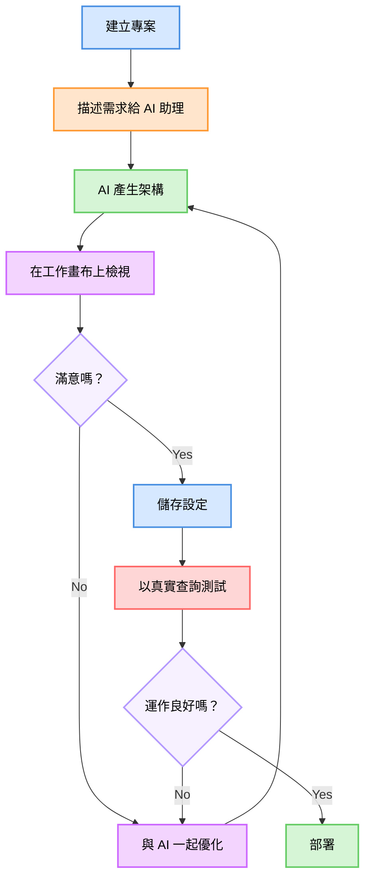
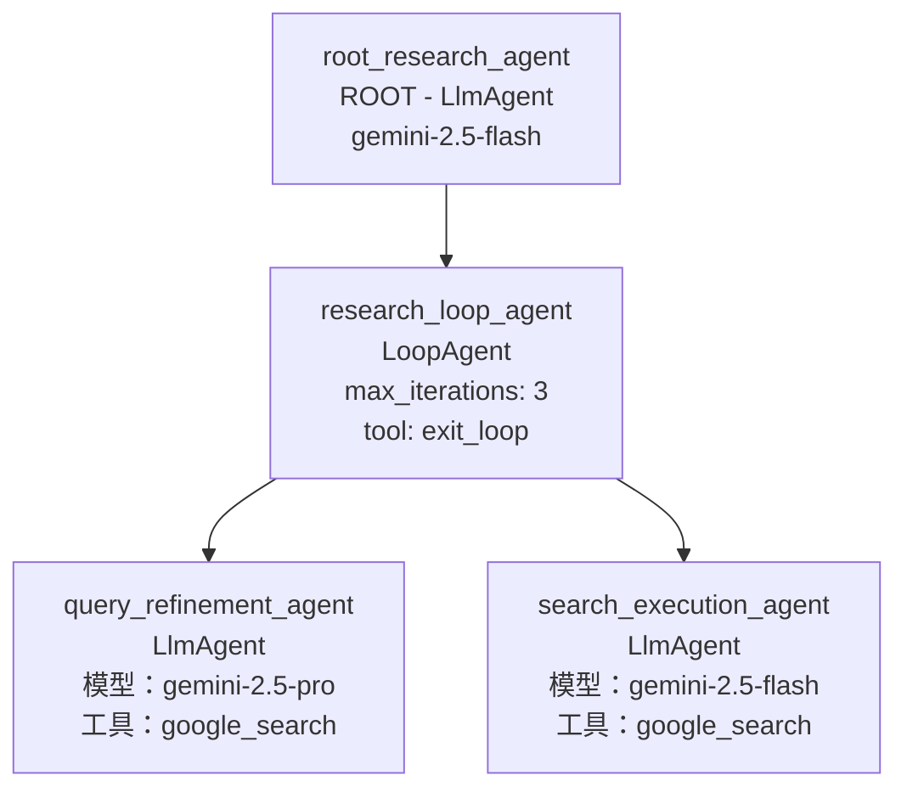

# 使用 Google ADK 視覺化代理建構器視覺化地建構 AI 代理

Google ADK v1.18.0 推出了**視覺化代理建構器**——一個基於瀏覽器的介面，讓您可以透過拖放互動和自然語言對話來設計、設定和測試複雜的多代理系統。再也不用手動編寫 YAML，再也沒有語法錯誤，只有純粹的代理架構。

我花了幾天時間探索這個功能，對於它所能實現的一切，我感到非常興奮。讓我向您展示如何使用視覺化建構器從頭開始建構一個研究代理系統。

## 什麼是 Google ADK 視覺化代理建構器？

視覺化代理建構器是一個用於建立 ADK 代理的網頁版 IDE。您可以把它想像成一個結合了視覺化工作流程設計器、設定編輯器和 AI 助理的工具。以下是它強大的地方：

-   **視覺化工作流程設計器**：將您的代理層級結構視為一個圖形。根代理、子代理、工具——所有東西都視覺化地呈現在畫布上。
-   **設定面板**：透過表單編輯代理屬性（名稱、模型、指令、工具），而不是原始的 YAML。
-   **AI 助理**：用簡單的英文描述您的需求，助理會為您生成代理架構。
-   **內建工具整合**：透過可搜尋的對話框瀏覽並新增 Google 搜尋、程式碼執行器和記憶體管理等工具。
-   **即時測試**：在您建構代理的同一個介面中立即測試它們，無需切換環境。
-   **回呼管理**：透過使用者介面設定所有六種類型的回呼（代理、模型、工具執行前後）。


美妙之處在於，您在視覺化建構器中所做的一切都會在底層生成正確的 ADK YAML 設定。您可以匯出它們、進行版本控制，並像部署基於程式碼的代理一樣部署它們。

## 什麼時候應該使用視覺化建構器？

視覺化建構器在特定情境下表現出色：

-   **學習 ADK**：如果您是 ADK 新手，視覺化建構器是了解代理類型、工具整合和架構模式最快的方式。使用者介面會向您展示可能性，並生成正確的設定作為範例。
-   **原型設計多代理系統**：設計包含多個子代理的複雜工作流程？視覺化畫布讓您可以輕鬆地實驗不同的組合（順序、平行、循環模式）。
-   **與非開發人員協作**：產品經理和領域專家可以使用 AI 助理以自然語言描述代理需求，然後將生成的 YAML 交給工程師。
-   **快速迭代**：當您在探索不同的代理架構時，視覺化建構器讓您可以快速新增/移除子代理和工具，而無需手動編輯巢狀的 YAML。

話雖如此，有時候程式碼優先的開發方式更為合理：基礎設施即程式碼（IaC）工作流程、CI/CD 管道，或者當您需要以程式化方式生成代理時。視覺化建構器和基於 Python 的方法是互補的。

## 開始使用 ADK 和視覺化建構器

### 先決條件

在開始之前，請確保您具備：

-   已安裝 Python 3.10 或更高版本
-   一個 Google Cloud 專案（用於存取 Gemini API）
-   對代理概念有基本的了解（如果您對細節不太清楚，別擔心）

### 安裝

安裝最新版本的 Google ADK：

```bash
# 安裝或升級至 ADK 1.18.0+
pip install --upgrade google-adk
# 驗證安裝
adk --version
```

### 啟動網頁介面

ADK 包含一個內建的網頁伺服器，其中包含視覺化建構器：

```bash
# 啟動 ADK 網頁介面
adk web
# 預設情況下，這會在 http://localhost:8000 啟動一個伺服器
# 視覺化建構器可在 http://localhost:8000/dev-ui/ 存取
```

伺服器啟動後，在瀏覽器中打開 `http://localhost:8000/dev-ui/`。您會看到 ADK 開發者使用者介面的登陸頁面。

## 了解視覺化建構器介面

視覺化建構器介面分為三個主要面板：


*視覺化建構器介面顯示三個主要面板——設定編輯器（左）、代理畫布（中）和 AI 助理（右）*

### 左側面板：設定編輯器

您可以在這裡設定單個代理的屬性：

-   **代理名稱**：必須是有效的 Python 識別碼（字母、數字、底線）
-   **代理類型**：LlmAgent、SequentialAgent、ParallelAgent、LoopAgent（根代理必須是 LlmAgent）
-   **模型**：從可用模型中選擇（Gemini 2.5 Flash、Pro 等）
-   **指令**：定義代理行為的系統提示
-   **描述**：關於代理用途的選擇性元數據
-   **工具**：可搜尋的內建和自訂工具列表
-   **子代理**：在多代理工作流程中管理子代理
-   **回呼**：設定生命週期掛鉤

### 中央面板：代理畫布

畫布提供了您代理層級結構的視覺化表示：

-   **根代理**：始終顯示在頂部（必須是 LlmAgent）
-   **子代理**：顯示工作流程結構的連接節點
-   **連接線**：代理關係的視覺化指標
-   **新增子代理按鈕**：快速擴展您的代理樹

畫布會隨著您在設定面板中的變更即時更新。

### 右側面板：AI 助理

代理建構器助理由 Gemini 提供支援，可以：

-   回答有關 ADK 概念的問題
-   從自然語言描述中生成代理架構
-   建議工具和設定
-   根據您的需求建立 YAML 檔案

您可以透過聊天介面與它互動——只需描述您想建構的內容。


*圖表：視覺化代理建構器的三個整合面板協同工作，提供無縫的開發體驗*

## 逐步教學：建構一個研究代理

讓我帶您逐步建構一個完整的研究代理系統。這個代理將：

-   接受使用者的研究主題
-   在 Google 上搜尋相關資訊
-   使用循環模式進行迭代優化
-   呈現綜合的研究結果

我們將遵循的工作流程展示了 AI 優先的方法：

*圖表：AI 優先的開發工作流程——描述意圖，讓 AI 生成，視覺化審查，迭代測試*

### 步驟 1：建立一個新的代理專案

從 ADK 開發者使用者介面登陸頁面：

1.  點擊顯示「選擇一個代理」的下拉選單
2.  點擊下拉選單旁邊的「+」按鈕（或「新增」圖示）
3.  出現一個對話框：「建立一個新的應用程式」
4.  輸入名稱：`research_agent`（必須是有效的 Python 識別碼）
5.  點擊**建立**


*「建立一個新的應用程式」對話框，用於建立新的代理專案*

視覺化建構器會在一個新的視圖中打開，URL 中帶有 `mode=builder`。您會看到一個新的 LlmAgent 的預設設定。

### 步驟 2：使用 AI 助理設計您的代理

這就是視覺化建構器真正發光發熱的地方。您不用手動設定每個代理、工具和參數，而是用簡單的英文向 AI 助理描述您的需求，它會為您生成整個架構。

在右側的 AI 助理面板中，輸入以下提示：


*向 AI 助理輸入一個全面的自然語言提示，描述研究代理的需求*

> 建立一個使用 Google 搜尋並採用迭代優化模式的研究代理。該代理應：
> 1.  接受使用者的研究主題
> 2.  使用循環代理模式迭代改進搜尋查詢並收集資訊
> 3.  擁有專門的子代理：
>     -   一個用於分析和優化搜尋查詢（使用 gemini-2.5-pro 以獲得更好的推理能力）
>     -   一個用於執行搜尋和提取見解（使用 gemini-2.5-flash 以提高速度）
> 4.  包含使用 `exit_loop` 工具的正確循環終止機制
> 5.  使用 Google 搜尋作為主要工具
> 6.  最多限制 3 次迭代
>
> 該架構應遵循 ADK 的最佳實踐，具有正確的代理層級和工具分配。

AI 助理會提出澄清問題，以確保它理解您的需求：


*AI 助理在生成架構前要求確認模型選擇*

在您確認細節後（在這種情況下，為每個代理指定模型選擇），AI 助理將提出一個完整的架構：


*AI 助理提出一個完整的 4 檔案 YAML 架構，包括根代理、循環代理和兩個專門的子代理，以及詳細的指令和工具分配*

AI 助理會生成：

1.  **完整的專案結構**：
    ```
    research_agent/
    ├── root_agent.yaml
    ├── research_loop_agent.yaml
    ├── query_refinement_agent.yaml
    └── search_execution_agent.yaml
    ```
2.  **詳細的 YAML 設定**：
    -   `root_agent.yaml`：使用 `gemini-2.5-flash` 的 LlmAgent，將任務委派給循環代理
    -   `research_loop_agent.yaml`：`max_iterations=3` 並帶有 `exit_loop` 工具的 LoopAgent
    -   `query_refinement_agent.yaml`：使用 `gemini-2.5-pro` 進行策略性查詢優化的 LlmAgent
    -   `search_execution_agent.yaml`：使用 `gemini-2.5-flash` 並帶有 `google_search` 工具的 LlmAgent
3.  **正確的指令**：每個代理都獲得了特定角色的指令，解釋其目的和行為
4.  **工具分配**：在適當的地方新增了 `google_search` 和 `exit_loop` 工具

一旦您批准了建議，AI 助理就會建立所有代理並更新視覺化畫布。

### 步驟 3：審查生成的架構

在 AI 助理建立代理後，視覺化畫布會更新以顯示您完整的多代理系統：


*視覺化畫布顯示完整的代理層級，包括根代理、循環代理和兩個專門的子代理，以及工具分配*

您可以看到完整的層級結構：

-   `root_research_agent` (ROOT) — 主要入口點
-   `research_loop_agent` (LoopAgent) — 協調迭代優化
-   `query_refinement_agent` — 使用 `gemini-2.5-pro` 優化搜尋查詢
-   `search_execution_agent` — 使用 `gemini-2.5-flash` 執行搜尋
-   `google_search` 工具 — 在畫布上可見

點擊畫布上的任何代理以檢查其設定。例如，點擊 `research_loop_agent` 會顯示：


*LoopAgent 設定面板顯示 `max_iterations` 設為 3，並帶有 `exit_loop` 工具和子代理分配*

關鍵設定亮點：

-   **最大迭代次數**：3（防止無限循環）
-   **工具**：`exit_loop`（允許代理在滿意時終止）
-   **子代理**：兩個專門的 LlmAgent，用於查詢優化和搜尋執行

讓我們檢查其中一個子代理。點擊畫布上的 `query_refinement_agent`：


*查詢優化代理設定顯示選擇了 `gemini-2.5-pro` 模型，`google_search` 工具和詳細指令*

注意 AI 助理如何：

-   **選擇了正確的模型**：`gemini-2.5-pro` 用於查詢優化中更好的推理
-   **分配了適當的工具**：`google_search` 給這個代理
-   **生成了清晰的指令**：詳細的提示解釋了代理的角色
-   **設定了層級結構**：正確地巢狀在 LoopAgent 下

生成的完整架構如下：

```
root_research_agent (ROOT)
└── research_loop_agent (LoopAgent, max_iterations=3)
    ├── query_refinement_agent (LlmAgent, gemini-2.5-pro)
    │   └── tool: google_search
    └── search_execution_agent (LlmAgent, gemini-2.5-flash)
        └── tool: google_search
```


*圖表：研究代理架構顯示由 AI 助理生成的層級結構*

### 步驟 4：儲存設定

在測試之前，點擊左側設定面板中的「儲存」按鈕。視覺化建構器會驗證您的設定，並將所有 YAML 檔案寫入您專案目錄的磁碟中：

```
research_agent_demo/
├── root_agent.yaml
├── research_loop_agent.yaml
├── query_refinement_agent.yaml
└── search_execution_agent.yaml
```

所有來自 AI 助理對話的代理設定、工具分配和指令現在都已儲存為程式碼。您可以對這些檔案進行版本控制，需要時手動編輯，或與您的團隊分享。

### 步驟 5：測試您的代理

現在是激動人心的部分——看著您的多代理系統實際運作。點擊「退出建構器模式」按鈕切換到測試介面。

在聊天中輸入一個研究查詢：

> 研究 2024 年量子計算錯誤校正的最新發展。


*完整的測試執行顯示所有 3 次循環迭代和關於量子計算錯誤校正的最終綜合研究摘要*

代理會執行多次迭代：

-   **迭代 1**：
    -   `query_refinement_agent` 分析問題並生成優化的搜尋查詢
    -   `search_execution_agent` 執行 Google 搜尋並綜合關於 Google 的 Willow 處理器、Microsoft/Quantinuum 的成就和 IBM 的 qLDPC 碼的初步發現
-   **迭代 2**：
    -   `query_refinement_agent` 識別研究中的空白（需要更深入的技術比較）
    -   `search_execution_agent` 提供 Surface Code、qLDPC 和 Color Code 錯誤校正方法的詳細比較
-   **迭代 3**：
    -   `query_refinement_agent` 確定已收集到足夠的資訊
    -   `search_execution_agent` 提供最終的綜合報告，涵蓋突破、技術比較和未來挑戰
-   **循環成功退出**

**最終輸出**：一份全面的研究摘要，涵蓋：

-   Google 的 Willow 處理器（《物理世界》2024 年度突破）
-   Microsoft/Quantinuum 的 800 倍錯誤減少里程碑
-   IBM 的雙變數自行車 qLDPC 碼
-   錯誤校正碼方法的詳細比較
-   可擴展性挑戰和未來研究方向

這展示了迭代優化模式的力量——代理不僅僅是執行一次搜尋就結束了。它分析了空白，優化了方法，並在多次迭代中綜合資訊，以產生一個全面、結構良好的答案。

**執行說明**：

-   **總執行時間**：約 75 秒（帶有外部 API 呼叫（如 Google 搜尋）的循環代理需要時間）
-   **循環迭代次數**：3（如 `max_iterations` 中所設）
-   **Google 搜尋呼叫**：在多次迭代中進行了多次搜尋
-   **使用的模型**：`gemini-2.5-pro` 用於查詢優化，`gemini-2.5-flash` 用於搜尋執行

您可以在「事件」標籤中查看完整的執行追蹤，顯示所有 LLM 呼叫、工具調用、代理轉移和循環迭代邊界。

## 結論

視覺化代理建構器改變了我們建構 AI 代理系統的方式。真正的突破不僅僅是視覺化畫布或設定面板——而是**AI 助理優先的方法**，讓您可以用自然語言描述您的需求，並在幾秒鐘內獲得一個完整、可運作的多代理架構。

您不用再與 YAML 語法搏鬥，手動設定每個代理，並對巢狀層級進行除錯，而是可以：

-   與 **AI 助理對話** 來設計您的架構
-   在畫布上**即時視覺化地看到結果**
-   在內建的聊天介面中**立即測試**
-   **儲存並匯出**生產就緒的 YAML 設定

**主要收穫**：

-   ✅ **AI 助理是殺手級功能**：用自然語言描述需求，獲得完整的代理架構，包含正確的模型選擇、工具分配和指令
-   ✅ **視覺化反饋加速開發**：畫布使複雜的層級結構變得具體——您可以清楚地看到 AI 生成了什麼以及代理之間的關係
-   ✅ **迭代優化模式有效**：正如研究代理所示，循環代理可以在多次迭代中智慧地優化其方法
-   ✅ **生產就緒的輸出**：所有東西都會生成正確的 ADK YAML，您可以進行版本控制、部署並與您的團隊分享

**下一步**：

1.  安裝 **ADK 1.18.0+** 並啟動視覺化建構器 (`adk web`)
2.  從 **AI 助理** 開始——描述一個代理系統，讓它生成架構
3.  在畫布和設定面板中**審查生成的設定**
4.  使用真實查詢**立即測試**，看看您的代理表現如何
5.  **儲存並迭代**——根據測試結果優化架構

視覺化建構器並非取代基於程式碼的代理開發——它加速了這個過程。使用 AI 助理進行架構原型設計，使用視覺化畫布理解複雜系統，並使用測試介面驗證行為。然後匯出 YAML 進行生產部署。

## 親自動手試試

本教學中的完整研究代理可作為開源 YAML 設定提供：

📁 **GitHub 儲存庫**：[google-adk-visual-agent-builder-demo](https://github.com/thomas-chong/google-adk-visual-agent-builder-demo)

該儲存庫包括：

-   所有 4 個 YAML 設定檔案（根代理 + 循環代理 + 2 個子代理）
-   在本地運行研究代理的設定說明
-   範例查詢和預期輸出
-   用於適應您自己用例的自訂指南

## 參考資料和資源

### 官方文件

-   [Google ADK Python 儲存庫](https://github.com/google/adk-python)
-   [ADK Wiki — 概覽](https://github.com/google/adk-python/wiki)
-   [ADK 代理類型和層級](https://github.com/google/adk-python/wiki/Agent-Types-and-Hierarchy)
-   [ADK 工具框架](https://github.com/google/adk-python/wiki/Tool-Framework)
-   [ADK 回呼和掛鉤](https://github.com/google/adk-python/wiki/Callbacks-and-Hooks)

### 版本說明

-   [ADK v1.18.0 版本說明（視覺化代理建構器）](https://github.com/google/adk-python/releases/tag/v1.18.0)

### 相關資源

-   [代理建構器助理系統提示](https://github.com/google/adk-python/blob/main/contributing/samples/adk_agent_builder_assistant/instruction_embedded.template)
-   [ADK 開發網頁 UI 文件](https://github.com/google/adk-python/wiki/Development-Web-UI)
-   [多代理組合指南](https://github.com/google/adk-python/wiki/Multi-Agent-Composition)

### 教學程式碼

-   [研究代理 YAML 設定](https://github.com/thomas-chong/google-adk-visual-agent-builder-demo)

### 社群

-   [ADK GitHub 討論區](https://github.com/google/adk-python/discussions)
-   [ADK 問題](https://github.com/google/adk-python/issues)
