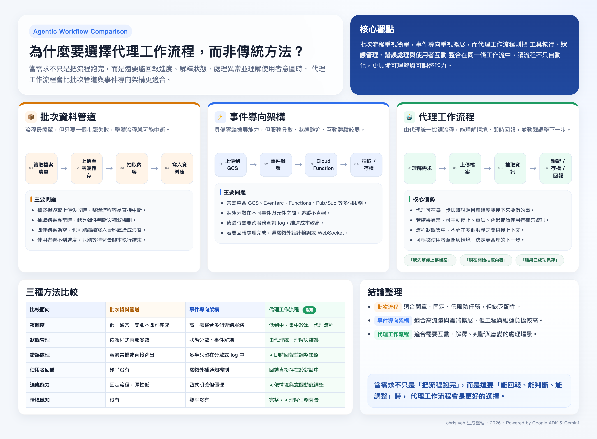

# LinkedIn Post — 多模態 AI 代理學習心得

📸 你有沒有想過，當使用者在對話裡傳一張照片，AI 代理能自動「看懂」、「整理」並「存進資料庫」，還能同步告訴你「已完成」？

這週學習了 Google Codelabs「使用 Graph RAG、ADK 和 Memory Bank 建構多模態 AI 代理」，其中在 **多模態管道（Multimodal Pipeline）技術選型上**，讓我印象深刻，以下就是個人透過 5W1H 模式來整理的學習心得：

**為什麼我們要用代理工作流程，而不是傳統的批次流程或事件導向架構？**

學習心得 👇

---

## 🔍 What — 這在做什麼？

系統能接收使用者即時上傳的 **圖片、影片、文字**，透過 AI 代理完成三件事：

1. **`upload_media`**｜將本機檔案上傳至 Google Cloud Storage
2. **`extract_from_media`**｜Gemini 視覺分析，萃取人員、資源、位置等結構化實體
3. **`save_to_spanner`**｜將實體與關係寫入 Spanner Graph 資料庫，並確認完成
4. **Agent 回報**｜「我幫你找到 3 位倖存者與 2 項資源，已成功儲存。」

---

## 🎯 Why — 為什麼這樣設計？

現場的倖存者資料是非結構化的：一張醫療包照片、一段語音備忘、一則手寫筆記。
問題是：**「水在哪裡？」** 這個查詢需要能搜尋這些多媒體裡的結構化資訊。

傳統做法的致命弱點：

- ❌ **批次流程**｜一個檔案壞掉，整個流程癱瘓
- ⚠️ **事件導向**｜5 個以上服務、狀態分散、偵錯噩夢
- ✅ **代理流程**｜即時回報、動態判斷、情境感知

---

## 🧑‍💻 Who — 由誰來協調？

`Google ADK` 的 **SequentialAgent** 是這一切的指揮中樞。
它把 4 個專職子代理串聯成一條有意識的流水線：上傳 → 擷取 → 儲存 → 摘要。
每個環節都能 **回報進度、判斷異常、調整策略**，而不是沉默地失敗。

---

## 🗺️ Where — 在哪裡運作？

整套流程部署在 **Google Cloud** 上：

| 元件            | 職責                               |
| --------------- | ---------------------------------- |
| `GCS`           | 儲存原始媒體（圖片、影片、文字）   |
| `Gemini`        | 多模態分析，視覺理解與實體萃取     |
| `Spanner Graph` | 圖資料庫，儲存人員、資源、位置關係 |

重點是：這不是把多個服務拼湊起來，而是 **由單一代理統一協調**，從使用者的一句話到資料入庫，都發生在同一個對話上下文裡。

---

## ⏱️ When — 這個架構什麼時候適合用？

不是所有場景都需要代理。但當你的需求是：

- ✔ 需要即時回饋
- ✔ 流程可能有異常
- ✔ 使用者意圖不固定
- ✔ 狀態需要跨步驟維護

那代理工作流程就值得認真考慮。

---

## ⚙️ How — 代理怎麼做到的？

關鍵在工具層（Tooling Layer）的三個設計原則：

```python
# 代理循序管道（簡化概念示意）
Agent: "我先幫你上傳檔案..."
Tool : upload_media → Success ✅
Agent: "正在擷取實體..."
Tool : extract_from_media → 找到 3 位倖存者、2 項資源 ✅
Agent: "正在儲存進資料庫..."
Tool : save_to_spanner → 儲存為 broadcast #456 ✅
Agent: "完成！共找到 3 位倖存者與 2 項資源，是否要重新上傳圖片 2？"
```

- `多模態輸入`：文字提示 + 圖片物件一起丟給 Gemini
- `結構化輸出`：`response_mime_type="application/json"` 確保 LLM 回傳有效 JSON
- `服務抽象化`：GCSService 封裝細節，代理只說「上傳」，不需知道 bucket 怎麼運作

---

## 💡 學習心得

這張比較圖是我最後整理思路的關鍵：
批次流程的問題不是「不夠強大」，而是 **缺乏韌性**；
事件導向的問題不是「不夠擴展」，而是 **狀態太分散、維運太複雜**。

代理工作流程不是萬靈丹，但它解決了一個核心問題：
**「流程跑完」和「讓人知道跑完了、還能問為什麼」之間，有一道鴻溝。**
SequentialAgent 填補的，正是這道鴻溝。

你對代理工作流程有什麼看法？歡迎留言交流 👇

---

## 🖼️ 圖片



> 圖：批次管道 / 事件導向 / 代理工作流程三方比較（由 flow.html 生成）

---

## 🏷️ Tags

#GoogleADK #AgenticAI #MultimodalAI #GeminiAPI #SequentialAgent #GoogleCloud #GraphRAG #AIEngineering #LLMOps #BuildWithAI #生成式AI #AI代理 #軟體工程師

---

## 🔗 相關連結

- 🧪 [Google Codelabs：Survivor Network — Step 9 Multimodal Pipeline（工具層）](https://codelabs.developers.google.com/codelabs/survivor-network/instructions?hl=zh-tw#8)
  多模態管道工具層詳細說明，包含 `upload_media`、`extract_from_media`、`save_to_spanner` 的原始碼與解說

- 🤖 [Google Codelabs：Survivor Network — Step 10 Agent Layer（代理層）](https://codelabs.developers.google.com/codelabs/survivor-network/instructions?hl=zh-tw#9)
  代理層詳細說明，SequentialAgent 如何把 4 個子代理串成完整的多模態處理流水線

- 📖 [Google Codelabs：使用 Graph RAG、ADK 和 Memory Bank 建構多模態 AI 代理（完整版）](https://codelabs.developers.google.com/codelabs/survivor-network/instructions?hl=zh-tw#0)
  從 Spanner Graph 設定、Graph RAG 混合搜尋、多模態管道到 Memory Bank 的完整學習路徑

- 📚 [Google ADK 官方文件](https://google.github.io/adk-docs/)
  Agent Development Kit — SequentialAgent、工具定義、Session 管理等完整 API 參考

---

*chris yeh 生成整理 · 2026 · Powered by Google ADK & Gemini*
