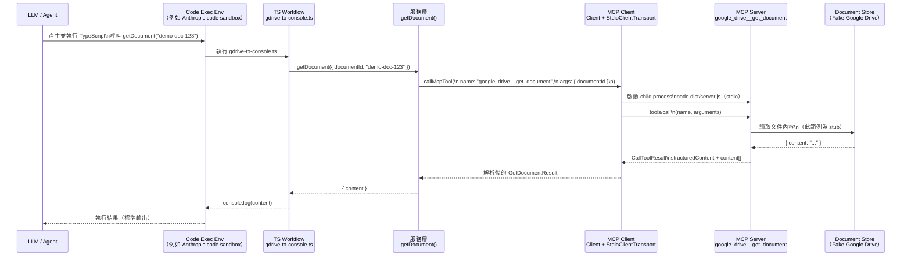

## 一、為什麼要用「Code Execution + MCP」？

### 1. 問題一：工具定義把 Context 撐爆

當一個 Agent 連到很多 MCP servers（Google Drive、Salesforce、各種內部系統…），傳統做法是：

*   把所有 tools 的定義（名稱、參數 schema、說明）全部塞到模型的 context 裡
*   模型用「直接呼叫工具」的方式運作（例如：`gdrive.getDocument`、`salesforce.updateRecord`）

當工具多到幾百、幾千個時：

*   工具定義本身就可能佔掉數十萬 tokens
*   還沒開始處理你的需求，context 已經被吃光一半了 ([Anthropic][1])

### 2. 問題二：中間結果也一直佔 tokens

典型流程像這樣：

1.  呼叫 `gdrive.getDocument(documentId: "abc123")` → 把完整逐字稿塞回模型 context
2.  模型再呼叫 `salesforce.updateRecord(...)`，需要把整份逐字稿再貼一次進參數裡

所以：

*   同一份 2 小時會議逐字稿，可能在 context 裡出現兩次以上
*   大文件甚至會超過 context 限制，流程直接壞掉 ([Anthropic][1])

---

## 二、解法總圖：把 MCP 工具包裝成「程式碼 API」

核心 Idea（這篇文章的重點）：

> 不是讓模型「直接呼叫 MCP 工具」，而是讓模型「寫程式」去呼叫 MCP API。([Anthropic][1])

做法是：

1.  每個 MCP tool 對應成一個程式檔：像 `servers/google-drive/getDocument.ts`
2.  Agent 在「程式碼執行環境」裡，自行：
    *   探索檔案系統（列出有哪些工具）
    *   `import` 它需要的工具
    *   寫 code 串接多個工具、處理資料
3.  只有「必要的摘要結果」才回傳給模型，減少 token 消耗

文章中的範例，把所有 server 長得像這樣的檔案樹：([Anthropic][1])

```text
servers
├── google-drive
│   ├── getDocument.ts
│   └── index.ts
├── salesforce
│   ├── updateRecord.ts
│   └── index.ts
└── ...
```

---

## 三、實作步驟：手把手設計一個「MCP + Code Execution」架構

### 1. 範例程式碼（TypeScript + MCP SDK）

這是一個**最小可跑**的專案結構：

*   MCP server：透過 `stdio` transport 提供 `google_drive__get_document` 工具
*   MCP client：用 `StdioClientTransport` 啟 server，呼叫工具
*   Lesson 2 workflow：用一個小小的 TypeScript 函式把「商業語意」包起來，再由工作流程呼叫

#### 1-1. 專案目錄結構建議

```text
mcp-lesson2/
  package.json
  tsconfig.json
  src/
    server.ts
    mcp/
      client.ts
    client/
      callMcpTool.ts
    servers/
      google-drive/
        getDocument.ts
    workflows/
      gdrive-to-console.ts
```

---

#### 1-2. package.json

> 版本號我用 `*`，實際開發時可以改成 npm 安裝後產生的版本。

```jsonc
{
  "name": "lesson2-mcp-typescript-demo",
  "version": "1.0.0",
  "type": "module",
  "scripts": {
    "build": "tsc",
    "server": "node dist/server.js",
    "workflow:gdrive": "node dist/workflows/gdrive-to-console.js"
  },
  "dependencies": {
    "@modelcontextprotocol/sdk": "*",
    "zod": "*"
  },
  "devDependencies": {
    "typescript": "*"
  }
}
```

---

#### 1-3. tsconfig.json

設定成 ESM + Node16 / Node-style module resolution，對 MCP SDK 的 `.js` 路徑比較友善。([Medium][1])

```json
{
  "compilerOptions": {
    "target": "ES2022",
    "module": "Node16",
    "moduleResolution": "Node16",
    "rootDir": "./src",
    "outDir": "./dist",
    "strict": true,
    "esModuleInterop": true,
    "skipLibCheck": true,
    "forceConsistentCasingInFileNames": true
  },
  "include": ["src/**/*"],
  "exclude": ["node_modules"]
}
```

---

#### 1-4. MCP Server：`src/server.ts`

這個 server 只做一件事：提供一個 demo 用的 `google_drive__get_document` 工具。
它**不會真的打 Google Drive API**，而是回傳一段 stub 文本，重點在 MCP 流程。

```ts
// src/server.ts
import { McpServer } from "@modelcontextprotocol/sdk/server/mcp.js";
import { StdioServerTransport } from "@modelcontextprotocol/sdk/server/stdio.js";
import { z } from "zod";

// 1) 建立 MCP Server
const server = new McpServer({
  name: "lesson2-gdrive-server",
  version: "1.0.0"
});

// 2) 註冊工具：google_drive__get_document
server.registerTool(
  "google_drive__get_document",
  {
    title: "Get Google Drive document (demo)",
    description:
      "回傳指定文件 ID 的內容（本範例為 stub，不會真的連線 Google Drive）。",
    inputSchema: {
      documentId: z.string()
    },
    outputSchema: {
      content: z.string()
    }
  },
  // handler
  async ({ documentId }) => {
    const output = {
      content: `這是文件 ${documentId} 的假資料內容（來自 MCP server stub）。`
    };

    return {
      // 給 LLM 的可讀文字（最佳實務：同時回傳 JSON 字串）
      content: [
        {
          type: "text",
          text: JSON.stringify(output)
        }
      ],
      // 結構化輸出：會依 outputSchema 驗證
      structuredContent: output
    };
  }
);

// 3) 啟動 stdio transport
async function main() {
  const transport = new StdioServerTransport();
  await server.connect(transport);
}

main().catch((err) => {
  console.error("MCP server error:", err);
  process.exit(1);
});
```

---

#### 1-5. MCP Client：`src/mcp/client.ts`

使用 `StdioClientTransport`，每次呼叫工具時啟動一個 child process 來跑 `node dist/server.js`。([GitHub][2])

```ts
// src/mcp/client.ts
import { Client } from "@modelcontextprotocol/sdk/client/index.js";
import { StdioClientTransport } from "@modelcontextprotocol/sdk/client/stdio.js";

let cachedClient: Client | null = null;

/**
 * 取得（或建立）一個共用 MCP Client 實例
 */
export async function getMcpClient(): Promise<Client> {
  if (cachedClient) return cachedClient;

  const transport = new StdioClientTransport({
    command: "node",
    args: ["dist/server.js"] // 會在 build 之後存在
  });

  const client = new Client({
    name: "lesson2-client",
    version: "1.0.0"
  });

  await client.connect(transport);
  cachedClient = client;

  return client;
}
```

---

#### 1-6. 通用工具呼叫封裝：`src/client/callMcpTool.ts`

這個檔案把 `client.callTool` 包成一個泛型函式，方便未來擴充其他工具。

```ts
// src/client/callMcpTool.ts
import { getMcpClient } from "../mcp/client.js";

export interface CallMcpToolOptions<TArgs> {
  name: string;
  args: TArgs;
}

// MCP SDK 的實際型別在 @modelcontextprotocol/sdk/types.js 裡，
// 這邊用簡化版避免跟 SDK 版本強耦合。
interface RawToolResult {
  structuredContent?: unknown;
  content?: Array<{ type: string; text?: string }>;
  isError?: boolean;
}

/**
 * 一般化的 MCP 工具呼叫封裝
 */
export async function callMcpTool<TArgs, TResult>(
  options: CallMcpToolOptions<TArgs>
): Promise<TResult> {
  const client = await getMcpClient();

  const raw = (await client.callTool({
    name: options.name,
    arguments: options.args as any
  })) as RawToolResult;

  if (raw.isError) {
    const msg = raw.content?.[0]?.text ?? "Unknown tool error";
    throw new Error(`Tool "${options.name}" 回傳錯誤：${msg}`);
  }

  // 優先使用 structuredContent（有 schema 驗證）
  if (raw.structuredContent) {
    return raw.structuredContent as TResult;
  }

  const first = raw.content?.[0];
  if (first?.type === "text" && first.text) {
    // 後備方案：解析 JSON 字串
    return JSON.parse(first.text) as TResult;
  }

  throw new Error(
    `Tool "${options.name}" 沒有提供可用的 structuredContent 或 text 內容`
  );
}
```

---

#### 1-7. Lesson 2 的「服務層」：`src/servers/google-drive/getDocument.ts`

這一層對 LLM/業務邏輯來說，就是「我有一個 `getDocument` 函式可以用」，
底下是 MCP 怎麼實現跟 transport 完全隱藏。

```ts
// src/servers/google-drive/getDocument.ts
import { callMcpTool } from "../../client/callMcpTool.js";

export interface GetDocumentArgs {
  documentId: string;
}

export interface GetDocumentResult {
  content: string;
}

/**
 * Lesson 2：對外暴露的 Google Drive 文件查詢服務
 */
export async function getDocument(
  args: GetDocumentArgs
): Promise<GetDocumentResult> {
  return callMcpTool<GetDocumentArgs, GetDocumentResult>({
    name: "google_drive__get_document",
    args
  });
}
```

---

#### 1-8. Lesson 2 Workflow：`src/workflows/gdrive-to-console.ts`

這就是「給 LLM 產生、由 code-exec 執行」的那段 TypeScript。
它只需要知道 `getDocument()` 這個抽象 API，不用管 MCP 細節。

```ts
// src/workflows/gdrive-to-console.ts
import { getDocument } from "../servers/google-drive/getDocument.js";

async function main() {
  // 在真實情境裡，documentId 會由 LLM 或使用者輸入
  const documentId = "demo-doc-123";

  const result = await getDocument({ documentId });

  console.log("✅ 從 MCP Google Drive 工具取得的內容：");
  console.log(result.content);
}

main().catch((err) => {
  console.error("Workflow error:", err);
  process.exit(1);
});
```

---

#### 1-9. 執行流程

1.  安裝套件（在專案根目錄）：

    ```bash
    npm install @modelcontextprotocol/sdk zod
    npm install -D typescript
    ```

2.  編譯：

    ```bash
    npm run build
    ```

3.  手動跑 Lesson 2 workflow（模擬 code-execution 環境）：

    ```bash
    npm run workflow:gdrive
    ```

你應該會在終端機看到類似：

```text
✅ 從 MCP Google Drive 工具取得的內容：
這是文件 demo-doc-123 的假資料內容（來自 MCP server stub）。
```

---

### 2. 程式碼流程說明

<details>
<summary>詳細流程說明</summary>

#### 步驟 1. LLM / Agent 生成程式碼並在 Code Execution 環境中執行

使用者問 LLM：「請幫我取得 Google Drive 文件內容」。 LLM 不直接呼叫工具，而是：

*   生成一小段 TypeScript 程式碼（例如 `gdrive-to-console.ts`）
*   程式碼中會呼叫 `getDocument({ documentId })`
*   系統把這段程式碼丟到安全的 Code Execution Sandbox 中執行

**流程開始於： `node dist/workflows/gdrive-to-console.js`**

#### 步驟 2. Workflow 啟動 ─ `src/workflows/gdrive-to-console.ts`

這段程式是最上層的「流程控制」：

```ts
const result = await getDocument({ documentId: "demo-doc-123" });
console.log(result.content);
```

它呼叫了我們在 Lesson 2 設計的 Service API：`getDocument()`。

---

#### 步驟 3. 呼叫 Service 層 ─ `getDocument()`

Service 層的任務是：

1.  **對 workflow 提供簡單的函式介面**
    → 例如 `getDocument()`、`searchDocuments()`、`updateLeadNotes()`
2.  **隱藏 MCP 細節**
    → workflow 不需要知道 MCP server 是如何溝通的、傳的是什麼格式。

`getDocument()` 的實作：

```ts
return callMcpTool({
  name: "google_drive__get_document",
  args: { documentId }
});
```

它唯一的工作就是把需求轉成 MCP tool 呼叫。

---

#### 步驟 4. Service 呼叫 MCP Client ─ `callMcpTool()`

`callMcpTool()` 是整個系統的「共用入口」，所有 MCP 工具呼叫都經過它。它主要做幾件事：

1.  **取得（或建立） MCP Client**
    ```ts
    const client = await getMcpClient();
    ```

2.  **呼叫 MCP 工具**
    ```ts
    const raw = await client.callTool({
      name: "google_drive__get_document",
      arguments: { documentId }
    });
    ```

3.  **解析 MCP server 回傳的格式**
    MCP 工具可能回傳：
    *   `structuredContent`（推薦）
    *   或 text 內容（例如 JSON 字串）
    *   或錯誤訊息
    `callMcpTool()` 把這些轉成 TypeScript 型別強一致的 `GetDocumentResult`。

---

#### 步驟 5. MCP Client 連線到 MCP Server ─ `getMcpClient()`

第一次呼叫 MCP 工具時（lazy 初始化）：

1.  建立 `StdioClientTransport`
    → 代表「用 stdio 啟動一個子程序來跑 server」
2.  執行 `node dist/server.js`
3.  MCP client 與 child process 之間建立 Model Context Protocol 連線
    → 用 stdio (stdin / stdout) 傳遞協議資料
4.  接著 `client.callTool(...)` 才會真的送出 `tools/call` 請求

---

#### 步驟 6. MCP Server 收到 `tools/call`

Server 是用 `McpServer` 建立的：

```ts
server.registerTool("google_drive__get_document", {...}, handler)
```

當 client 發送請求時，MCP server 會：

1.  比對 tool 名稱
2.  把 `arguments` (`{ "documentId": "demo-doc-123" }`) 丟進 zod schema 驗證
3.  進入 handler 內執行

handler 執行完後會回傳：

```ts
{
  content: [{ type: "text", text: JSON.stringify({ content: "..." }) }],
  structuredContent: { content: "..." }
}
```

這裡的「假 Google Drive」資料只是示範。

---

#### 步驟 7. MCP Client 接收結果並回傳給 Service 層

MCP Client 收到 server 回覆：

*   若有 `structuredContent` → 直接回傳
*   否則看 `text` → 嘗試 parse JSON
*   若是錯誤格式 → 丟出 exception

Service 層 `getDocument()` 最終收到一個標準型別：

```ts
{ content: "這是文件 demo-doc-123 的假資料內容..." }
```

---

#### 步驟 8. Workflow 印出結果

Workflow 拿到結果後：

```ts
console.log(result.content);
```

LLM 就能看到輸出，也能繼續寫下一段 code，或根據 output 做決策。

</details>

**流程總結**：

1.  **LLM 產生 TypeScript workflow 並在沙盒中執行。**
2.  Workflow 呼叫 `getDocument()` 取得文件。
3.  `getDocument()` 呼叫 `callMcpTool()`。
4.  `callMcpTool()` 使用 MCP Client（Client + Stdio transport）。
5.  MCP Client 用 `node dist/server.js` 啟動 MCP Server。
6.  MCP Client 與 MCP Server 建立 MCP session（透過 stdio）。
7.  MCP Client 發送 `tools/call`。
8.  MCP Server 呼叫對應的 handler（Zod 驗證、執行工具）。
9.  MCP Server 回傳 `structuredContent` + `text` 結構。
10. MCP Client 整理回傳內容，交給 Service 層。
11. Service 層把結果回交給 Workflow。
12. Workflow 顯示文件內容。
13. LLM 讀到結果後可繼續規劃下一步流程。



---

## 四、什麼時候適合用「Code Execution + MCP」？

**適合情境：**

*   你的 Agent 已經連接「很多」 MCP servers（內外部系統、SaaS、DB…）
*   任務會處理大量資料（報表、log、交易資料、客戶清單…）
*   對隱私與資料流向有高要求（金融、醫療、公部門）
*   需要複雜控制流程：輪詢、重試、錯誤處理、多步驟 pipeline

**需要考慮的成本：** ([Anthropic][1])

*   必須建立一個**安全的程式碼執行環境**：
    *   sandbox（容器 / VM）
    *   resource limit（CPU / Memory / 執行時間）
    *   監控與審計（避免惡意程式碼）
*   相較「直接讓模型呼叫工具」，基礎設施與維運複雜一些
