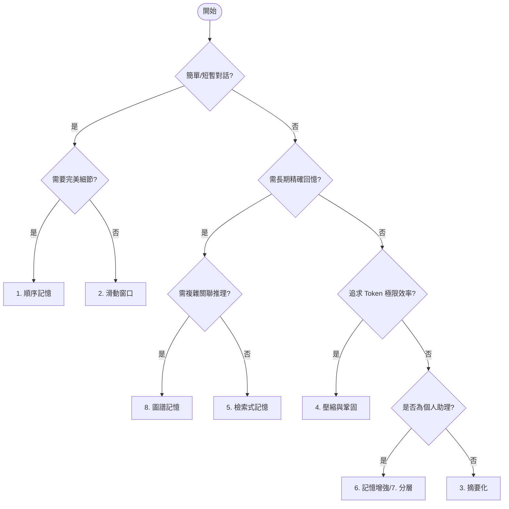

# AI 代理 (AI Agent) 記憶優化技術指南

本文章參考 `Fareed Khan` 來自 Medium 文章 [Implementing 9 Techniques to Optimize AI Agent Memory](https://medium.com/@fareedkhandev/67d813e3d796?sk=14ccc929e8d9c64b0ca7c4c80fe79b45) 搭配 Google ADK [參考](#6-google-adk-中的記憶優化實現) 在 Memory 深入探討 AI 代理在處理長對話與複雜任務時的記憶管理技術。隨著對話深度增加，如何平衡 **Token 成本**、**模型上下文限制** 與 **資訊檢索精準度**，成為構建生產級 AI 系統的核心挑戰。

## 1. 為什麼需要記憶優化？

在預設情況下，LLM 是無狀態的。為了維持對話連貫性，我們通常將歷史記錄完整發送回模型。然而，這會面臨三大問題：
1. **Token 成本飆升**：對話越長，每輪互動消耗的 Token 越多。
2. **上下文窗口限制**：模型能處理的內容長度有其上限（Context Window）。
3. **資訊干擾**：過多無關的歷史資訊可能分散模型注意力，導致「Lost in the Middle」現象。

## 2. 記憶管理技術演進路徑

我們將 9 種優化技術依據**實現複雜度**與**應用場景**分為三個層次：

### A. 基礎管理類 (Basic Management)
適用於簡單聊天機器人，側重於對話流的直接控制。
*   **1. 順序記憶 (Sequential)**：保留所有歷史，不做處理。
*   **2. 滑動窗口 (Sliding Window)**：僅保留最近 $N$ 則訊息。

### B. 資訊壓縮類 (Information Distillation)
適用於長篇對話，側重於在減少 Token 的同時保留語義。
*   **3. 摘要化 (Summarization)**：定期將舊對話總結為摘要。
*   **4. 壓縮與鞏固 (Compression)**：將對話蒸餾為精簡的事實陳述，去除社交廢話。

### C. 進階架構類 (Advanced Architecture)
適用於複雜專家系統或長期助理，側重於結構化儲存與精準檢索。
*   **5. 檢索式記憶 (RAG)**：基於向量數據庫的相似度檢索。
*   **6. 記憶增強 (Memory Augmented)**：提取核心事實（如用戶偏好）作為「便利貼」。
*   **7. 分層記憶 (Hierarchical)**：模擬工作記憶與長期記憶的分離。
*   **8. 圖譜記憶 (Graph-Based)**：利用知識圖譜處理複雜實體關聯。
*   **9. 類 OS 記憶管理 (OS-Like)**：在活動內存 (RAM) 與被動儲存 (Disk) 間動態交換。

---

## 3. 技術深度解析

| 技術名稱 | 核心機制 | 優點 | 缺點 / 限制 | 最佳適用場景 |
| :--- | :--- | :--- | :--- | :--- |
| **順序記憶** | 完整發送所有歷史。 | 完美召回，保留語氣細節。 | 成本極高，易達上限。 | 短暫、一次性任務。 |
| **滑動窗口** | 自動丟棄 $N$ 則之前的訊息。 | 成本固定，實現最簡單。 | 會遺忘窗口外的關鍵資訊。 | 僅需關注近期上下文。 |
| **摘要化** | 使用 LLM 定期生成運行摘要。 | 大幅節省 Token，保留主旨。 | 摘要過程可能遺失細節。 | 長篇創作、一般性助理。 |
| **壓縮與鞏固** | 蒸餾每輪對話為核心事實。 | 極高資訊密度，Token 效率高。 | 失去個性、語氣與語境。 | 預算有限且僅需事實回憶。 |
| **檢索式 (RAG)** | 向量搜尋最相關的片段。 | 處理大規模背景資訊，精準。 | 數據庫管理複雜，有檢索延遲。 | 需要長期、精確回憶。 |
| **記憶增強** | 提取用戶偏好等核心事实。 | 長期維持用戶個性化體驗。 | 額外的 LLM 提取成本。 | 可靠的個人助理。 |
| **分層記憶** | 區分快/慢、長/短記憶層。 | 兼顧對話流暢度與深度。 | 系統邏輯判斷較為複雜。 | 執行多任務的高級代理。 |
| **圖譜記憶** | 建立實體與關係 (SPO 三元組)。 | 擅長複雜關聯推理與結構化。 | 提取與構建技術難度高。 | 專家系統、深度知識推理。 |
| **類 OS 管理** | 模擬 RAM/Disk 資訊換頁。 | 處理無限記憶量。 | 需處理複雜的分頁錯誤機制。 | 超大規模、長效運行系統。 |


## 4. 決策指引：如何選擇正確的策略？

選擇記憶策略時，應在 **預算 (Budget)**、**精準度 (Precision)** 與 **複雜度 (Complexity)** 之間取得平衡。

### 策略選擇路線圖



## 5. 實作建議

### 技術棧推薦
*   **語言**：Python (建議採用物件導向設計建立抽象記憶類別)
*   **運算與計算**：`openai`, `tiktoken` (精確計算 Token)
*   **向量搜尋**：`faiss-cpu`, `chromadb`, 或 `qdrant`
*   **圖譜建立**：`networkx`, `neo4j`

### 實作心法
1. **模組化**：定義統一的 `BaseMemory` 介面，讓策略切換不影響核心業務邏輯。
2. **混合模式**：在生產環境中，最成功的案例通常是 **「滑動窗口 (近期) + RAG (長期)」** 的組合。
3. **監控與成本估算**：在發送給 LLM 前，先使用 `tiktoken` 預估成本，必要時觸發摘要程序。

## 6. Google ADK 中的記憶優化實現

Google Agent Development Kit (ADK) 提供了現成的組件來實現上述許多記憶優化策略，讓開發者無需從頭造輪子：

### ADK 核心組件對應表

| ADK 功能組件 | 對應優化技術 | 實作說明 |
| :--- | :--- | :--- |
| **Context Caching** (`ContextCacheConfig`) | *基礎設施優化* | 針對重複的長指令或大量背景資訊進行快取，顯著降低 **Token 成本** 與 **首字延遲**。 |
| **Context Compaction** (`EventsCompactionConfig`) | **2. 滑動窗口** / **3. 摘要化** | 內建自動化機制，可設定保留視窗大小 (`overlap_size`) 並使用 LLM 定期摘要 (`summarizer`) 舊事件。 |
| **Session State** (`user:`, `app:` 前綴) | **6. 記憶增強** | 利用狀態前綴區分範疇：`temp:` (單次調用)、`user:` (跨會話持久化)、`app:` (全域設定)，精準控制記憶生命週期。 |
| **Memory Service** (`VertexAiMemoryBank`) | **5. 檢索式記憶 (RAG)** | 整合 Vertex AI Agent Engine，提供生產級的語義搜尋與自動記憶提取能力。 |

### ADK 程式碼配置範例

```python
from google.adk.apps.app import App, EventsCompactionConfig
from google.adk.agents.context_cache_config import ContextCacheConfig
from google.adk.memory import VertexAiMemoryBankService

# 1. 配置 Context Caching (針對大量重複背景資訊)
# 當內容超過 2048 tokens 時自動快取，並保留 10 分鐘
cache_config = ContextCacheConfig(min_tokens=2048, ttl_seconds=600)

# 2. 配置 Context Compaction (自動摘要與滑動視窗)
# 每 5 輪對話觸發一次壓縮，並保留 2 輪重疊以維持上下文連貫
compaction_config = EventsCompactionConfig(
    compaction_interval=5,
    overlap_size=2
)

# 3. 連接長期記憶服務 (RAG / 語義搜尋)
memory_service = VertexAiMemoryBankService(
    project="your-project-id",
    location="us-central1"
)

app = App(
    name='smart-assistant',
    root_agent=my_agent,
    context_cache_config=cache_config,
    events_compaction_config=compaction_config,
    memory_service=memory_service
)
```

## 7. 參考資源

### Google ADK 官方文件與教學
*   **Context Caching (快取)**: [ADK Context Caching Guide](../../adk-docs/context/caching.md)
*   **Context Compaction (壓縮)**: [ADK Context Compaction Guide](../../adk-docs/context/compaction.md)
*   **State & Memory Tutorial (狀態與記憶實戰)**: [Tutorial 08: Persistent Agent Context](../../notes/google-adk-training-hub/adk_training/08-state_memory.md)
*   **Memory Service (記憶服務)**: [Memory Service Guide](../../adk-docs/sessions&memory/memory.md)

### 原始理論與實作
*   **原始文章**：[Implementing 9 Techniques to Optimize AI Agent Memory](https://medium.com/@fareedkhandev/67d813e3d796?sk=14ccc929e8d9c64b0ca7c4c80fe79b45) (By Fareed Khan)
*   **GitHub 實作範例**：[optimize-ai-agent-memory](https://github.com/FareedKhan-dev/optimize-ai-agent-memory)
*   **進階架構參考**：[Building a multi-agent AI system with LangGraph and LangSmith](https://levelup.gitconnected.com/building-a-multi-agent-ai-system-with-langgraph-and-langsmith-6cb70487cd81)
