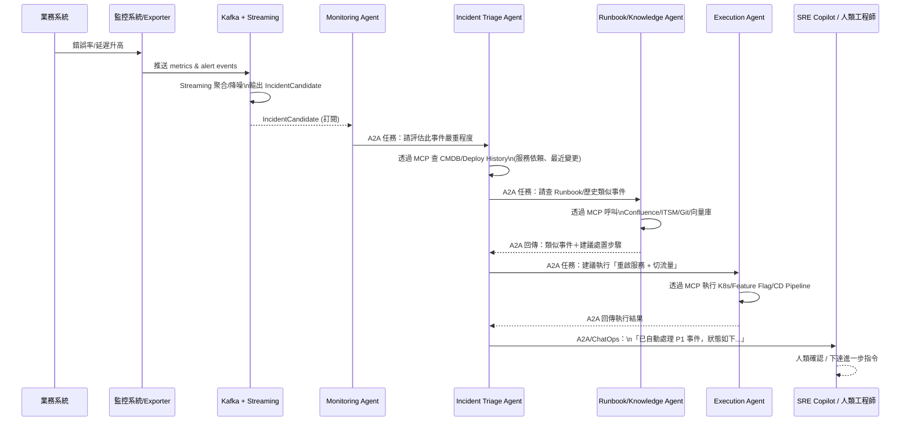

# 主題發想 - 維運多 Agent 協作宇宙

## 一、系統維運多 Agent 宇宙（內建 MCP + A2A）

### 設計核心目標

本設計旨在建構一個由多個專業 AI 代理人（Agent）協同工作的自動化維運系統，其核心目標如下：

1.  **實現端到端的自動化事件應對流程**：
    從監控系統發現異常（`Monitoring Agent`），到判斷事件嚴重等級與影響範圍（`Incident Triage Agent`），查詢歷史解決方案（`Runbook/Knowledge Agent`），執行自動化修復動作（`Execution Agent`），最後將過程與結果彙報給維運人員（`SRE Copilot Agent`），打造一個全自動、閉環的事件處理流程，以提高反應速度並降低人為錯誤。

2.  **建立職責分離且高效協作的 Agent 生態系**：
    將複雜的維運工作拆解給不同職責的 Agent。每個 Agent 專注於特定任務（如：監控、分析、知識查詢、執行），並透過 A2A（Agent-to-Agent）通訊協議進行任務指派與成果回報。這種模組化設計讓系統更易於維護、擴展，並實現了「讓專業的 Agent 做專業的事」。

3.  **集中化知識管理，降低資訊存取複雜度**：
    透過 `Runbook / Knowledge Agent` 作為統一的知識入口，所有其他 Agent 皆透過它來查詢內部文件（Confluence、Git）、歷史事件（ITSM）或 Runbook。這不僅統一了知識來源，也集中管理了存取權限與檢索邏輯（如 RAG），讓其他 Agent 的開發可以更專注於自身的核心任務。

4.  **明確劃分技術堆疊（Kafka, MCP, A2A）的角色**：
    *   **Kafka** 定位為系統的「資料血管」，專責高速、大量的事件與指標數據流傳輸。
    *   **MCP** 作為 Agent 與「外部世界」（內部系統、工具、API）溝通的標準橋樑。
    *   **A2A** 則專責 Agent 之間的「語意層協作」，處理任務的委派與狀態回報。
    透過此劃分，建立一個穩定、清晰且可擴展的底層架構。

---

## 二、Multi Agent 設計角色說明

### 1️⃣ Monitoring Agent（監控代理人）

**角色：**

* 吸收來自 Kafka / 監控系統的 event，做初步聚合與降噪。

**資料流：**

* Data Plane：

  * 從 Kafka topics（metrics / alert / log events）訂閱資料
* MCP：可選，不一定要（多數只讀 Kafka 或監控 API 即可）
* A2A：

  * 當它認為「這可能是一個 incident」時，透過 A2A 發送任務給 `Incident Triage Agent`：

> 「這裡有一組候選事件，請幫我判斷嚴重程度與影響範圍。」

### 2️⃣ Incident Triage Agent（事件分級代理人）

**角色：**

* 判斷事件嚴重性（P1/P2/P3）、影響範圍，決定是否 escalate、是否需要自動化處置。

**資料取得方式：**

* MCP：

  * `cmdb_tool`：查服務拓樸、依賴關係
  * `deploy_history_tool`：查最近是否有 release / config 變更
  * `metrics_query_tool`：補拉某段時間的 metrics 曲線
* A2A：

  * 接收 `Monitoring Agent` 的 A2A 任務
  * 再透過 A2A 向 `Runbook / Knowledge Agent` 請求「過去類似事件＆建議處置」

### 3️⃣ 📚 Runbook / Knowledge Agent（知識 / Runbook 代理人）

* 專門負責「跟各種內部知識系統打交道」，藉由 **MCP tools** 存取：

  * Confluence / Wiki / Notion / SharePoint（技術文件、SOP）
  * Git repo（README、運維文件、infra as code 註解）
  * Ticket / ITSM 系統（歷史 incident / postmortem）
  * 內部向量資料庫（embedding 後的 tech doc / runbook）

`-> 如何使用 MCP？`

在 ADK / MCP 的語境下，這個 Agent 可能綁上多個 MCP tools，例如：

* `confluence_search`（MCP tool）
* `itsm_ticket_search`
* `runbook_vector_search`
* `git_doc_search`

**流程範例：**

1. `Incident Triage Agent` 透過 **A2A** 發一個任務：

> 「給定 service = X，symptom = '5xx 激增，發生在 deploy 後 10 分鐘內'，請幫我找過去類似事件、對應 runbook，並總結建議處置步驟。」

2. `Runbook Agent`：

   * 用 MCP 的 tools 去查 Confluence、ITSM、向量庫
   * 用 LLM 把結果整理成：

     * 類似案例列表
     * 步驟化建議（step-by-step）
     * 可能 root cause 清單

3. `Runbook Agent` 再透過 **A2A** 回傳給 `Incident Triage Agent`：

> 「這看起來和事件 #INC-2024-0921 類似，以前的處置步驟是… 建議這次也先…」

`-> 重點：其他 Agent 不用自己直接碰 Confluence / ITSM，
而是「問 Runbook Agent 就好」，把知識存取集中管理。`

### 4️⃣ Execution / Automation Agent（執行 / 自動化代理人）

**角色：**

* 接收 Triage Agent 的決策建議，決定是否執行自動化動作（受 guardrail 約束）。

**資料流：**

* MCP（tools 多半是「動作型工具」）：

  * `k8s_scaling_tool`
  * `service_restart_tool`
  * `feature_flag_toggle_tool`
  * `cd_pipeline_rollback_tool`
* A2A：

  * 從 Triage Agent 收到：「建議執行 X, Y 操作」的任務
  * 執行完成後再用 A2A 回報狀態（成功 / 失敗 / log）。

### 5️⃣ SRE Copilot Agent（人類溝通代理人）

**角色：**

* 是 SRE / On-call 工程師的「對話入口」，整合多個 Agent 的輸入與輸出。

**資料流：**

* MCP：

  * `chatops_tool`（例如寫入 Slack / MS Teams）
  * `incident_system_tool`（開 ticket、更新狀態）
* A2A：

  * 接收其他 Agent 的狀態更新
  * 接收 SRE 指令後，把指令轉成 A2A 任務丟給其他 Agent（例如 Execution Agent）。

## 三、Kafka + Data Streaming：仍然是資料血管，不負責「語意協作」

在整體設計中，我們可以這樣分工：

* **Kafka / Streaming：**

  * 負責 **事件 & 指標資料** 的「高速輸送 + 即時聚合」
  * 輸出給 Monitoring Agent / Triage Agent 作為 decision context
* **MCP：**

  * 負責 **Agent ↔ 內部系統 / 知識庫 / 工具** 的安全調用
* **A2A：**

  * 負責 **Agent ↔ Agent** 之間的任務委派與結果回傳

## 四、 P1 事故處理時序圖

## 五、問題探討：Runbook / Knowledge Agent 的 MCP & A2A 使用方式

### Q：`📚 Runbook / Knowledge Agent` 是否可以透過內部 MCP 或 A2A 來取得資訊？

* **取得知識本身：**
  ✅ **建議使用 MCP**

  * 對內部系統、知識庫、文件、ticket 系統 → 都定義成 MCP tools
  * Runbook Agent 用 MCP 調用這些工具並整理結果

* **與其他 Agent 交換結果：**
  ✅ **建議使用 A2A**

  * 其他 Agent 不直接查 Confluence / Git / ITSM
  * 而是用 A2A，丟一個「查詢任務」給 Runbook Agent
  * Runbook Agent 用 MCP 查完，整理後用 A2A 回傳

### ** 達成幾個好處 **

1. **權限集中管理**：只有 Runbook Agent 有權讀某些敏感知識庫
2. **重用邏輯**：搜尋 / RAG / summarization 邏輯集中寫一份
3. **其他 Agent 更單純**：只需要會「問問題」＆「吃答案」

***
[<< 返回目錄](./README.md) | [下一篇：A2A Agent 職責表 >>](./02_agents.md)
