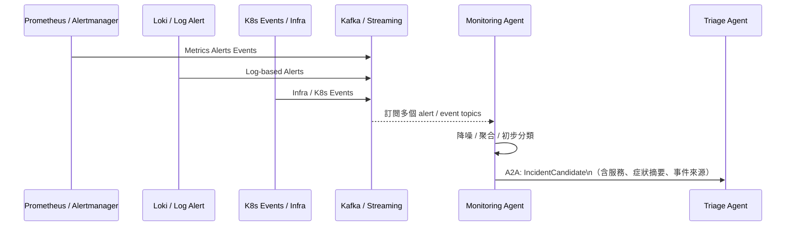
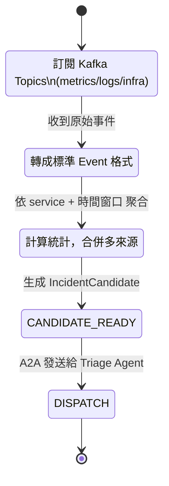

# Monitoring Agent 模組設計

## **1. 模組定位與職責（Role & Responsibility）**

Monitoring Agent 是整個多 Agent 維運架構中的「**前線偵測與降噪者**」，負責：

1. **接收監控相關事件**

   * 從 **Kafka** 訂閱：

     * metrics-based alert events
     * log-based alert events
     * infra / K8s 事件（pod crash、node not ready…）
   * 來源包含 Prometheus / Alertmanager / Loki / K8s event exporter 等

2. **降噪與聚合（Noise Reduction & Aggregation）**

   * 將短時間內大量重複告警合併
   * 將多來源（metrics + logs + infra）的訊號合併成「一個候選事件」

3. **初步分類（Pre-Classification）**

   * 分析基本屬性：

     * 服務名稱 / cluster / namespace
     * 是否為敏感服務
     * 是否為已知 pattern（可比對簡單規則）

4. **輸出 IncidentCandidate 給 Triage Agent**

   * 經過整理的事件會變成 **IncidentCandidate**，透過 **A2A** 傳給 Incident Triage Agent
   * 自己不做深度 root cause 分析、不決定是否自動處置

> 關鍵定位：**「把一堆噪音告警整理成可被 Triage Agent 消化的『事件候選』」**。

---

## **2. 架構互動圖（Architecture Interaction）**



---

## **3. 功能清單（Functional Requirements）**

| 編號    | 功能                   | 說明                                                |
| ----- | -------------------- | ------------------------------------------------- |
| FR-01 | 訂閱相關 Kafka Topics    | 包含 metrics_alerts、log_alerts、infra_events 等       |
| FR-02 | 事件標準化                | 將不同來源（Prometheus / Loki / K8s）的事件轉成統一 schema      |
| FR-03 | 降噪                   | 同一段時間、同一服務、同一類型告警合併                               |
| FR-04 | 聚合                   | 將 metrics + log + infra 事件合併成單一 IncidentCandidate |
| FR-05 | 初步分類                 | 標註服務、來源、嚴重度 hint（非最終 severity）                    |
| FR-06 | 輸出 IncidentCandidate | 用 A2A 發送給 Incident Triage Agent                   |
| FR-07 | 健康監控                 | 自身處理量、延遲、失敗率需有 metrics                            |

---

## **4. 技術棧 Mapping**

| 類別              | 使用技術                                            |
| --------------- | ----------------------------------------------- |
| Framework / 協議  | Google ADK（Agent Host）、A2A Protocol             |
| Data Streaming  | Apache Kafka、Kafka Streams（或 Flink）             |
| Observability   | Prometheus / Alertmanager、Loki / ELK、K8s Events |
| Knowledge / MCP | （通常不使用 MCP 知識工具）                                |
| Infra 自動化       | 不直接操作任何基礎設施                                     |
| 協作              | 不直接與人互動（透過下游 Agent 負責）                          |

---

## **5. 事件來源與 Topic 規劃**

### 📡 事件來源

| 來源                        | 說明                                        | 對應 Kafka Topic 範例       |
| ------------------------- | ----------------------------------------- | ----------------------- |
| Prometheus / Alertmanager | 根據 rules 觸發的 metrics-based alert          | `ops.metrics.alerts`    |
| Loki / ELK                | log pattern trigger（如 error pattern）      | `ops.logs.alerts`       |
| K8s Events                | pod crash、image pull error、node not ready | `ops.infra.k8s.events`  |
| Infra Monitoring          | VM disk full、network issue                | `ops.infra.host.events` |

---

### 📦 統一事件 Schema（Normalized Event）

Monitoring Agent 負責把各種不同格式轉成內部標準格式，例如：

```json
{
  "source": "prometheus",
  "alert_name": "HighErrorRate",
  "service": "policy-api",
  "cluster": "cluster-prod-a",
  "namespace": "ns-policy",
  "severity_hint": "warning",
  "labels": {
    "instance": "10.0.0.25:8080",
    "job": "policy-api"
  },
  "starts_at": "2025-01-25T09:20:00Z",
  "ends_at": null
}
```

Monitoring Agent 自己可以用 Kafka Streams 做：

* group by `service + alert_name + time window`
* 做 **降噪與聚合**。

---

## **6. 降噪 / 聚合邏輯（Noise Reduction & Aggregation）**

### 降噪情境例子

* 1 分鐘內，`policy-api` 同一個 `HighErrorRate` alert 產生 200 次
  → 合併為 1 個事件，做 count=200 紀錄
* 同一時間段內，`policy-api` 來自：

  * metrics alert：error_rate > threshold
  * log alert：大量 `NullPointerException`
    → 聚合成一個 IncidentCandidate，註記多來源

### 聚合後的 IncidentCandidate（送給 Triage Agent）

```json
{
  "incident_id": "INC-2025-00087",
  "service": "policy-api",
  "cluster": "cluster-prod-a",
  "time_window": {
    "from": "2025-01-25T09:20:00Z",
    "to": "2025-01-25T09:23:00Z"
  },
  "sources": [
    "prometheus:HighErrorRate",
    "loki:ErrorPattern_NPE"
  ],
  "stats": {
    "alert_count": 200,
    "unique_instances": 5
  },
  "symptom_hint": "High 5xx + error pattern: NullPointerException",
  "severity_hint": "warning"
}
```

---

## **7. A2A 介面規格（對 Incident Triage Agent）**

### 發送任務：`IncidentCandidate`

* **From**：Monitoring Agent
* **To**：Incident Triage Agent
* **Type**：`IncidentCandidateTask`

```json
{
  "task_type": "IncidentCandidate",
  "payload": {
    "incident_id": "INC-2025-00087",
    "service": "policy-api",
    "cluster": "cluster-prod-a",
    "time_window": {
      "from": "2025-01-25T09:20:00Z",
      "to": "2025-01-25T09:23:00Z"
    },
    "symptom_hint": "High 5xx + error pattern: NullPointerException",
    "sources": [
      "prometheus:HighErrorRate",
      "loki:ErrorPattern_NPE"
    ],
    "stats": {
      "alert_count": 200,
      "unique_instances": 5
    },
    "severity_hint": "warning"
  }
}
```

> Triage Agent 收到後會用自己的 MCP 去查 cmdb/metrics/logs/deploy history，不由 Monitoring Agent 負責。

---

## **8. Monitoring Agent 內部流程（Flow & State）**



---

## **9. Metrics & 健康監控設計**

Monitoring Agent 自己也要被監控（很 meta 😄），建議輸出：

* 每秒處理事件數 `monitoring_agent_events_processed_total`
* 聚合後輸出 IncidentCandidate 數量
* 處理延遲（從 Kafka event 到 Candidate 的延遲分佈）
* 發送給 Triage Agent 的成功/失敗率
* 自身錯誤 log pattern（避免死循環）

這些 metrics 可進入 Prometheus / Grafana 監控畫面。

---

## **10. 錯誤處理與退場策略**

* Kafka 事件格式解析失敗 → 丟到 `ops.monitoringagent.deadletter` topic
* 若下游（Triage Agent）暫時不可用 → A2A 不可阻塞，需重試 / fallback / queue
* 若某段時間事件量爆增 → 降採樣（sampling）策略，避免壓垮 Triage 層
* 對於不明來源 / 無法解析服務的事件 → 標記為 `unknown_service`，仍可送出但會有較低優先級

---

## **11. 安全與權限考量**

* Monitoring Agent **應只具備「讀取」事件與「發送 A2A 任務」的能力**
* 不可直接：

  * 操作 K8s
  * 修改任何設定
  * 觸發自動化修復

這樣能確保：
即便 Monitoring Agent 出錯，也只會影響「事件輸出品質」，不會直接破壞系統。

---

# ✅ 小結

Monitoring Agent 的設計重點是：

* 不做過多「決策」，只專注在：

  * **標準化 → 降噪 → 聚合 → 輸出 IncidentCandidate**
* 整個多 Agent Mesh 的「入口」，替下游 Agent 擋住一大堆 alert 雜訊
* 實作上高度依賴 **Kafka + Streaming（Kafka Streams/Flink）**

***
[<< 上一篇：設計與開發計畫](./05_design-plan.md) | [返回目錄](./README.md) | [下一篇：Incident Triage Agent 設計 >>](./07_Incident-triage-agent.md)
