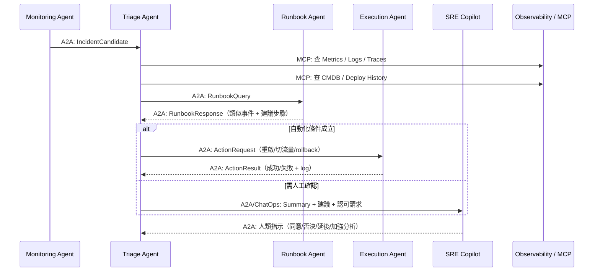
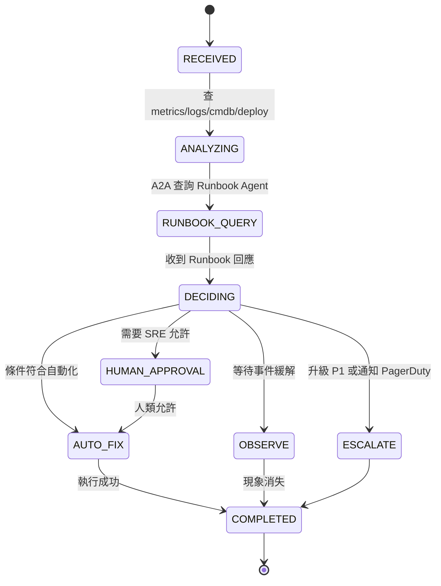

# ** Incident Triage Agent 模組設計**

## **1 模組定位與職責（Role & Responsibility）**

Incident Triage Agent 是整個「AI 驅動維運平台」的核心決策代理人，負責：

1. **事件接收（Incident Intake）**

   * 接收 Monitoring Agent 透過 A2A 發送的 `IncidentCandidate`
   * 與 Kafka 事件（如 metrics spike、error burst）同步使用作為 context

2. **事件分級（Severity Classification）**

   * 將事件分類為 P1/P2/P3
   * 依照服務重要性（CMDB）與影響面（log/metrics/traces）做判斷

3. **影響分析（Impact Assessment）**

   * 查 service dependency graph（CMDB）
   * 分析最近是否 Deploy / Config Change（Deploy History）

4. **知識查詢（via Runbook Agent）**

   * 使用 A2A 向 Runbook Agent 查詢相似事件 / Runbook 步驟 / Postmortem

5. **決策與建議（Decision Making）**

   * 決定是否要：

     * 自動化處置（呼叫 Execution Agent）
     * 升級通知 SRE Copilot Agent
     * 等待觀察（hold）
     * 人工審核後再進行

6. **後續動作（Action Dispatch via A2A）**

   * 向 Execution Agent 發出修復任務
   * 向 SRE Copilot 傳遞摘要、建議和風險提示
   * 與 Runbook Agent 保持資訊流

## **2 架構互動圖（Architecture Interaction）**



## **3 功能清單（Functional Requirements）**

| 編號    | 功能                    | 說明                                           |
| ----- | --------------------- | -------------------------------------------- |
| FR-01 | 接收 IncidentCandidate  | 經由 A2A，來源為 Monitoring Agent                  |
| FR-02 | 事件分級（P1/P2/P3）        | 綜合 metrics、traces、CMDB profile、錯誤率等          |
| FR-03 | 事件歸因（Root Cause Clue） | 分析 deploy history、pattern、service dependency |
| FR-04 | 查詢相關知識                | 透過 A2A 呼叫 Runbook Agent                      |
| FR-05 | 決策判斷                  | 是否自動化？是否人工介入？是否 escalate？                    |
| FR-06 | 下達自動化命令               | A2A 呼叫 Execution Agent                       |
| FR-07 | 通報人類                  | 交由 SRE Copilot（Slack/PagerDuty）              |
| FR-08 | 審計紀錄                  | 儲存 decision log / reasoning summary（合規）      |

## **4 技術棧 Mapping（依本系統架構）**

| 類別                      | 使用技術                                                   |
| ----------------------- | ------------------------------------------------------ |
| Framework               | Google ADK（Agent host）、A2A、MCP                         |
| Observability           | Prometheus、Loki、Jaeger/OTel                            |
| Data Streaming（context） | Apache Kafka                                           |
| Knowledge               | ITSM（歷史事件）、Runbook Agent（Confluence / Git / Vector DB） |
| Infra（資訊參考，不操作）         | CMDB、Deploy History                                    |
| Collaboration（下游）       | SRE Copilot（Slack、PagerDuty）                           |

## **5 MCP Tools 設計（Tool Contract）**

### 🎯 用於資料查詢（Read Tools）

| Tool Name             | Input                                 | Output                            | 功能               |
| --------------------- | ------------------------------------- | --------------------------------- | ---------------- |
| `cmdb_lookup_tool`    | service_name                          | dependency list<br>critical level | 判斷「服務重要度」與「依賴關係」 |
| `deploy_history_tool` | service_name<br>time_range            | deploy records                    | 判斷事故是否與最近部署相關    |
| `metrics_query_tool`  | service_name<br>window                | CPU/mem/latency/error_rate        | 補強 metrics 曲線    |
| `log_query_tool`      | service_name<br>pattern<br>time_range | 日誌樣本                              | 搜尋可能 root cause  |
| `trace_query_tool`    | trace_id / service                    | trace chain                       | 找出 bottleneck    |

> Triage Agent **不需**直接理解 PromQL / Elasticsearch DSL → MCP 工具做抽象化。

## **6 A2A 介面規格（Task ↔ Response Schema）**

### 📥 Input：`IncidentCandidate`（來自 Monitoring Agent）

```json
{
  "incident_id": "INC-2025-00092",
  "service": "policy-api",
  "timestamp": "2025-01-25T09:28:00Z",
  "symptoms": {
    "error_rate": "12%",
    "latency_p95": "920ms",
    "alert_source": ["prometheus", "log-pattern"]
  }
}
```

### 📤 Query：`RunbookQuery`（送給 Runbook Agent）

```json
{
  "incident_id": "INC-2025-00092",
  "service": "policy-api",
  "symptom_summary": "5xx error surge after recent deploy",
  "observed_metrics": {
    "latency_p95": "920ms",
    "error_rate": "12%"
  }
}
```
### 📥 Response：`RunbookResponse`

```json
{
  "incident_id": "INC-2025-00092",
  "similar_incidents": [
    { "id": "INC-2024-1021", "score": 0.82 },
    { "id": "INC-2024-0403", "score": 0.75 }
  ],
  "recommended_actions": [
    "Check DB connection pool saturation",
    "Rollback to previous deployment",
    "Inspect service mesh routing anomaly"
  ]
}
```

### 📤 Output：`ActionRequest`（送給 Execution Agent）

```json
{
  "incident_id": "INC-2025-00092",
  "service": "policy-api",
  "recommended_action": "rollback",
  "parameters": {
    "rollback_version": "2025.01.24-1"
  }
}
```

## **7 狀態機設計（State Machine）**



## **8 Decision Logic（Decision Matrix）**

| 條件                                 | 自動化     | 人工     | 升級    |
| ---------------------------------- | ------- | ------ | ----- |
| Error Rate > 20% + 近期部署            | ❌       | ✔（需確認） | ✔     |
| Error Rate 10%~20% + 無部署           | ✔       | ❌      | ❌     |
| Latency spike + Mesh routing issue | ✔       | ❌      | ❌     |
| DB connection saturation           | ⚠️（視風險） | ✔      | ❌     |
| 核心服務 + 依賴服務異常                      | ❌       | ✔      | ✔（P1） |

## **9 審計（Audit Log）定義**

每次決策要輸出：

* incident_id
* time
* involved_agents（Triage, Runbook, Execution）
* metrics snapshot
* reasoning summary
* action taken（or not taken）
* human approval?（true/false）

格式範例：

```json
{
  "incident_id": "INC-2025-00092",
  "decision": "rollback",
  "reasoning": "High 5xx surge after deploy; similar to INC-2024-1021.",
  "requires_human": false,
  "executed_by": "ExecutionAgent",
  "timestamp": "2025-01-25T09:33:21Z"
}
```

## **10 風險與防呆機制**

* 自動化需嚴格白名單
* 自動 rollback 必須檢查 `previous_version` 存在
* 決策不可單靠單一資料源（需 cross-source）
* 避免「把 noise 當事故」（需減噪校驗）
* 所有動作需可 audit
* 設計 human override（Kill switch）

***
[<< 上一篇：Monitoring Agent 設計](./06_monitoring-agent.md) | [返回目錄](./README.md) | [下一篇：Runbook/Knowledge Agent 設計 >>](./08_runbook-knowledge-agent.md)
