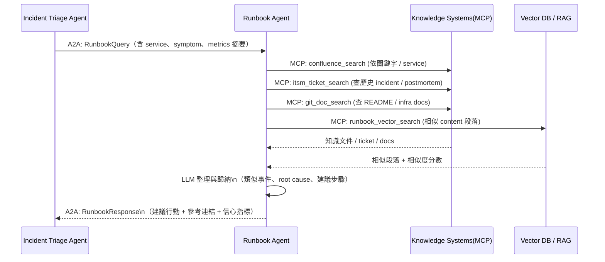
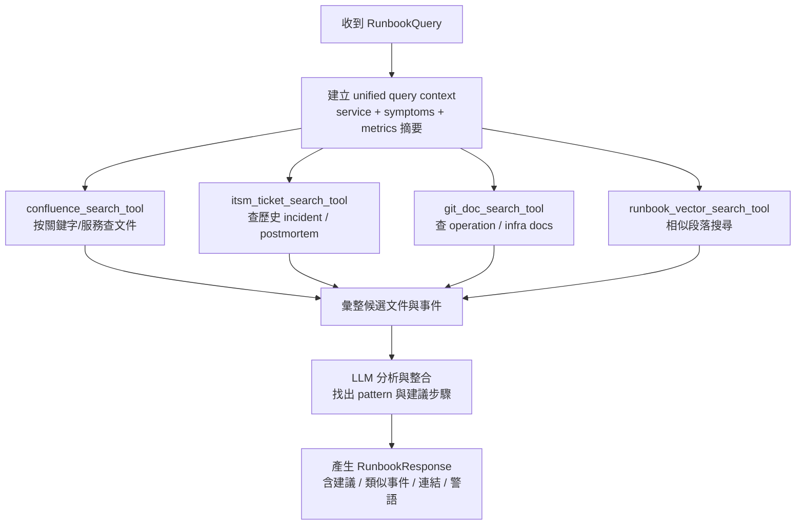
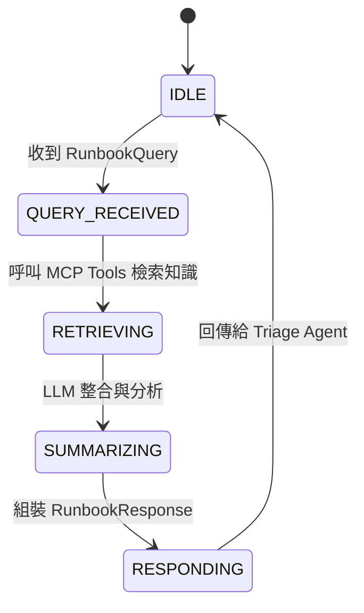

# ** Runbook / Knowledge Agent 模組設計**

## **1 模組定位與職責（Role & Responsibility）**

Runbook / Knowledge Agent（以下簡稱 Runbook Agent）
是整個維運多 Agent Mesh 中的「知識中樞」，負責把：

* **技術文件（Confluence / Wiki / Git Docs）**
* **歷史事件與 Postmortem（ITSM / Ticket 系統）**
* **結構化維運手冊（Runbook SOP）**
* **向量檢索結果（Vector DB / RAG）**

轉換成可被其他 Agent 直接使用的「**建議行動步驟 + 類似事件參考**」。

其主要職責：

1. **接收 Triage Agent 的查詢需求（RunbookQuery）**
2. **透過 MCP 調用各種知識來源**
3. **整合、比對並以 LLM 生成「建議處置方案」**
4. **將結果以 A2A 回傳給 Triage Agent（RunbookResponse）**
5. **提供可追溯的知識來源引用（evidence links）**

> 🔑 Runbook Agent 不直接操控任何 Infra，不會重啟服務、不做 rollback。
> 它只負責「查」與「說」，而不是「動手」。

---

## **2 架構互動圖（Architecture Interaction）**



---

## **3 功能清單（Functional Requirements）**

| 編號    | 功能              | 說明                                            |
| ----- | --------------- | --------------------------------------------- |
| FR-01 | 接收 RunbookQuery | 來自 Triage Agent 的 A2A 任務                      |
| FR-02 | 知識檢索            | 依 symptom / service / error pattern 查詢文件與歷史事件 |
| FR-03 | 相似事件比對          | 找出過去類似 incident（ITSM / Vector DB）             |
| FR-04 | 建議步驟生成          | 將多個來源整理為具體 step-by-step 建議                    |
| FR-05 | 提供依據與連結         | 回傳參考文件 URL / Ticket 編號 / Postmortem ID        |
| FR-06 | 信心與限制說明         | 提供建議可信度、適用條件、警語                               |
| FR-07 | 審計與查詢紀錄         | 保留 Runbook 查詢與回應紀錄，供日後優化與稽核                   |

---

## **4 技術棧 Mapping**

| 類別                | 使用技術                                                                              |
| ----------------- | --------------------------------------------------------------------------------- |
| Framework         | Google ADK（Agent host）、A2A、MCP                                                    |
| 知識來源              | Confluence / Wiki / SharePoint、ITSM（ServiceNow / Jira SM）、Git Repo Docs、Vector DB |
| Observability（輔助） | 少量 log sample / metrics snippet（作為 prompt context，可由 MCP 取）                       |
| Data Streaming    | 一般不直接訂閱 Kafka（只透過 Triage Agent 提供的摘要）                                             |
| Infra 操作          | 不使用（零動作，只讀）                                                                       |
| Collaboration     | 不直接與人互動，由 SRE Copilot 來呈現結果給人類                                                    |

---

## **5 MCP Tools 設計（Tool Spec）**

### 🧭 1. `confluence_search_tool`

* **用途**：搜尋內部文件（Runbook、架構說明、FAQ）
* **Input（示意）**：

```json
{
  "query": "policy-api 5xx after deploy",
  "space": "SRE-RUNBOOK",
  "max_results": 5
}
```

* **Output（示意）**：

```json
{
  "results": [
    {
      "title": "policy-api 服務故障處置手冊",
      "url": "https://confluence/.../policy-api-runbook",
      "snippet": "當 5xx 大量增加時，請先檢查..."
    }
  ]
}
```

---

### 🧭 2. `itsm_ticket_search_tool`

* **用途**：搜尋歷史 incident / 問題單 / Postmortem
* **Input**：

```json
{
  "service": "policy-api",
  "symptom": "5xx surge",
  "time_range": "P1Y",
  "max_results": 10
}
```

* **Output**：

```json
{
  "tickets": [
    {
      "id": "INC-2024-1021",
      "summary": "policy-api 5xx after rollout",
      "status": "resolved",
      "resolution": "rollback + DB pool tuning"
    }
  ]
}
```

---

### 🧭 3. `git_doc_search_tool`

* **用途**：查詢 repo 中的 README / docs / infra 說明檔
* **Input**：

```json
{
  "service": "policy-api",
  "path_patterns": ["docs/**", "infra/**", "README*"],
  "keywords": ["db pool", "timeout", "circuit breaker"]
}
```

* **Output**：

```json
{
  "files": [
    {
      "path": "docs/policy-api/operation.md",
      "snippet": "調整 connection pool 須注意..."
    }
  ]
}
```

---

### 🧭 4. `runbook_vector_search_tool`

* **用途**：以向量方式搜索「相似事件 / 相似 Runbook 段落」
* **Input**：

```json
{
  "query_text": "policy-api 5xx surge after deploy, DB connection timeout",
  "top_k": 5
}
```

* **Output**：

```json
{
  "matches": [
    {
      "id": "rb_2024_001",
      "score": 0.87,
      "content": "部署後 5xx 暴增時，請先檢查 DB 連線池...",
      "source": "confluence://..."
    }
  ]
}
```

---

## **6 A2A 訊息規格（與 Triage Agent 的互動）**

### 📥 Input：`RunbookQuery`（來自 Triage Agent）

```json
{
  "incident_id": "INC-2025-00092",
  "service": "policy-api",
  "symptom_summary": "5xx surge 10 mins after deploy",
  "observed_metrics": {
    "latency_p95": "920ms",
    "error_rate": "12%"
  },
  "hint": [
    "recent_deploy:true",
    "db_timeout_pattern_detected:true"
  ]
}
```

---

### 📤 Output：`RunbookResponse`（回給 Triage Agent）

```json
{
  "incident_id": "INC-2025-00092",
  "summary": "本次事件與過去 policy-api 部署後 DB 連線池容量不足情境高度相似。",
  "confidence": 0.84,
  "similar_incidents": [
    {
      "id": "INC-2024-1021",
      "similarity": 0.82,
      "summary": "部署後 5xx surge，DB pool 用盡",
      "link": "https://itsm/.../INC-2024-1021"
    }
  ],
  "recommended_actions": [
    "檢查 DB connection pool 使用率與 max pool size 配置。",
    "暫時 rollback 至前一個版本：2025.01.24-1。",
    "如 rollback 後恢復正常，安排後續調整 DB pool 設定。"
  ],
  "supporting_documents": [
    {
      "title": "policy-api 故障處置手冊",
      "url": "https://confluence/.../policy-api-runbook"
    },
    {
      "title": "DB 連線池調校指引",
      "url": "https://confluence/.../db-pool-tuning"
    }
  ],
  "warnings": [
    "Rollback 前請確認新版本無 schema migration。",
    "若使用金絲雀流量，需同步檢查 mesh routing 設定。"
  ]
}
```

---

## **7 檢索與生成流程（Retrieval & Generation Flow）**



---

## **8 狀態機設計（State Machine）**



---

## **9 品質與風險控制（Quality & Risks）**

* **避免「亂猜」**：

  * 若檢索結果不足，需回傳「低信心」並清楚說明限制
* **知識時效性**：

  * 透過 metadata 篩選「過舊」或「已標記過時」的文件
* **來源多元性**：

  * 優先結合：Runbook + ITSM + Git Docs，再做 LLM 統整
* **避免執行建議直接變成「命令」**：

  * Runbook Agent 只給建議，不下任何動作命令
  * 是否採用由 Triage / Execution / 人類決定
* **審計需求**：

  * 每次查詢要記錄：用到哪些文件、tickets、向量結果

---

## **10 Audit Log 設計**

每次 Runbook 查詢需紀錄：

* incident_id
* query_context（service、symptom、metrics 摘要）
* 檢索到的文件 / tickets / 向量 match id
* 生成的建議內容摘要
* 回傳時間與耗時
* 信心分數

範例：

```json
{
  "incident_id": "INC-2025-00092",
  "query_context": {
    "service": "policy-api",
    "symptom_summary": "5xx surge 10 mins after deploy"
  },
  "used_sources": {
    "confluence_docs": ["doc_123", "doc_456"],
    "itsm_tickets": ["INC-2024-1021"],
    "vector_matches": ["rb_2024_001"]
  },
  "response_confidence": 0.84,
  "timestamp": "2025-01-25T09:31:10Z"
}
```

***
[<< 上一篇：Incident Triage Agent 設計](./07_Incident-triage-agent.md) | [返回目錄](./README.md) | [下一篇：Execution/Automation Agent 設計 >>](./09_execution-agent.md)
