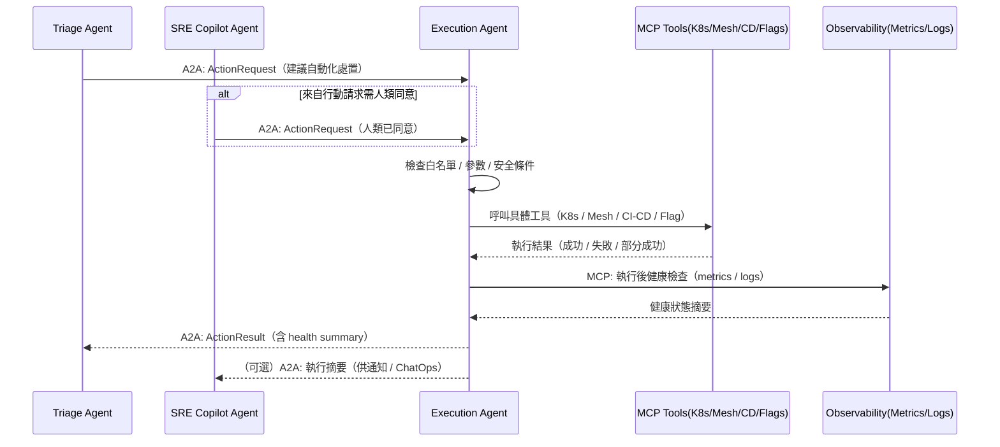
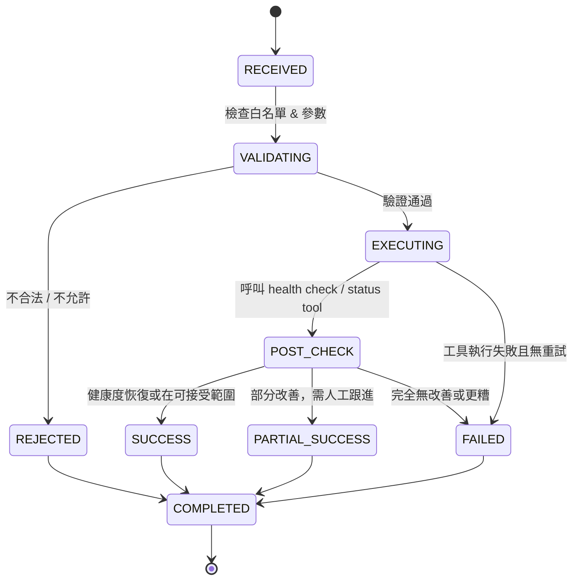

# Execution / Automation Agent 模組設計

## **1. 模組定位與職責（Role & Responsibility）**

Execution Agent 是「會真的動手」的維運代理人，負責**將決策變成實際動作**，但本身**不做事件分級／判斷事故嚴重性**。

核心職責：

1. **接收行動請求（ActionRequest）**

   * 主要來自 Incident Triage Agent（經過決策後）
   * 也可能來自 SRE Copilot（人類下指令，由 Copilot 轉交）

2. **前置檢查（Pre-check）**

   * 確認動作在白名單內
   * 檢查參數合理性（版本存在？service 名稱有效？）
   * 檢查目前系統狀態（例如：已經在 rollback 中就不要再 rollback）

3. **執行自動化動作（Execution）**

   * K8s scaling / restart / drain node
   * Service Mesh 流量切換 / 金絲雀 rollback
   * CI/CD rollback 或重新部署
   * Feature Flag 開關
   * 預定義 script（Runbook automation）

4. **後置驗證（Post-check / Health Check）**

   * 呼叫 Prometheus / Observability 工具查看健康狀態是否改善
   * 決定標記為成功／部分成功／失敗

5. **結果回報（ActionResult 回傳）**

   * 透過 A2A 回傳給 Triage Agent
   * 由 Triage Agent 或 SRE Copilot 轉成對人類可讀的說明

6. **安全與審計（Security & Audit）**

   * 每個動作必須有完整 audit log
   * 僅能呼叫預先註冊且通過審核的 MCP Tools
   * 支援「Kill Switch」機制（可總體關掉自動化）

---

## **2. 架構互動圖（Architecture Interaction）**



---

## **3. 功能清單（Functional Requirements）**

| 編號    | 功能               | 說明                                      |
| ----- | ---------------- | --------------------------------------- |
| FR-01 | 接收 ActionRequest | 經由 A2A，從 Triage / SRE Copilot 收到行動請求    |
| FR-02 | 驗證動作合法性          | 檢查 action type 是否在白名單、權限是否允許            |
| FR-03 | 參數檢核             | 檢查 service 名稱、版本號、flag key 等是否合法        |
| FR-04 | 執行自動化動作          | 呼叫 MCP 工具對 K8s / Mesh / CI/CD / Flag 操作 |
| FR-05 | 執行後健康檢查          | 檢查關鍵 metrics / logs 是否回到可接受範圍           |
| FR-06 | 回傳 ActionResult  | 對 Triage Agent 回報執行結果，供後續判斷             |
| FR-07 | 失敗回復與重試策略        | 適當重試與回報失敗資訊                             |
| FR-08 | 完整審計紀錄           | 記錄所有執行動作與入參／結果，供稽核使用                    |

---

## **4. 技術棧 Mapping**

| 類別             | 使用技術                                                   |
| -------------- | ------------------------------------------------------ |
| Framework / 協議 | Google ADK、A2A Protocol、MCP                            |
| Observability  | Prometheus（健康檢查）、Loki/ELK（錯誤 log 確認）                   |
| Infra 自動化      | Kubernetes、Service Mesh、CI/CD Pipeline、Feature Flag 平台 |
| Knowledge      | 不直接查知識庫（僅參考參數與輸入）                                      |
| Collaboration  | 不直接對人類互動，由 Triage / SRE Copilot 對外呈現                   |

---

## **5. MCP Tools 設計（Tool Contract）**

### 🛠 控制類工具（Write / Action Tools）

| Tool Name                  | Input                                           | Output                          | 用途                                     |
| -------------------------- | ----------------------------------------------- | ------------------------------- | -------------------------------------- |
| `k8s_rollout_restart_tool` | service_name<br>namespace                       | status（success/fail）<br>message | 對特定 Deployment/StatefulSet 做滾動重啟       |
| `k8s_scale_tool`           | service_name<br>namespace<br>replicas           | status<br>current_replicas      | 調整 service 的副本數                        |
| `mesh_route_update_tool`   | service_name<br>target_version<br>traffic_split | status                          | 調整 Service Mesh 內的流量比例（例如金絲雀 rollback） |
| `cd_rollback_tool`         | service_name<br>rollback_version                | status<br>pipeline_url          | 觸發 CI/CD 系統進行 rollback                 |
| `feature_flag_toggle_tool` | flag_key<br>target_value                        | status<br>current_value         | 開啟/關閉某個 feature flag                   |
| `run_script_tool`          | script_id<br>parameters                         | status<br>output_snippet        | 執行預先註冊好的維運 Script（不可任意命令）              |

### 👀 檢查類工具（Read / Check Tools）

| Tool Name                   | Input                   | Output                                      | 用途                   |
| --------------------------- | ----------------------- | ------------------------------------------- | -------------------- |
| `service_health_check_tool` | service_name<br>window  | latency / error_rate / availability         | 檢查服務健康狀態             |
| `deployment_status_tool`    | service_name<br>version | current_status<br>replicas<br>error_message | 確認部署是否完成、是否有異常       |
| `flag_status_tool`          | flag_key                | current_value                               | 確認 feature flag 目前狀態 |

---

## **6. A2A 介面規格**

### 📥 Input：`ActionRequest`

來源：Triage Agent 或 SRE Copilot Agent

```json
{
  "incident_id": "INC-2025-00092",
  "request_id": "AR-2025-00123",
  "source": "TriageAgent",
  "service": "policy-api",
  "action_type": "rollback",
  "parameters": {
    "rollback_version": "2025.01.24-1"
  },
  "constraints": {
    "require_health_check": true,
    "max_duration_sec": 300,
    "retry_policy": "NO_RETRY"
  },
  "human_approved": true
}
```

---

### 📤 Output：`ActionResult`

回傳對象：Triage Agent（必要）、可選通知 SRE Copilot

```json
{
  "incident_id": "INC-2025-00092",
  "request_id": "AR-2025-00123",
  "status": "SUCCESS",
  "steps": [
    {
      "tool": "cd_rollback_tool",
      "status": "SUCCESS",
      "detail": "Rollback to 2025.01.24-1 completed."
    },
    {
      "tool": "service_health_check_tool",
      "status": "SUCCESS",
      "detail": "Error rate back to 0.5%, latency p95 220ms."
    }
  ],
  "health_summary": {
    "before": { "error_rate": "12%", "latency_p95": "920ms" },
    "after":  { "error_rate": "0.5%", "latency_p95": "220ms" }
  },
  "timestamp": "2025-01-25T09:33:21Z"
}
```

---

## **7. 狀態機設計（State Machine）**



---

## **8. 動作白名單與風險分級（Action Whitelist & Risk Level）**

| 動作類型                   | 典型工具                       | 風險等級 | 是否允許自動執行    | 備註                 |
| ---------------------- | -------------------------- | ---- | ----------- | ------------------ |
| 重啟單一 stateless service | `k8s_rollout_restart_tool` | 中    | 可自動         | 須確認有多副本、無 state 依賴 |
| 擴容（scale out）          | `k8s_scale_tool`           | 中    | 可自動         | 有 cost 但風險低        |
| 降容（scale in）           | `k8s_scale_tool`           | 中高   | 一般需人工批准     | 避免誤殺流量             |
| 金絲雀 rollback           | `mesh_route_update_tool`   | 中    | 可自動         | 滾回上一穩定版本           |
| CI/CD rollback         | `cd_rollback_tool`         | 高    | 預設需人工批准     | 涉及版本切換             |
| 關閉高風險 Feature          | `feature_flag_toggle_tool` | 低    | 可自動         | 有利快速降低風險           |
| 執行自訂 Script            | `run_script_tool`          | 高    | 嚴格限制 & 人工批准 | 僅限白名單 Script       |

---

## **9. 審計與紀錄（Audit & Logging）**

每一次 ActionRequest 處理需紀錄：

* request_id, incident_id
* source（Triage / Copilot）
* action_type, parameters（遮蔽敏感資訊）
* 前後健康狀態（metrics snapshot）
* 是否有人類批准、人類帳號
* 每一步工具呼叫結果（tool name / status / duration）
* 最終結論（SUCCESS / PARTIAL / FAILED / REJECTED）

範例 audit record：

```json
{
  "request_id": "AR-2025-00123",
  "incident_id": "INC-2025-00092",
  "source": "TriageAgent",
  "human_approved": true,
  "actions": [
    {
      "tool": "cd_rollback_tool",
      "status": "SUCCESS",
      "started_at": "2025-01-25T09:30:00Z",
      "ended_at": "2025-01-25T09:31:45Z"
    }
  ],
  "health_before": { "error_rate": "12%", "latency_p95": "920ms" },
  "health_after": { "error_rate": "0.5%", "latency_p95": "220ms" },
  "final_status": "SUCCESS",
  "logged_at": "2025-01-25T09:33:21Z"
}
```

---

## **10. 安全控制與 Kill Switch**

* **Policy-based Control**：

  * 不同環境（DEV/UAT/PROD）允許的 action type 不同
  * 不同服務（核心帳務 vs 周邊服務）需要不同批准流程

* **Kill Switch 機制**：

  * 可針對整個 Execution Agent 停用自動執行，只允許「產生建議但不執行」
  * 可針對某些高風險 tool 暫時禁用

* **Rate Limit**：

  * 限制在一定時間內執行的動作數量，避免「瘋狂 rollback / 重啟」

***
[<< 上一篇：Runbook/Knowledge Agent 設計](./08_runbook-knowledge-agent.md) | [返回目錄](./README.md) | [下一篇：SRE Copilot Agent 設計 >>](./10_sre-copilot-agent.md)
