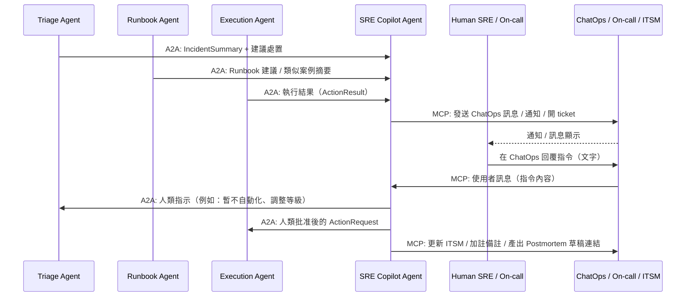
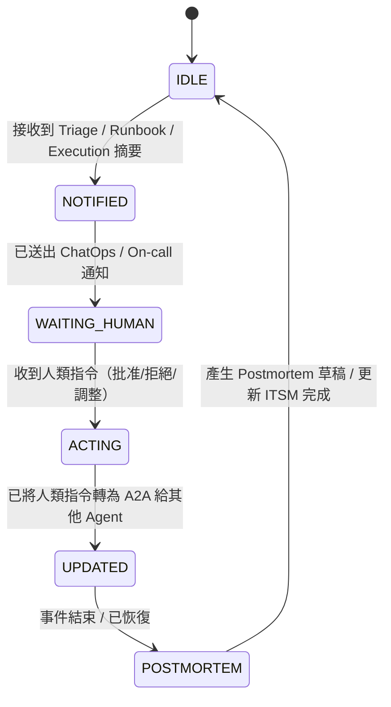

# ** SRE Copilot Agent 模組設計**

## **1 模組定位與職責（Role & Responsibility）**

SRE Copilot Agent 是整個「AI 維運多 Agent 平台」中 **唯一面向人類工程師的入口 Agent**，負責：

1. **事件與決策摘要呈現**

   * 將 Monitoring / Triage / Runbook / Execution Agents 的輸入與輸出整理成**可閱讀、可行動**的摘要
   * 以 ChatOps（Slack / Teams）或 Portal 方式提供給 On-call / SRE / 主管

2. **人類指令接收與轉譯**

   * 接收 SRE 在 ChatOps 中的指令（例如：`同意 rollback`、`只觀察不要動`）
   * 將自然語言意圖轉換成結構化 A2A 任務，發送給 Triage / Execution Agent

3. **通報與升級（Escalation & Notification）**

   * 透過 PagerDuty / Opsgenie 等 On-call 系統觸發值班通知
   * 協助建立 / 更新 ITSM incident / problem / change ticket

4. **Postmortem 與知識沉澱**

   * 事件結束後，彙整各 Agent 的證據（metrics/logs/runbook/action）
   * 協助產生 Postmortem 初稿，並推送到 ITSM / Confluence

5. **合規與風險提示**

   * 對所有「可能有風險的自動化建議」加上清楚提示
   * 確保文字敘述符合組織的資安與合規要求（尤其金融業）

> 簡單講：**其他 Agent 面向「系統」，SRE Copilot 面向「人」**，是人機協作的關鍵樞紐。

---

## **2 架構互動圖（Architecture Interaction）**



---

## **3 功能清單（Functional Requirements）**

| 編號    | 功能            | 說明                                             |
| ----- | ------------- | ---------------------------------------------- |
| FR-01 | 接收多 Agent 摘要  | 接收 Triage / Runbook / Execution Agent 的事件摘要與結果 |
| FR-02 | 人類可讀摘要生成      | 將技術細節轉成清楚、分層的事件摘要與建議                           |
| FR-03 | ChatOps 通知    | 將摘要發送到 Slack / Teams 指定頻道或 DM 給值班人員            |
| FR-04 | On-call 觸發    | 必要時觸發 PagerDuty / Opsgenie 通知                  |
| FR-05 | 指令解析          | 將 SRE 在 ChatOps 輸入的自然語言解析為具體意圖與動作              |
| FR-06 | A2A 指令發送      | 依指令向 Triage / Execution 等 Agent 發送 A2A 任務      |
| FR-07 | ITSM 整合       | 建立 / 更新 incident ticket、附上 AI 分析與決策 log        |
| FR-08 | Postmortem 協助 | 事故結束後產出 Postmortem 初稿，交由人類修訂                   |
| FR-09 | 審計紀錄          | 保留 SRE Copilot 對人類與其他 Agent 的所有互動紀錄            |

---

## **4 技術棧 Mapping**

| 類別                       | 使用技術                                                                                          |
| ------------------------ | --------------------------------------------------------------------------------------------- |
| Framework / 協定           | Google ADK、A2A Protocol、MCP                                                                   |
| Data / Observability（間接） | 從 Triage / Runbook / Execution 的輸出中取得摘要，不直接查 metrics/logs                                     |
| Knowledge / ITSM         | ITSM API（incident / problem / change）、Confluence / Wiki（Postmortem 存放處）                       |
| Collaboration            | Slack / Microsoft Teams（ChatOps）、PagerDuty / Opsgenie（On-call）、Dashboard（Grafana / Kibana 連結） |

---

## **5 MCP Tools 設計（Tool Contract）**

### 🎯 ChatOps / 通知相關

| Tool Name                         | Input                                  | Output          | 功能                              |
| --------------------------------- | -------------------------------------- | --------------- | ------------------------------- |
| `chatops_post_tool`               | channel / user<br>message payload（含格式） | success / error | 將事件摘要、建議、執行結果發送到 Slack/Teams    |
| `chatops_fetch_messages_tool`（可選） | channel / time_range                   | message 列表      | 取得近期人類回覆，用於指令解析（或透過 webhook 觸發） |

### 🎯 On-call / ITSM / Postmortem

| Tool Name                   | Input                                                 | Output               | 功能                                   |
| --------------------------- | ----------------------------------------------------- | -------------------- | ------------------------------------ |
| `oncall_trigger_tool`       | incident_id<br>severity<br>summary                    | ack / error          | 觸發 PagerDuty / Opsgenie 事件           |
| `itsm_create_incident_tool` | incident summary<br>impact / urgency<br>相關 link       | ticket_id            | 建立 incident ticket                   |
| `itsm_update_incident_tool` | ticket_id<br>update content                           | success / error      | 更新 ticket 內容（加上 AI 分析記錄）             |
| `postmortem_builder_tool`   | incident timeline<br>metrics summary<br>actions taken | postmortem draft url | 於 Confluence/Wiki 建立 Postmortem 草稿頁面 |

---

## **6 A2A 介面規格（與其他 Agent）**

### 1️⃣ 從 Triage Agent 接收事件摘要

**Message Type：`TriageSummary`**

```json
{
  "incident_id": "INC-2025-00901",
  "severity": "P2",
  "service": "policy-api",
  "summary": "5xx error surge observed; auto-remediation suggested.",
  "auto_fix_suggestion": "rollback",
  "risk_flags": ["核心服務", "近期部署"]
}
```

---

### 2️⃣ 從 Runbook Agent 接收建議摘要

**Message Type：`RunbookDigest`**

```json
{
  "incident_id": "INC-2025-00901",
  "similar_incidents": [
    { "id": "INC-2024-0203", "score": 0.81 }
  ],
  "key_learnings": [
    "過去為 DB connection pool 設定不足",
    "rollback 可快速緩解，但需後續調參"
  ],
  "recommended_steps": [
    "Step 1: 檢查 DB 連線數與等待隊列",
    "Step 2: 視情況執行 rollback",
    "Step 3: 事件後調整 pool 設定與負載測試"
  ]
}
```

---

### 3️⃣ 從 Execution Agent 接收執行結果

**Message Type：`ActionResult`**

```json
{
  "incident_id": "INC-2025-00901",
  "action": "rollback",
  "status": "SUCCESS",
  "details": "Rollback to version 2025.01.23-2 completed.",
  "verification_metrics": {
    "error_rate": "0.5%",
    "latency_p95": "180ms"
  }
}
```

---

### 4️⃣ 從人類指令轉為 A2A 給其他 Agent

**範例：人類在 Slack 輸入**：

> 「看起來是最近 deploy 有問題，先 rollback，但要幫我開 incident。」

SRE Copilot 解析後：

**A2A to Execution Agent：`HumanActionRequest`**

```json
{
  "incident_id": "INC-2025-00901",
  "requested_by": "sre_user_123",
  "action": "rollback",
  "parameters": {
    "target_version": "2025.01.23-2"
  },
  "justification": "Human-approved rollback due to high 5xx after deploy."
}
```

**A2A to Triage Agent（可選）：`HumanDecisionOverride`**

```json
{
  "incident_id": "INC-2025-00901",
  "decision": "ESCALATE",
  "requested_by": "sre_user_123",
  "note": "請提升為 P1 並持續監控。"
}
```

---

## **7 狀態機設計（State Machine）**



---

## **8 人機互動流程（UX / ChatOps Flow）**

**典型對話腳本示例：**

1. SRE Copilot 在 Slack 發送：

> 「🔔 事件 INC-2025-00901（P2）\n服務：policy-api
> 現象：5xx error surge after deploy
> 建議步驟：\n1) 檢查 DB pool 狀況\n2) 考慮 rollback\n\n你可以輸入：`同意 rollback`、`先觀察`、`升級 P1 並叫人`」

2. 人類 SRE 回覆：

> `同意 rollback，並幫我開 incident`

3. SRE Copilot 動作：

* 觸發：Execution Agent 的 rollback A2A
* 觸發：ITSM incident create
* 回報至同一個 Slack thread：

  > 「✅ 已執行 rollback 至 2025.01.23-2，初步指標恢復正常。
  > ✅ 已建立 ITSM ticket：INC-IT-2025-10023」

---

## **9 審計與合規考量**

SRE Copilot Agent 的所有互動需**完整留痕**，特別是：

* 哪位人類下了什麼指令
* 指令被如何轉譯為哪一個 A2A 任務
* 對應 Execution/Triage 的結果怎麼樣
* 發出了哪些通知 / 開了哪些 ticket
* 文字描述需避免誤導（金融業對外說法與對內說法也需區隔）

可考慮設計：

* `copilot_audit_log` index / topic
* 審計欄位：`user_id`, `command_text`, `parsed_intent`, `dispatched_actions`, `timestamp`

---

## **10 風險控管與防呆**

* 對於高風險指令（例如：大量刪除、停服務），即使人類下指令，也須再二次確認（例如要求附加 `CONFIRM` 字樣）
* 不允許 SRE Copilot 自行捏造不曾執行的動作或結果（嚴禁「幻想」）
* 必須明確標註：

  * 「已執行」、「預計執行」、「建議但尚未執行」 的差異
* 必須支援「人工糾正」：

  * 若 SRE 指出判讀錯誤，需記錄並用於後續調整（在人類回饋管線中）

***
[<< 上一篇：Execution/Automation Agent 設計](./09_execution-agent.md) | [返回目錄](./README.md) | [下一篇：總結 >>](./11_summary.md)
