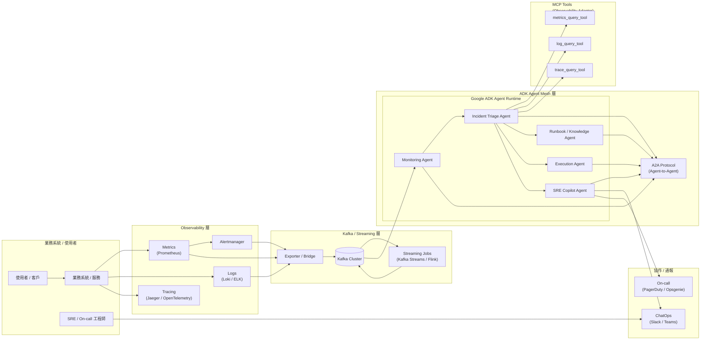

[<< 上一篇：SRE Copilot Agent 設計](./10_sre-copilot-agent.md) | [返回目錄](./README.md)
***

## 1️⃣ 架構全圖

## 重點說明

1. **左上**是既有的業務系統與使用者（APP、USER），
   下方是既有的 **Observability 堆疊**（Prometheus、Loki、Jaeger、Alertmanager）。

2. Observability 資料經過 **Exporter / Bridge** 匯入 **Kafka**，
   由 **Streaming Job（Kafka Streams / Flink）** 進行降噪與聚合，
   形成比較乾淨的「事件流」。

3. **Google ADK Agent Mesh 層**：

   * 多個 Agent（Monitoring / Triage / Runbook / Execution / SRE Copilot）
   * 都跑在 ADK Runtime 上。
   * 彼此透過 **A2A Protocol** 來做 **Agent-to-Agent 任務協作**。

4. **Monitoring Agent** 從 Kafka 訂閱事件，做第一層判斷後交給 **Incident Triage Agent**。

5. **Incident Triage Agent** 是決策中樞：

   * 一方面透過 MCP Tools 直接查 **Observability**（metrics/logs/traces），
   * 一方面透過 A2A 找 **Runbook Agent** 要知識、
   * 再透過 A2A 呼叫 **Execution Agent** 做自動修復，
   * 同時把結果與建議送到 **SRE Copilot Agent**。

6. **SRE Copilot Agent** 最後透過 **ChatOps / On-call 系統** 把事件摘要與決策建議呈現給 **SRE 值班工程師**，形成完整的人機協作閉環。
