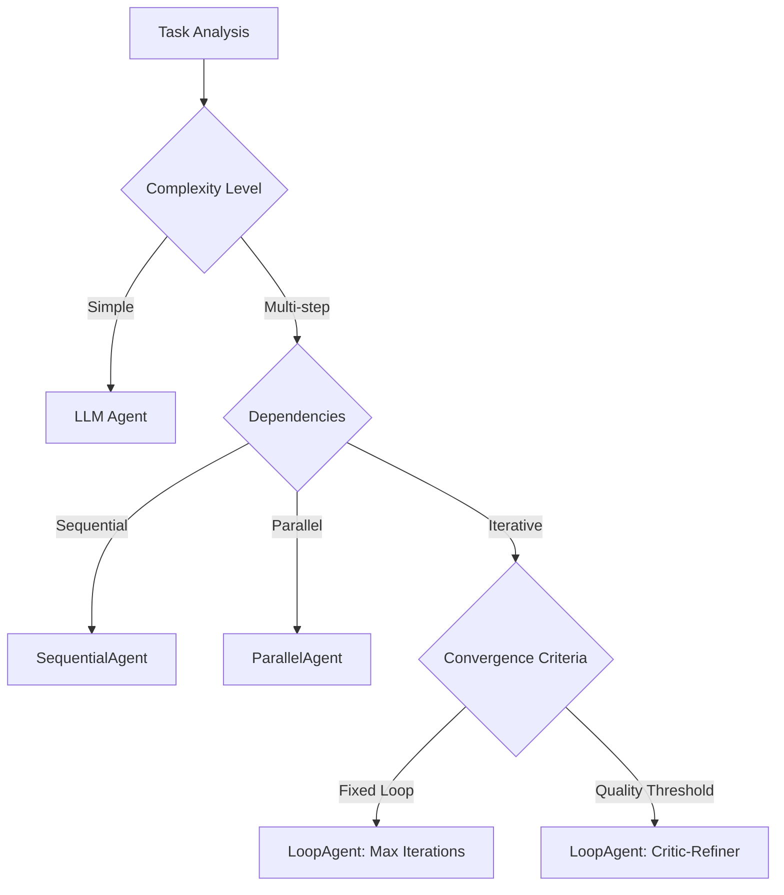
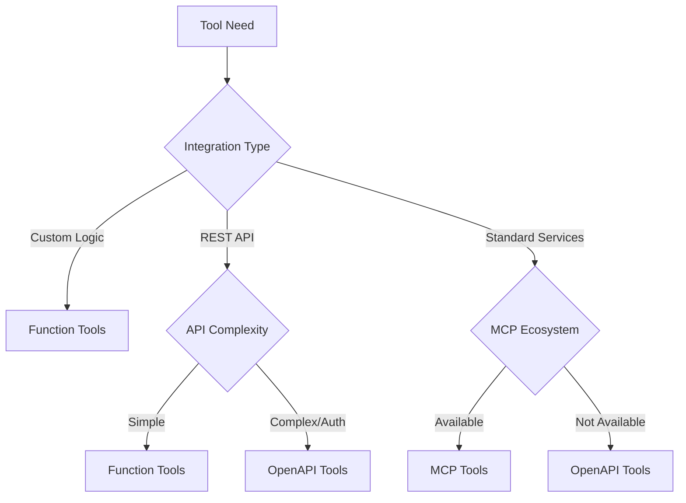
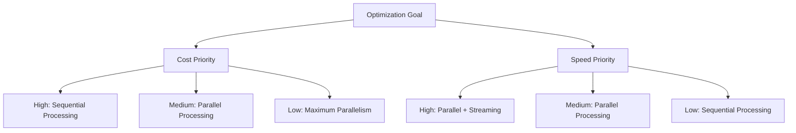
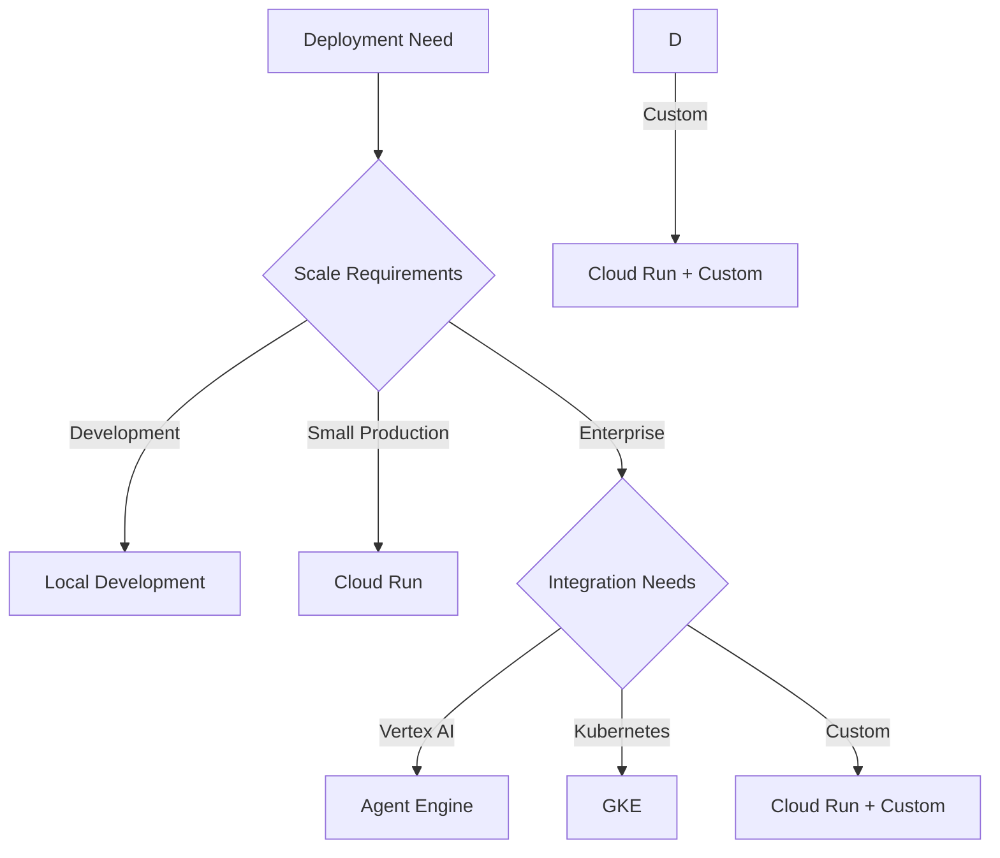
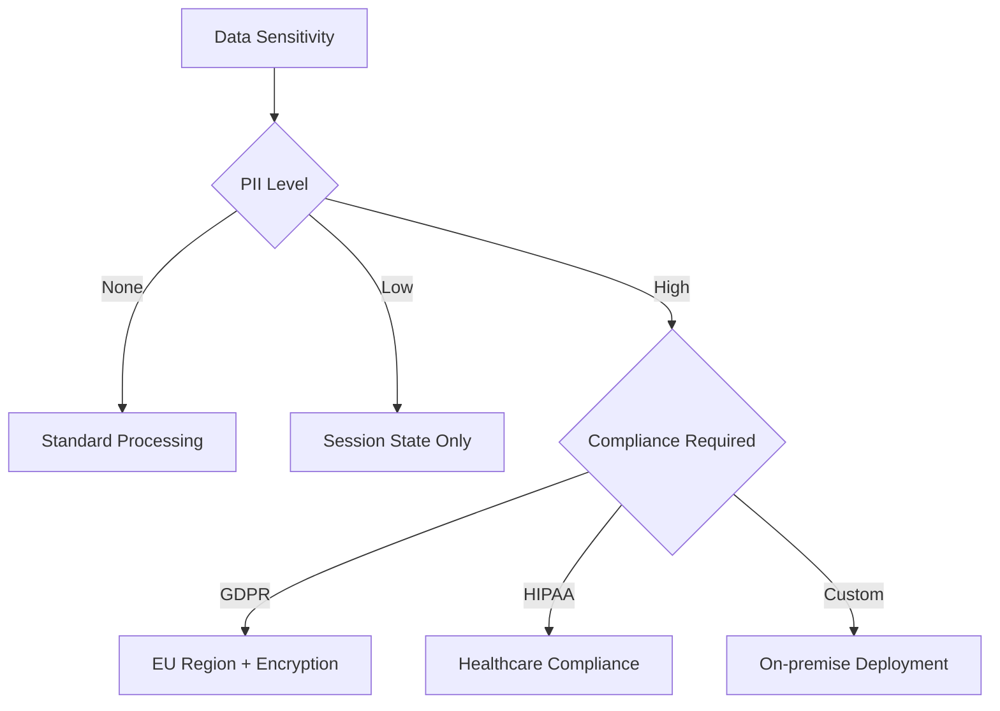
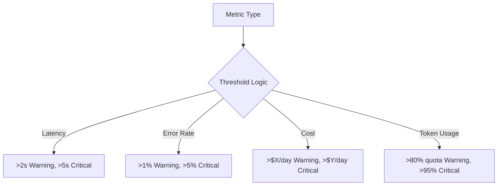

# Decision Frameworks (決策框架)

本文檔旨在指導 ADK (Agent Development Kit) 實施過程中的策略性決策，涵蓋了模式、工具與部署策略的選擇。

## 目錄 (Table of Contents)

1.  [Pattern Selection Framework (模式選擇框架)](#pattern-selection-framework-模式選擇框架)
    *   選擇正確的代理類型
2.  [Tool Selection Matrix (工具選擇矩陣)](#tool-selection-matrix-工具選擇矩陣)
    *   Function vs OpenAPI vs MCP 工具
3.  [Performance Optimization (性能優化)](#performance-optimization-性能優化)
    *   成本與速度的權衡
4.  [Deployment Strategy (部署策略)](#deployment-strategy-部署策略)
    *   選擇本地、雲端或託管部署
5.  [Security & Compliance (安全性與合規性)](#security--compliance-安全性與合規性)
    *   保護代理與資料
6.  [Monitoring & Observability (監控與可觀測性)](#monitoring--observability-監控與可觀測性)
    *   追蹤生產環境中的性能
7.  [Implementation Checklist (實施清單)](#implementation-checklist-實施清單)
    *   逐步部署指南

---

## Pattern Selection Framework (模式選擇框架)

### Agent Type Decision Tree (代理類型決策樹)

此決策樹有助於根據任務的複雜性與依賴性選擇最適合的代理類型。

### When to Use Each Agent Type (各種代理類型的使用時機)

| Agent Type | When to Use (使用時機) | Example Use Cases (使用案例) |
| :--- | :--- | :--- |
| **LLM Agent** | 單一步驟任務、純粹的推理 | 問答、分析、簡單分類 |
| **SequentialAgent** | 有序的依賴關係、管道式工作流程 | 資料處理 → 分析 → 報告 |
| **ParallelAgent** | 獨立任務、速度優化 | 多來源資料收集、平行分析 |
| **LoopAgent** | 迭代優化、品質改進 | 程式碼審查、內容編輯、最佳化 |

---

## 🔧 Tool Selection Matrix (工具選擇矩陣)

### Function Tools vs OpenAPI vs MCP

此圖表幫助您在 Function Tools、OpenAPI 和 MCP (Model Context Protocol) 之間做出選擇。

### Tool Decision Criteria (工具決策標準)

| Criteria (標準) | Function Tools | OpenAPI Tools | MCP Tools |
| :--- | :--- | :--- | :--- |
| **Development Speed (開發速度)** | 最快 | 中等 | 最慢 |
| **Maintenance (維護成本)** | 最高 | 中等 | 最低 |
| **Flexibility (靈活性)** | 最大 | 有限 | 中等 |
| **Interoperability (互操作性)** | 無 | 有限 | 最大 |
| **Security (安全性)** | 自訂 | API Keys | 內建 |

---

## ⚡ Performance Optimization (性能優化)

### Cost vs Speed Trade-offs (成本與速度的權衡)

根據您的優化目標（成本優先或速度優先）來選擇處理模式。

### Model Selection Guide (模型選擇指南)

| Use Case (使用案例) | Recommended Model (推薦模型) | Reasoning (原因) |
| :--- | :--- | :--- |
| **Fast Responses (快速回應)** | `gemini-2.0-flash` | 速度優化、成本效益高 |
| **Complex Reasoning (複雜推理)** | `gemini-2.0-flash-thinking` | 內建的思維鏈 (Chain-of-Thought) |
| **Code Generation (程式碼生成)** | `gemini-2.0-flash` | 強大的編碼能力 |
| **Multimodal (多模態)** | `gemini-2.0-flash` | 支援視覺、音訊、視訊 |
| **Live Interaction (即時互動)** | `gemini-2.0-flash-live` | 即時串流 |

---

## 🚀 Deployment Strategy Matrix (部署策略矩陣)

### Environment Selection (環境選擇)

根據部署需求與規模選擇合適的環境。

### Deployment Decision Factors (部署決策因素)

| Factor (因素) | Local (本地) | Cloud Run | Agent Engine | GKE |
| :--- | :--- | :--- | :--- | :--- |
| **Setup Time (設定時間)** | 最快 | 快 | 中等 | 最慢 |
| **Scaling (擴展性)** | 手動 | 自動 | 自動 | 自動 |
| **Cost (成本)** | 免費 | 按使用量付費 | 按使用量付費 | 基礎設施費用 |
| **Customization (客製化)** | 最大 | 有限 | 有限 | 最大 |
| **Monitoring (監控)** | 基本 | 基本 | 進階 | 進階 |

---

## 🔒 Security & Compliance (安全性與合規性)

### Data Handling Strategy (資料處理策略)

根據資料的敏感性與合規要求選擇處理策略。

### State Scope Guidelines (狀態範圍指南)

| Data Type (資料類型) | Recommended Scope (建議範圍) | Retention (保留期限) | Encryption (加密) |
| :--- | :--- | :--- | :--- |
| **User Preferences (使用者偏好)** | `user:` | 永久 | 總是 |
| **Session Context (會話上下文)** | `session:` | 會話期間 | 可選 |
| **Temporary Data (臨時資料)** | `temp:` | 請求期間 | 可選 |
| **Application Config (應用程式配置)** | `app:` | 永久 | 總是 |
| **Sensitive PII (敏感個資)** | `user:` | 永久 | 必要 |

---

## 📊 Monitoring & Observability (監控與可觀測性)

### Alert Thresholds (警報閾值)

為關鍵指標設定明確的警報閾值。

### Key Metrics to Monitor (需監控的關鍵指標)

*   **Performance (性能)**: 延遲、吞吐量、錯誤率
*   **Cost (成本)**: Token 使用量、API 成本、基礎設施成本
*   **Quality (品質)**: 任務完成率、使用者滿意度
*   **Reliability (可靠性)**: 正常運行時間、錯誤恢復、備援成功率

---

## 🎯 Implementation Checklist (實施清單)

### Pre-Production Validation (預生產驗證)

*   [ ] 使用真實數據測試代理配置
*   [ ] 端到端驗證工具整合
*   [ ] 錯誤處理涵蓋所有失敗模式
*   [ ] 性能基準測試符合要求
*   [ ] 完成安全性審查
*   [ ] 驗證成本估算
*   [ ] 配置監控與警報
*   [ ] 記錄回滾計畫

### Production Readiness (生產就緒)

*   [ ] 完成負載測試
*   [ ] 測試災難恢復
*   [ ] 更新文件
*   [ ] 完成團隊培訓
*   [ ] 建立支援流程
*   [ ] 滿足合規要求

---

## 🎯 Key Takeaways (重點摘要)

1.  **Pattern Selection (模式選擇)**: 根據任務複雜性與依賴關係匹配代理類型。
2.  **Tool Choice (工具選擇)**: 在開發速度與長期維護之間取得平衡。
3.  **Performance (性能)**: 根據優先級（成本、速度或品質）進行優化。
4.  **Deployment (部署)**: 根據規模與客製化需求選擇環境。
5.  **Security (安全性)**: 根據資料敏感性使用適當的狀態範圍與加密。
6.  **Monitoring (監控)**: 建立清晰的閾值與全面的可觀測性。

**🔗 下一步**: 遵循結構化的 [Learning Paths](/adk_training/docs/learning-paths) 來掌握 ADK 開發。
