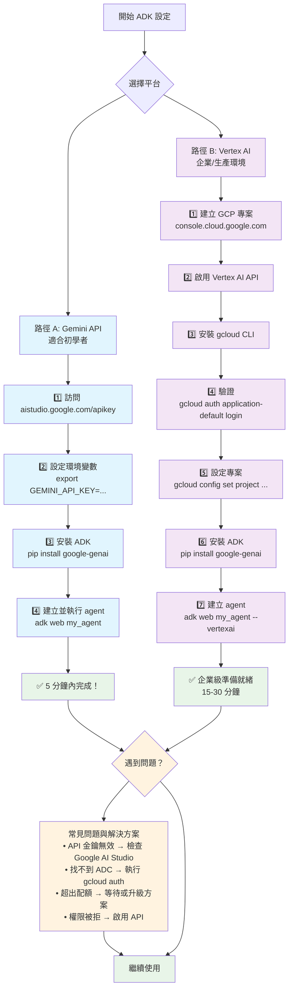

# Tutorial 00: 設定與驗證 - Google ADK 入門

## 概述 (Overview)

本篇教學旨在引導使用者完成 Google ADK 開發環境的設定與驗證，並協助選擇適合的 Google AI 平台。在開始建立 ADK 代理程式之前，必須先完成驗證設定。Google 提供兩種主要平台來存取 Gemini 模型：**Vertex AI** (Google Cloud Platform 的一部分) 和 **Gemini API** (獨立的 Google AI 服務)。

本教學涵蓋以下基礎主題：
- 獲取 API 金鑰與設定驗證
- 了解平台差異並選擇合適的平台
- ADK 基礎設定與配置
- 為後續所有教學準備環境

**重要提示**：請務必先完成本教學，所有其他教學都依賴於正確配置的驗證。

## 平台比較 (Platform Comparison)

### 快速決策指南 (Quick Decision Guide)

| 使用案例 (Use Case) | 平台 (Platform) | 原因 (Why) |
| :--- | :--- | :--- |
| **學習 ADK** | Gemini API | 免費，設定簡單 |
| **原型設計** | Gemini API | 每日 1500 次免費請求 |
| **生產環境** | Vertex AI | 企業級功能、高安全性 |
| **高流量** | Vertex AI | 可配置的吞吐量 |

### 主要差異 (Key Differences)

**Gemini API (適合初學者):**
- ✅ API 金鑰驗證
- ✅ 每日 1500 次免費請求
- ✅ 無需 GCP 帳戶
- ❌ 僅提供基本功能

**Vertex AI (適合生產環境):**
- ✅ 企業級安全性
- ✅ 與 GCP 整合
- ✅ 進階監控功能
- ❌ 設定較複雜

**定價：** 兩者相同 - 每 1 百萬輸入 token 收費 $0.30，每 1 百萬輸出 token 收費 $2.50。

## 驗證設定 (Authentication Setup)

### Gemini API (簡易設定)

```bash
# 1. 從 https://aistudio.google.com/apikey 獲取 API 金鑰
# 2. 設定環境變數
export GEMINI_API_KEY=your-api-key-here

# 3. 測試連線
python -c "from google.genai import Client; Client().models.generate_content(model='gemini-1.5-flash', contents='test')"
```

### Vertex AI (企業級設定)

```bash
# 1. 設定專案
export GOOGLE_CLOUD_PROJECT=your-project-id

# 2. 進行驗證
gcloud auth application-default login

# 3. 啟用 API
gcloud services enable aiplatform.googleapis.com

# 4. 測試連線
python -c "from google.genai import Client; Client(vertexai=True).models.generate_content(model='gemini-1.5-flash', contents='test')"
```

## 成本管理 (Cost Management)

### 免費方案 (Free Tiers)

- **Gemini API**: 每日 1500 次請求，每分鐘 1 百萬 token。
- **Vertex AI**: $300-500 的初始贈金 (有效期 90 天)。

### 付費使用 (Paid Usage)

- **輸入 token**: 每 1 百萬 token 收費 $0.30。
- **輸出 token**: 每 1 百萬 token 收費 $2.50。
- **兩平台定價相同**。

### 成本控制 (Cost Control)

```bash
# 設定預算提醒
gcloud billing budgets create adk-budget \
    --billing-account=YOUR_BILLING_ACCOUNT \
    --display-name="ADK Budget" \
    --budget-amount=50.00 \
    --threshold-rule=percent=50,percent=90
```

## 設定工作流程 (Setup Workflow)



## 平台特定功能 (Platform-Specific Features)

### Vertex AI 獨有功能 (VertexAI Exclusive)

- 為保證性能而設的預配置吞吐量
- 進階 MLOps 功能
- 用於安全性的 VPC 服務控制
- 模型監控與可解釋性
- 與 BigQuery、Cloud Storage 等服務整合

### Gemini API 獨有功能 (Gemini API Exclusive)

- Google AI Studio 介面
- 簡易的 API 金鑰驗證
- 內建用於測試的 Playground
- 用於客戶端應用的臨時 token

## 整合模式 (Integration Patterns)

### ADK Agent 實現 (ADK Agent Implementation)

**Vertex AI 模式:**

```python
# 引入 ADK Agent 和 Google GenAI Client
from adk import Agent
from google.genai import Client

# Vertex AI agent (企業級)
# 自動使用 ADC (應用程式預設憑證)，無需 API 金鑰
vertex_agent = Agent(
    name="enterprise_agent",
    model="gemini-1.5-flash",
    instruction="你是一個企業級 AI 助理",
    tools=[tool1, tool2],
)

# 可部署至 Vertex AI 端點
# 整合監控與日誌
# 支援 VPC 安全控制
```

**Gemini API 模式:**

```python
# 引入 ADK Agent 和 Google GenAI Client
from adk import Agent
from google.genai import Client

# Gemini API agent (開發者友善)
# 使用 GEMINI_API_KEY 環境變數
gemini_agent = Agent(
    name="dev_agent",
    model="gemini-1.5-flash",
    instruction="你是一個開發 AI 助理",
    tools=[tool1, tool2],
)

# 快速部署
# 簡單驗證
# 開發成本效益高
```

### 部署情境 (Deployment Scenarios)

**開發環境:**

```bash
# 使用 Gemini API 快速設定
export GEMINI_API_KEY=your-key
adk web dev_agent  # 啟動開發伺服器
```

**生產環境:**

```bash
# 使用 Vertex AI 進行企業級部署
export GOOGLE_CLOUD_PROJECT=prod-project
gcloud auth application-default login
adk deploy vertexai prod_agent  # 部署至 Vertex AI
```

## ADK 最低需求 (Minimum Requirements for ADK)

### API 啟用需求 (API Enablement Requirements)

#### Gemini API (無需 GCP)

- **最低需求**:
  - ✅ Google AI Studio 帳戶
  - ✅ 從 [https://aistudio.google.com/apikey](https://aistudio.google.com/apikey) 獲取的 API 金鑰
- **驗證設定**:
  ```bash
  # 唯一需求：API 金鑰
  export GEMINI_API_KEY=your-api-key-here
  ```

#### Vertex AI (需要 GCP)

- **最低需啟用的 API**:
  - ✅ `aiplatform.googleapis.com` (Vertex AI API)
  - ✅ `iam.googleapis.com` (身份與存取權管理)
- **驗證 API 啟用**:
  ```bash
  # 啟用最低需求的 API
  gcloud services enable aiplatform.googleapis.com iam.googleapis.com
  # 驗證 API 是否已啟用
  gcloud services list --enabled | grep -E "(aiplatform|iam)"
  ```

### 使用者權限 (User Rights and Permissions)

#### Gemini API 使用者權限

- **最低權限**:
  - ✅ 可存取 Google AI Studio 的 Google 帳戶
  - ✅ 能夠建立 API 金鑰

#### Vertex AI 使用者權限

- **最低 IAM 角色**:
  - ✅ `roles/aiplatform.user` - 基本 Vertex AI 存取權限
- **驗證權限設定**:
  ```bash
  # 授予最低需求的 IAM 角色 (需由專案管理員執行)
  gcloud projects add-iam-policy-binding your-project-id \
      --member="user:your-email@gmail.com" \
      --role="roles/aiplatform.user"
  ```

## 最佳實踐 (Best Practices)

### 安全要點 (Security Essentials)

- **API 金鑰**:
  - 切勿將金鑰提交到程式碼中
  - 使用環境變數
  - 每 90 天輪換一次金鑰
- **Vertex AI**:
  - 使用服務帳戶，而非使用者帳戶
  - 授予最小 IAM 權限
  - 在生產環境中啟用 VPC 服務控制

### 環境隔離 (Environment Separation)

```bash
# 開發環境
export GOOGLE_CLOUD_PROJECT=adk-dev
export GEMINI_API_KEY=dev-key

# 生產環境
export GOOGLE_CLOUD_PROJECT=adk-prod
# 使用 ADC 與生產服務帳戶
```

## 常見問題與解決方案 (Troubleshooting Common Issues)

- **`gcloud command not found`**: 安裝 Google Cloud CLI。
- **`ADC not found`**: 執行 `gcloud auth application-default login`。
- **`API key invalid`**: 重新從 Google AI Studio 產生金鑰並更新環境變數。
- **`Permission denied` in Vertex AI**: 啟用 Vertex AI API 並授予 `roles/aiplatform.user` 角色。
- **`Quota exceeded`**: 免費方案有速率限制，請等待或升級。

## 常見問題解答 (FAQ)

- **Q: 學習 ADK 應該選擇哪個平台？**
  - A: 建議從 **Gemini API** 開始，它設定簡單且有免費額度。
- **Q: 如何避免意外費用？**
  - A: 使用 Gemini API 的免費方案進行開發，並在 GCP 中設定帳單警示。
- **Q: 如何保護我的 API 金鑰？**
  - A: 使用環境變數或 GCP Secret Manager，切勿將金鑰寫死在程式碼中。

## 快速入門指令 (Quick Start Commands)

### Gemini API (建議初學者)

```bash
# 1. 從 https://aistudio.google.com/apikey 獲取 API 金鑰
# 2. 設定環境變數
export GEMINI_API_KEY=your-api-key-here
# 3. 測試設定
python -c "from google.genai import Client; print('Setup successful!')"
```

### Vertex AI (生產環境)

```bash
# 1. 設定 GCP 專案
export GOOGLE_CLOUD_PROJECT=your-project-id
# 2. 驗證
gcloud auth application-default login
# 3. 啟用 Vertex AI API
gcloud services enable aiplatform.googleapis.com
# 4. 測試設定
python -c "from google.genai import Client; print('Setup successful!')"
```

## 資源 (Resources)

- [Vertex AI Documentation](https://cloud.google.com/vertex-ai/generative-ai/docs)
- [Gemini API Documentation](https://ai.google.dev/gemini-api/docs)
- [ADK Platform Integration Guide](https://github.com/google/adk-python)
- [Google AI Studio](https://aistudio.google.com)
- [Google Cloud Console](https://console.cloud.google.com)
