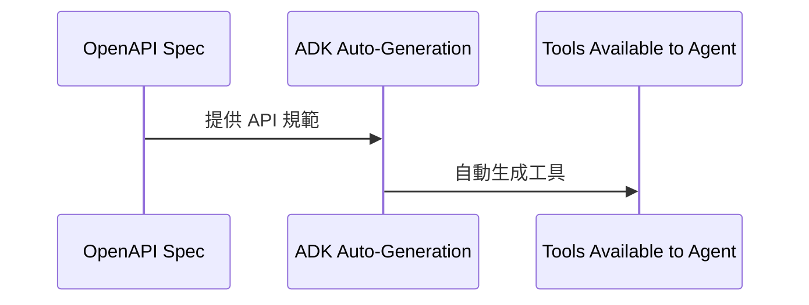

# Tutorial 03: OpenAPI Tools - REST API Integration

本篇教學將引導您如何使用 OpenAPI 工具整合 REST API，讓您的 AI Agent 能夠自動與網路服務互動，無需手動編寫工具函式。

## Overview (總覽)

本教學將建立一個 Chuck Norris 笑話助理，具備以下功能：
- 依類別搜尋 Chuck Norris 笑話
- 取得隨機笑話
- 列出所有可用類別
- 使用 **OpenAPIToolset** 從 API 規範自動生成工具

透過 OpenAPI 規範，ADK 能夠自動生成工具，大幅節省開發時間並減少錯誤。

## Prerequisites (先決條件)

- Python 3.9+
- 已安裝 `google-adk`
- Google API 金鑰
- 已完成教學 01-02
- 對 REST API 有基本了解

## Core Concepts (核心概念)

### What is OpenAPI? (什麼是 OpenAPI？)

OpenAPI (前身為 Swagger) 是一種用於描述 REST API 的規範格式。

```json
{
  "openapi": "3.0.0",
  "paths": {
    "/jokes/random": {
      "get": {
        "summary": "Get random joke",
        "parameters": []
      }
    }
  }
}
```

### How OpenAPIToolset Works (OpenAPIToolset 如何運作)

OpenAPIToolset 的運作流程是將 OpenAPI 規範透過 ADK 自動生成可供 Agent 使用的工具。



**範例**:
```python
# ADK 會自動根據 api_spec 建立工具
# - get_jokes_random()
# - get_jokes_search()
# - get_jokes_categories()
toolset = OpenAPIToolset(spec=api_spec)
```

**優點**:
- 無需手動編寫工具
- 總是與 API 規範保持一致
- 自動處理身份驗證
- 驗證參數
- 適用於任何符合 OpenAPI 規範的 API

## Use Case: Chuck Norris Fact Assistant (使用案例：Chuck Norris 笑話助理)

**情境**: 建立一個能從 [Chuck Norris API](https://api.chucknorris.io/) 擷取笑話的 Agent。

**API 特點**:
- 免費，無需 API 金鑰
- 簡單的 OpenAPI 規範
- 適合學習
- 有趣且引人入勝

## Implementation (實作)

### Project Structure (專案結構)

```
chuck_norris_agent/
├── __init__.py
├── agent.py
├── .env
└── README.md
```

### Complete Code (完整程式碼)

**chuck_norris_agent/__init__.py**:
```python
# 引入 agent 模組中的 root_agent
from .agent import root_agent

# 定義此模組對外公開的成員
__all__ = ['root_agent']
```

**chuck_norris_agent/agent.py**:
```python
"""Chuck Norris Fact Assistant - OpenAPI Tools Demonstration
此 Agent 展示如何使用 OpenAPIToolset 從 API 規範自動生成工具，而無需手動編寫工具函式。
"""
from google.adk.agents import Agent
from google.adk.tools.openapi_tool import OpenAPIToolset

# ============================================================================
# OPENAPI SPECIFICATION (OPENAPI 規範)
# ============================================================================
# Chuck Norris API OpenAPI 規範
# 參考: https://api.chucknorris.io/
CHUCK_NORRIS_SPEC = {
    "openapi": "3.0.0",
    "info": {
        "title": "Chuck Norris API",
        "description": "Free JSON API for hand curated Chuck Norris facts",
        "version": "1.0.0"
    },
    "servers": [
        {
            "url": "https://api.chucknorris.io/jokes"
        }
    ],
    "paths": {
        "/random": {
            "get": {
                "operationId": "get_random_joke",
                "summary": "Get a random Chuck Norris joke",
                "description": "Retrieve a random joke from the database. Can optionally filter by category.",
                "parameters": [
                    {
                        "name": "category",
                        "in": "query",
                        "description": "Filter jokes by category (optional)",
                        "required": False,
                        "schema": {
                            "type": "string"
                        }
                    }
                ],
                "responses": {
                    "200": {
                        "description": "Successful response",
                        "content": {
                            "application/json": {
                                "schema": {
                                    "type": "object",
                                    "properties": {
                                        "icon_url": {"type": "string"},
                                        "id": {"type": "string"},
                                        "url": {"type": "string"},
                                        "value": {"type": "string"}
                                    }
                                }
                            }
                        }
                    }
                }
            }
        },
        "/search": {
            "get": {
                "operationId": "search_jokes",
                "summary": "Search for jokes",
                "description": "Free text search for jokes containing the query term.",
                "parameters": [
                    {
                        "name": "query",
                        "in": "query",
                        "description": "Search query (3+ characters required)",
                        "required": True,
                        "schema": {
                            "type": "string",
                            "minLength": 3
                        }
                    }
                ],
                "responses": {
                    "200": {
                        "description": "Successful response",
                        "content": {
                            "application/json": {
                                "schema": {
                                    "type": "object",
                                    "properties": {
                                        "total": {"type": "integer"},
                                        "result": {
                                            "type": "array",
                                            "items": {
                                                "type": "object",
                                                "properties": {
                                                    "icon_url": {"type": "string"},
                                                    "id": {"type": "string"},
                                                    "url": {"type": "string"},
                                                    "value": {"type": "string"}
                                                }
                                            }
                                        }
                                    }
                                }
                            }
                        }
                    }
                }
            }
        },
        "/categories": {
            "get": {
                "operationId": "get_categories",
                "summary": "Get all joke categories",
                "description": "Retrieve list of available joke categories.",
                "responses": {
                    "200": {
                        "description": "Successful response",
                        "content": {
                            "application/json": {
                                "schema": {
                                    "type": "array",
                                    "items": {
                                        "type": "string"
                                    }
                                }
                            }
                        }
                    }
                }
            }
        }
    }
}

# ============================================================================
# OPENAPI TOOLSET (OPENAPI 工具集)
# ============================================================================
# 從規範建立 OpenAPIToolset
# ADK 將自動生成 3 個工具:
# - get_random_joke(category: Optional[str])
# - search_jokes(query: str)
# - get_categories()
chuck_norris_toolset = OpenAPIToolset(spec_dict=CHUCK_NORRIS_SPEC)

# ============================================================================
# AGENT DEFINITION (AGENT 定義)
# ============================================================================
root_agent = Agent(
    name="chuck_norris_agent",
    model="gemini-2.0-flash",
    description="""
    Chuck Norris fact assistant that can retrieve jokes/facts from the
    Chuck Norris API using OpenAPI tools.
    """,
    instruction="""
    You are a fun Chuck Norris fact assistant!
    CAPABILITIES:
    - Get random Chuck Norris jokes (optionally filtered by category)
    - Search for jokes containing specific keywords
    - List all available joke categories
    STYLE:
    - Be enthusiastic and playful
    - Chuck Norris jokes are exaggerated for comedic effect
    - Format jokes clearly for easy reading
    - If search returns multiple results, show a few best ones
    WORKFLOW:
    - For random requests → use get_random_joke
    - For specific topics → use search_jokes with query
    - To see categories → use get_categories
    - For category-specific random → use get_random_joke with category parameter
    IMPORTANT:
    - Always extract the 'value' field from API response (that's the actual joke)
    - If search finds 0 results, suggest trying a different keyword
    - Categories are lowercase (e.g., "dev", "movie", "food")
    """,
    # 將工具集傳遞給 agent
    tools=[chuck_norris_toolset]
)
```

**chuck_norris_agent/.env**:
```
GOOGLE_GENAI_USE_VERTEXAI=FALSE
GOOGLE_API_KEY=your_api_key_here
```

## Running the Agent (執行 Agent)

### Method 1: Web UI (Recommended) (方法一：網頁介面 (建議))

```bash
cd /path/to/chuck_norris_agent/..
adk web chuck_norris_agent
```

**可嘗試的提示**:
- "Tell me a random Chuck Norris joke"
- "Find jokes about computers"
- "What joke categories exist?"
- "Give me a random movie joke"
- "Search for jokes with the word 'code'"

### Method 2: Terminal (方法二：終端機)

```bash
adk run chuck_norris_agent
```

## Expected Behavior (預期行為)

| 使用者輸入 | Agent 流程 | Agent 回應 |
| --- | --- | --- |
| "Tell me a random Chuck Norris joke" | 1. 呼叫 `get_random_joke()` 工具<br>2. API 回傳包含 'value' 欄位的 JSON<br>3. Agent 擷取並格式化笑話 | "Here's a Chuck Norris fact for you: 'Chuck Norris can divide by zero.' 😄 Classic!" |
| "Find jokes about programming" | 1. 呼叫 `search_jokes(query="programming")` 工具<br>2. API 回傳匹配的笑話陣列<br>3. Agent 選擇最佳笑話並格式化 | "I found some programming-related Chuck Norris jokes: 1. 'Chuck Norris writes code that optimizes itself.'..." |
| "What categories are available?" | 1. 呼叫 `get_categories()` 工具<br>2. API 回傳類別字串陣列<br>3. Agent 格式化列表 | "Chuck Norris jokes are available in these categories: - animal - career - celebrity..." |
| "Tell me a joke from the dev category" | 1. 呼叫 `get_random_joke(category="dev")` 工具<br>2. API 回傳 'dev' 類別的隨機笑話<br>3. Agent 格式化笑話 | "Here's a dev joke for you: 'Chuck Norris's keyboard doesn't have a Ctrl key because nothing controls Chuck Norris.' 🤓 Perfect for developers!" |

## How It Works: OpenAPIToolset Deep Dive (運作原理：深入了解 OpenAPIToolset)

1.  **Specification Structure (規範結構)**: `operationId` 成為函式名稱，`parameters` 成為函式參數。
2.  **Auto-Generated Tools (自動生成工具)**: ADK 根據 `operationId` 和 `parameters` 自動建立非同步函式。
3.  **Agent Tool Usage (Agent 工具使用)**: 將 `toolset` 直接傳遞給 `Agent` 的 `tools` 參數，ADK 會在內部處理非同步工具的載入。
4.  **What ADK Handles Automatically (ADK 自動處理的項目)**:
    - HTTP 請求建構
    - 參數驗證
    - URL 建構
    - 回應解析
    - 錯誤處理
    - 身份驗證

## Key Takeaways (重點摘要)

1.  **OpenAPIToolset = Zero Manual Tool Code**: 無需手動編寫工具程式碼。
2.  **operationId → Function Name**: `operationId` 決定了 LLM 如何看待工具。
3.  **parameters → Function Args**: `parameters` 成為工具函式的簽名。
4.  **Works with Any OpenAPI API**: 可與任何 OpenAPI 相容的 API 協作。
5.  **No API Key Needed for Chuck Norris API**: 此 API 為公開免費。

## Best Practices (最佳實踐)

| 類別 | 建議 (DO) | 不建議 (DON'T) |
| --- | --- | --- |
| **OpenAPI Spec Creation** | - 使用描述性的 `operationId`<br>- 撰寫清晰的 `description`<br>- 正確標記必要參數<br>- 包含回應結構 | - 使用通用名稱如 `api_call_1`<br>- 忽略描述<br>- 將所有參數標記為必要 |
| **Tool Design** | - 每個獨立動作一個工具<br>- 保持參數列表簡短<br>- 使用 `enums` 處理分類參數<br>- 獨立測試工具 | - 在單一端點中結合不相關的動作<br>- 使用過於複雜的巢狀參數<br>- 假設 LLM 能推斷遺漏的描述 |
| **Authentication** | - 對於需要驗證的 API，使用 `auth_config` 參數配置驗證方式 (API Key, Bearer Token 等)。 | - |

## Common Issues & Troubleshooting (常見問題與疑難排解)

- **Tool Not Being Called (工具未被呼叫)**: 檢查 `operationId` 是否具描述性，並在 spec 中加入詳細的 `summary` 和 `description`。
- **Import Errors (匯入錯誤)**: 確認 `google-adk` 已安裝，並使用正確的匯入路徑。
- **Constructor Parameter Errors (建構子參數錯誤)**: 使用 `spec_dict` 參數而非 `spec`。
- **Async Tool Loading Issues (非同步工具載入問題)**: 直接傳遞 `toolset` (`tools=[my_toolset]`)，而非 `my_toolset.get_tools()`。
- **Invalid API Response (無效的 API 回應)**: 使用 `curl` 或 Postman 直接測試 API 端點，並驗證 spec 是否與實際 API 行為相符。
- **Spec Validation Errors (Spec 驗證錯誤)**: 在 [Swagger Editor](https://editor.swagger.io/) 驗證 spec。
- **Agent Misinterprets Tool Output (Agent 誤解工具輸出)**: 改善 Agent 指令以指定輸出格式，或在 spec 中提供回應結構。

## Real-World Applications (真實世界應用)

- **GitHub Integration**: 建立程式碼審查助理。
- **Stripe Payment Processing**: 建立電子商務支援 Agent。
- **Twilio SMS/Voice**: 建立通訊自動化 Agent。
- **Jira Project Management**: 建立開發工作流程 Agent。

## Advanced Topics (進階主題)

- **Custom Response Processing (自訂回應處理)**: 建立包裝函式 (wrapper) 來後處理 API 回應。
- **Multiple API Integration (多重 API 整合)**: 在單一 Agent 中結合多個 `OpenAPIToolset`。
- **Rate Limiting Handling (速率限制處理)**: 使用 `tenacity` 等函式庫實現重試邏輯。

## Further Reading (延伸閱讀)

- [OpenAPI Specification](https://spec.openapis.org/oas/latest.html)
- [Chuck Norris API Documentation](https://api.chucknorris.io/)
- [ADK OpenAPIToolset Documentation](https://google.github.io/adk-docs/tools/openapi/)
- [Swagger Editor](https://editor.swagger.io/)
- [Public APIs List](https://github.com/public-apis/public-apis)

## 程式碼實現 (Code Implementation)
- chuck-norris-agent：[程式碼連結](../../../python/agents/chuck-norris-agent/README.md)