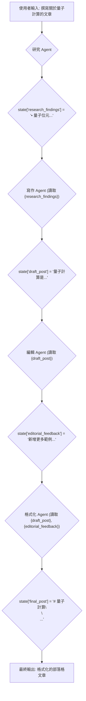
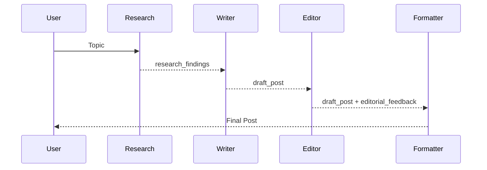

# 教學 04：循序工作流程 - Agent Pipelines

## 總覽

本教學將引導您如何連接多個 agents，以建立一個循序執行的多步驟工作流程。我們將建構一個包含四個階段的部落格文章產生器 Pipeline：

1.  **研究 Agent**：收集主題相關資訊。
2.  **寫作 Agent**：根據研究結果撰寫草稿。
3.  **編輯 Agent**：審查並提出改進建議。
4.  **格式化 Agent**：將最終版本轉換為 Markdown 格式。

每個 agent 的輸出將作為下一個 agent 的輸入，形成一個完整的內容創作流程。

## 先決條件

- 完成教學 01-03，了解 agents、工具和 OpenAPI。
- 已安裝 ADK (`pip install google-adk`)。
- 已設定 API 金鑰。

## 核心概念

### SequentialAgent

`SequentialAgent` 是一個工作流程協調器，它會嚴格按照順序執行子 agent。它不是由 LLM 驅動的，因此其執行順序是確定性的。

- **主要特性**：
  - 一次執行一個子 agent，順序固定。
  - 每個 agent 完成後，下一個才會開始。
  - 所有 agents 共享相同的 `InvocationContext`（共享狀態）。
  - 適用於順序至關重要的 pipeline。

### 使用 `output_key` 的資料流

Agents 之間透過 **session state** 傳遞資料：

1.  Agent 定義 `output_key="my_result"`。
2.  ADK 自動將 agent 的回應儲存到 `state['my_result']`。
3.  下一個 agent 在其 instruction 中使用 `{my_result}` 來讀取該狀態。

### 何時使用循序工作流程

- ✅ 任務**必須**按特定順序執行。
- ✅ 每個步驟都依賴於前一步驟的輸出。
- ✅ 需要可預測、確定性的執行。
- ✅ 建立 pipelines（例如 ETL、內容創作、審查流程）。

## 使用案例

我們將建立一個**部落格文章產生器 Pipeline**，包含研究、寫作、編輯和格式化四個階段。

## 步驟 1：建立專案結構

建立一個新的專案目錄並新增必要的檔案。

```bash
mkdir blog_pipeline
cd blog_pipeline
touch __init__.py agent.py .env
```

## 步驟 2：設定套件匯入

在 `__init__.py` 中匯入 agent 模組。

**blog_pipeline/__init__.py**
```python
from . import agent
```

## 步驟 3：定義 Pipeline Agents

在 `agent.py` 中定義四個 agent，並將它們組合成一個 `SequentialAgent`。

**blog_pipeline/agent.py**
```python
from __future__ import annotations
from google.adk.agents import Agent, SequentialAgent

# ===== Agent 1: 研究 Agent =====
research_agent = Agent(
    name="researcher",
    model="gemini-2.0-flash",
    description="Researches a topic and gathers key information",
    instruction=(
        "You are a research assistant. Your task is to gather key facts and information "
        "about the topic requested by the user.\n"
        "\n"
        "Output a bulleted list of 5-7 key facts or insights about the topic. "
        "Focus on interesting, specific information that would make a blog post engaging.\n"
        "\n"
        "Format:\n"
        "• Fact 1\n"
        "• Fact 2\n"
        "• etc.\n"
        "\n"
        "Output ONLY the bulleted list, nothing else."
    ),
    output_key="research_findings"  # 儲存到 state['research_findings']
)

# ===== Agent 2: 寫作 Agent =====
writer_agent = Agent(
    name="writer",
    model="gemini-2.0-flash",
    description="Writes a blog post draft based on research findings",
    instruction=(
        "You are a creative blog writer. Write an engaging blog post based on "
        "the research findings below.\n"
        "\n"
        "**Research Findings:**\n"
        "{research_findings}\n"  # 從 state 讀取!
        "\n"
        "Write a 3-4 paragraph blog post that:\n"
        "- Has an engaging introduction\n"
        "- Incorporates the key facts naturally\n"
        "- Has a conclusion that wraps up the topic\n"
        "- Uses a friendly, conversational tone\n"
        "\n"
        "Output ONLY the blog post text, no meta-commentary."
    ),
    output_key="draft_post"  # 儲存到 state['draft_post']
)

# ===== Agent 3: 編輯 Agent =====
editor_agent = Agent(
    name="editor",
    model="gemini-2.0-flash",
    description="Reviews blog post draft and provides editorial feedback",
    instruction=(
        "You are an experienced editor. Review the blog post draft below and provide "
        "constructive feedback.\n"
        "\n"
        "**Draft Blog Post:**\n"
        "{draft_post}\n"  # 從 state 讀取!
        "\n"
        "Analyze the post for:\n"
        "1. Clarity and flow\n"
        "2. Grammar and style\n"
        "3. Engagement and reader interest\n"
        "4. Structure and organization\n"
        "\n"
        "Provide your feedback as a short list of specific improvements. "
        "If the post is excellent, simply say: 'No revisions needed - post is ready.'\n"
        "\n"
        "Output ONLY the feedback, nothing else."
    ),
    output_key="editorial_feedback"  # 儲存到 state['editorial_feedback']
)

# ===== Agent 4: 格式化 Agent =====
formatter_agent = Agent(
    name="formatter",
    model="gemini-2.0-flash",
    description="Applies editorial feedback and formats the final blog post",
    instruction=(
        "You are a formatter. Create the final version of the blog post by applying "
        "the editorial feedback to improve the draft.\n"
        "\n"
        "**Original Draft:**\n"
        "{draft_post}\n"  # 從 state 讀取!
        "\n"
        "**Editorial Feedback:**\n"
        "{editorial_feedback}\n"  # 從 state 讀取!
        "\n"
        "Create the final blog post by:\n"
        "1. Applying the suggested improvements\n"
        "2. Formatting as proper markdown with:\n"
        "   - A compelling title (# heading)\n"
        "   - Section headings if appropriate (## subheadings)\n"
        "   - Proper paragraph breaks\n"
        "   - Bold/italic for emphasis where appropriate\n"
        "\n"
        "If feedback said 'No revisions needed', just format the original draft nicely.\n"
        "\n"
        "Output ONLY the final formatted blog post in markdown."
    ),
    output_key="final_post"  # 儲存到 state['final_post']
)

# ===== 建立循序 Pipeline =====
blog_creation_pipeline = SequentialAgent(
    name="BlogCreationPipeline",
    sub_agents=[
        research_agent,
        writer_agent,
        editor_agent,
        formatter_agent
    ],  # 嚴格按照此順序執行!
    description="Complete blog post creation pipeline from research to publication"
)

# ADK 要求必須命名為 root_agent
root_agent = blog_creation_pipeline
```

### 程式碼分解

#### 狀態流程視覺化



## 步驟 4：執行 Pipeline

啟動 ADK Web 介面並測試 pipeline。

```bash
cd ..  # 回到 blog_pipeline/ 的上一層目錄
adk web
```

在 `http://localhost:8000` 中選擇 "blog_pipeline" 並嘗試以下提示：

- `Write a blog post about artificial intelligence`
- `Create a blog post explaining how solar panels work`

## 了解 Pipeline 執行

在 **Events** 標籤頁中，您可以看到每個 agent 如何依序執行，以及其輸出如何儲存到 state 並被下一個 agent 使用。

## 運作原理 (幕後)

1.  ADK 啟動 pipeline。
2.  `SequentialAgent` 依序呼叫 `research_agent.run()`，等待完成後將輸出儲存到 `state['research_findings']`。
3.  ADK 將 `{research_findings}` 注入到寫作 agent 的 instruction 中，然後呼叫 `writer_agent.run()`。
4.  此流程持續進行，直到 pipeline 中的最後一個 agent 完成。

#### 視覺化流程



## 關鍵要點

- ✅ `SequentialAgent` 用於嚴格排序的 agent 鏈。
- ✅ `output_key` 將結果儲存到 state。
- ✅ `{key}` 語法從 state 讀取資料。
- ✅ 所有 agent 共享 `InvocationContext` 和 state。
- ✅ 執行是確定性的，沒有 LLM 決定順序。

## 最佳實踐

- **要**：為每個 agent 分配單一、專注的任務。
- **要**：使用描述性的 `output_key` 名稱。
- **不要**：讓 agent 承擔過多任務。
- **不要**：忘記設定 `output_key`，否則資料無法流動。

## 常見問題

- **問題**："下一個 agent 看不到前一個 agent 的輸出"
  - **解決方案**：檢查前一個 agent 是否定義了 `output_key`，並確認 `{key}` 名稱是否正確。
- **問題**："Pipeline 似乎跳過了某些 agents"
  - **解決方案**：檢查 Events 標籤頁，確認 agent 是否輸出了空回應。

## 真實世界應用

- **內容 Pipelines**：研究 → 撰寫 → 編輯 → 發布。
- **資料處理**：提取 → 轉換 → 驗證 → 載入 (ETL)。
- **品質控制**：建立 → 審查 → 修復 → 核准。

## 程式碼實現 (Code Implementation)
- blog-pipeline：[程式碼連結](../../../python/agents/blog-pipeline/README.md)