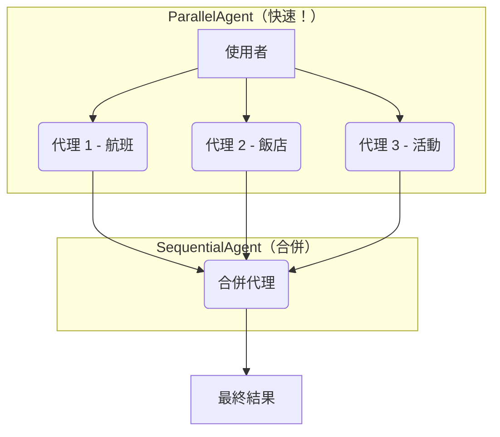

# 教學 05：平行處理 - 同時執行多個代理

## 總覽

本教學將指導您如何同時執行多個代理（Agent），以顯著提升工作流程的效率。您將學習 **`ParallelAgent`** 模式和強大的 **扇出/收集 (fan-out/gather)** 技術，這對於任何需要高效能的真實世界代理系統至關重要。

**🎯 工作實現**：一個完整且經過測試的旅遊規劃系統可在 [`tutorial_implementation/tutorial05/`](https://github.com/raphaelmansuy/adk_training/tree/main/tutorial_implementation/tutorial05/) 中找到，包含完整的測試、文件和使用者友善的設定流程。

## 先決條件

*   完成教學 01-04，了解代理、工具和循序工作流程。
*   已安裝 ADK：`pip install google-adk`。
*   已設定 API 金鑰（參考教學 01）。

## 核心概念

### ParallelAgent

**`ParallelAgent`** 會**同時**執行多個子代理，而非循序執行。這在以下情況下非常適用：

*   任務彼此**獨立**。
*   追求**速度**，希望比逐一執行更快。
*   從**多個來源**收集資訊。

**主要特性：**

*   所有子代理同時啟動。
*   代理獨立執行，執行期間無共享資料。
*   `ParallelAgent` 會等待所有代理完成。
*   直到最慢的代理完成後才返回結果。

### 何時使用平行 vs. 循序

| 使用 `ParallelAgent` (平行)                                | 使用 `SequentialAgent` (循序)                                |
| ---------------------------------------------------------- | ------------------------------------------------------------ |
| ✅ 任務獨立（可任意順序執行）                              | ✅ 任務**必須**按特定順序執行                                |
| ✅ 速度至關重要                                            | ✅ 每一步都需要前一步的輸出                                  |
| ✅ 從多個來源收集資料                                      | ✅ 建立一個管線（輸出在代理之間流動）                        |
| ✅ 任務不需要彼此的輸出                                    |                                                              |

### 扇出/收集 (Fan-Out/Gather) 模式

這是真實世界代理的關鍵模式：

1.  **扇出 (Fan-Out)** (平行) → 同時執行多個代理以收集資料。
2.  **收集 (Gather)** (循序) → 使用一個最終代理合併所有結果。



這種模式兼具**速度**（平行資料收集）和**綜合**（合併結果）的優點。

## 使用案例

我們將建立一個**智慧旅遊規劃器**，透過以下步驟幫助使用者規劃行程：

1.  **搜尋航班** (平行)
2.  **搜尋飯店** (平行)
3.  **尋找活動** (平行)
4.  **將所有資訊合併**成一個完整的行程 (循序)

## 步驟 1：取得工作實現

一個完整且經過測試的實作可在儲存庫中找到：

```bash
# 導航至工作實現目錄
cd tutorial_implementation/tutorial05/

# 安裝依賴
make setup

# 複製環境變數範本並加入您的 API 金鑰
cp travel_planner/.env.example travel_planner/.env
# 編輯 travel_planner/.env 並加入您的 GOOGLE_API_KEY
```

## 步驟 2：建立專案結構 (可選)

如果您想從頭開始，請建立以下結構：

```bash
mkdir travel_planner
cd travel_planner
touch __init__.py agent.py .env
```

## 專案結構

工作實現遵循以下結構：

```
tutorial05/
├── travel_planner/           # 代理實現
│   ├── __init__.py
│   ├── agent.py             # 代理定義與管線
│   └── .env.example
├── tests/                   # 測試套件
│   ├── test_agent.py
│   ├── ...
├── requirements.txt
├── Makefile
└── README.md
```

## 步驟 3：定義旅遊規劃代理

**travel_planner/agent.py**

```python
from __future__ import annotations
from google.adk.agents import Agent, ParallelAgent, SequentialAgent

# ============================================================================
# 平行搜尋代理
# ============================================================================

# 航班搜尋器
flight_finder = Agent(
    name="flight_finder",
    model="gemini-2.0-flash",
    description="搜尋可用航班",
    instruction="您是航班搜尋專家...",
    output_key="flight_options"
)

# 飯店搜尋器
hotel_finder = Agent(
    name="hotel_finder",
    model="gemini-2.0-flash",
    description="搜尋可用飯店",
    instruction="您是飯店搜尋專家...",
    output_key="hotel_options"
)

# 活動搜尋器
activity_finder = Agent(
    name="activity_finder",
    model="gemini-2.0-flash",
    description="尋找活動與景點",
    instruction="您是當地活動專家...",
    output_key="activity_options"
)

# ============================================================================
# 扇出：平行資料收集
# ============================================================================

parallel_search = ParallelAgent(
    name="ParallelSearch",
    sub_agents=[flight_finder, hotel_finder, activity_finder],
    description="同時搜尋航班、飯店和活動"
)

# ============================================================================
# 收集：循序結果合併
# ============================================================================

itinerary_builder = Agent(
    name="itinerary_builder",
    model="gemini-2.0-flash",
    description="將所有搜尋結果合併成完整的旅遊行程",
    instruction=(
        "您是旅遊規劃師。請結合以下搜尋結果，建立一份組織良好的完整行程。\n"
        "**可用航班:**\n{flight_options}\n"
        "**可用飯店:**\n{hotel_options}\n"
        "**推薦活動:**\n{activity_options}\n"
        "請建立一份格式化的行程..."
    ),
    output_key="final_itinerary"
)

# ============================================================================
# 完整的扇出/收集管線
# ============================================================================

travel_planning_system = SequentialAgent(
    name="TravelPlanningSystem",
    sub_agents=[
        parallel_search,     # 步驟 1：平行收集資料 (快速!)
        itinerary_builder    # 步驟 2：合併結果 (綜合)
    ],
    description="完整的旅遊規劃系統"
)

root_agent = travel_planning_system
```

### 程式碼解析

**扇出/收集流程：**

1.  **使用者輸入**："Plan a trip to Tokyo for 5 days"
2.  **`ParallelAgent` 啟動**：3 個代理同時執行。
    *   `flight_finder` → 搜尋航班 → 存入 `state['flight_options']`
    *   `hotel_finder` → 搜尋飯店 → 存入 `state['hotel_options']`
    *   `activity_finder` → 尋找活動 → 存入 `state['activity_options']`
3.  **`ParallelAgent` 完成**：等待所有代理完成。
4.  **`itinerary_builder` 執行**：從 `state` 讀取 3 個鍵的資料。
5.  **最終輸出**：完整的旅遊行程。

## 步驟 4：執行旅遊規劃器

### 使用工作實現

```bash
# 從 tutorial_implementation/tutorial05/
make dev
```

開啟 `http://localhost:8000` 並選擇 "travel_planner"。

### 嘗試以下提示

*   `Plan a 3-day trip to Paris`
*   `I need a 5-day Tokyo trip for 2 people. Budget-friendly options preferred.`
*   `Weekend getaway to New York. Looking for cultural activities and good restaurants.`

## 了解平行執行

在 **Events** 標籤頁中，您可以看到：

1.  `ParallelAgent` 啟動。
2.  `flight_finder`, `hotel_finder`, `activity_finder` **同時**啟動。
3.  各代理完成後，將結果存入 `state`。
4.  `ParallelAgent` 在所有子代理完成後結束。
5.  `itinerary_builder` 啟動，並注入所有需要的資料。
6.  `itinerary_builder` 完成，輸出最終結果。

## 關鍵要點

*   ✅ **`ParallelAgent`** 同時執行子代理，大幅提升速度。
*   ✅ 適用於**獨立任務**。
*   ✅ **扇出/收集**是核心模式：平行加速，循序綜合。
*   ✅ 結合 `SequentialAgent` 以發揮兩者優勢。
*   ✅ 可在 **Events** 標籤頁中驗證平行執行。

## 最佳實踐

**應做：**

*   用於 I/O 密集型任務（API 呼叫、網頁搜尋）。
*   保持子代理獨立。
*   結合 `SequentialAgent` 進行合併。
*   使用描述性的 `output_keys`。

**不應做：**

*   用於代理之間有依賴性的任務（應使用 `Sequential`）。
*   假設平行區塊內的執行順序。
*   忘記合併步驟。

## 真實世界應用

*   **資料收集**：同時搜尋多個 API/資料庫。
*   **內容創作**：同時生成多個版本。
*   **分析**：對相同資料並行運行不同分析。
*   **多源研究**：學術、新聞、社群媒體。
*   **比價購物**：從不同來源獲取價格、評論。

## 下一步

🚀 **教學 06：多代理系統** - 結合循序和平行模式，打造更複雜的工作流程。
