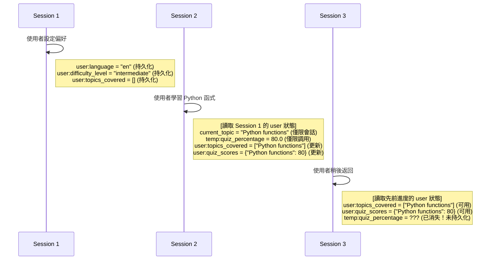

# Tutorial 08: State and Memory - Persistent Agent Context (狀態與記憶體 - 持久化代理上下文)

> **💡 [點此查看完整的實作與測試套件](https://github.com/raphaelmansuy/adk_training/tree/main/tutorial_implementation/tutorial08/README.md)**

## Overview (總覽)

本教學將引導您如何使用 **session state (會話狀態)** 與 **long-term memory (長期記憶體)** 來建構能夠跨互動記住資訊的代理。我們將以一個個人家教系統為例，該系統能追蹤使用者的學習進度、偏好和歷史紀錄。

**您將建構的系統**：一個個人化的學習助理，具備以下功能：

*   記住使用者偏好 (例如：語言、難度等級)。
*   跨會話追蹤進度 (例如：已涵蓋的主題、測驗分數)。
*   使用臨時狀態進行計算。
*   搜尋過去的學習會話以獲取上下文。
*   根據歷史紀錄調整教學內容。

**為何重要**：大多數正式環境的代理都需要在單次對話之外維持上下文。狀態管理和記憶體功能使得提供個人化、具備上下文感知能力的體驗成為可能。

---

## Prerequisites (先決條件)

*   Python 3.9+
*   已安裝 `google-adk` (`pip install google-adk`)
*   Google API 金鑰 (請參閱 [Authentication Setup](https://google.github.io/adk-docs/get-started/quickstart/))
*   已完成教學 01-02 (代理與工具的基礎知識)
*   理解會話 (session) 的概念

---

## Core Concepts (核心概念)

### Session State (`session.state`) (會話狀態)

這是代理的 **暫存區 (scratchpad)**，一個用於儲存對話層級資料的鍵值字典。

**使用前綴進行狀態範疇界定 (State Scoping with Prefixes)**：

| 前綴 (Prefix) | 範疇 (Scope) | 持久性 (Persistence) | 使用案例範例 |
| :--- | :--- | :--- | :--- |
| None | 目前會話 | 依賴 SessionService | `state['current_topic'] = 'python'` - 任務進度 |
| `user:` | 特定使用者的所有會話 | 持久化 | `state['user:preferred_language'] = 'en'` - 使用者偏好 |
| `app:` | 所有使用者/會話 | 持久化 | `state['app:course_catalog'] = [...]` - 全域設定 |
| `temp:` | 僅限當前調用 | **永不持久化** | `state['temp:quiz_score'] = 85` - 臨時計算 |

**重點**：

*   `temp:` 狀態在調用完成後會被 **捨棄**。
*   `temp:` 狀態在同一次調用中的所有子代理之間 **共享**。
*   `user:` 和 `app:` 需要持久化的 SessionService (例如：Database/VertexAI)。
*   使用 `output_key` 或 `context.state` 來安全地更新狀態。

### Memory Service (記憶體服務)

儲存超越當前會話的長期知識，就像一個 **可搜尋的檔案庫**。

**兩種實作方式**：

1.  **InMemoryMemoryService**：關鍵字搜尋，無持久性 (適用於開發/測試)。
2.  **VertexAiMemoryBankService**：語意搜尋，由大型語言模型 (LLM) 驅動，具持久性 (適用於正式環境)。

**工作流程**：

1.  使用者與代理互動 (一個會話)。
2.  呼叫 `add_session_to_memory(session)` 來儲存會話。
3.  之後，代理進行搜尋：`search_memory(query)`。
4.  記憶體服務回傳相關的過去互動紀錄。
5.  代理使用檢索到的上下文。

---

## Use Case: Personal Learning Tutor (使用案例：個人學習導師)

**情境**：建立一個具備以下功能的導師：

*   儲存使用者偏好 (語言、難度)。
*   追蹤您已學習過的主題。
*   記住您的測驗表現。
*   當您提問時，搜尋過去的課程內容。
*   根據您的程度調整解釋方式。

**狀態策略**：

*   `user:language` → 偏好 (跨會話持久化)。
*   `user:difficulty_level` → 偏好 (初級/中級/高級)。
*   `user:topics_covered` → 已完成主題的列表。
*   `user:quiz_scores` → 測驗表現的歷史紀錄。
*   `current_topic` → 目前正在學習的主題 (會話層級)。
*   `temp:quiz_answers` → 測驗期間的答案 (測驗後捨棄)。

---

## Implementation (實作)

### Project Structure (專案結構)

```
personal_tutor/
├── __init__.py          # 匯入代理
├── agent.py             # 代理定義
└── .env.example         # API 金鑰範本
```

### Complete Code (完整程式碼)

**personal_tutor/__init__.py**:

```python
# 匯入 agent.py 中定義的 root_agent
from .agent import root_agent

# 定義此模組對外公開的成員
__all__ = ['root_agent']
```

**personal_tutor/agent.py**:

```python
"""
個人學習導師 - 展示狀態與記憶體管理

此代理使用：
- user: 前綴來儲存持久化的偏好設定 (語言、難度)。
- 會話狀態來追蹤目前的主題。
- temp: 前綴來進行臨時的測驗計算。
- 記憶體服務來檢索過去的學習會話。
"""
from google.adk.agents import Agent
from google.adk.tools.tool_context import ToolContext
from typing import Dict, Any

# ============================================================================
# TOOLS: 狀態管理與記憶體操作
# ============================================================================

def set_user_preferences(
    language: str,
    difficulty_level: str,
    tool_context: ToolContext) -> Dict[str, Any]:
    """
    設定使用者的學習偏好 (會被持久化儲存)。
    Args:
        language: 偏好語言 (例如：en, es, fr)。
        difficulty_level: 難度等級 (beginner, intermediate, or advanced)。
    """
    # 使用 user: 前綴進行跨會話的持久化儲存
    tool_context.state['user:language'] = language
    tool_context.state['user:difficulty_level'] = difficulty_level
    return {
        'status': 'success',
        'message': f'偏好已儲存：語言 {language}，難度 {difficulty_level}'
    }

def record_topic_completion(
    topic: str,
    quiz_score: int,
    tool_context: ToolContext) -> Dict[str, Any]:
    """
    記錄使用者完成一個主題 (會被持久化儲存)。
    Args:
        topic: 主題名稱 (例如："Python Basics", "Data Structures")。
        quiz_score: 滿分 100 的分數。
    """
    # 獲取現有的列表，若不存在則建立新的
    topics = tool_context.state.get('user:topics_covered', [])
    scores = tool_context.state.get('user:quiz_scores', {})

    # 更新持久化的使用者狀態
    if topic not in topics:
        topics.append(topic)
    scores[topic] = quiz_score
    tool_context.state['user:topics_covered'] = topics
    tool_context.state['user:quiz_scores'] = scores
    return {
        'status': 'success',
        'topics_count': len(topics),
        'message': f'已記錄：{topic}，分數 {quiz_score}/100'
    }

def get_user_progress(tool_context: ToolContext) -> Dict[str, Any]:
    """
    獲取使用者的學習進度摘要。
    回傳跨所有會話的持久化使用者資料。
    """
    # 讀取持久化的使用者狀態
    language = tool_context.state.get('user:language', 'en')
    difficulty = tool_context.state.get('user:difficulty_level', 'beginner')
    topics = tool_context.state.get('user:topics_covered', [])
    scores = tool_context.state.get('user:quiz_scores', {})

    # 計算平均分數
    avg_score = sum(scores.values()) / len(scores) if scores else 0
    return {
        'status': 'success',
        'language': language,
        'difficulty_level': difficulty,
        'topics_completed': len(topics),
        'topics': topics,
        'average_quiz_score': round(avg_score, 1),
        'all_scores': scores
    }

def start_learning_session(
    topic: str,
    tool_context: ToolContext) -> Dict[str, Any]:
    """
    為一個主題開始新的學習會話。
    使用會話狀態 (無前綴) 來追蹤目前的主題。
    """
    # 會話層級的狀態 (僅在此會話中持久存在)
    tool_context.state['current_topic'] = topic
    tool_context.state['session_start_time'] = 'now'  # 簡化表示

    # 獲取使用者的難度等級以進行個人化
    difficulty = tool_context.state.get('user:difficulty_level', 'beginner')
    return {
        'status': 'success',
        'topic': topic,
        'difficulty_level': difficulty,
        'message': f'已開始學習會話：{topic}，難度為 {difficulty}'
    }

def calculate_quiz_grade(
    correct_answers: int,
    total_questions: int,
    tool_context: ToolContext) -> Dict[str, Any]:
    """
    使用臨時狀態計算測驗成績。
    展示 temp: 前綴用於僅限單次調用的資料。
    """
    # 將中間計算結果儲存在 temp 狀態中 (調用後捨棄)
    percentage = (correct_answers / total_questions) * 100
    tool_context.state['temp:raw_score'] = correct_answers
    tool_context.state['temp:quiz_percentage'] = percentage

    # 判斷成績等級
    if percentage >= 90:
        grade = 'A'
    elif percentage >= 80:
        grade = 'B'
    elif percentage >= 70:
        grade = 'C'
    elif percentage >= 60:
        grade = 'D'
    else:
        grade = 'F'
    return {
        'status': 'success',
        'score': f'{correct_answers}/{total_questions}',
        'percentage': round(percentage, 1),
        'grade': grade,
        'message': f'測驗成績：{grade} ({percentage:.1f}%)'
    }

def search_past_lessons(
    query: str,
    tool_context: ToolContext) -> Dict[str, Any]:
    """
    在記憶體中搜尋相關的過去學習會話。
    此函式展示了記憶體服務的整合。
    在正式環境中，這會使用 MemoryService.search_memory()。
    """
    # 注意：這是一個簡化的模擬
    # 實際的實作會是：
    # memory_service = tool_context.memory_service
    # results = await memory_service.search_memory(
    #     app_name=tool_context.app_name,
    #     user_id=tool_context.user_id,
    #     query=query
    # )

    # 模擬的記憶體搜尋結果
    topics = tool_context.state.get('user:topics_covered', [])
    relevant = [t for t in topics if query.lower() in t.lower()]
    if relevant:
        return {
            'status': 'success',
            'found': True,
            'relevant_topics': relevant,
            'message': f'找到 {len(relevant)} 個與 "{query}" 相關的過去會話'
        }
    else:
        return {
            'status': 'success',
            'found': False,
            'message': f'找不到與 "{query}" 相關的過去會話'
        }

# ============================================================================
# AGENT DEFINITION (代理定義)
# ============================================================================
root_agent = Agent(
    name="personal_tutor",
    model="gemini-2.0-flash",
    description="""
    個人學習導師，能追蹤您的進度、偏好和學習歷史。
    使用狀態管理和記憶體來提供個人化的教育。
    """,
    instruction="""
    您是一位具備記憶使用者進度能力的個人學習導師。

    能力：
    - 設定並記住使用者偏好 (語言、難度等級)。
    - 跨會話追蹤已完成的主題和測驗分數。
    - 開始特定主題的新學習會話。
    - 計算測驗成績並儲存結果。
    - 搜尋過去的學習會話以獲取上下文。
    - 根據使用者的程度和歷史調整教學內容。

    狀態管理：
    - 使用者偏好以 user: 前綴儲存 (持久化)。
    - 目前的會話使用會話狀態追蹤。
    - 臨時計算使用 temp: 前綴 (調用後捨棄)。

    教學方法：
    1. 檢查使用者的難度等級並調整解釋方式。
    2. 在相關時參考過去的主題。
    3. 追蹤進度並慶祝成就。
    4. 根據歷史提供個人化推薦。

    工作流程：
    1. 如果是新使用者，詢問其偏好 (語言、難度)。
    2. 對於學習請求：
       - 使用 start_learning_session 開始一個會話。
       - 以適當的等級教授主題。
       - 以測驗結束。
    3. 記錄完成情況與測驗分數。
    4. 當使用者詢問先前的主題時，搜尋過去的課程。

    永遠保持鼓勵的態度，並適應使用者的學習步調！
    """,
    tools=[
        set_user_preferences,
        record_topic_completion,
        get_user_progress,
        start_learning_session,
        calculate_quiz_grade,
        search_past_lessons
    ],
    # 將最終回應儲存到會話狀態中
    output_key="last_tutor_response"
)
```

**personal_tutor/.env**:

```
GOOGLE_GENAI_USE_VERTEXAI=FALSE
GOOGLE_API_KEY=your_api_key_here
```

---

## Running the Agent (執行代理)

### Option 1: Dev UI (Recommended) (選項 1：開發者介面 (建議))

```bash
cd /path/to/personal_tutor
adk web .
```

**測試工作流程**：

1.  **設定偏好** (建立 `user:` 狀態)：
    *   **使用者**：「將我的語言設定為英文，難度設定為中級」
    *   **代理**：[呼叫 `set_user_preferences`] 「好的！我已儲存您的偏好：英文，中級。」

2.  **開始學習** (建立會話狀態)：
    *   **使用者**：「教我關於 Python 函式」
    *   **代理**：[呼叫 `start_learning_session('Python functions')`] [以中級程度解釋 Python 函式]

3.  **進行測驗** (使用 `temp:` 狀態)：
    *   **使用者**：「10 題中我答對了 8 題」
    *   **代理**：[呼叫 `calculate_quiz_grade(8, 10)`] 「太棒了！您在測驗中獲得了 80% (B 級)。」

4.  **記錄完成** (更新 `user:` 狀態)：
    *   **代理**：[呼叫 `record_topic_completion('Python functions', 80)`] 「我已記錄您以 80/100 的成績完成了 Python 函式的學習。」

5.  **檢查進度** (讀取 `user:` 狀態)：
    *   **使用者**：「到目前為止我學了什麼？」
    *   **代理**：[呼叫 `get_user_progress`] 「您已完成 1 個主題 (Python 函式)，平均分數為 80。」

6.  **搜尋過去的課程** (記憶體整合)：
    *   **使用者**：「我們之前涵蓋了關於函式的哪些內容？」
    *   **代理**：[呼叫 `search_past_lessons('functions')`] 「我找到 1 個過去的會話：Python 函式，您在其中獲得了 80% 的分數。」

### Option 2: CLI (選項 2：命令列介面)

```bash
adk run personal_tutor
```

---

## Understanding the Behavior (理解行為)

### Events Tab Debugging (事件分頁除錯)

在 `adk web` 中，**Events (事件)** 分頁會顯示：

1.  **State Changes (狀態變更)**：
    *   `user:language` → "en" (已持久化)
    *   `user:difficulty_level` → "intermediate" (已持久化)
    *   `current_topic` → "Python functions" (僅限此會話)
    *   `temp:quiz_percentage` → 80.0 (調用後捨棄)
2.  **Tool Calls (工具呼叫)**：
    *   `set_user_preferences(language="en", difficulty_level="intermediate")`
    *   `start_learning_session(topic="Python functions")`
    *   `calculate_quiz_grade(correct_answers=8, total_questions=10)`
    *   `record_topic_completion(topic="Python functions", quiz_score=80)`
3.  **Output Key (輸出鍵)**：
    *   `last_tutor_response` → 包含代理的最終教學回應

### State Lifecycle (狀態生命週期)



---

## How It Works: State Management Deep Dive (運作原理：狀態管理深入探討)

### 1. User Preferences (Persistent) (使用者偏好 (持久化))

```python
# 工具函式
tool_context.state['user:language'] = 'en'  # 跨會話持久化
tool_context.state['user:difficulty_level'] = 'intermediate'

# 稍後的存取 (不同會話，相同使用者)
language = tool_context.state.get('user:language', 'en')  # 回傳 'en'！
```

**原因**：`user:` 前綴會將資料與 `user_id` 綁定儲存，在未來的所有會話中都可用。

### 2. Session State (Session-Scoped) (會話狀態 (會話範疇))

```python
# 目前會話追蹤
tool_context.state['current_topic'] = 'Python functions'  # 無前綴 = 會話層級

# 新會話開始
# current_topic 已消失 (除非使用持久化的 SessionService)
```

**原因**：沒有前綴的資料僅存活於當前會話中 (除非 SessionService 將其持久化)。

### 3. Temporary State (Invocation-Scoped) (臨時狀態 (調用範疇))

```python
# 在測驗計算期間
tool_context.state['temp:quiz_percentage'] = 80.0  # 僅限此次調用

# 調用完成後
# temp:quiz_percentage 永遠消失
```

**原因**：`temp:` 用於中間計算，永不持久化，總是會被捨棄。

### 4. Output Key (Auto-Save Response) (輸出鍵 (自動儲存回應))

```python
root_agent = Agent(
    ...,
    output_key="last_tutor_response"  # 儲存代理的最終回應
)

# 代理回應後
state['last_tutor_response'] = "這是我們學到的..."  # 自動儲存！
```

**原因**：這是一種無需手動更新狀態即可方便地儲存代理回應的方法。

### 5. Tool Context State Updates (工具上下文狀態更新)

```python
def my_tool(tool_context: ToolContext):
    # 所有狀態變更都會被自動追蹤
    tool_context.state['key'] = 'value'
    # 框架會在幕後建立 EventActions.state_delta
    return {'status': 'success'}
```

**原因**：使用 `tool_context.state` 可確保變更被記錄在事件中並正確持久化。

---

## Memory Service Integration (Production) (記憶體服務整合 (正式環境))

### Setup for Vertex AI Memory Bank (設定 Vertex AI Memory Bank)

**先決條件**：

1.  已啟用 Vertex AI API 的 Google Cloud 專案。
2.  在 Vertex AI 中已建立 Agent Engine。
3.  身份驗證：`gcloud auth application-default login`。
4.  環境變數：
    ```bash
    export GOOGLE_CLOUD_PROJECT="your-gcp-project-id"
    export GOOGLE_CLOUD_LOCATION="us-central1"
    ```

**設定**：

```python
# 選項 1：CLI 旗標
# adk web personal_tutor --memory_service_uri="agentengine://1234567890"

# 選項 2：程式化 (修改 agent.py)
from google.adk.memory import VertexAiMemoryBankService
from google.adk.runners import Runner

memory_service = VertexAiMemoryBankService(
    project="your-project-id",
    location="us-central1",
    agent_engine_id="1234567890"
)

runner = Runner(
    agent=root_agent,
    app_name="personal_tutor",
    memory_service=memory_service
)
```

**使用記憶體工具**：

```python
from google.adk.tools.preload_memory_tool import PreloadMemoryTool
from google.adk.tools.load_memory_tool import LoadMemoryTool

root_agent = Agent(
    ...,
    tools=[
        PreloadMemoryTool(),  # 總是在開始時載入記憶體
        # 或
        LoadMemoryTool(),     # 當代理決定時載入
        # ... 其他工具
    ]
)
```

**將會話儲存到記憶體**：

```python
# 手動方法
# await memory_service.add_session_to_memory(session)

# 使用回呼自動化
async def save_to_memory_callback(callback_context):
    await callback_context.memory_service.add_session_to_memory(
        callback_context.session
    )

root_agent = Agent(
    ...,
    after_agent_callback=save_to_memory_callback
)
```

---

## Key Takeaways (重點摘要)

1.  **狀態前綴控制範疇**：
    *   無前綴 → 會話層級 (取決於 SessionService)。
    *   `user:` → 跨會話，使用者特定 (持久化)。
    *   `app:` → 跨使用者，應用程式範圍 (持久化)。
    *   `temp:` → 僅限調用 (總是捨棄)。
2.  **透過上下文更新狀態**：
    *   使用 `tool_context.state` 或 `callback_context.state`。
    *   **絕不** 直接從 `get_session()` 修改 `session.state`。
    *   變更會自動在 EventActions 中被追蹤。
3.  **輸出鍵簡化回應儲存**：
    *   `output_key="key_name"` 會自動儲存代理的回應。
    *   無需手動更新狀態。
4.  **記憶體實現長期回憶**：
    *   `add_session_to_memory()` 吸收對話內容。
    *   `search_memory(query)` 檢索相關的過去互動。
    *   VertexAI Memory Bank 提供語意搜尋。
5.  **持久化儲存需要持久化的 SessionService**：
    *   `InMemorySessionService` → 重新啟動後遺失。
    *   `DatabaseSessionService`/`VertexAiSessionService` → 持久化。

---

## Best Practices (最佳實踐)

### State Management (狀態管理)

**應做 (DO)**：

*   ✅ 對於需要持久化的偏好設定，使用 `user:`。
*   ✅ 對於不應持久化的計算，使用 `temp:`。
*   ✅ 使用 `tool_context.state` 進行更新。
*   ✅ 使用描述性的鍵名：`user:quiz_scores` 而非 `scores`。
*   ✅ 使用預設值初始化狀態：`state.get('key', default)`。

**不應做 (DON'T)**：

*   ❌ 直接修改從 `get_session()` 取得的 `session.state`。
*   ❌ 在狀態中儲存複雜的物件 (函式、連線)。
*   ❌ 對於需要在多次調用中使用的資料，使用 `temp:`。
*   ❌ 在讀取前忘記檢查鍵是否存在。

### Memory Service (記憶體服務)

**應做 (DO)**：

*   ✅ 在有意義的互動後呼叫 `add_session_to_memory()`。
*   ✅ 使用語意查詢：「我們學到了關於 X 的什麼？」
*   ✅ 結合記憶體搜尋與當前狀態。
*   ✅ 在正式環境中使用 VertexAI Memory Bank。

**不應做 (DON'T)**：

*   ❌ 將每個瑣碎的互動都儲存到記憶體中。
*   ❌ 在正式環境中依賴 InMemoryMemoryService。
*   ❌ 忘記設定記憶體服務的 URI。
*   ❌ 假設記憶體搜尋是即時的 (它是一個 API 呼叫)。

---

## Common Issues & Troubleshooting (常見問題與疑難排解)

### Issue 1: State Not Persisting Across Sessions (問題 1：狀態無法跨會話持久化)

**問題**：設定了 `user:language = "en"`，但在下一個會話中消失了。

**解決方案**：

1.  檢查 SessionService 類型：
    *   `InMemorySessionService` = 無持久性。
    *   應使用 `DatabaseSessionService` 或 `VertexAiSessionService`。
2.  確認使用了 `user:` 前綴。
3.  確保 `append_event` 被呼叫 (框架會自動處理)。

### Issue 2: `temp:` State Appears Empty (問題 2：`temp:` 狀態顯示為空)

**問題**：設定了 `temp:score`，但稍後無法使用。

**原因**：`temp:` 狀態被 **刻意設計** 為在調用後捨棄。

**解決方案**：如果稍後需要，請使用會話狀態 (無前綴) 或 `user:` 前綴。

### Issue 3: Memory Search Returns Nothing (問題 3：記憶體搜尋無結果)

**問題與解決方案**：

**使用 InMemoryMemoryService**：

*   必須先呼叫 `add_session_to_memory()`。
*   僅進行關鍵字匹配 (非語意)。
*   使用會話中的確切詞語。

**使用 VertexAI Memory Bank**：

*   確保 Agent Engine 已建立且 ID 正確。
*   檢查身份驗證：`gcloud auth application-default login`。
*   確認環境變數已設定。
*   等待索引建立 (非即時)。

### Issue 4: Tool Context State Changes Not Saving (問題 4：工具上下文的狀態變更未儲存)

**問題**：`tool_context.state['key'] = value` 未能持久化。

**解決方案**：

1.  工具必須有回傳值 (即使是空字典)。
2.  檢查是否使用了正確的上下文類型 (`ToolContext` 而非僅是 dict)。
3.  確認 SessionService 已在 Runner 中設定。
4.  對於跨會話資料，使用持久化的 SessionService。

---

## Real-World Applications (實際應用)

### 1. Personalized Education (個人化教育)

*   追蹤學生在多個科目上的進度。
*   根據過去的表現調整難度。
*   記住學習偏好 (視覺、聽覺等)。
*   當學生提問時，搜尋過去的課程內容。

### 2. Customer Support Agent (客戶支援代理)

*   記住客戶偏好 (語言、溝通風格)。
*   追蹤問題歷史和解決方案。
*   搜尋過去的支援工單以獲取上下文。
*   使用 `temp:` 進行工單驗證流程。

### 3. Healthcare Assistant (健康照護助理)

*   安全地儲存患者偏好 (`user:` 前綴)。
*   跨會話追蹤用藥提醒。
*   記住過去的症狀和治療方法。
*   搜尋病史以支援診斷。

### 4. Personal Shopping Assistant (個人購物助理)

*   記住尺寸偏好、風格、預算 (`user:` 狀態)。
*   追蹤購買歷史。
*   使用 `temp:` 進行購物車計算。
*   搜尋過去的購買紀錄以提供推薦。

---

## Next Steps (後續步驟)

🚀 **Tutorial 09: Callbacks & Guardrails** - 為您的代理增加安全控制和監控。
🚀 **Tutorial 10: Evaluation & Testing** - 學習如何系統性地測試狀態管理。

**練習**：

1.  新增一個 `reset_progress` 工具，用於清除 `user:` 狀態。
2.  實作 `get_recommendations`，根據歷史紀錄推薦主題。
3.  新增 `user:learning_goals` 來追蹤長期目標。
4.  建立一個測驗產生器，根據過去的表現調整難度。

---

## Further Reading (延伸閱讀)

*   [Session State Documentation](https://google.github.io/adk-docs/sessions/state/)
*   [Memory Service Guide](https://google.github.io/adk-docs/sessions/memory/)
*   [Vertex AI Memory Bank](https://cloud.google.com/vertex-ai/generative-ai/docs/agent-engine/memory-bank/overview)
*   [Context Objects Reference](https://google.github.io/adk-docs/context/)

---

## 程式碼實現 (Code Implementation)
- **Personal Learning Tutor**：[程式碼連結](https://github.com/raphaelmansuy/adk_training/tree/main/tutorial_implementation/tutorial08/README.md)

