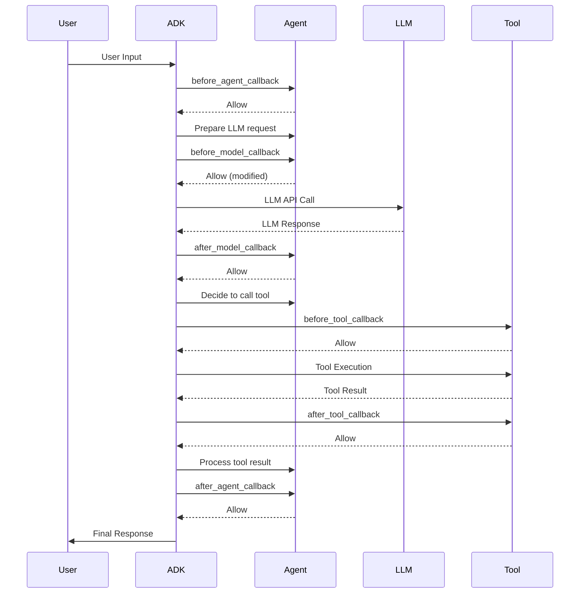

# Tutorial 09: Callbacks and Guardrails - Agent Safety and Monitoring

## Overview (總覽)

本教學將說明如何使用 **callbacks** 在特定的執行點觀察、客製化和控制代理行為。本教學將示範一個具有安全護欄、日誌記錄和請求/回應修改功能的內容審核系統。

**您將會建立什麼**：一個智慧內容助理，具備以下功能：

*   在請求到達 LLM 之前 **阻擋** 不適當的請求（護欄）。
*   在執行前 **驗證** 工具的參數。
*   **記錄** 所有 LLM 呼叫和工具執行（監控）。
*   **修改** 請求以新增安全指令。
*   **過濾** 回應以移除敏感資訊。
*   在會話狀態中 **追蹤** 使用指標。

**為何重要**：生產環境中的代理需要安全檢查、監控和控制機制。回呼（Callbacks）可以在不修改核心代理邏輯的情況下提供這些功能。

---

## Prerequisites (先決條件)

*   Python 3.9+
*   已安裝 `google-adk` (`pip install google-adk`)
*   Google API 金鑰
*   已完成教學 01、02 和 08（代理、工具、狀態管理）

---

## Core Concepts (核心概念)

### What are Callbacks? (什麼是回呼？)

**Callbacks** 是您定義的函式，ADK 會在特定的執行點自動呼叫它們。它們能夠實現：

*   **可觀察性 (Observability)**：日誌記錄和監控。
*   **控制 (Control)**：阻擋或修改操作。
*   **客製化 (Customization)**：動態調整行為。
*   **護欄 (Guardrails)**：強制執行安全策略。

### Callback Types (回呼類型)

**代理生命週期 (Agent Lifecycle)** (所有代理類型):

*   `before_agent_callback`: 在代理主要邏輯開始前。
*   `after_agent_callback`: 在代理完成後。

**LLM 互動 (LLM Interaction)** (僅限 LlmAgent):

*   `before_model_callback`: 在 LLM API 呼叫前。
*   `after_model_callback`: 在收到 LLM 回應後。

**工具執行 (Tool Execution)** (僅限 LlmAgent):

*   `before_tool_callback`: 在工具函式執行前。
*   `after_tool_callback`: 在工具函式完成後。

### Control Flow Pattern (控制流模式)

*   **Return `None`** → 正常進行（允許預設行為）。
*   **Return Object** → 覆寫/跳過操作：
    *   `before_agent_callback` → `Content`: 跳過代理執行。
    *   `before_model_callback` → `LlmResponse`: 跳過 LLM 呼叫，使用返回的回應。
    *   `before_tool_callback` → `dict`: 跳過工具執行，使用返回的結果。
    *   `after_agent_callback` → `Content`: 取代代理輸出。
    *   `after_model_callback` → `LlmResponse`: 取代 LLM 回應。
    *   `after_tool_callback` → `dict`: 取代工具結果。

---

## Use Case: Content Moderation Assistant (使用案例：內容審核助理)

**情境**：建立一個寫作助理，能夠：

*   阻擋包含褻瀆或仇恨言論的請求。
*   驗證工具參數（例如，不允許負數的字數）。
*   記錄所有 LLM 呼叫以供審核。
*   為每個 LLM 請求新增安全指令。
*   從回應中過濾個人身份資訊（PII）。
*   追蹤使用指標（LLM 呼叫、工具使用、被阻擋的請求）。

**安全需求**:

*   ✅ 阻擋不適當的輸入（在到達 LLM 之前）。
*   ✅ 驗證工具參數（在執行之前）。
*   ✅ 記錄所有操作（用於合規/除錯）。
*   ✅ 過濾輸出（移除敏感資料）。
*   ✅ 追蹤指標（用於監控）。

---

## Implementation (實作)

### Project Structure (專案結構)

```
content_moderator/
├── __init__.py          # 匯入代理
├── agent.py             # 代理定義與回呼
└── .env                 # API 金鑰
```

### Complete Code (完整程式碼)

**content_moderator/agent.py**:

```python
"""
內容審核助理 - 展示回呼與護欄功能

此代理使用回呼來實現：
- 護欄：阻擋不適當的內容 (before_model_callback)
- 驗證：檢查工具參數 (before_tool_callback)
- 日誌記錄：追蹤所有操作 (多個回呼)
- 修改：新增安全指令 (before_model_callback)
- 過濾：從回應中移除個人身份資訊（PII） (after_model_callback)
- 指標：追蹤使用統計資料 (狀態管理)
"""
from google.adk.agents import Agent, CallbackContext
from google.adk.tools.tool_context import ToolContext
from google.genai import types
from typing import Dict, Any, Optional
import re
import logging

# 設定日誌記錄
logging.basicConfig(level=logging.INFO)
logger = logging.getLogger(__name__)

# ============================================================================
# BLOCKLIST CONFIGURATION
# ============================================================================
# 示範用的簡化封鎖清單
BLOCKED_WORDS = [
    'profanity1', 'profanity2', 'hate-speech',  # 請用真實詞彙替換
    'offensive-term', 'inappropriate-word'
]

# 用於過濾的 PII 模式
PII_PATTERNS = {
    'email': r'\b[A-Za-z0-9._%+-]+@[A-Za-z0-9.-]+\.[A-Z|a-z]{2,}\b',
    'phone': r'\b\d{3}[-.]?\d{3}[-.]?\d{4}\b',
    'ssn': r'\b\d{3}-\d{2}-\d{4}\b',
    'credit_card': r'\b\d{4}[-\s]?\d{4}[-\s]?\d{4}[-\s]?\d{4}\b'
}

# ============================================================================
# CALLBACK FUNCTIONS
# ============================================================================
def before_agent_callback(callback_context: CallbackContext) -> Optional[types.Content]:
    """在代理開始處理請求前呼叫。
    用途：檢查代理是否應該處理此請求。
    返回：
        None: 允許代理繼續。
        Content: 跳過代理執行，使用返回的內容作為回應。
    """
    logger.info(f"[AGENT START] Session: {callback_context.invocation_id}")
    # 檢查代理是否處於維護模式（應用程式狀態）
    if callback_context.state.get('app:maintenance_mode', False):
        logger.warning("[AGENT BLOCKED] Maintenance mode active")
        return types.Content(
            parts=[types.Part(text="System is currently under maintenance. Please try again later.")],
            role="model"
        )
    # 增加請求計數器
    count = callback_context.state.get('user:request_count', 0)
    callback_context.state['user:request_count'] = count + 1
    return None  # 允許代理繼續

def after_agent_callback(callback_context: CallbackContext, content: types.Content) -> Optional[types.Content]:
    """在代理完成處理後呼叫。
    用途：後處理或驗證最終輸出。
    返回：
        None: 使用代理的原始輸出。
        Content: 以此內容取代代理的輸出。
    """
    logger.info(f"[AGENT COMPLETE] Generated {len(content.parts)} parts")
    # 追蹤成功完成的次數
    callback_context.state['temp:agent_completed'] = True
    return None  # 使用原始輸出

def before_model_callback(
    callback_context: CallbackContext,
    llm_request: types.GenerateContentRequest
) -> Optional[types.GenerateContentResponse]:
    """在向 LLM 發送請求前呼叫。
    用途：
    1. 護欄：阻擋不適當的請求。
    2. 修改：新增安全指令。
    3. 快取：返回快取的回應。
    4. 日誌：追蹤 LLM 使用情況。
    返回：
        None: 允許 LLM 呼叫繼續。
        LlmResponse: 跳過 LLM 呼叫，改用此回應。
    """
    # 提取使用者輸入
    user_text = ""
    for content in llm_request.contents:
        for part in content.parts:
            if part.text:
                user_text += part.text
    logger.info(f"[LLM REQUEST] Length: {len(user_text)} chars")
    # 護欄：檢查封鎖詞彙
    for word in BLOCKED_WORDS:
        if word.lower() in user_text.lower():
            logger.warning(f"[LLM BLOCKED] Found blocked word: {word}")
            # 追蹤被阻擋的請求
            blocked_count = callback_context.state.get('user:blocked_requests', 0)
            callback_context.state['user:blocked_requests'] = blocked_count + 1
            # 返回錯誤回應（跳過 LLM 呼叫）
            return types.GenerateContentResponse(
                candidates=[
                    types.Candidate(
                        content=types.Content(
                            parts=[types.Part(
                                text="I cannot process this request as it contains inappropriate content. Please rephrase respectfully."
                            )],
                            role="model"
                        )
                    )
                ]
            )
    # 修改：新增安全指令
    safety_instruction = "\n\nIMPORTANT: Do not generate harmful, biased, or inappropriate content. If the request is unclear, ask for clarification."
    if llm_request.config and llm_request.config.system_instruction:
        llm_request.config.system_instruction += safety_instruction
    # 追蹤 LLM 呼叫
    llm_count = callback_context.state.get('user:llm_calls', 0)
    callback_context.state['user:llm_calls'] = llm_count + 1
    return None  # 允許 LLM 呼叫（帶有修改）

def after_model_callback(
    callback_context: CallbackContext,
    llm_response: types.GenerateContentResponse
) -> Optional[types.GenerateContentResponse]:
    """在從 LLM 收到回應後呼叫。
    用途：
    1. 過濾：移除 PII 或敏感資料。
    2. 格式化：標準化輸出格式。
    3. 日誌：追蹤回應品質。
    返回：
        None: 使用原始 LLM 回應。
        LlmResponse: 以修改後的回應取代。
    """
    # 提取回應文本
    response_text = ""
    if llm_response.candidates:
        for part in llm_response.candidates[0].content.parts:
            if part.text:
                response_text += part.text
    logger.info(f"[LLM RESPONSE] Length: {len(response_text)} chars")
    # 過濾：移除 PII 模式
    filtered_text = response_text
    for pii_type, pattern in PII_PATTERNS.items():
        matches = re.findall(pattern, filtered_text)
        if matches:
            logger.warning(f"[FILTERED] Found {len(matches)} {pii_type} instances")
            filtered_text = re.sub(pattern, f'[{pii_type.upper()}_REDACTED]', filtered_text)
    # 如果過濾了任何內容，返回修改後的回應
    if filtered_text != response_text:
        return types.GenerateContentResponse(
            candidates=[
                types.Candidate(
                    content=types.Content(
                        parts=[types.Part(text=filtered_text)],
                        role="model"
                    )
                )
            ]
        )
    return None  # 使用原始回應

def before_tool_callback(
    callback_context: CallbackContext,
    tool_name: str,
    args: Dict[str, Any]
) -> Optional[Dict[str, Any]]:
    """在執行工具前呼叫。
    用途：
    1. 驗證：檢查參數是否有效。
    2. 授權：檢查使用者權限。
    3. 速率限制：強制執行使用限制。
    4. 日誌：追蹤工具使用情況。
    返回：
        None: 允許工具執行。
        dict: 跳過工具執行，改用此結果。
    """
    logger.info(f"[TOOL CALL] {tool_name} with args: {args}")
    # 驗證：檢查 generate_text 中的負數值
    if tool_name == 'generate_text':
        word_count = args.get('word_count', 0)
        if word_count <= 0 or word_count > 5000:
            logger.warning(f"[TOOL BLOCKED] Invalid word_count: {word_count}")
            return {
                'status': 'error',
                'message': f'Invalid word_count: {word_count}. Must be between 1 and 5000.'
            }
    # 速率限制：檢查工具使用配額
    tool_count = callback_context.state.get(f'user:tool_{tool_name}_count', 0)
    if tool_count >= 100:  # 範例限制
        logger.warning(f"[TOOL BLOCKED] Rate limit exceeded for {tool_name}")
        return {
            'status': 'error',
            'message': f'Rate limit exceeded for {tool_name}. Please try again later.'
        }
    # 追蹤工具使用
    callback_context.state[f'user:tool_{tool_name}_count'] = tool_count + 1
    callback_context.state['temp:last_tool'] = tool_name
    return None  # 允許工具執行

def after_tool_callback(
    callback_context: CallbackContext,
    tool_name: str,
    tool_response: Dict[str, Any]
) -> Optional[Dict[str, Any]]:
    """在工具執行完成後呼叫。
    用途：
    1. 日誌：記錄結果。
    2. 轉換：標準化輸出格式。
    3. 快取：儲存結果以供未來使用。
    返回：
        None: 使用原始工具結果。
        dict: 以修改後的結果取代。
    """
    logger.info(f"[TOOL RESULT] {tool_name}: {tool_response.get('status', 'unknown')}")
    # 儲存最後的工具結果以供除錯
    callback_context.state['temp:last_tool_result'] = str(tool_response)
    return None  # 使用原始結果

# ============================================================================
# TOOLS
# ============================================================================
def generate_text(topic: str, word_count: int, tool_context: ToolContext) -> Dict[str, Any]:
    """根據指定主題和字數生成文本。"""
    return {
        'status': 'success',
        'topic': topic,
        'word_count': word_count,
        'message': f'Generated {word_count}-word article on "{topic}"'
    }

def check_grammar(text: str, tool_context: ToolContext) -> Dict[str, Any]:
    """檢查文法並提供修正建議。"""
    issues_found = len(text.split()) // 10
    return {
        'status': 'success',
        'issues_found': issues_found,
        'message': f'Found {issues_found} potential grammar issues'
    }

def get_usage_stats(tool_context: ToolContext) -> Dict[str, Any]:
    """從狀態中獲取使用者使用統計資料。"""
    return {
        'status': 'success',
        'request_count': tool_context.state.get('user:request_count', 0),
        'llm_calls': tool_context.state.get('user:llm_calls', 0),
        'blocked_requests': tool_context.state.get('user:blocked_requests', 0),
        'tool_generate_text_count': tool_context.state.get('user:tool_generate_text_count', 0),
        'tool_check_grammar_count': tool_context.state.get('user:tool_check_grammar_count', 0)
    }

# ============================================================================
# AGENT DEFINITION
# ============================================================================
root_agent = Agent(
    name="content_moderator",
    model="gemini-2.0-flash",
    description="具有安全護欄、驗證和監控功能的內容審核助理。",
    instruction="您是一位寫作助理，幫助使用者創建和完善內容。",
    tools=[generate_text, check_grammar, get_usage_stats],
    # ============================================================================
    # CALLBACKS CONFIGURATION
    # ============================================================================
    before_agent_callback=before_agent_callback,
    after_agent_callback=after_agent_callback,
    before_model_callback=before_model_callback,
    after_model_callback=after_model_callback,
    before_tool_callback=before_tool_callback,
    after_tool_callback=after_tool_callback,
    output_key="last_response"
)
```

---

## Running the Agent (執行代理)

### Option 1: Dev UI (Recommended) (選項一：開發者介面 (建議))

```bash
cd /path/to/content_moderator
adk web .
```

**測試情境**:

1.  **正常請求** (所有回呼皆允許):
    *   **使用者**: `"Generate a 500-word article about Python programming"`
    *   **流程**: `before_agent` → `before_model` → `before_tool` → `generate_text` → `after_tool` → `after_model` → `after_agent` → **成功回應**。
2.  **被阻擋的請求** (護欄觸發):
    *   **使用者**: `"Write about profanity1 and hate-speech"`
    *   **流程**: `before_agent` → `before_model` (發現封鎖詞彙) → **阻擋** → **錯誤回應** (LLM 未被呼叫)。
3.  **無效的工具參數** (驗證失敗):
    *   **使用者**: `"Generate an article with -100 words"`
    *   **流程**: `before_agent` → `before_model` → `before_tool` (驗證 `word_count` < 0) → **阻擋** → **錯誤回應** (工具未被執行)。
4.  **PII 過濾** (`after_model` 過濾回應):
    *   **使用者**: `"Give me an example email"`
    *   **流程**: LLM 生成 `"john.doe@example.com"` → `after_model` (發現 email 模式) → **過濾** → **回應** `"Sure! [EMAIL_REDACTED] is a valid email."`。
5.  **使用統計** (狀態追蹤):
    *   **使用者**: `"Show my usage stats"`
    *   **流程**: `get_usage_stats` 工具讀取狀態 → **回應** 包含請求次數、LLM 呼叫次數等統計資料。

### Option 2: CLI (選項二：命令列介面)

```bash
adk run content_moderator
```

---

## Understanding the Behavior (理解行為)

### Execution Flow with Callbacks (帶有回呼的執行流程)



### Events Tab View (事件分頁檢視)

在 `adk web` 中，事件分頁會顯示：

**正常流程**:
```
事件 1: user_request (使用者請求)
事件 2: before_agent_callback executed (before_agent_callback 已執行)
事件 3: state_update (user:request_count = 1) (狀態更新 (user:request_count = 1))
事件 4: before_model_callback executed (before_model_callback 已執行)
事件 5: state_update (user:llm_calls = 1) (狀態更新 (user:llm_calls = 1))
事件 6: llm_request sent (llm_request 已發送)
事件 7: llm_response received (llm_response 已接收)
事件 8: after_model_callback executed (after_model_callback 已執行)
事件 9: before_tool_callback executed (before_tool_callback 已執行)
事件 10: state_update (user:tool_generate_text_count = 1) (狀態更新 (user:tool_generate_text_count = 1))
事件 11: tool_call (generate_text) (工具呼叫 (generate_text))
事件 12: tool_result (工具結果)
事件 13: after_tool_callback executed (after_tool_callback 已執行)
事件 14: after_agent_callback executed (after_agent_callback 已執行)
事件 15: final_response (最終回應)
```
```

**被阻擋的流程** (護欄觸發):
```
事件 1: user_request (使用者請求)
事件 2: before_agent_callback executed (before_agent_callback 已執行)
事件 3: state_update (user:request_count = 1) (狀態更新 (user:request_count = 1))
事件 4: before_model_callback executed (before_model_callback 已執行)
事件 5: BLOCKED! (found blocked word) (已阻擋！(發現封鎖詞彙))
事件 6: state_update (user:blocked_requests = 1) (狀態更新 (user:blocked_requests = 1))
事件 7: synthetic_llm_response (from callback) (合成的 llm_response (來自回呼))
事件 8: after_agent_callback executed (after_agent_callback 已執行)
事件 9: final_response (error message) (最終回應 (錯誤訊息))
```
```
**注意**: 當請求被阻擋時，不會有 `llm_request` 或 `tool_call` 事件。

---

## How It Works: Callback Patterns Deep Dive (運作原理：回呼模式深入探討)

### Pattern 1: Guardrails (Block Before Execution) (模式一：護欄（執行前阻擋）)
```python
def before_model_callback(callback_context, llm_request):
    # Check condition
    if contains_blocked_content(llm_request):
        # Return response object to SKIP LLM call
        return types.GenerateContentResponse(...)

    return None  # Allow LLM call
```

在 `before_model_callback` 中，如果請求包含被封鎖的內容，則返回一個 `GenerateContentResponse` 物件以跳過 LLM 呼叫。這可以節省 API 成本並防止不當內容被處理。

### Pattern 2: Validation (Check Arguments) (模式二：驗證（檢查參數）)
```python
def before_tool_callback(callback_context, tool_name, args):
    # Validate arguments
    if args['word_count'] <= 0:
        # Return error dict to SKIP tool execution
        return {'status': 'error', 'message': '...'}

    return None  # Allow tool execution
```

在 `before_tool_callback` 中，驗證工具的參數。如果參數無效（例如 `word_count <= 0`），則返回一個錯誤字典以跳過工具執行。

### Pattern 3: Logging (Observe All Operations) (模式三：日誌記錄（觀察所有操作）)
```python
def before_tool_callback(callback_context, tool_name, args):
    logger.info(f"Tool: {tool_name}, Args: {args}")
    return None  # Just observe, don't block

def after_tool_callback(callback_context, tool_name, result):
    logger.info(f"Result: {result}")
    return None  # Just observe, don't modify
```
在 `before_*` 和 `after_*` 回呼中使用 `logger` 記錄操作和結果。返回 `None` 以確保僅觀察而不改變行為，從而建立審核追蹤。

### Pattern 4: Modification (Transform Data) (模式四：修改（轉換資料）)
```python
def before_model_callback(callback_context, llm_request):
    # Modify request in place
    llm_request.config.system_instruction += "\nBe concise."
    return None  # Allow modified request to proceed

def after_model_callback(callback_context, llm_response):
    # Replace response
    filtered_text = remove_pii(llm_response.text)
    return types.GenerateContentResponse(...)
```
*   在 `before_model_callback` 中，直接修改 `llm_request` 物件（例如新增系統指令），然後返回 `None` 以讓修改後的請求繼續。
*   在 `after_model_callback` 中，返回一個新的 `GenerateContentResponse` 物件以取代原始的 LLM 回應。

### Pattern 5: State Tracking (Metrics & Analytics) (模式五：狀態追蹤（指標與分析）)
```python
def before_model_callback(callback_context, llm_request):
    # Track metrics in state
    count = callback_context.state.get('user:llm_calls', 0)
    callback_context.state['user:llm_calls'] = count + 1
    return None
```
在回呼中使用 `callback_context.state` 來追蹤指標，例如 LLM 呼叫次數。狀態的變更會自動被保存。

---

## Key Takeaways (重點摘要)

1.  **Callbacks = Execution Hooks (回呼 = 執行鉤子)**:
    *   在代理生命週期的特定點執行。
    *   提供上下文（會話、狀態、請求/回應）。
    *   可以觀察、修改或阻擋操作。

2.  **Return `None` vs Object (返回 `None` 與物件的差異)**:
    *   `None` → 正常進行（允許預設行為）。
    *   `Object` → 覆寫/跳過操作。

3.  **Callback Types Serve Different Purposes (不同回呼類型有不同用途)**:
    *   `before_agent` → 授權、維護檢查。
    *   `before_model` → 護欄、請求修改。
    *   `after_model` → 回應過濾、PII 移除。
    *   `before_tool` → 參數驗證、速率限制。
    *   `after_tool` → 結果日誌、快取。
    *   `after_agent` → 最終輸出驗證。

4.  **State Management in Callbacks (回呼中的狀態管理)**:
    *   使用 `callback_context.state` 進行指標追蹤。
    *   變更會自動被追蹤。
    *   可以使用 `user:`、`app:`、`temp:` 前綴。

5.  **Callbacks Run Synchronously (回呼同步執行)**:
    *   保持回呼執行速度（避免長時間執行的操作）。
    *   繁重的處理應該被轉移到其他地方。
    *   每個回呼都會增加延遲。

---

## Best Practices (最佳實踐)

### Design Principles (設計原則)

**應該做**:

*   ✅ 保持回呼的單一職責。
*   ✅ 使用描述性的函式名稱。
*   ✅ 記錄重要的決策。
*   ✅ 優雅地處理錯誤。
*   ✅ 為每個回呼撰寫文件。

**不應該做**:

*   ❌ 在回呼中進行大量計算。
*   ❌ 進行外部 API 呼叫（如果可能）。
*   ❌ 建立龐大的單體回呼。
*   ❌ 忘記在允許預設行為時返回 `None`。

### Error Handling (錯誤處理)
```python
def before_model_callback(callback_context, llm_request):
    try:
        # Check for blocked content
        if check_blocklist(llm_request):
            return create_blocked_response()
        return None
    except Exception as e:
        logger.error(f"Callback error: {e}")
        # Decide: Block request or allow?
        return None  # Allow on error (fail open)
        # OR
        # return create_error_response()  # Block on error (fail closed)
```
在回呼中使用 `try...except` 區塊來捕捉潛在的錯誤，並決定是允許請求繼續（fail open）還是阻擋請求（fail closed）。

### State Management (狀態管理)
```python
def track_usage(callback_context):
    # Use descriptive keys
    key = f'user:{callback_context.user_id}:llm_calls'

    # Initialize if not exists
    count = callback_context.state.get(key, 0)

    # Update
    callback_context.state[key] = count + 1
```
使用具有描述性的鍵名來更新狀態，並在更新前檢查鍵名是否存在以進行初始化。

### Testing Callbacks (測試回呼)
```python
# Unit test with mock context
def test_before_model_blocks_profanity():
    mock_context = MockCallbackContext()
    mock_request = create_request_with_profanity()

    result = before_model_callback(mock_context, mock_request)

    assert result is not None  # Should block
    assert "inappropriate content" in result.text
```
使用模擬的上下文（mock context）對回呼函式進行單元測試，以確保其行為符合預期。

---

## Common Issues & Troubleshooting (常見問題與疑難排解)

### Issue 1: Callback Not Running (問題一：回呼未執行)

**問題**：回呼函式 `before_model_callback` 從未被呼叫。

**解決方案**：

1.  **檢查回呼是否已在 Agent 中正確設定**：
    ```python
    root_agent = Agent(
        ...,
        before_model_callback=my_callback  # 必須設定！
    )
    ```

2.  **驗證回呼函式簽名是否匹配**：
    ```python
    # 正確的簽名
    def before_model_callback(
        callback_context: CallbackContext,
        llm_request: types.GenerateContentRequest
    ) -> Optional[types.GenerateContentResponse]:
        ...
    ```

3.  **檢查代理類型**：
    *   模型回呼（`before_model_callback`、`after_model_callback`）僅適用於 `LlmAgent`。
    *   工具回呼（`before_tool_callback`、`after_tool_callback`）僅適用於 `LlmAgent`。
    *   代理回呼（`before_agent_callback`、`after_agent_callback`）適用於所有代理類型。

### Issue 2: Callback Blocks Everything (問題二：回呼阻擋所有請求)

**問題**：所有請求都意外地被阻擋。

**解決方案**：

1.  **檢查返回值**：
    ```python
    # 錯誤：總是返回物件（阻擋所有）
    def before_model_callback(ctx, req):
        return types.GenerateContentResponse(...)

    # 正確：返回 None 以允許
    def before_model_callback(ctx, req):
        if should_block(req):
            return types.GenerateContentResponse(...)
        return None  # 允許！
    ```

2.  **新增偵錯日誌以了解流程**。

3.  **獨立測試回呼邏輯**。

### Issue 3: State Changes Not Persisting (問題三：狀態變更未持續存在)

**問題**：在回呼中設定的狀態在稍後消失了。

**解決方案**：

1.  **使用正確的上下文**：
    ```python
    # 錯誤：錯誤的上下文類型
    def my_callback(context, ...):
        context.state['key'] = 'value'  # 錯誤！

    # 正確：使用 callback_context
    def my_callback(callback_context: CallbackContext, ...):
        callback_context.state['key'] = 'value'  # 正確！
    ```

2.  **確保使用持久的 SessionService 來處理跨會話狀態**。

3.  **記住 `temp:` 前綴永遠不會被持久化**。

### Issue 4: Callback Causes Errors (問題四：回呼導致錯誤)

**問題**：代理在回呼執行時崩潰。

**解決方案**：

1.  **新增錯誤處理**：
    ```python
    def before_model_callback(ctx, req):
        try:
            # 回呼邏輯
            ...
        except Exception as e:
            logger.error(f"Callback failed: {e}")
            return None  # 在錯誤時允許
    ```

2.  **檢查所有必要的匯入是否存在**。

3.  **在存取前驗證上下文/請求物件**。

4.  **獨立測試回呼**。

---

## Real-World Applications (真實世界應用)

### 1. Content Moderation Platform (內容審核平台)

**使用案例**：社群媒體平台、論壇、使用者生成內容網站。

**回呼實作**：

*   **`before_model_callback`**：阻擋仇恨言論、褻瀆語言和非法內容。
    ```python
    def before_model_callback(ctx, req):
        if contains_hate_speech(req) or contains_illegal_content(req):
            return create_blocked_response("Inappropriate content detected")
        return None
    ```

*   **`after_model_callback`**：過濾個人身份資訊（PII），編輯敏感資訊。
    ```python
    def after_model_callback(ctx, resp):
        filtered_text = remove_pii(resp.text)
        filtered_text = redact_sensitive_info(filtered_text)
        return create_response(filtered_text)
    ```

*   **`before_tool_callback`**：驗證圖片 URL，檢查檔案大小。
    ```python
    def before_tool_callback(ctx, tool_name, args):
        if tool_name == 'upload_image':
            if not is_valid_url(args['url']) or args['size'] > MAX_SIZE:
                return {'status': 'error', 'message': 'Invalid image'}
        return None
    ```

*   **狀態追蹤**：使用指標、違規次數。
    ```python
    ctx.state['user:violation_count'] = ctx.state.get('user:violation_count', 0) + 1
    ctx.state['app:total_moderated'] = ctx.state.get('app:total_moderated', 0) + 1
    ```

---

### 2. Enterprise Support Agent (企業支援代理)

**使用案例**：客戶服務中心、技術支援平台、內部支援系統。

**回呼實作**：

*   **`before_agent_callback`**：檢查使用者權限，強制執行營業時間。
    ```python
    def before_agent_callback(ctx):
        if not is_business_hours():
            return create_response("Support is available Mon-Fri, 9AM-5PM")
        if not has_permission(ctx.user_id):
            return create_response("Unauthorized access")
        return None
    ```

*   **`before_tool_callback`**：驗證客戶 ID，檢查授權。
    ```python
    def before_tool_callback(ctx, tool_name, args):
        if tool_name == 'get_customer_data':
            if not is_valid_customer_id(args['customer_id']):
                return {'status': 'error', 'message': 'Invalid customer ID'}
            if not is_authorized(ctx.user_id, args['customer_id']):
                return {'status': 'error', 'message': 'Not authorized'}
        return None
    ```

*   **`after_tool_callback`**：記錄所有資料庫查詢以供審核。
    ```python
    def after_tool_callback(ctx, tool_name, result):
        if tool_name.startswith('db_'):
            audit_log.write({
                'user': ctx.user_id,
                'tool': tool_name,
                'result': result,
                'timestamp': datetime.now()
            })
        return None
    ```

*   **狀態追蹤**：支援單數量、解決時間。
    ```python
    ctx.state['user:ticket_count'] = ctx.state.get('user:ticket_count', 0) + 1
    ctx.state['temp:ticket_start_time'] = time.time()
    # 在 after_agent_callback 中計算解決時間
    ```

---

### 3. Healthcare Assistant (醫療保健助理)

**使用案例**：病患入口網站、遠程醫療平台、醫療記錄系統。

**回呼實作**：

*   **`before_model_callback`**：強制執行 HIPAA 法規遵循，阻擋日誌中的 PHI（受保護的健康資訊）。
    ```python
    def before_model_callback(ctx, req):
        # 確保不將 PHI 記錄到日誌中
        sanitized_request = remove_phi_for_logging(req)
        logger.info(f"Request: {sanitized_request}")

        # 檢查法規遵循
        if not is_hipaa_compliant(req):
            return create_response("Request violates HIPAA guidelines")
        return None
    ```

*   **`after_model_callback`**：為所有回應新增醫療免責聲明。
    ```python
    def after_model_callback(ctx, resp):
        disclaimer = "\n\n**Medical Disclaimer**: This information is for educational purposes only. Consult a healthcare provider for medical advice."
        modified_text = resp.text + disclaimer
        return create_response(modified_text)
    ```

*   **`before_tool_callback`**：在存取資料前驗證病患同意。
    ```python
    def before_tool_callback(ctx, tool_name, args):
        if tool_name == 'get_patient_records':
            if not has_patient_consent(args['patient_id'], ctx.user_id):
                return {'status': 'error', 'message': 'Patient consent required'}
        return None
    ```

*   **狀態追蹤**：諮詢次數、法規遵循檢查。
    ```python
    ctx.state['user:consultation_count'] = ctx.state.get('user:consultation_count', 0) + 1
    ctx.state['app:hipaa_checks_passed'] = ctx.state.get('app:hipaa_checks_passed', 0) + 1
    ```

---

### 4. Financial Advisor Bot (財務顧問機器人)

**使用案例**：投資平台、銀行服務、交易系統。

**回呼實作**：

*   **`before_agent_callback`**：檢查市場開放時間、交易權限。
    ```python
    def before_agent_callback(ctx):
        if not is_market_open():
            return create_response("Markets are currently closed")
        if not has_trading_permission(ctx.user_id):
            return create_response("Trading permission required")
        return None
    ```

*   **`before_tool_callback`**：驗證交易金額，檢查詐騙模式。
    ```python
    def before_tool_callback(ctx, tool_name, args):
        if tool_name == 'execute_trade':
            amount = args['amount']
            if amount <= 0 or amount > get_account_balance(ctx.user_id):
                return {'status': 'error', 'message': 'Invalid transaction amount'}
            if is_suspicious_pattern(ctx.user_id, amount):
                return {'status': 'blocked', 'message': 'Transaction flagged for review'}
        return None
    ```

*   **`after_tool_callback`**：加密敏感的財務資料。
    ```python
    def after_tool_callback(ctx, tool_name, result):
        if tool_name in ['get_account_info', 'get_transaction_history']:
            result['account_number'] = encrypt(result['account_number'])
            result['balance'] = encrypt(result['balance'])
        return result
    ```

*   **狀態追蹤**：交易次數、風險評分。
    ```python
    ctx.state['user:transaction_count'] = ctx.state.get('user:transaction_count', 0) + 1
    ctx.state['user:risk_score'] = calculate_risk_score(ctx.user_id)
    ```

---

### Key Implementation Patterns Across Use Cases (跨使用案例的關鍵實作模式)

1.  **Authorization & Access Control (授權與存取控制)**：
    *   使用 `before_agent_callback` 進行會話級別的存取檢查。
    *   使用 `before_tool_callback` 進行資源級別的授權。

2.  **Compliance & Regulation (法規遵循與監管)**：
    *   使用 `before_model_callback` 強制執行內容政策。
    *   使用 `after_model_callback` 新增必要的免責聲明。
    *   使用 `after_tool_callback` 記錄審核追蹤。

3.  **Data Protection (資料保護)**：
    *   使用 `after_model_callback` 過濾/編輯敏感資訊。
    *   使用 `after_tool_callback` 加密敏感資料。
    *   使用 `before_model_callback` 防止日誌中出現敏感資料。

4.  **Validation & Fraud Prevention (驗證與詐騙預防)**：
    *   使用 `before_tool_callback` 驗證參數。
    *   使用狀態追蹤來偵測可疑模式。
    *   使用 `before_agent_callback` 強制執行業務規則。

5.  **Monitoring & Analytics (監控與分析)**：
    *   使用狀態管理追蹤跨會話的指標。
    *   使用 `after_*` 回呼進行日誌記錄和分析。
    *   使用 `temp:` 狀態進行會話內的追蹤。


---

## Next Steps (後續步驟)

🚀 **教學 10: 評估與測試** - 學習如何系統性地測試代理行為與回呼。

**練習**:
1.  新增 `before_agent_callback` 來檢查使用者的速率限制。
2.  在 `before_model_callback` 中使用狀態實現快取。
3.  建立一個 `after_tool_callback` 將所有工具結果儲存到資料庫。
4.  建立一個客製化的 PII 過濾器來處理額外的模式。

---

## Working Implementation (可運作的實作)

一個完整、可用於生產的實作可在以下連結找到：
**📁 [內容審查助理（Content Moderation Assistant](../../../python/agents/content-moderator/)**

### What's Included (包含內容)
*   ✅ **完整的代理**：包含所有 6 種類型回呼的內容審核器。
*   ✅ **全面的測試**：11 個測試案例，涵蓋所有回呼情境。
*   ✅ **生產功能**：日誌、指標、PII 過濾、速率限制。
*   ✅ **開發者工具**：Makefile、requirements.txt、詳細的 README。
*   ✅ **安全性**：封鎖清單過濾、輸入驗證、護欄。

### Quick Start (快速入門)
```bash
cd tutorial_implementation/tutorial09/content_moderator
make setup
cp .env.example .env  # 新增您的 GOOGLE_API_KEY
make test             # 執行全面測試
make dev              # 啟動 ADK 網頁介面
```

### Features Demonstrated (功能展示)

**護欄與安全 (Guardrails & Safety)**:
*   在 LLM 呼叫前阻擋不當言論
*   從回應中過濾 PII
*   驗證工具參數
*   速率限制保護

**監控與可觀察性 (Monitoring & Observability)**:
*   完整的審核日誌
*   使用指標追蹤
*   跨會話的狀態管理
*   效能監控

**回呼模式 (Callback Patterns)**:
*   所有 6 種回呼類型的實作
*   控制流範例（阻擋 vs 允許）
*   狀態操作模式
*   錯誤處理最佳實踐

### Test Coverage (測試覆蓋範圍)
實作中包含了對以下功能的全面測試：
*   維護模式阻擋
*   請求計數
*   不當言論過濾
*   安全指令注入
*   PII 編輯
*   工具驗證
*   速率限制
*   結果日誌
*   工具功能
*   使用統計

---

## Code Implementation (程式碼實現)

- **Content Moderator**：[程式碼連結](../../../python/agents/content-moderator/)

---

## Further Reading (延伸閱讀)

*   [Callbacks Documentation](https://google.github.io/adk-docs/callbacks/)
*   [Types of Callbacks](https://google.github.io/adk-docs/callbacks/types-of-callbacks/)
*   [Callback Design Patterns](https://google.github.io/adk-docs/callbacks/design-patterns-and-best-practices/)
*   [Safety & Security Guide](https://google.github.io/adk-docs/safety/)
*   [Context Objects Reference](https://google.github.io/adk-docs/context/)
