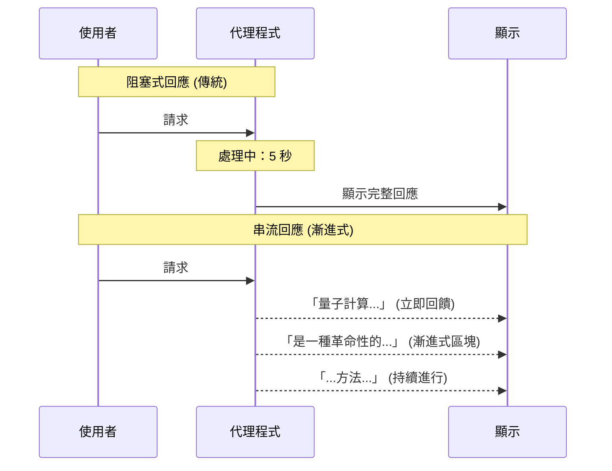
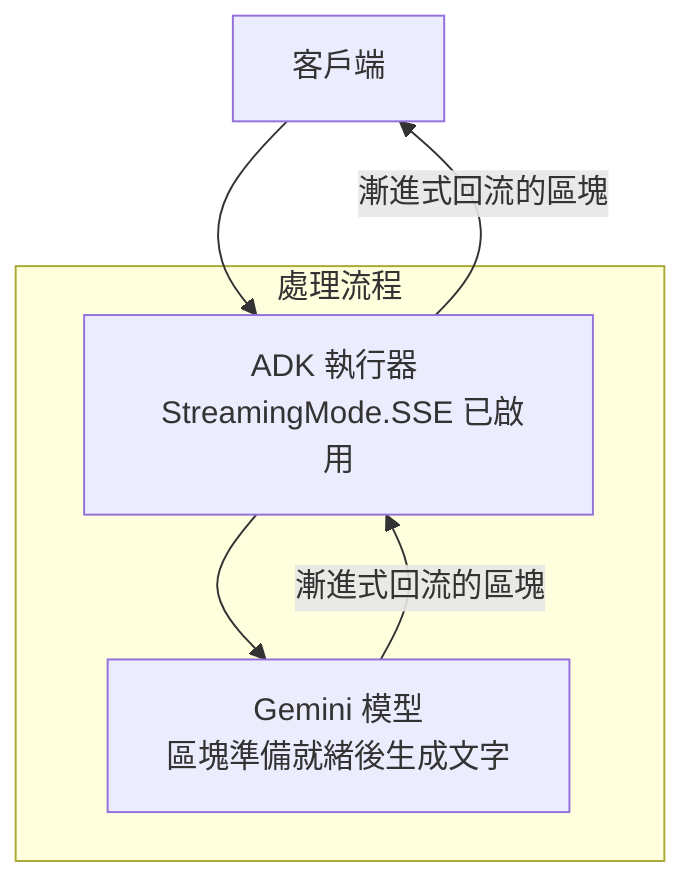
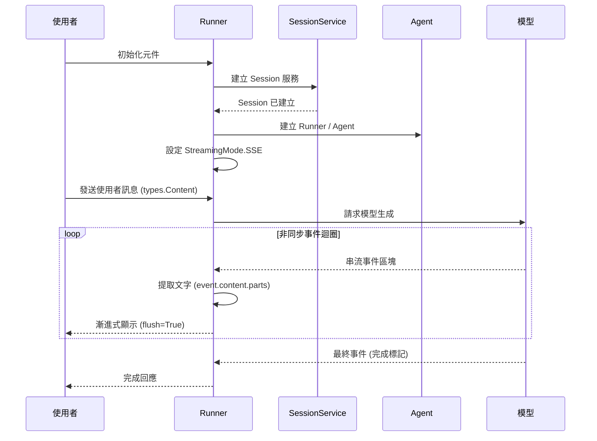
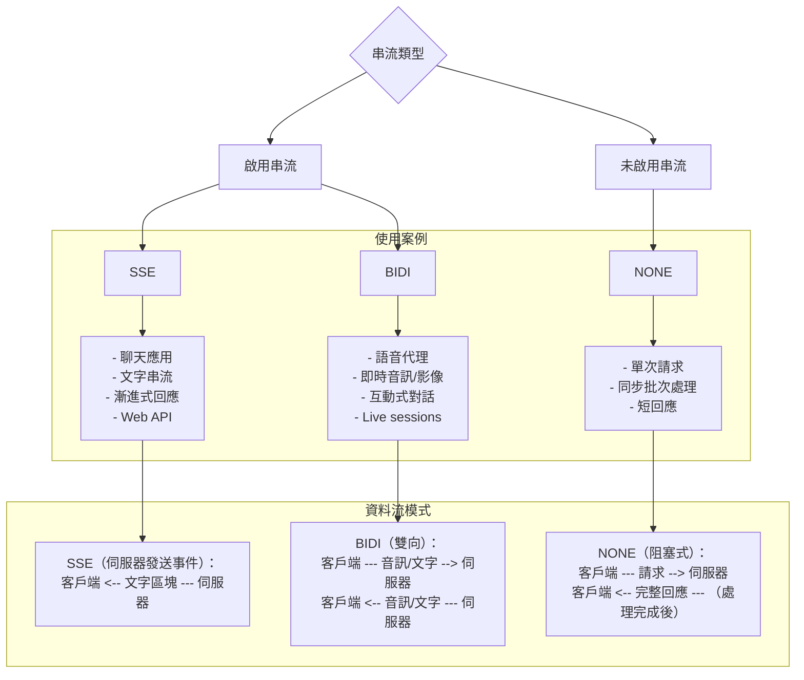
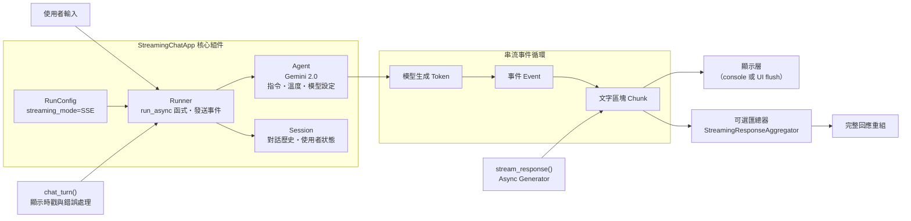
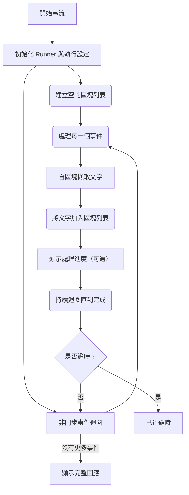
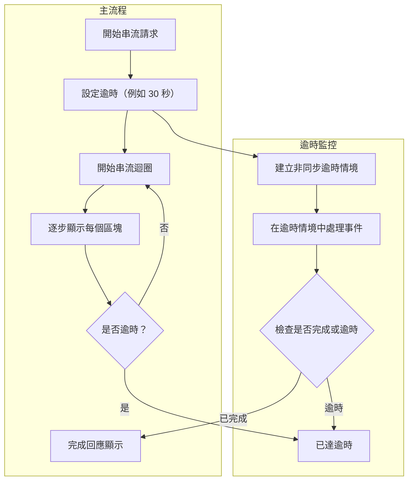
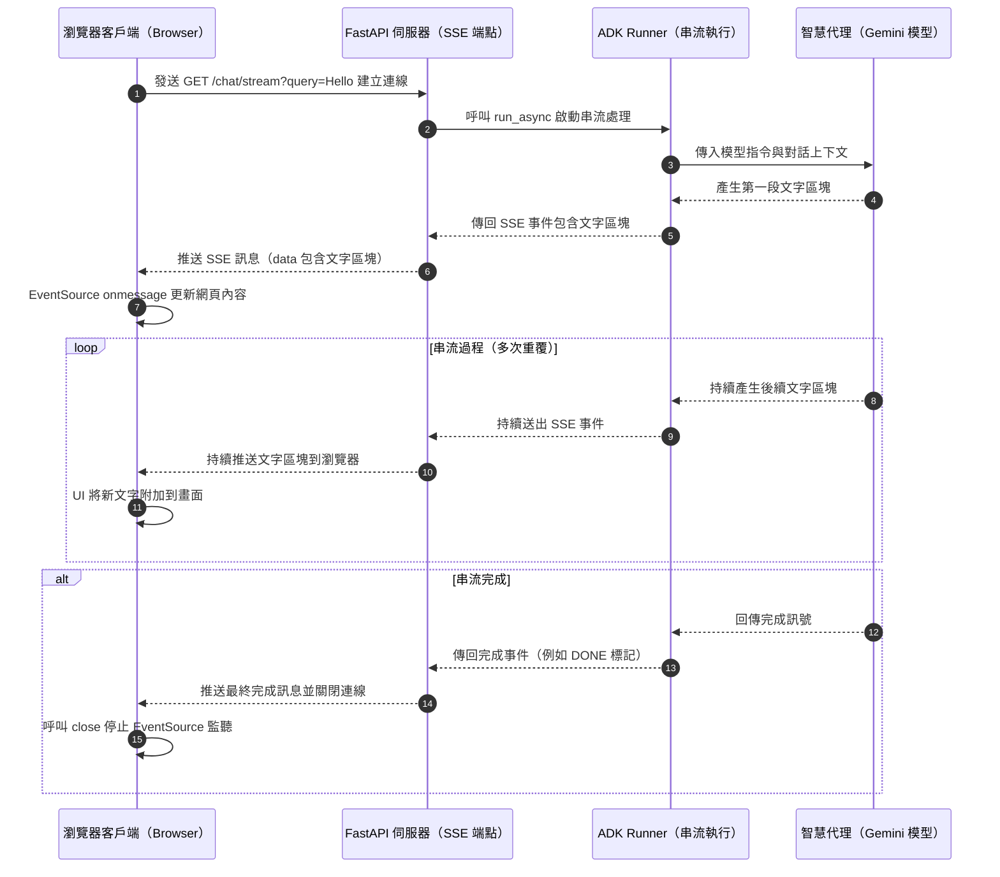

# 教學 14：串流與伺服器發送事件 (Streaming and Server-Sent Events, SSE)

**目標**：實作使用伺服器發送事件 (SSE) 的串流回應，以提供即時、漸進式的輸出，為您的 AI 代理程式提供更好的使用者體驗。

**先決條件**：
*   教學 01 (Hello World Agent)
*   教學 02 (Function Tools)
*   對 Python 中的 async/await 有基本了解

**您將學到**：
*   了解串流與非串流回應的差異
*   使用 `StreamingMode.SSE` 實作 SSE 串流
*   使用 `RunConfig` 進行串流設定
*   建立即時聊天介面
*   匯總串流回應
*   生產環境中串流應用的最佳實踐

**完成時間**：45-60 分鐘

---

## 為何串流如此重要 (Why Streaming Matters)

傳統的 AI 回應是**阻塞式**的——使用者在看到任何內容之前，必須等待完整的答案。串流則在模型生成文字時提供**漸進式輸出**。

**無串流 (阻塞式)**：
```
使用者：「解釋量子計算」
代理程式：[等待 5 秒...]
      [完整回應一次性出現]
```

**有串流 (漸進式)**：
```
使用者：「解釋量子計算」
代理程式：「量子計算是一種革命性的...」
      [文字逐字或逐塊出現]
      [使用者立即看到進度]
```

**優點**：
*   ✅ **更佳的使用者體驗**：使用者能立即看到進度
*   ✅ **感知速度**：即使總時間相似，感覺也更快
*   ✅ **早期回饋**：使用者可以在需要時中斷
*   ✅ **即時感**：更具對話性和吸引力
*   ✅ **長篇回應**：對於冗長的輸出至關重要

**回應流程比較 (Response Flow Comparison)**：


**資料流架構 (Data Flow Architecture)**：


---

## 1. 串流基礎 (Streaming Basics)

### 什麼是伺服器發送事件 (SSE)？ (What is Server-Sent Events, SSE?)

**SSE** 是一種標準協議，用於伺服器透過 HTTP 將資料推送給客戶端。在 ADK 中，串流功能讓模型能夠在使用 `StreamingMode.SSE` 時，在生成回應區塊後立即發送。

### 基本串流實作 (Basic Streaming Implementation)

```python
# 匯入必要的模組
import asyncio
from google.adk.agents import Agent
from google.adk.runners import Runner
from google.adk.agents.run_config import RunConfig, StreamingMode
from google.adk.sessions import InMemorySessionService
from google.genai import types

# 建立代理程式
agent = Agent(
    model='gemini-2.0-flash',
    name='streaming_assistant',
    instruction='提供詳細且有幫助的回應。'
)

# 設定串流
run_config = RunConfig(
    streaming_mode=StreamingMode.SSE
)

async def stream_response(query: str):
    """使用真實的 ADK API 串流代理程式回應。"""
    # 建立 session 服務與執行器
    session_service = InMemorySessionService()
    runner = Runner(app_name="streaming_demo", agent=agent, session_service=session_service)

    # 建立 session
    session = await session_service.create_session(
        app_name="streaming_demo",
        user_id="demo_user"
    )

    print(f"使用者: {query}\n")
    print("代理程式: ", end='', flush=True)

    # 執行串流
    async for event in runner.run_async(
        user_id="demo_user",
        session_id=session.id,
        new_message=types.Content(role="user", parts=[types.Part(text=query)]),
        run_config=run_config
    ):
        # 當每個區塊到達時印出
        if event.content and event.content.parts:
            for part in event.content.parts:
                if part.text:
                    print(part.text, end='', flush=True)
    print("\n")

# 使用範例
asyncio.run(stream_response("解釋神經網路如何運作"))
```

**輸出** (漸進式)：
```
使用者: 解釋神經網路如何運作
代理程式: 神經網路是受...
      [文字隨著生成漸進式出現]
      ...人腦啟發的計算模型。它們由相互連接的節點組成...
      [持續串流...]
      ...使其在模式識別任務中非常強大。
```

### 串流如何運作 (實際執行) (How Streaming Works, Actual Implementation)

**目前 ADK v1.16.0 的執行流程**：
1.  **設定元件** → 建立 `Runner`、`SessionService` 和 `Session` 以管理上下文
2.  **設定串流** → 使用 `RunConfig` 並設定 `StreamingMode.SSE`
3.  **發送訊息** → 使用 `types.Content` 並設定正確的角色和內容結構
4.  **處理事件** → 迭代 `runner.run_async()` 的事件
5.  **提取區塊** → 從 `event.content.parts` 取得文字
6.  **漸進式顯示** → 當區塊到達時，yield/print 它們
7.  **完成** → 最後一個事件標示完成

**關鍵元件**：
*   **`Runner`**: 執行支援串流的代理程式
*   **`SessionService`**: 管理對話 session 和上下文
*   **`RunConfig`**: 設定串流模式和參數
*   **`StreamingMode.SSE`**: 啟用伺服器發送事件串流
*   **`types.Content`**: 正確結構化的訊息格式

**ADK 串流流程 (ADK Streaming Flow)**：


流程說明:
- 設定 StreamingMode.SSE: 啟用伺服器發送事件串流
- 處理事件 (非同步迴圈): async for 迭代每個串流事件
- 漸進式顯示 (flush=True): 區塊到達即時輸出
- 完成回應: 最終事件標示結束並可聚合完整文字

---

## 2. StreamingMode 設定 (StreamingMode Configuration)

### 可用的串流模式 (Available Streaming Modes)

```python
from google.adk.agents import StreamingMode

# SSE - 伺服器發送事件 (單向串流)
StreamingMode.SSE

# BIDI - 雙向串流 (用於 Live API)
StreamingMode.BIDI

# OFF - 無串流 (預設，阻塞式)
StreamingMode.NONE
```

### RunConfig 設定 (RunConfig Setup)

```python
from google.adk.agents import RunConfig, StreamingMode

# SSE 串流
sse_config = RunConfig(
    streaming_mode=StreamingMode.SSE
)

# 無串流 (阻塞式)
blocking_config = RunConfig(
    streaming_mode=StreamingMode.NONE
)

# 在 runner 中使用
runner = Runner()

# 串流
async for event in runner.run_async(query, agent, run_config=sse_config):
    process_event(event)

# 阻塞式
result = await runner.run_async(query, agent, run_config=blocking_config)
process_complete_result(result)
```

**StreamingMode 決策樹 (StreamingMode Decision Tree)**：


---

## 3. 真實世界範例：串流聊天應用程式 (Real-World Example: Streaming Chat Application)

### 完整實作 (Complete Implementation)

```python
"""
串流聊天應用程式與 SSE
具有漸進式回應的即時互動聊天。
"""
import asyncio
import os
from datetime import datetime
from typing import AsyncIterator
from google.adk.agents import Agent, Runner, RunConfig, StreamingMode, Session
from google.genai import types

# 環境設定
os.environ['GOOGLE_GENAI_USE_VERTEXAI'] = '1'
os.environ['GOOGLE_CLOUD_PROJECT'] = 'your-project-id'
os.environ['GOOGLE_CLOUD_LOCATION'] = 'us-central1'

class StreamingChatApp:
    """互動式串流聊天應用程式。"""

    def __init__(self):
        """初始化聊天應用程式。"""
        # 建立聊天代理程式
        self.agent = Agent(
            model='gemini-2.0-flash',
            name='chat_assistant',
            description='一個可以搜尋網路的助理。',
            instruction="""你是一個有幫助、友善的助理，進行自然的對話。
指導方針：
- 保持對話性和吸引力
- 當被問到時提供詳細解釋
- 如果需要，提出澄清問題
- 記住對話上下文
- 對於簡單的查詢要簡潔，對於複雜的查詢要詳細
            """.strip(),
            generate_content_config=types.GenerateContentConfig(
                temperature=0.7,  # 對話性
                max_output_tokens=2048
            )
        )
        # 建立用於對話上下文的 session
        self.session = Session()
        # 設定串流
        self.run_config = RunConfig(
            streaming_mode=StreamingMode.SSE
        )
        self.runner = Runner()

    async def stream_response(self, user_message: str) -> AsyncIterator[str]:
        """
        串流代理程式對使用者訊息的回應。
        Args:
            user_message: 使用者的輸入訊息
        Yields:
            生成時的文字區塊
        """
        # 執行代理程式串流
        async for event in self.runner.run_async(
            user_message,
            agent=self.agent,
            session=self.session,
            run_config=self.run_config
        ):
            # 從事件中提取文字
            if event.content and event.content.parts:
                for part in event.content.parts:
                    if part.text:
                        yield part.text

    async def chat_turn(self, user_message: str):
        """
        執行一次帶有串流顯示的聊天回合。
        Args:
            user_message: 使用者的輸入訊息
        """
        # 顯示使用者訊息
        timestamp = datetime.now().strftime('%H:%M:%S')
        print(f"\n[{timestamp}] 使用者: {user_message}")
        # 顯示代理程式回應（串流）
        timestamp = datetime.now().strftime('%H:%M:%S')
        print(f"[{timestamp}] 代理程式: ", end='', flush=True)
        # 串流回應區塊
        async for chunk in self.stream_response(user_message):
            print(chunk, end='', flush=True)
        print()  # 完整回應後換行

    async def run_interactive(self):
        """執行互動式聊天迴圈。"""
        print("="*70)
        print("串流聊天應用程式")
        print("="*70)
        print("輸入 'exit' 或 'quit' 結束對話")
        print("="*70)
        while True:
            try:
                # 獲取使用者輸入
                user_input = input("\n你: ").strip()
                if not user_input:
                    continue
                # 檢查是否退出
                if user_input.lower() in ['exit', 'quit']:
                    print("\n再見！")
                    break
                # 處理聊天回合
                await self.chat_turn(user_input)
            except KeyboardInterrupt:
                print("\n\n已中斷。再見！")
                break
            except Exception as e:
                print(f"\n錯誤: {e}")

    async def run_demo(self):
        """執行示範對話。"""
        print("="*70)
        print("串流聊天示範")
        print("="*70)
        demo_messages = [
            "你好！你能幫我什麼？",
            "用簡單的話解釋量子計算",
            "它有哪些實際應用？",
            "它與傳統計算相比如何？"
        ]
        for message in demo_messages:
            await self.chat_turn(message)
            await asyncio.sleep(1)  # 每回合之間暫停

async def main():
    """主進入點。"""
    chat = StreamingChatApp()
    # 執行示範
    await chat.run_demo()
    # 若要進入互動模式，請取消以下註解：
    # await chat.run_interactive()

if __name__ == '__main__':
    asyncio.run(main())
```

#### 串流聊天應用程式架構 (Streaming Chat Application Architecture)

```
┌─────────────────────────────────────────────────────────────┐
│                StreamingChatApp 類別                        │
├─────────────────────────────────────────────────────────────┤
│                                                             │
│  ┌─────────────────┐  ┌─────────────────┐  ┌─────────────┐  │
│  │   Agent         │  │   Session       │  │   Runner    │  │
│  │ (Gemini-2.0)    │  │ (對話上下文)    │  │ (執行與串流) │  │
│  │                 │  │                 │  │             │  │
│  │ • 模型設定      │  │ • 對話歷史      │  │ • run_async  │  │
│  │ • 指令/角色     │  │ • 使用者狀態    │  │ • 串流事件    │  │
│  │ • 溫度參數      │  │                 │  │             │  │
│  └─────────────────┘  └─────────────────┘  └─────────────┘  │
│           │                     │                   │        │
├───────────┼─────────────────────┼───────────────────┼────────┤
│           │                     │                   │        │
│  ┌────────▼─────────────────────▼───────────────────▼─────┐  │
│  │        RunConfig(streaming_mode = StreamingMode.SSE)   │  │
│  └────────▲─────────────────────▲───────────────────▲─────┘  │
│           │                     │                   │        │
│  ┌────────┴─────────────────────┴───────────────────┴─────┐  │
│  │                  串流回應流程                           │  │
│  │  User Input ─► Runner.run_async() ─► Events ─► Chunks   │  │
│  │        （事件逐步到達 → 文字區塊逐步 yield）            │  │
│  └─────────────────────────────────────────────────────────┘  │
│           │                     │                   │        │
├───────────┼─────────────────────┼───────────────────┼────────┤
│           ▼                     ▼                   ▼        │
│  ┌─────────────────┐  ┌─────────────────┐  ┌─────────────┐  │
│  │ chat_turn()     │  │ stream_response │  │ Display      │  │
│  │ 方法            │  │ 非同步生成器    │  │ 終端/前端    │  │
│  │                 │  │                 │  │ (flush=True) │  │
│  │ • 格式化訊息    │  │ • Yield 區塊    │  │ • 漸進輸出   │  │
│  │ • 時戳          │  │ • 非同步處理    │  │ • 即時顯示   │  │
│  │ • 錯誤處理      │  │ • 保持上下文    │  │ • 使用者體驗 │  │
│  └─────────────────┘  └─────────────────┘  └─────────────┘  │
└─────────────────────────────────────────────────────────────┘
```

##### Mermaid：組件與資料流程 (Components & Data Flow)


#### 預期輸出 (示範對話逐步串流範例)
```
======================================================================
串流聊天示範 (STREAMING CHAT DEMO)
======================================================================

[14:23:15] 使用者: 嗨！你可以幫我做什麼？
[14:23:15] 代理程式: 嗨！我可以協助各種任務...
[（逐步串流中）]
...我能解釋概念、回答問題、協助寫作、協助問題解決、
提供多種主題的資訊等等。你今天想了解什麼？

[14:23:18] 使用者: 用簡單方式解釋量子計算
[14:23:18] 代理程式: 想像一般電腦使用位元，就像...
[（逐步串流中）]
...燈的開或關 (1 或 0)。量子電腦使用「量子位元」(qubit)，
它可以同時處於開與關的疊加態...
[（持續串流）]
...這讓量子電腦可同時探索多個可能性，在某些問題上更快。

[14:23:25] 使用者: 有哪些實際應用？
[14:23:25] 代理程式: 好問題！以下是幾個關鍵應用...
[（逐步串流中）]

1. 藥物研發：模擬分子交互作用...
2. 密碼學：破解既有加密並建立量子安全方法...
3. 最佳化：處理複雜物流與排程問題...
4. 金融模型：分析風險與投資組合最佳化...
5. 人工智慧：訓練更複雜的模型...

[14:23:32] 使用者: 與傳統計算相比有何不同？
[14:23:32] 代理程式: 我來分解其差異...
[（逐步串流中）]

傳統計算：
- 逐步處理 (一次一個計算)
- 決定論 (同樣輸入 → 同樣輸出)
- 擅長日常通用任務...

量子計算：
- 平行探索 (同時檢視多條路徑)
- 機率性 (結果有機率分佈)
- 擅長特定複雜問題...

可以這樣想：傳統電腦像逐一檢查...
```

---


## 4. 進階串流模式 (Advanced Streaming Patterns)

### 模式 1：回應匯總 (Response Aggregation)

在串流的同時收集完整的回應：

```python
from typing import List

async def stream_and_aggregate(query: str, agent: Agent) -> tuple[str, List[str]]:
    """
    在收集區塊的同時串流回應。
    返回：
        (完整文字, 區塊列表)
    """
    runner = Runner()
    run_config = RunConfig(streaming_mode=StreamingMode.SSE)
    chunks = []
    async for event in runner.run_async(query, agent=agent, run_config=run_config):
        if event.content and event.content.parts:
            chunk = event.content.parts[0].text
            chunks.append(chunk)
            print(chunk, end='', flush=True)
    complete_text = ''.join(chunks)
    return complete_text, chunks

# 使用範例
complete, chunks = await stream_and_aggregate(
    "解釋機器學習",
    agent)
print(f"\n\n總區塊數: {len(chunks)}")
print(f"總長度: {len(complete)} 字元")
```

#### 流程圖


### 模式 2：帶有進度指示器的串流 (Streaming with Progress Indicators)

在串流期間顯示進度：

```python
import sys

async def stream_with_progress(query: str, agent: Agent):
    """帶有視覺進度指示器的串流。"""
    runner = Runner()
    run_config = RunConfig(streaming_mode=StreamingMode.SSE)
    print("代理程式: ", end='', flush=True)
    chunk_count = 0
    async for event in runner.run_async(query, agent=agent, run_config=run_config):
        if event.content and event.content.parts:
            chunk = event.content.parts[0].text
            print(chunk, end='', flush=True)
            chunk_count += 1
            # 每 10 個區塊顯示一個進度指示器
            if chunk_count % 10 == 0:
                sys.stderr.write('.')
                sys.stderr.flush()
    print()  # 換行

# 使用範例
await stream_with_progress("寫一篇關於 AI 的長文", agent)
```

### 模式 3：串流至多個輸出 (Streaming to Multiple Outputs)

將串流回應發送到多個目的地：

```python
from typing import List, Callable

async def stream_to_multiple(
    query: str,
    agent: Agent,
    outputs: List[Callable[[str], None]]):
    """
    將回應串流至多個輸出處理器。
    Args:
        query: 使用者查詢
        agent: 要使用的代理程式
        outputs: 處理每個區塊的函式列表
    """
    runner = Runner()
    run_config = RunConfig(streaming_mode=StreamingMode.SSE)
    async for event in runner.run_async(query, agent=agent, run_config=run_config):
        if event.content and event.content.parts:
            chunk = event.content.parts[0].text
            # 發送到所有輸出
            for output_fn in outputs:
                output_fn(chunk)

# 使用範例
async def console_output(chunk: str):
    print(chunk, end='', flush=True)

async def file_output(chunk: str):
    with open('response.txt', 'a') as f:
        f.write(chunk)

async def websocket_output(chunk: str):
    # await websocket.send(chunk)
    pass

await stream_to_multiple(
    "解釋 AI 安全",
    agent,
    outputs=[console_output, file_output, websocket_output])
```

### 模式 4：帶有超時的串流 (Streaming with Timeout)

增加超時保護：

```python
import asyncio

async def stream_with_timeout(
    query: str,
    agent: Agent,
    timeout_seconds: float = 30.0):
    """帶有超時的串流回應。"""
    runner = Runner()
    run_config = RunConfig(streaming_mode=StreamingMode.SSE)
    try:
        async with asyncio.timeout(timeout_seconds):
            async for event in runner.run_async(query, agent=agent, run_config=run_config):
                if event.content and event.content.parts:
                    chunk = event.content.parts[0].text
                    print(chunk, end='', flush=True)
    except asyncio.TimeoutError:
        print("\n\n[超時：回應時間過長]")
    print()

# 使用範例
await stream_with_timeout("解釋宇宙", agent, timeout_seconds=10.0)
```

#### 流程圖


---

## 5. StreamingResponseAggregator

ADK 提供了 `StreamingResponseAggregator` 來處理串流回應：

```python
from google.adk.models.streaming_response_aggregator import StreamingResponseAggregator

async def stream_with_aggregator(query: str, agent: Agent):
    """使用 StreamingResponseAggregator 讓程式碼更簡潔。"""
    runner = Runner()
    run_config = RunConfig(streaming_mode=StreamingMode.SSE)
    aggregator = StreamingResponseAggregator()
    async for event in runner.run_async(query, agent=agent, run_config=run_config):
        # 匯總器處理區塊收集
        aggregator.add(event)
        # 顯示區塊
        if event.content and event.content.parts:
            print(event.content.parts[0].text, end='', flush=True)
    # 取得完整回應
    complete_response = aggregator.get_response()
    print(f"\n\n完整回應有 {len(complete_response.content.parts[0].text)} 個字元")
    return complete_response

# 使用範例
response = await stream_with_aggregator("解釋區塊鏈", agent)
```

---

## 6. 使用串流建立 Web API (Building Web APIs with Streaming)

### FastAPI SSE 端點 (FastAPI SSE Endpoint)

```python
"""使用 SSE 串流的 FastAPI 端點。"""
from fastapi import FastAPI
from fastapi.responses import StreamingResponse
from google.adk.agents import Agent, Runner, RunConfig, StreamingMode
from google.adk.cli.adk_web_server import AdkWebServer
import json

app = FastAPI()

# 建立代理程式
agent = Agent(
    model='gemini-2.0-flash',
    name='api_assistant')
runner = Runner()

async def generate_stream(query: str):
    """產生 SSE 串流。"""
    run_config = RunConfig(streaming_mode=StreamingMode.SSE)
    async for event in runner.run_async(query, agent=agent, run_config=run_config):
        if event.content and event.content.parts:
            # 格式化為 SSE
            chunk = event.content.parts[0].text
            data = json.dumps({'text': chunk})
            yield f"data: {data}\n\n"
    # 發送完成信號
    yield "data: [DONE]\n\n"

@app.post("/chat/stream")
async def chat_stream(query: str):
    """串流聊天端點。"""
    return StreamingResponse(
        generate_stream(query),
        media_type="text/event-stream"
    )

# 使用 ADK 網頁伺服器
if __name__ == '__main__':
    # adk api_server 會自動設定串流端點
    import uvicorn
    uvicorn.run(app, host="0.0.0.0", port=8000)
```

#### Web API SSE 架構


### 客戶端 JavaScript (Client-Side JavaScript)

```javascript
// 連接到 SSE 端點
const eventSource = new EventSource(
  "http://localhost:8000/chat/stream?query=Hello"
);

eventSource.onmessage = (event) => {
  if (event.data === "[DONE]") {
    eventSource.close();
    return;
  }
  const data = JSON.parse(event.data);
  // 在 UI 中顯示區塊
  document.getElementById("response").innerHTML += data.text;
};

eventSource.onerror = (error) => {
  console.error("SSE 錯誤:", error);
  eventSource.close();
};
```

---

## 7. 最佳實踐 (Best Practices)

**串流實作指南**：

| 類別 | ✅ 該做 | ❌ 不該做 |
| :--- | :--- | :--- |
| **回應類型** | 對於長篇/詳細的輸出使用串流 | 阻塞長篇回應 (>10 秒等待時間) |
| **非同步處理** | 在整個鏈中使用正確的 async/await | 混合同步/非同步上下文 (阻塞事件迴圈) |
| **輸出顯示** | 使用 `flush=True` 以立即顯示在終端機 | 緩衝輸出 (延遲顯示，使用者體驗差) |
| **錯誤處理** | 使用 try/catch 處理串流失敗 | 忽略串流錯誤 (無聲的失敗) |
| **Session 管理** | 使用 session 維持對話上下文 | 無狀態對話 (失去上下文) |
| **超時控制** | 設定合理的超時 (10-60 秒) | 無限等待串流 (資源耗盡) |
| **資源使用** | 監控區塊大小和延遲 | 無限制的記憶體使用 (記憶體洩漏) |
| **測試策略** | 使用真實的串流資料進行測試 | 模擬所有串流 (錯過真實問題) |
| **生產就緒** | 優雅地降級到阻塞模式 | 沒有備案的快速失敗 (部署脆弱) |

#### ✅ 1. 使用長串流回應 (Use Streaming for Long Responses)
```python
# ✅ DO / Good - Stream long responses
run_config = RunConfig(streaming_mode=StreamingMode.SSE)

async for event in runner.run_async(
    "Write a detailed essay on climate change",
    agent=agent,
    run_config=run_config
):
    display_chunk(event)


# ❌ 不佳 / Bad - Blocking for long response（使用者需等待完整結果）

result = runner.run(
    "Write a detailed essay on climate change",
    agent=agent
)
# User waits 10+ seconds for complete response
```

#### 2. 正確使用非同步 (Handle Async Properly)
```python
# ✅ DO / Good - Proper async handling
async def handle_stream():
    async for event in runner.run_async(...):
        await process_event(event)

asyncio.run(handle_stream())

# ❌ 不佳 / Bad - Blocking in async context（阻塞事件迴圈）
async def handle_stream():
    result = runner.run(...)  # Blocks async loop
```

#### 3. 立即刷新輸出 (Flush Output Immediately)
```python
# ✅ DO / Good - Flush for immediate display
print(chunk, end='', flush=True)

❌ 不佳 / Bad - Buffered output（延遲顯示）

print(chunk, end='')  # No flush
```

#### 4. 處理串流錯誤 (Handle Streaming Errors)
```python
# ✅ DO / Good - Error handling
async def safe_stream(query, agent):
    try:
        run_config = RunConfig(streaming_mode=StreamingMode.SSE)

        async for event in runner.run_async(query, agent=agent, run_config=run_config):
            if event.content and event.content.parts:
                print(event.content.parts[0].text, end='', flush=True)

    except Exception as e:
        print(f"\n[Error during streaming: {e}]")


# ❌ 不佳 / Bad - No error handling（錯誤將導致崩潰）
async for event in runner.run_async(...):
    print(event.content.parts[0].text)  # Crashes on error
```

#### 5. 使用 Session 維持上下文 (Use Sessions for Context)

```python
# ✅ DO / Good - Session maintains conversation context
session = Session()
run_config = RunConfig(streaming_mode=StreamingMode.SSE)

for message in conversation:
    async for event in runner.run_async(
        message,
        agent=agent,
        session=session,  # Context preserved
        run_config=run_config
    ):
        process_event(event)


# ❌ 不佳 / Bad - No session（上下文遺失）
run_config = RunConfig(streaming_mode=StreamingMode.SSE)

for message in conversation:
    async for event in runner.run_async(message, agent=agent, run_config=run_config):
        process_event(event)
```

---

## 8. 疑難排解 (Troubleshooting)

### 疑難排解 (Troubleshooting)

#### 問題：「找不到串流類別」 (Streaming classes not available)
**可能原因**：`StreamingMode`, `Runner`, `Session`, `RunConfig` 匯入失敗或版本過低。
**解法**：
1. 確認版本：`pip show google-adk` （需 >= 1.16.0）
2. 使用正確匯入：
```python
from google.adk.agents import Agent
from google.adk.runners import Runner
from google.adk.sessions import InMemorySessionService
from google.adk.agents.run_config import RunConfig, StreamingMode
from google.genai import types
```
3. 使用已測試函式：
```python
from streaming_agent import stream_agent_response

async for chunk in stream_agent_response("Hello"):
    print(chunk, end='', flush=True)
```

#### 問題：「沒有發生串流」 (No streaming happening)
**徵狀**：回應一次性出現。
**檢查清單**：
1. 版本：`pip show google-adk` 應 >= 1.16.0
2. 串流設定：
```python
# ✅ 正確
run_config = RunConfig(streaming_mode=StreamingMode.SSE)

# ❌ 無串流
run_config = RunConfig(streaming_mode=StreamingMode.NONE)
```
3. 立即刷新：
```python
print(chunk, end='', flush=True)  # ✅
print(chunk, end='')              # ❌
```

#### 問題：「Agent.run_async 方法不存在」 (Agent.run_async not found)
**錯誤**：`AttributeError: 'LlmAgent' object has no attribute 'run_async'`
**解法**：使用 `Runner.run_async()` 或封裝方法：
```python
from streaming_agent import stream_agent_response

async for chunk in stream_agent_response("Hello"):
    print(chunk, end='', flush=True)

# ❌ 錯誤用法
# agent.run_async("Hello")
```

#### 問題：「串流效能問題」 (Streaming performance issues)
**徵狀**：速度感覺很慢或延遲明顯。
**排查**：
1. 網路品質與 API 金鑰可用性
2. 版本檢查：`pip show google-adk`
3. 測試核心匯入：
```bash
python -c "import google.genai; print('GenAI import OK')"
```
4. 若實際串流失敗，備援策略（模擬串流）可能啟用—檢查是否出現警告訊息。

#### 問題：「google.adk.agents 匯入錯誤」 (Import errors)
**解法**：
1. 確認套件：
```bash
pip show google-adk
```
2. 在範例實作目錄測試：
```bash
cd tutorial_implementation/tutorial14
python -c "from streaming_agent import stream_agent_response; print('OK')"
```

#### 快速自檢 (Quick self-check)
```
[ ] ADK 版本 >= 1.16.0
[ ] 使用 StreamingMode.SSE
[ ] 使用 Runner.run_async()
[ ] print(..., flush=True)
[ ] 有效的 API 金鑰與網路
```

---

## 9. 測試串流代理程式 (Testing Streaming Agents)

### 單元測試 (Unit Tests)

```python
import pytest
from google.adk.agents import Agent, Runner, RunConfig, StreamingMode

@pytest.mark.asyncio
async def test_streaming_response():
    """測試串流是否返回多個區塊。"""
    agent = Agent(
        model='gemini-2.0-flash',
        instruction='提供詳細的回應。'
    )
    runner = Runner()
    run_config = RunConfig(streaming_mode=StreamingMode.SSE)
    chunks = []
    async for event in runner.run_async(
        "詳細解釋機器學習",
        agent=agent,
        run_config=run_config
    ):
        if event.content and event.content.parts:
            chunks.append(event.content.parts[0].text)
    # 應收到多個區塊
    assert len(chunks) > 1
    # 完整文字應有合理的長度
    complete = ''.join(chunks)
    assert len(complete) > 100

@pytest.mark.asyncio
async def test_streaming_aggregation():
    """測試串流區塊是否能正確組合。"""
    agent = Agent(model='gemini-2.0-flash')
    runner = Runner()
    run_config = RunConfig(streaming_mode=StreamingMode.SSE)
    chunks = []
    async for event in runner.run_async(
        "數到 10",
        agent=agent,
        run_config=run_config
    ):
        if event.content and event.content.parts:
            chunks.append(event.content.parts[0].text)
    complete = ''.join(chunks)
    # 應包含所有數字
    for i in range(1, 11):
        assert str(i) in complete
```

---

## 摘要 (Summary)

你已掌握使用 SSE 進行串流回應。

### 關鍵重點 (Key Takeaways)
- ✅ `StreamingMode.SSE` 啟用 progressive response output
- ✅ 使用 `RunConfig` 設定 streaming
- ✅ `runner.run_async()` + `async for` 進行串流
- ✅ 更佳 UX：使用者立即看到進度 (users see progress immediately)
- ✅ 適合長篇回應與即時應用 (long responses / real-time applications)
- ✅ 可與 Session 搭配保留對話上下文 (works with sessions for conversation context)
- ✅ 可結合工具與程式碼執行 (combine with tools and code execution)
- ✅ `flush=True` 立即終端輸出 (immediate terminal output)

### 生產檢查清單 (Production Checklist)
```
[ ] 使用 RunConfig(streaming_mode=StreamingMode.SSE)
[ ] 正確 async / await 處理
[ ] 串流錯誤處理 (error handling for streaming failures)
[ ] 使用 Session 維持上下文 (session management)
[ ] 輸出刷新 flush=True
[ ] 長時間回應的超時保護 (timeout protection)
[ ] 多筆查詢的串流測試 (testing with multiple queries)
[ ] 監控區塊大小與延遲 (monitor chunk sizes & latency)
```

### 參考資源 (Resources)
- [ADK Streaming Docs](https://raphaelmansuy.github.io/adk_training/docs/streaming_sse#:~:text=Resources%3A-,ADK%20Streaming%20Docs,-Server%2DSent%20Events)
- [Server-Sent Events Standard](https://raphaelmansuy.github.io/adk_training/docs/streaming_sse#:~:text=Server%2DSent%20Events%20Standard)
- [FastAPI SSE](https://raphaelmansuy.github.io/adk_training/docs/streaming_sse#:~:text=Sent%20Events%20Standard-,FastAPI%20SSE,-%F0%9F%8E%89%20Tutorial%2014%20Complete)

---
## 程式碼實現 (Code Implementation)
- streaming_agent: [程式碼連結](../../../python/agents/streaming-agent/)
