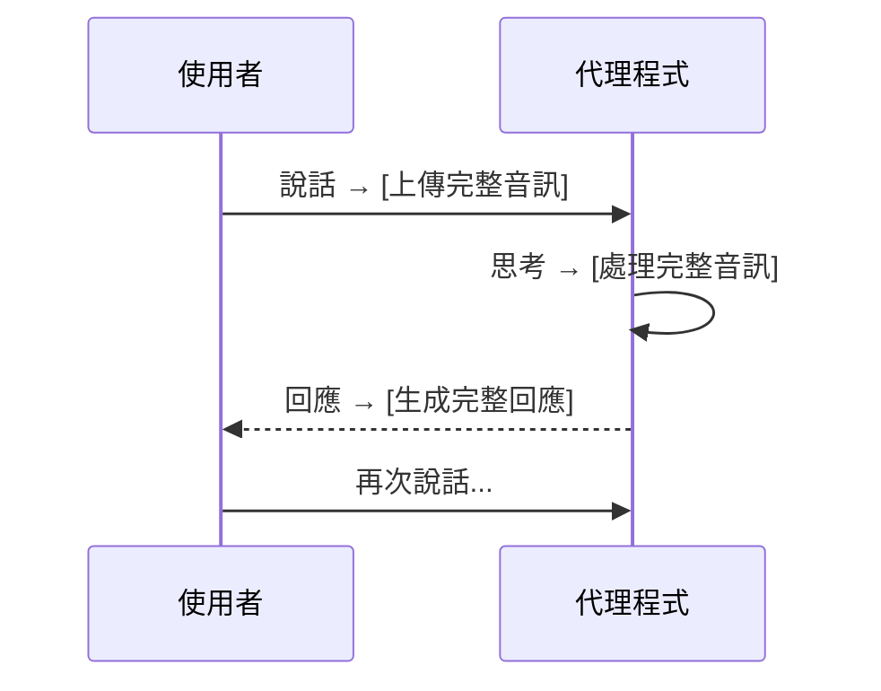
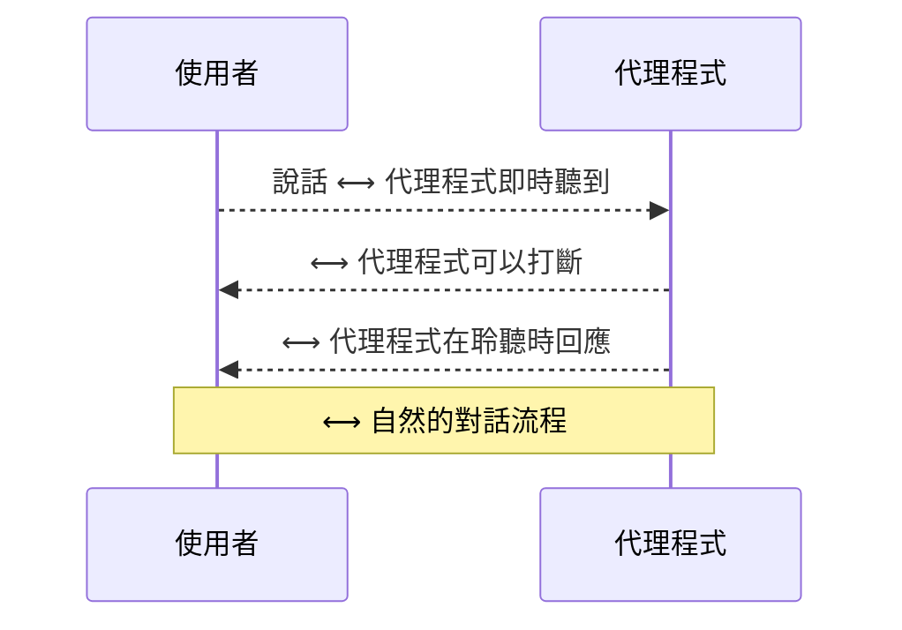
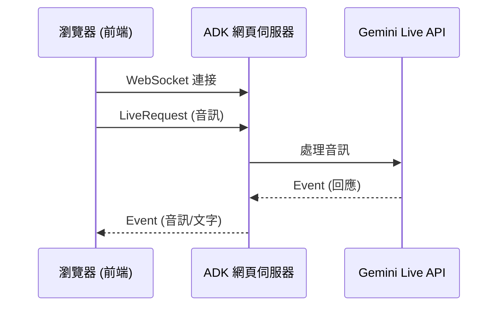

# 教學 15：Live API 與雙向串流 (Live API & Bidirectional Streaming with Audio)


**本教學已進行簡化，專注於 Live API 的有效方法：ADK Web 介面。**

**主要更新 (2025 年 1 月 12 日)**:
- ✅ **建議方法**: 使用 `adk web` 進行 Live API 雙向串流
- ✅ **原因**: `runner.run_live()` 需要 WebSocket 伺服器情境 (在 `adk web` 中運作，而非獨立腳本)
- ✅ **核心元件**: 用於程式化使用的代理程式定義和音訊工具
- ✅ **簡化**: 移除了無效的獨立示範腳本
- ✅ **焦點**: 單一清晰路徑 - 啟動 ADK 網頁伺服器並使用瀏覽器介面


**快速入門**:
```bash
cd tutorial_implementation/tutorial15
make setup  # 安裝依賴項
make dev    # 啟動 ADK 網頁介面
# 開啟 http://localhost:8000 並選擇 'voice_assistant'
```

**目標**: 掌握 Live API 以實現雙向串流，從而與您的 AI 代理程式進行即時語音對話、音訊輸入/輸出以及互動式多模態體驗。

**先決條件**:

- 教學 01 (Hello World 代理程式)
- 教學 14 (使用 SSE 進行串流)
- 對 async/await 有基本了解
- 用於音訊範例的麥克風存取權限

**您將學到**:

- 使用 `StreamingMode.BIDI` 實現雙向串流
- 使用 `LiveRequestQueue` 進行即時通訊
- 設定音訊輸入/輸出與語音辨識
- 建立語音助理
- 處理影片串流
- 了解主動性和情感對話
- Live API 模型選擇與相容性

**完成時間**: 60-75 分鐘

---

## 為何 Live API 如此重要 (Why Live API Matters)

傳統的代理程式是**回合制**的——傳送訊息，等待完整回應。而 **Live API** 則實現了**即時、雙向**的通訊：

**回合制 (傳統)**:



**Live API (雙向)**:



**優點**:

- 🎙️ **即時音訊**: 在您說話時串流音訊
- 🗣️ **自然對話**: 中斷、輪流發言
- 🎭 **情感對話**: 偵測語音中的情緒
- 📹 **影片串流**: 即時影片分析
- ⚡ **低延遲**: 立即回應
- 🤖 **主動性**: 代理程式可以發起對話

---

## 入門：ADK 網頁介面 (Getting Started: ADK Web Interface)

### 建議做法
**ADK 網頁介面** (`adk web`) 是實現 Live API 雙向串流的建議且有效的方法。此方法：

- ✅ 使用官方的 `/run_live` WebSocket 端點
- ✅ 提供完整的雙向音訊串流
- ✅ 可直接與瀏覽器介面搭配使用
- ✅ 包含所有 ADK 代理程式功能 (工具、狀態等)

**為何不使用獨立腳本？** `runner.run_live()` 方法需要一個帶有已連接客戶端的活躍 WebSocket 伺服器情境。獨立的 Python 腳本無法提供此環境，這就是為什麼 `adk web` 是官方的有效模式。


### 使用 ADK Web 快速入門 (Quick Start with ADK Web)

**步驟 1：設定**

```bash
cd tutorial_implementation/tutorial15
make setup  # 安裝依賴項和套件
```

**步驟 2：設定環境**

```bash
export GOOGLE_GENAI_USE_VERTEXAI=1
export GOOGLE_CLOUD_PROJECT=your-project-id
export GOOGLE_CLOUD_LOCATION=us-central1
export VOICE_ASSISTANT_LIVE_MODEL=gemini-2.0-flash-live-preview-04-09
```

**步驟 3：啟動 ADK Web**

```bash
make dev  # 在 http://localhost:8000 啟動網頁伺服器
```

**步驟 4：在瀏覽器中使用**

1. 開啟 http://localhost:8000
2. 從下拉選單中選擇 `voice_assistant`
3. 點擊**音訊/麥克風按鈕** (🎤)
4. 開始您的對話！

### 運作原理 (How It Works)

ADK 網頁介面提供一個 `/run_live` WebSocket 端點，其運作方式如下：



**關鍵元件**:

- **前端**: 基於瀏覽器的 UI，具有麥克風/揚聲器存取權限
- **WebSocket**: 用於雙向通訊的 `/run_live` 端點
- **Live Request Queue**: 管理客戶端和代理程式之間的訊息流
- **並行任務**: `forward_events()` 和 `process_messages()` 同時運行

---

## 1. Live API 基礎 (Live API Basics)

### 什麼是雙向串流？ (What is Bidirectional Streaming?)

**BIDI 串流**實現了使用者和代理程式之間的**同時**雙向通訊。與 SSE (單向) 不同，BIDI 允許：

- 使用者在代理程式回應時傳送資料
- 代理程式在使用者結束前即可回應
- 無需輪流發言的即時互動


### 基本 Live API 設定 (Basic Live API Setup)

```python
# 匯入必要的模組
import asyncio
from google.adk.agents import Agent, Runner, RunConfig, StreamingMode, LiveRequestQueue
from google.genai import types

# 建立用於即時互動的代理程式
agent = Agent(
    model='gemini-2.0-flash-live-preview-04-09',  # Live API 模型 (Vertex)
    name='live_assistant',
    instruction='您是一位樂於助人的語音助理。請自然地回應使用者查詢。'
)

# 設定即時串流
run_config = RunConfig(
    streaming_mode=StreamingMode.BIDI,
    speech_config=types.SpeechConfig(
        voice_config=types.VoiceConfig(
            prebuilt_voice_config=types.PrebuiltVoiceConfig(
                voice_name='Puck'  # 可用聲音：Puck, Charon, Kore, Fenrir, Aoede
            )
        )
    )
)

async def live_session():
    """執行即時雙向會話。"""

    # 建立用於即時通訊的請求佇列
    queue = LiveRequestQueue()

    # 使用應用程式或代理程式建立執行器
    from google.adk.apps import App
    app = App(name='live_app', root_agent=agent)
    runner = Runner(app=app)

    # 建立或取得會話
    user_id = 'test_user'
    session = await runner.session_service.create_session(
        app_name=app.name,
        user_id=user_id
    )

    # 使用正確的參數啟動即時會話
    async for event in runner.run_live(
        live_request_queue=queue,
        user_id=user_id,
        session_id=session.id,
        run_config=run_config
    ):
        if event.content and event.content.parts:
            # 處理代理程式回應
            for part in event.content.parts:
                if part.text:
                    print(f"代理程式: {part.text}")

# 執行非同步函式
asyncio.run(live_session())
```

### Live API 模型 (Live API Models)

**VertexAI API**:

```python
# ✅ Vertex Live API 模型
agent = Agent(model='gemini-2.0-flash-live-preview-04-09')
```

**AI Studio API**:

```python
# ✅ AI Studio Live API 模型
agent = Agent(model='gemini-live-2.5-flash-preview')
```

**重要**: 一般的 Gemini 模型不支援 Live API：

```python
# ❌ 這些不支援 Live API
agent = Agent(model='gemini-2.0-flash')  # 一般模型
agent = Agent(model='gemini-1.5-flash')  # 較舊的模型
```

---

## 2. LiveRequestQueue：即時通訊 (LiveRequestQueue: Real-Time Communication)

### 了解 LiveRequestQueue (Understanding LiveRequestQueue)

`LiveRequestQueue` 管理雙向通訊——同時傳送使用者輸入和接收代理程式回應。

**來源**: `google/adk/agents/live_request_queue.py`

### 傳送文字 (Sending Text)

```python
# 匯入必要的模組
from google.adk.agents import LiveRequestQueue
from google.genai import types

# 建立請求佇列
queue = LiveRequestQueue()

# 使用 send_content 傳送文字訊息 (而非 send_realtime)
queue.send_content(
    types.Content(
        role='user',
        parts=[types.Part.from_text(text="你好，你好嗎？")]
    )
)

# 繼續對話
queue.send_content(
    types.Content(
        role='user',
        parts=[types.Part.from_text(text="跟我說說量子計算")]
    )
)

# 結束會話
queue.close()
```

### 傳送音訊 (Sending Audio)

```python
# 匯入 wave 模組
import wave

# 載入音訊檔案
with wave.open('audio_input.wav', 'rb') as audio_file:
    audio_data = audio_file.readframes(audio_file.getnframes())

# 使用 send_realtime 將音訊傳送給代理程式 (用於即時音訊輸入)
queue.send_realtime(
    blob=types.Blob(
        data=audio_data,
        mime_type='audio/pcm;rate=16000'  # 指定取樣率
    )
)
```

### 傳送影片 (Sending Video)

```python
# 傳送影片影格
queue.send_realtime(
    blob=types.Blob(
        data=video_frame_bytes,
        mime_type='video/mp4'
    )
)
```

### 佇列管理 (Queue Management)

```python
# 完成後關閉佇列
queue.close()

# 佇列會自動管理：
# - 緩衝
# - 同步
# - 背壓
```

---

## 3. 音訊設定 (Audio Configuration)

### 語音辨識 (輸入) (Speech Recognition (Input))

```python
# 匯入必要的模組
from google.genai import types

run_config = RunConfig(
    streaming_mode=StreamingMode.BIDI,

    # 音訊輸入/輸出設定
    speech_config=types.SpeechConfig(
        # 語音輸出設定
        voice_config=types.VoiceConfig(
            prebuilt_voice_config=types.PrebuiltVoiceConfig(
                voice_name='Puck'  # 代理程式的聲音
            )
        )
    ),

    # 回應格式 - 每個會話只能有一種模態
    response_modalities=['audio']  # 用於音訊回應
    # 或
    # response_modalities=['text']  # 用於文字回應
)
```

### 可用聲音 (Available Voices)

```python
# 可用的預建聲音：
voices = [
    'Puck',    # 友善、對話式
    'Charon',  # 深沉、權威
    'Kore',    # 溫暖、專業
    'Fenrir',  # 充滿活力、動感
    'Aoede'    # 平靜、舒緩
]

# 設定聲音
run_config = RunConfig(
    streaming_mode=StreamingMode.BIDI,
    speech_config=types.SpeechConfig(
        voice_config=types.VoiceConfig(
            prebuilt_voice_config=types.PrebuiltVoiceConfig(
                voice_name='Charon'  # 選擇聲音
            )
        )
    )
)
```

### 回應模態 (Response Modalities)

```python
# 僅文字 (使用小寫以避免 Pydantic 序列化警告)
response_modalities=['text']

# 僅音訊 (使用小寫以避免 Pydantic 序列化警告)
response_modalities=['audio']

# 關鍵：每個會話只能設定一種模態
# 原生音訊模型需要 'audio' 模態
# 支援文字的模型可以使用 'text' 模態
# 同時設定 ['text', 'audio'] 會導致錯誤
```

---

## 4. 建立您的語音助理 (Building Your Voice Assistant)

### 專案結構 (Project Structure)

教學 15 的實作提供了一個乾淨、最小化的結構：

```
tutorial_implementation/tutorial15/
├── voice_assistant/
│   ├── __init__.py           # 套件匯出
│   ├── agent.py              # 核心代理程式與 VoiceAssistant 類別
│   └── audio_utils.py        # AudioPlayer 和 AudioRecorder 工具
├── tests/                    # 全面的測試套件
├── Makefile                  # 開發指令
├── requirements.txt          # 依賴項
└── pyproject.toml           # 套件設定
```

### 核心代理程式實作 (Core Agent Implementation)

`voice_assistant/agent.py` 檔案定義了 ADK web 發現的根代理程式：

```python
"""Live API 的語音助理代理程式"""

# 匯入必要的模組
import os
from google.adk.agents import Agent
from google.genai import types

# 環境設定
LIVE_MODEL = os.getenv(
    "VOICE_ASSISTANT_LIVE_MODEL",
    "gemini-2.0-flash-live-preview-04-09"
)

# 根代理程式 - ADK web 將會發現此代理程式
root_agent = Agent(
    model=LIVE_MODEL,
    name="voice_assistant",
    description="支援 Live API 的即時語音助理",
    instruction="""
您是一位樂於助人的語音助理。指南：

- 自然且對話式地回應
- 保持回應簡潔以利語音互動
- 需要時提出澄清問題
- 友善且引人入勝
- 使用適合口語對話的休閒語言
    """.strip(),
    generate_content_config=types.GenerateContentConfig(
        temperature=0.8,  # 自然、對話式的語氣
        max_output_tokens=200  # 簡潔以利語音
    )
)
```

**就是這樣！** 代理程式現在可以被 `adk web` 發現了。

### 使用語音助理 (Using the Voice Assistant)

一旦您建立了代理程式並執行 `make dev`，ADK 網頁伺服器會：

1.  **發現** `voice_assistant/agent.py` 中的 `root_agent`
2.  **建立**一個 `/run_live` WebSocket 端點
3.  **自動處理**雙向音訊串流
4.  **管理** LiveRequestQueue 和並行事件處理

**在瀏覽器中**:
- 從下拉選單中選擇 `voice_assistant`
- 點擊音訊/麥克風按鈕
- 開始說話或打字
- 代理程式會以音訊輸出即時回應

### 音訊工具 (可選) (AudioUtilities (Optional))

對於程式化的音訊處理，`voice_assistant/audio_utils.py` 提供了：

```python
# 匯入音訊工具
from voice_assistant.audio_utils import AudioPlayer, AudioRecorder

# 播放 PCM 音訊
player = AudioPlayer()
player.play_pcm_bytes(audio_data)
player.save_to_wav(audio_data, "output.wav")
player.close()

# 從麥克風錄音
recorder = AudioRecorder()
audio_data = recorder.record(duration_seconds=5)
recorder.save_to_wav(audio_data, "input.wav")
recorder.close()
```

### 設定選項 (Configuration Options)

**環境變數**:

```bash
# 模型選擇
export VOICE_ASSISTANT_LIVE_MODEL=gemini-2.0-flash-live-preview-04-09

# Vertex AI 設定
export GOOGLE_GENAI_USE_VERTEXAI=1
export GOOGLE_CLOUD_PROJECT=your-project
export GOOGLE_CLOUD_LOCATION=us-central1
```

**聲音選擇** (修改 agent.py):

```python
# 在 VoiceAssistant 類別中將 speech_config 加入 run_config
run_config = RunConfig(
    streaming_mode=StreamingMode.BIDI,
    speech_config=types.SpeechConfig(
        voice_config=types.VoiceConfig(
            prebuilt_voice_config=types.PrebuiltVoiceConfig(
                voice_name='Charon'  # 選項：Puck, Charon, Kore, Fenrir, Aoede
            )
        )
    )
)
```

### 測試 (Testing)

執行全面的測試套件：

```bash
make test
```

測試驗證：
- ✅ 代理程式設定
- ✅ VoiceAssistant 類別功能
- ✅ 套件結構與匯入
- ✅ 音訊工具可用性

---

## 5. 進階 Live API 功能 (Advanced Live API Features)

### 主動性 (Proactivity)

允許代理程式發起對話：

```python
# 匯入必要的模組
from google.genai import types

run_config = RunConfig(
    streaming_mode=StreamingMode.BIDI,

    # 啟用主動回應 (需要 v1alpha API)
    # 注意：主動音訊僅支援原生音訊模型
    proactivity=types.ProactivityConfig(
        proactive_audio=True
    ),

    speech_config=types.SpeechConfig(
        voice_config=types.VoiceConfig(
            prebuilt_voice_config=types.PrebuiltVoiceConfig(
                voice_name='Puck'
            )
        )
    )
)

# 代理程式現在可以在不等待使用者輸入的情況下說話
# 適用於：通知、提醒、建議
```

### 情感對話 (情緒偵測) (Affective Dialog (Emotion Detection))

從語音中偵測使用者情緒：

```python
run_config = RunConfig(
    streaming_mode=StreamingMode.BIDI,

    # 啟用情緒偵測
    enable_affective_dialog=True,

    speech_config=types.SpeechConfig(
        voice_config=types.VoiceConfig(
            prebuilt_voice_config=types.PrebuiltVoiceConfig(
                voice_name='Kore'  # 富有同理心的聲音
            )
        )
    )
)

# 代理程式接收情緒訊號：
# - 開心、悲傷、生氣、中性等
# - 可以相應地調整回應語氣
```

### 影片串流 (Video Streaming)

串流影片以進行即時分析：

```python
# 匯入必要的模組
import cv2
import asyncio

# 捕捉影片
cap = cv2.VideoCapture(0)

queue = LiveRequestQueue()

while True:
    ret, frame = cap.read()

    if not ret:
        break

    # 將影格轉換為位元組
    _, buffer = cv2.imencode('.jpg', frame)
    frame_bytes = buffer.tobytes()

    # 將影格傳送給代理程式
    queue.send_realtime(
        blob=types.Blob(
            data=frame_bytes,
            mime_type='image/jpeg'
        )
    )

    await asyncio.sleep(0.1)  # 約 10 FPS

queue.send_end()

# 代理程式可以即時分析影片
# 使用案例：手勢辨識、物體偵測、監控
```

---

## 6. 多代理程式即時會話 (Multi-Agent Live Sessions)

在即時對話中結合多個代理程式：

```python
"""
多代理程式語音對話。
"""

# 匯入必要的模組
from google.adk.agents import Agent, Runner, RunConfig, StreamingMode, LiveRequestQueue
from google.genai import types

# 建立專門的代理程式
greeter = Agent(
    model='gemini-2.0-flash-live-preview-04-09',
    name='greeter',
    instruction='熱情地問候使用者，並詢問如何提供協助。'
)

expert = Agent(
    model='gemini-2.0-flash-live-preview-04-09',
    name='expert',
    instruction='提供詳細的專家級問題解答。'
)

# 協調者代理程式
orchestrator = Agent(
    model='gemini-2.0-flash-live-preview-04-09',
    name='orchestrator',
    instruction="""
您在多個代理程式之間進行協調：
- 使用 'greeter' 進行初次接觸
- 使用 'expert' 回答詳細問題
- 確保對話流暢
    """,
    sub_agents=[greeter, expert],
    flow='sequential'
)

run_config = RunConfig(
    streaming_mode=StreamingMode.BIDI,
    speech_config=types.SpeechConfig(
        voice_config=types.VoiceConfig(
            prebuilt_voice_config=types.PrebuiltVoiceConfig(
                voice_name='Puck'
            )
        )
    )
)

async def multi_agent_voice():
    """執行多代理程式語音會話。"""

    queue = LiveRequestQueue()

    # 設定應用程式和執行器
    from google.adk.apps import App
    app = App(name='multi_agent_voice', root_agent=orchestrator)
    runner = Runner(app=app)

    # 建立會話
    user_id = 'multi_agent_user'
    session = await runner.session_service.create_session(
        app_name=app.name,
        user_id=user_id
    )

    # 使用者說話 (使用 send_content 傳送文字)
    queue.send_content(
        types.Content(
            role='user',
            parts=[types.Part.from_text(
                text="你好，我有一個關於量子計算的問題"
            )]
        )
    )
    queue.close()

    # 協調者協調代理程式
    async for event in runner.run_live(
        live_request_queue=queue,
        user_id=user_id,
        session_id=session.id,
        run_config=run_config
    ):
        if event.content and event.content.parts:
            for part in event.content.parts:
                if part.text:
                    print(f"{event.author}: {part.text}")

# 執行非同步函式
asyncio.run(multi_agent_voice())
```

---

## 7. 最佳實踐 (Best Practices)

### ✅ 應做：使用 Live API 模型 (DO: Use Live API Models)

```python
# ✅ 良好 - Live API 模型
agent = Agent(model='gemini-2.0-flash-live-preview-04-09')  # Vertex
agent = Agent(model='gemini-live-2.5-flash-preview')  # AI Studio

# ❌ 不良 - 一般模型不支援 Live API
agent = Agent(model='gemini-2.0-flash')
agent = Agent(model='gemini-1.5-flash')
```

### ✅ 應做：保持語音回應簡潔 (DO: Keep Voice Responses Concise)

```python
# ✅ 良好 - 簡潔以利語音
agent = Agent(
    model='gemini-2.0-flash-live-preview-04-09',
    instruction='保持回應簡短且對話式，以利語音互動。',
    generate_content_config=types.GenerateContentConfig(
        max_output_tokens=150
    )
)

# ❌ 不良 - 對於語音而言過於冗長
agent = Agent(
    model='gemini-2.0-flash-live-preview-04-09',
    generate_content_config=types.GenerateContentConfig(
        max_output_tokens=4096  # 對於語音而言太長
    )
)
```

### ✅ 應做：正確處理音訊格式 (DO: Handle Audio Formats Properly)

```python
# ✅ 良好 - 正確的音訊格式與取樣率
queue.send_realtime(
    blob=types.Blob(
        data=audio_data,
        mime_type='audio/pcm;rate=16000'  # 指定取樣率
    )
)

# ❌ 不良 - 錯誤的格式或缺少取樣率
queue.send_realtime(
    blob=types.Blob(
        data=audio_data,
        mime_type='text/plain'  # 錯誤的類型
    )
)
```

### ✅ 應做：務必關閉佇列 (DO: Always Close Queue)

```python
# ✅ 良好 - 正確關閉佇列
queue = LiveRequestQueue()

try:
    queue.send_content(types.Content(
        role='user',
        parts=[types.Part.from_text(text="你好")]
    ))
    # ... 處理回應
finally:
    queue.close()  # 務必關閉

# ❌ 不良 - 忘記關閉
queue = LiveRequestQueue()
queue.send_content(types.Content(
    role='user',
    parts=[types.Part.from_text(text="你好")]
))
# 佇列保持開啟
```

### ✅ 應做：使用合適的聲音 (DO: Use Appropriate Voices)

```python
# ✅ 良好 - 聲音符合使用案例
customer_service = Agent(
    model='gemini-2.0-flash-live-preview-04-09',
    instruction='樂於助人的客戶服務代理程式'
)

run_config = RunConfig(
    streaming_mode=StreamingMode.BIDI,
    speech_config=types.SpeechConfig(
        voice_config=types.VoiceConfig(
            prebuilt_voice_config=types.PrebuiltVoiceConfig(
                voice_name='Kore'  # 溫暖、專業
            )
        )
    )
)
```

---

## 8. 疑難排解 (Troubleshooting)

### 錯誤："模型不支援 Live API" (Error: "Model doesn't support Live API")

**問題**: 使用非 Live API 模型

**解決方案**:

```python
# ❌ 錯誤的模型
agent = Agent(model='gemini-2.0-flash')

# ✅ 使用 Live API 模型
agent = Agent(model='gemini-2.0-flash-live-preview-04-09')  # Vertex
# 或
agent = Agent(model='gemini-live-2.5-flash-preview')  # AI Studio
```

### 問題："回應中沒有音訊" (Issue: "No audio in response")

**問題**: 音訊設定不正確

**解決方案**:

1.  **設定回應模態**:

```python
run_config = RunConfig(
    streaming_mode=StreamingMode.BIDI,
    response_modalities=['TEXT', 'AUDIO'],  # 包含 AUDIO
    speech_config=types.SpeechConfig(...)
)
```

2.  **設定聲音**:

```python
speech_config=types.SpeechConfig(
    voice_config=types.VoiceConfig(
        prebuilt_voice_config=types.PrebuiltVoiceConfig(
            voice_name='Puck'  # 必須設定聲音
        )
    )
)
```

### 問題："佇列逾時" (Issue: "Queue timeout")

**問題**: 佇列未正確關閉

**解決方案**:

```python
# ✅ 務必 close() 佇列
queue = LiveRequestQueue()
queue.send_content(types.Content(
    role='user',
    parts=[types.Part.from_text(text="你好")]
))
queue.close()  # 重要！
```

---

## 總結 (Summary)

**對於生產環境的 Live API 應用**: 使用本教學中示範的 `adk web` 介面。`/run_live` WebSocket 端點是官方測試過的雙向音訊串流模式。

**為何 ADK Web 能運作**:
- 瀏覽器和伺服器之間有活躍的 WebSocket 連接
- 並行任務管理 (`forward_events()` + `process_messages()`)
- 正確的 LiveRequestQueue 處理
- 完整的 ADK 代理程式功能 (工具、狀態、記憶體)

**替代方案**: 對於需要直接 API 存取而無需 ADK 框架的應用，請直接使用 `google.genai.Client.aio.live.connect()` (繞過 ADK Runner)。


您已掌握使用 Live API 進行即時語音互動：

**重點回顧**:

- ✅ `StreamingMode.BIDI` 實現雙向串流
- ✅ `LiveRequestQueue` 管理即時通訊
- ✅ 使用 `speech_config` 進行音訊輸入/輸出
- ✅ 提供多種聲音 (Puck, Charon, Kore 等)
- ✅ 主動性讓代理程式能發起對話
- ✅ 情感對話用於情緒偵測
- ✅ 支援影片串流
- ✅ Live API 模型: `gemini-2.0-flash-live-preview-04-09` (Vertex), `gemini-live-2.5-flash-preview` (AI Studio)

**生產檢查清單**:

- [ ] 使用與 Live API 相容的模型
- [ ] 已設定 `StreamingMode.BIDI`
- [ ] 包含聲音選擇的語音設定
- [ ] 正確設定音訊格式 (audio/pcm;rate=16000)
- [ ] 使用 `close()` 正確關閉佇列
- [ ] 語音回應簡潔 (max_output_tokens=150-200)
- [ ] 處理音訊/網路問題的錯誤處理
- [ ] 使用實際音訊設備進行測試
- [ ] 每個會話只有一種回應模態 (TEXT 或 AUDIO，而非兩者)
- [ ] 正確的 `run_live()` 參數 (live_request_queue, user_id, session_id)

**資源**

- [Live API 文件](https://cloud.google.com/vertex-ai/generative-ai/docs/model-reference/gemini-live)
- [音訊設定指南](https://cloud.google.com/vertex-ai/generative-ai/docs/speech)
- [範例: live_bidi_streaming_single_agent](https://github.com/google/adk-python/tree/main/contributing/samples/live_bidi_streaming_single_agent/)

---

## 程式碼實現 (Code Implementation)
- voice_assistant：[程式碼連結](../../../python/agents/voice-assistant/)
