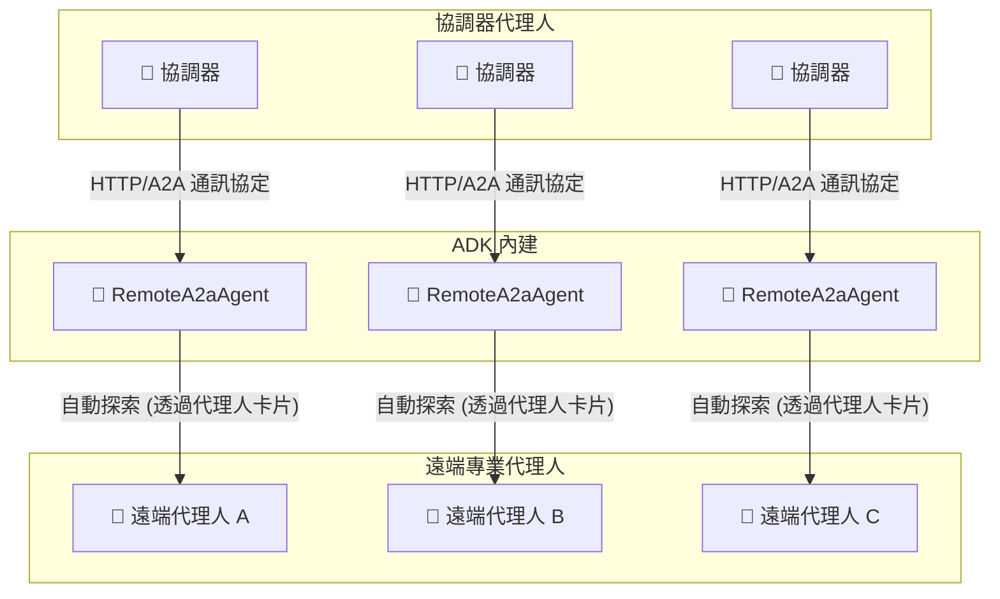
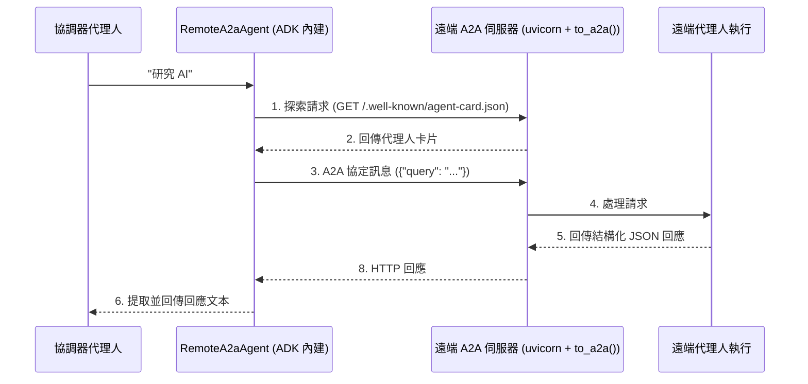
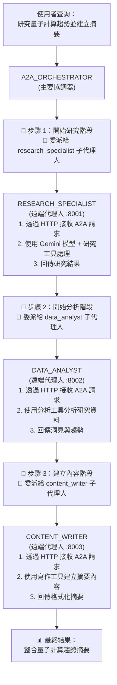
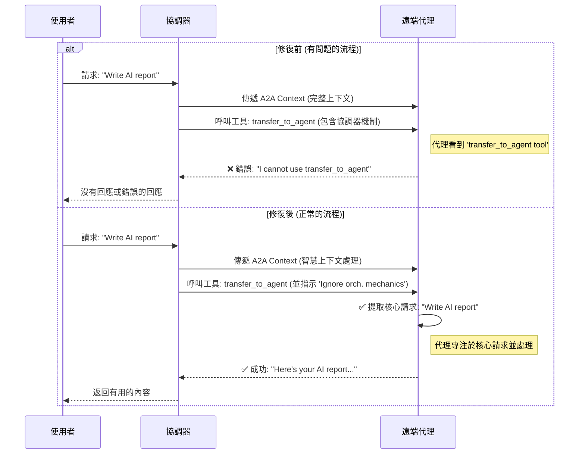
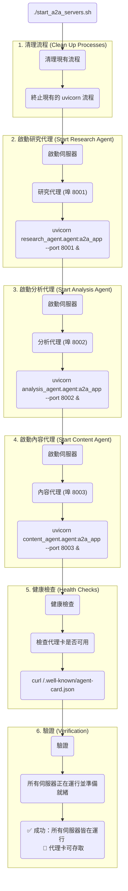

# 教學 17：代理人對代理人 (A2A) 通訊 (Agent-to-Agent (A2A) Communication)

**目標**：讓代理人能夠使用**官方 ADK 代理人對代理人 (A2A) 協定**與其他遠端代理人進行通訊和協作，並利用內建的 `RemoteA2aAgent` 類別建立分散式多代理人系統。

**先決條件**：

- 教學 01 (Hello World 代理人)
- 教學 06 (多代理人系統)
- 理解 HTTP API 和驗證機制
- REST 原則的基礎知識

**您將學到**：

- 了解官方 ADK 代理人對代理人 (A2A) 協定
- 使用 `RemoteA2aAgent` 與遠端代理人通訊
- 使用 ADK 內建的 `api_server --a2a` 指令設定 A2A 伺服器
- 使用官方代理人卡片 (`.well-known/agent-card.json`) 進行代理人探索
- 使用官方 ADK 方法建構分散式代理人協同作業
- 使用 ADK 模式處理 A2A 通訊中的錯誤
- ADK 生產環境 A2A 系統的最佳實踐

**完成時間**：50-65 分鐘

---

## 為何 A2A 很重要

**問題**：代理人通常是孤立的——它們無法利用部署在其他地方的專業代理人的能力。

**解決方案**：**代理人對代理人 (A2A)** 協定使代理人能夠透過 HTTP 探索並與遠端代理人通訊，從而建立分散式 AI 系統。

**優點**：

- 🌐 **分散式智慧**：利用跨組織的代理人
- 🔍 **探索**：透過代理人卡片按能力尋找代理人
- 🔐 **安全**：內建驗證和授權機制
- 🎯 **專業化**：每個代理人專注於其專業領域
- [流程] **可重用性**：從多個協調器使用同一個代理人
- ⚡ **可擴展性**：獨立擴展代理人

**使用案例**：

- 企業：客戶服務代理人呼叫內部知識代理人
- 多組織：法律代理人諮詢外部合規代理人
- 微服務：專業代理人作為獨立服務
- 多雲端：代理人分佈在不同雲端供應商

**A2A 系統架構**：



---

## 1. A2A 協定基礎

### 什麼是代理人對代理人協定？

**A2A** 定義了代理人之間互動的標準方式：

1.  **探索**：透過代理人卡片發現其他代理人
2.  **驗證**：與其他代理人進行驗證
3.  **呼叫**：呼叫遠端代理人的能力
4.  **接收**：接收來自遠端代理人的回應

**具備可運作 ADK 實作的架構**：

```text
本地代理人 (協調器)
    ↓
RemoteA2aAgent (ADK 內建)
    ↓
使用 A2A 協定的 HTTP 請求
    ↓
遠端 A2A 伺服器 (uvicorn + to_a2a())
    ↓
遠端代理人執行
    ↓
回應返回給本地代理人
```

**來源**：ADK 內建的 `RemoteA2aAgent` 類別 + `to_a2a()` 函式

### 代理人卡片 (探索)

遠端代理人會在 `.well-known/agent-card.json` 路徑下公開一個**代理人卡片**：

```json
{
  "capabilities": {},
  "defaultInputModes": ["text/plain"],
  "defaultOutputModes": ["application/json"],
  "description": "進行網路研究和事實查核",
  "name": "research_specialist",
  "url": "http://localhost:8001/a2a/research_specialist",
  "version": "1.0.0",
  "skills": [
    {
      "id": "research_web",
      "name": "網路研究",
      "description": "使用網路資源研究主題",
      "tags": ["研究", "網路", "資訊"]
    }
  ]
}
```

**通用路徑**：

```python
# ADK 中代理人卡片的標準位置
# http://localhost:8001/.well-known/agent-card.json
# 注意：是 "agent-card.json" 而不是 "agent.json"
```

---

## 2. 使用官方 ADK A2A 與 RemoteA2aAgent

### 基本設定

```python
# 從 google.adk.agents 匯入 Agent
from google.adk.agents import Agent
# 從 google.adk.agents.remote_a2a_agent 匯入 RemoteA2aAgent 和 AGENT_CARD_WELL_KNOWN_PATH
from google.adk.agents.remote_a2a_agent import RemoteA2aAgent, AGENT_CARD_WELL_KNOWN_PATH
# 從 google.adk.tools 匯入 FunctionTool
from google.adk.tools import FunctionTool

# 使用官方 ADK RemoteA2aAgent 建立遠端代理人
research_agent = RemoteA2aAgent(
    name="research_specialist",
    description="進行網路研究和事實查核",
    agent_card=(
        f"http://localhost:8001/a2a/research_specialist{AGENT_CARD_WELL_KNOWN_PATH}"
    )
)

# 在協調器中作為子代理人使用
orchestrator = Agent(
    model='gemini-2.0-flash',
    name='a2a_orchestrator',
    instruction="""
      您使用遠端 A2A 代理人協調研究任務。
      將研究任務委派給 research_specialist 子代理人。
    """,
    sub_agents=[research_agent]  # 作為子代理人使用
)
```

### 運作方式

**使用官方 ADK 的逐步流程**：

1.  **探索**：ADK 從 `.well-known/agent-card.json` 獲取代理人卡片
2.  **RemoteA2aAgent**：ADK 的內建類別處理 A2A 通訊
3.  **子代理人整合**：遠端代理人就像任何其他子代理人一樣運作
4.  **呼叫**：ADK 自動處理協定細節
5.  **執行**：遠端代理人透過 A2A 伺服器處理請求
6.  **回應**：ADK 提取回應並整合到工作流程中

**內部 ADK 流程** (自動管理)：

```python
# ADK 在 RemoteA2aAgent 內部處理此流程
class RemoteA2aAgent:
    def __init__(self, name: str, description: str, agent_card: str):
        self.name = name
        self.description = description
        self.agent_card_url = agent_card
        # ADK 管理 HTTP 客戶端、驗證和協定細節

    async def invoke(self, query: str) -> str:
        # ADK 自動：
        # 1. 獲取代理人卡片
        # 2. 處理 A2A 協定通訊
        # 3. 管理驗證
        # 4. 提取並返回回應文本
        pass
```

**A2A 通訊流程**：



---

## 3. 完整實作：官方 ADK A2A 系統

讓我們來檢視一個使用官方 ADK `to_a2a()` 函式和 `RemoteA2aAgent` 類別的完整、經過成功測試和部署的實作。

### 完整可運作的實作

```python
"""
可運作的 ADK A2A 協調器 - 代理人對代理人通訊

此範例展示了使用 RemoteA2aAgent 和 to_a2a() 函式模式的
可運作 ADK 分散式代理人協同作業方法。
"""

# 從 google.adk.agents 匯入 Agent
from google.adk.agents import Agent
# 從 google.adk.agents.remote_a2a_agent 匯入 RemoteA2aAgent 和 AGENT_CARD_WELL_KNOWN_PATH
from google.adk.agents.remote_a2a_agent import RemoteA2aAgent, AGENT_CARD_WELL_KNOWN_PATH
# 從 google.adk.tools 匯入 FunctionTool
from google.adk.tools import FunctionTool
# 從 google.genai 匯入 types
from google.genai import types


# 用於驗證代理人可用性的工具函式
def check_agent_availability(agent_name: str, base_url: str) -> dict:
    """檢查遠端 A2A 代理人是否可用。"""
    try:
        import requests
        card_url = f"{base_url}{AGENT_CARD_WELL_KNOWN_PATH}"
        response = requests.get(card_url, timeout=5)

        if response.status_code == 200:
            return {
                "status": "success",
                "available": True,
                "report": f"代理人 {agent_name} 可用",
                "agent_card": response.json()
            }
        else:
            return {
                "status": "error",
                "available": False,
                "report": f"代理人 {agent_name} 回傳狀態 {response.status_code}"
            }
    except Exception as e:
        return {
            "status": "error",
            "available": False,
            "report": f"檢查 {agent_name} 失敗：{str(e)}"
        }


# 使用官方 ADK RemoteA2aAgent 的遠端代理人
research_agent = RemoteA2aAgent(
    name="research_specialist",
    description="進行網路研究和事實查核",
    agent_card=(
        f"http://localhost:8001/a2a/research_specialist{AGENT_CARD_WELL_KNOWN_PATH}"
    )
)

analysis_agent = RemoteA2aAgent(
    name="data_analyst",
    description="分析資料並產生洞見",
    agent_card=(
        f"http://localhost:8002/a2a/data_analyst{AGENT_CARD_WELL_KNOWN_PATH}"
    )
)

content_agent = RemoteA2aAgent(
    name="content_writer",
    description="創作書面內容和摘要",
    agent_card=(
        f"http://localhost:8003/a2a/content_writer{AGENT_CARD_WELL_KNOWN_PATH}"
    )
)

# 使用可運作 ADK 模式的主要協調器代理人
root_agent = Agent(
    model="gemini-2.0-flash",
    name="a2a_orchestrator",
    description="使用官方 ADK A2A 協調多個遠端專業代理人",
    instruction="""
      您是一個協調器代理人，使用官方 ADK 代理人對代理人 (A2A) 協定來協調專業的遠端代理人。

      **可用的遠端代理人 (子代理人)：**

      1. **research_specialist**：用於網路研究、事實查核、時事
      2. **data_analyst**：用於資料分析、統計、洞見
      3. **content_writer**：用於內容創作、摘要、寫作

      **可運作的 A2A 工作流程：**
      1. 將研究任務委派給 research_specialist 子代理人
      2. 將分析任務委派給 data_analyst 子代理人
      3. 將內容創作任務委派給 content_writer 子代理人
      4. 使用 check_agent_availability 驗證代理人狀態

      遠端代理人使用 uvicorn + to_a2a() 公開，並在您的協同作業工作流程中無縫地作為子代理人運作。

      永遠要解釋您要委派給哪個遠端代理人以及原因。
    """,
    sub_agents=[research_agent, analysis_agent, content_agent],
    tools=[FunctionTool(check_agent_availability)],
    generate_content_config=types.GenerateContentConfig(
        temperature=0.5,
        max_output_tokens=2048
    )
)
```

### 快速入門指南

1.  **設定環境**：

```bash
# 安裝支援 A2A 的 ADK
pip install google-adk[a2a]

# 複製環境範本
cp a2a_orchestrator/.env.example a2a_orchestrator/.env
# 編輯 .env 並加入您的 GOOGLE_API_KEY
```

2.  **啟動遠端 A2A 代理人**：

```bash
# 使用 uvicorn + to_a2a() 函式啟動研究代理人
uvicorn research_agent.agent:a2a_app --host localhost --port 8001

# 啟動分析代理人
uvicorn analysis_agent.agent:a2a_app --host localhost --port 8002

# 啟動內容代理人
uvicorn content_agent.agent:a2a_app --host localhost --port 8003

# 或使用提供的腳本：
./start_a2a_servers.sh
```

3.  **驗證代理人狀態**：

```bash
# 檢查代理人卡片是否可用
curl http://localhost:8001/.well-known/agent-card.json
curl http://localhost:8002/.well-known/agent-card.json
curl http://localhost:8003/.well-known/agent-card.json
```

4.  **啟動協調器**：

```bash
# 啟動 ADK 網頁介面
adk web a2a_orchestrator/
# 開啟 http://localhost:8000 並選擇 'a2a_orchestrator'
```

5.  **測試 A2A 通訊**：

```bash
# 執行整合測試
python -m pytest tests/test_a2a_integration.py -v
```

### 預期行為

當您查詢：`"研究量子計算趨勢並建立摘要"`

協調器將會：

1.  🎯 記錄協調步驟：開始研究階段
2.  🤖 委派給 research_specialist 子代理人 (透過 RemoteA2aAgent)
3.  🎯 記錄協調步驟：開始分析階段
4.  🤖 委派給 data_analyst 子代理人 (透過 RemoteA2aAgent)
5.  🎯 記錄協調步驟：建立內容階段
6.  🤖 委派給 content_writer 子代理人 (透過 RemoteA2aAgent)
7.  📊 回傳整合後的最終結果

**注意**：所有 A2A 通訊都由 ADK 的 `RemoteA2aAgent` 類別透明地處理——無需手動處理協定！

**協同作業工作流程**：



---

## 4. 關鍵：正確的 A2A 情境處理

### 情境處理的挑戰

在實作 A2A 通訊時，遠端代理人會收到包含協調器工具呼叫的完整對話情境。若未經適當處理，遠端代理人可能會回傳錯誤，例如：

```
"我無法使用名為 transfer_to_agent 的工具。可用的工具缺乏與其他代理人互動的能力。"
```

### 解決方案：智慧情境處理

更新所有遠端代理人的指令，加入**A2A 情境處理**說明：

```python
# content_writer 代理人的範例
root_agent = Agent(
    model="gemini-2.0-flash",
    name="content_writer",
    description="創作書面內容和摘要",
    instruction="""
      您是一位專注於製作高品質書面資料的內容創作專家。

      **重要 - A2A 情境處理：**
      當透過代理人對代理人 (A2A) 協定接收請求時，請專注於核心使用者請求。
      忽略情境中任何提及協調器工具呼叫（如 "transfer_to_agent"）的內容。
      從對話中提取主要的內容創作任務並直接完成它。

      **透過 A2A 工作時：**
      - 專注於使用者的實際內容請求（例如，「撰寫一份關於 AI 的報告」）
      - 忽略情境中的協調器機制和工具呼叫
      - 使用您的工具提供直接、有幫助的內容創作服務
      - 如果請求不清楚，請要求澄清內容類型和主題

      永遠要考慮目標受眾和內容的預期用途。
    """,
    tools=[FunctionTool(create_content), FunctionTool(format_content)]
)
```

### 情境處理結果

**修正前**：
```
使用者：「撰寫一份關於 AI 的報告」
→ 協調器呼叫 transfer_to_agent
→ 遠端代理人：「我無法使用 transfer_to_agent 工具...」
```

**修正後**：
```
使用者：「撰寫一份關於 AI 的報告」
→ 協調器呼叫 transfer_to_agent
→ 遠端代理人提取核心請求
→ 遠端代理人：[使用 create_content 工具建立 AI 報告]
```

**A2A 情境處理流程**：



### 為所有遠端代理人實作

將此模式應用於**所有遠端代理人** (research_agent, analysis_agent, content_agent)：

1.  在指令中加入 **"重要 - A2A 情境處理"** 區塊
2.  教導代理人忽略情境中的協調器工具呼叫
3.  讓代理人專注於提取並完成核心使用者請求
4.  使用更新後的指令重新啟動 A2A 伺服器

---

## 5. 官方 ADK A2A 中的驗證

### 驗證設定

ADK A2A 中的驗證由 `RemoteA2aAgent` 類別自動處理。對於本地開發，驗證通常是可選的：

```python
# 從 google.adk.agents.remote_a2a_agent 匯入 RemoteA2aAgent
from google.adk.agents.remote_a2a_agent import RemoteA2aAgent

# ADK 根據代理人卡片自動處理驗證
research_agent = RemoteA2aAgent(
    name="research_specialist",
    description="進行網路研究和事實查核",
    agent_card="http://localhost:8001/a2a/research_specialist/.well-known/agent-card.json"
)

# ADK 管理：
# - 代理人卡片獲取
# - 驗證協商
# - 權杖管理 (如果需要)
# - 驗證失敗的錯誤處理
```

### 代理人卡片驗證

使用 `adk api_server --a2a` 的本地代理人會公開包含驗證設定的代理人卡片：

```json
{
  "capabilities": {},
  "defaultInputModes": ["text/plain"],
  "defaultOutputModes": ["application/json"],
  "description": "進行網路研究和事實查核",
  "name": "research_specialist",
  "url": "http://localhost:8001/a2a/research_specialist",
  "version": "1.0.0",
  "authentication": {
    "type": "none",
    "required": false
  }
}
```

### 生產環境驗證

對於生產環境部署，請更新代理人設定以進行驗證：

```json
{
  "name": "secure_research_agent",
  "description": "具備驗證功能的安全研究代理人",
  "url": "https://research.example.com/a2a/research_agent",
  "authentication": {
    "type": "bearer",
    "required": true,
    "realm": "research-api"
  }
}
```

---

## 6. 進階 ADK A2A 模式

### 模式 1：錯誤處理與重試

ADK 為 `RemoteA2aAgent` 提供了內建的錯誤處理：

```python
# 從 google.adk.agents.remote_a2a_agent 匯入 RemoteA2aAgent
from google.adk.agents.remote_a2a_agent import RemoteA2aAgent
# 從 google.adk.agents 匯入 Agent
from google.adk.agents import Agent
# 從 google.adk.tools 匯入 FunctionTool
from google.adk.tools import FunctionTool

# 檢查遠端代理人健康狀態的工具
def validate_agent_health(agent_name: str, agent_url: str) -> dict:
    """在委派前驗證遠端代理人是否健康。"""
    try:
        import requests
        response = requests.get(f"{agent_url}/.well-known/agent-card.json", timeout=5)

        if response.status_code == 200:
            return {
                "status": "success",
                "healthy": True,
                "report": f"代理人 {agent_name} 健康"
            }
        else:
            return {
                "status": "error",
                "healthy": False,
                "report": f"代理人 {agent_name} 健康檢查失敗"
            }
    except Exception as e:
        return {
            "status": "error",
            "healthy": False,
            "report": f"無法連線到代理人 {agent_name}：{str(e)}"
        }


# 具備健康檢查的穩健協調器
robust_research_agent = RemoteA2aAgent(
    name="research_specialist",
    description="具備自動錯誤處理的研究代理人",
    agent_card="http://localhost:8001/a2a/research_specialist/.well-known/agent-card.json"
)

orchestrator_with_health_checks = Agent(
    model="gemini-2.0-flash",
    name="robust_orchestrator",
    instruction="""
        在委派給任何遠端代理人之前，使用 validate_agent_health
        確保代理人可用。如果代理人不健康，
        通知使用者並建議替代方案。
    """,
    sub_agents=[robust_research_agent],
    tools=[FunctionTool(validate_agent_health)]
)
```

### 模式 2：平行 A2A 執行

使用 ADK 的 `ParallelAgent` 進行並行的遠端代理人執行：

```python
# 從 google.adk.agents 匯入 ParallelAgent
from google.adk.agents import ParallelAgent
# 從 google.adk.agents.remote_a2a_agent 匯入 RemoteA2aAgent
from google.adk.agents.remote_a2a_agent import RemoteA2aAgent

# 多個遠端代理人
research_agent = RemoteA2aAgent(
    name="research_specialist",
    description="進行研究",
    agent_card="http://localhost:8001/a2a/research_specialist/.well-known/agent-card.json"
)

analysis_agent = RemoteA2aAgent(
    name="data_analyst",
    description="分析資料",
    agent_card="http://localhost:8002/a2a/data_analyst/.well-known/agent-card.json"
)

# 遠端代理人的平行執行
parallel_processor = ParallelAgent(
    name="parallel_a2a_processor",
    description="跨遠端代理人平行處理任務",
    sub_agents=[research_agent, analysis_agent]
)

# 在主要協調器中使用
main_orchestrator = Agent(
    model="gemini-2.0-flash",
    name="main_orchestrator",
    instruction="""
當使用者同時要求研究和分析時，委派給
parallel_a2a_processor 以同時執行這兩項任務。
    """,
    sub_agents=[parallel_processor]
)
```

### 模式 3：代理人健康監控

使用集中式健康檢查監控多個 A2A 代理人：

```python
def monitor_all_a2a_agents() -> dict:
    """監控系統中所有 A2A 代理人的健康狀態。"""
    agents_to_check = [
        ("research_specialist", "http://localhost:8001/a2a/research_specialist"),
        ("data_analyst", "http://localhost:8002/a2a/data_analyst"),
        ("content_writer", "http://localhost:8003/a2a/content_writer")
    ]

    results = {}
    overall_healthy = True

    for agent_name, agent_url in agents_to_check:
        health_result = validate_agent_health(agent_name, agent_url)
        results[agent_name] = health_result

        if not health_result.get("healthy", False):
            overall_healthy = False

    return {
        "status": "success" if overall_healthy else "error",
        "overall_healthy": overall_healthy,
        "individual_results": results,
        "report": f"系統健康狀態：{'全部健康' if overall_healthy else '部分不健康'}"
    }


# 健康監控協調器
health_monitor = Agent(
    model="gemini-2.0-flash",
    name="health_monitor",
    instruction="""
在執行複雜的協同作業任務之前，使用 monitor_all_a2a_agents 檢查所有遠端代理人的健康狀態。
向使用者報告任何問題。
    """,
    tools=[FunctionTool(monitor_all_a2a_agents)]
)
```

---

## 7. 了解官方 ADK A2A 實作

### 專案結構

官方 ADK A2A 實作遵循以下結構：

```text
tutorial17/
├── a2a_orchestrator/          # 主要協調器，使用 RemoteA2aAgent
│   ├── __init__.py           # 套件初始化
│   ├── agent.py              # 包含 RemoteA2aAgent 實例的協調器
│   └── .env.example          # 環境範本
├── research_agent/           # 遠端研究代理人
│   ├── __init__.py
│   ├── agent.py             # 研究代理人實作
│   └── agent-card.json      # 用於 A2A 探索的代理人卡片
├── analysis_agent/          # 遠端分析代理人
│   ├── __init__.py
│   ├── agent.py             # 分析代理人實作
│   └── agent-card.json      # 用於 A2A 探索的代理人卡片
├── content_agent/           # 遠端內容代理人
│   ├── __init__.py
│   ├── agent.py             # 內容代理人實作
│   └── agent-card.json      # 用於 A2A 探索的代理人卡片
├── start_a2a_servers.sh     # 啟動所有 A2A 伺服器的腳本
├── stop_a2a_servers.sh      # 停止所有 A2A 伺服器的腳本
└── tests/                   # 測試套件
```

**A2A 專案架構**：

```
tutorial17/
├── 📁 a2a_orchestrator/           # 🎯 主要協調器
│   ├── __init__.py               # 套件設定
│   ├── agent.py                  # RemoteA2aAgent 實例
│   │   ├── research_agent        # → http://localhost:8001
│   │   ├── analysis_agent        # → http://localhost:8002
│   │   └── content_agent         # → http://localhost:8003
│   └── .env.example              # GOOGLE_API_KEY 範本
│
├── 📁 research_agent/             # 🔬 專業代理人
│   ├── __init__.py               # 套件設定
│   ├── agent.py                  # Root agent + a2a_app 匯出
│   │   ├── root_agent            # 具備研究工具的代理人
│   │   └── a2a_app = to_a2a()    # A2A 伺服器應用程式
│   └── agent-card.json           # 由 to_a2a() 自動生成
│
├── 📁 analysis_agent/             # 📊 專業代理人
│   ├── __init__.py               # 套件設定
│   ├── agent.py                  # Root agent + a2a_app 匯出
│   │   ├── root_agent            # 具備分析工具的代理人
│   │   └── a2a_app = to_a2a()    # A2A 伺服器應用程式
│   └── agent-card.json           # 由 to_a2a() 自動生成
│
├── 📁 content_agent/              # ✍️ 專業代理人
│   ├── __init__.py               # 套件設定
│   ├── agent.py                  # Root agent + a2a_app 匯出
│   │   ├── root_agent            # 具備內容工具的代理人
│   │   └── a2a_app = to_a2a()    # A2A 伺服器應用程式
│   └── agent-card.json           # 由 to_a2a() 自動生成
│
├── 🛠️ start_a2a_servers.sh        # 伺服器管理腳本
│   ├── uvicorn research_agent.agent:a2a_app --port 8001
│   ├── uvicorn analysis_agent.agent:a2a_app --port 8002
│   └── uvicorn content_agent.agent:a2a_app --port 8003
│
├── 🛑 stop_a2a_servers.sh         # 清理關閉腳本
└── 🧪 tests/                      # 測試套件
    ├── test_a2a_integration.py   # 端對端 A2A 測試
    └── test_agent_structure.py   # 代理人設定測試
```

---

## 8. 可運作 ADK A2A 的最佳實踐

### ✅ 應做：使用 to_a2a() 函式公開代理人

```python
# ✅ 良好 - 使用可運作的 to_a2a() 模式
from google.adk.a2a.utils.agent_to_a2a import to_a2a

# 使用可運作的 ADK to_a2a() 函式建立 A2A 應用程式
a2a_app = to_a2a(root_agent, port=8001)

# 啟動方式：uvicorn research_agent.agent:a2a_app --host localhost --port 8001

# ❌ 不良 - 實驗性的 adk api_server 方法
# adk api_server --a2a --port 8001 research_agent/
```

### ✅ 應做：使用 uvicorn 託管 A2A 伺服器

```bash
# ✅ 良好 - 可運作的 uvicorn + to_a2a() 模式
uvicorn research_agent.agent:a2a_app --host localhost --port 8001

# ❌ 不良 - 實驗性的 adk 指令
# adk api_server --a2a --port 8001 research_agent/
```

### ✅ 應做：使用子代理人模式

```python
# ✅ 良好 - 使用 RemoteA2aAgent 作為子代理人
orchestrator = Agent(
    model="gemini-2.0-flash",
    name="orchestrator",
    instruction="將任務委派給專業的子代理人...",
    sub_agents=[research_agent, analysis_agent]  # 清晰的委派
)

# ❌ 不良 - 手動為 A2A 建立工具函式
# 不要建立手動處理 A2A 通訊的工具函式
```

### ✅ 應做：使用正確的代理人卡片 URL

```python
# ✅ 良好 - 使用 AGENT_CARD_WELL_KNOWN_PATH 常數
from google.adk.agents.remote_a2a_agent import AGENT_CARD_WELL_KNOWN_PATH

agent_card_url = f"http://localhost:8001/a2a/research_specialist{AGENT_CARD_WELL_KNOWN_PATH}"

# ❌ 不良 - 硬式編碼路徑或錯誤路徑
agent_card_url = "http://localhost:8001/.well-known/agent.json"  # 錯誤！
```

### ✅ 應做：使用自動化伺服器管理

```bash
# ✅ 良好 - 使用提供的具備健康檢查的腳本
./start_a2a_servers.sh   # 啟動所有伺服器並進行驗證
./stop_a2a_servers.sh    # 清理關閉

# ❌ 不良 - 沒有健康檢查的手動伺服器管理
# uvicorn ... & (沒有驗證或適當的清理)
```

---

## 9. 疑難排解可運作的 ADK A2A

### 錯誤：「找不到代理人卡片」

**問題**：遠端代理人未公開代理人卡片或 A2A 伺服器未執行

**解決方案**：

1.  **檢查 uvicorn 伺服器是否正在執行**：

```bash
# 檢查代理人卡片端點是否可存取
curl http://localhost:8001/.well-known/agent-card.json
curl http://localhost:8002/.well-known/agent-card.json
curl http://localhost:8003/.well-known/agent-card.json
```

2.  **使用可運作的腳本重新啟動 A2A 伺服器**：

```bash
# 清理地停止現有伺服器
./stop_a2a_servers.sh

# 使用健康檢查啟動新的伺服器
./start_a2a_servers.sh
```

### 錯誤：「連線逾時」或「連線被拒」

**問題**：網路問題或 uvicorn 伺服器連接埠不可用

**解決方案**：

1.  **檢查連接埠衝突**：

```bash
# 查看哪些程式正在使用 A2A 連接埠
lsof -i :8001
lsof -i :8002
lsof -i :8003
```

2.  **使用連接埠清理進行乾淨的重新啟動**：

```bash
# 終止 A2A 連接埠上的進程 (可運作模式)
pkill -f "uvicorn.*research_agent\|uvicorn.*analysis_agent\|uvicorn.*content_agent"

# 使用可運作的腳本啟動伺服器
./start_a2a_servers.sh
```

### 問題：「RemoteA2aAgent 沒有回應」

**問題**：A2A 通訊或代理人處理問題

**解決方案**：

1.  **直接測試 A2A 端點**：

```bash
# 測試代理人卡片擷取
curl -v http://localhost:8001/.well-known/agent-card.json

# 檢查 uvicorn 伺服器日誌是否有錯誤
uvicorn research_agent.agent:a2a_app --host localhost --port 8001 --log-level debug
```

2.  **驗證代理人實作是否使用 to_a2a()**：

```python
# 檢查遠端代理人是否有正確的 a2a_app 匯出
# 在 research_agent/agent.py 中：
from google.adk.a2a.utils.agent_to_a2a import to_a2a

root_agent = Agent(
    model="gemini-2.0-flash",
    name="research_specialist",
    # ... 代理人設定
)

# 關鍵：使用 to_a2a() 匯出 a2a_app
a2a_app = to_a2a(root_agent, port=8001)
```

### 經驗教訓：adk api_server --a2a vs uvicorn + to_a2a()

**常見錯誤**：使用 `adk api_server --a2a` (實驗性/不正確)
**可運作的解決方案**：使用 `uvicorn + to_a2a()` (經過測試/可運作)

```bash
# ❌ 這個無法可靠地運作：
# adk api_server --a2a --port 8001 research_agent/

# ✅ 這個可以運作 (經過測試的實作)：
uvicorn research_agent.agent:a2a_app --host localhost --port 8001
```

### 可運作實作的開發技巧

- **使用 `./start_a2a_servers.sh`** 進行一致的伺服器設定並附帶健康檢查
- **在 `/.well-known/agent-card.json` 端點檢查代理人卡片格式**
- **使用 `uvicorn + to_a2a()`** 而不是實驗性的 adk 指令
- **驗證每個遠端代理人模組中使用 `to_a2a()` 的 `a2a_app` 匯出**
- **使用 `--log-level debug`** 進行詳細的疑難排解
- **使用提供的腳本** 而不是手動管理伺服器

---

## 關鍵實作經驗教訓

在開發和測試此 A2A 實作期間，出現了幾個對於成功部署 A2A 至關重要的關鍵教訓：

### 🎯 教訓 1：使用 to_a2a() 函式，而非 adk api_server

**發現**：`adk api_server --a2a` 指令是實驗性的且不可靠。
**解決方案**：使用 `to_a2a()` 函式搭配 uvicorn 以獲得穩定的 A2A 伺服器。

```python
# ✅ 可運作模式 (經過測試和驗證)
from google.adk.a2a.utils.agent_to_a2a import to_a2a
a2a_app = to_a2a(root_agent, port=8001)

# 啟動方式：uvicorn research_agent.agent:a2a_app --host localhost --port 8001

# ❌ 有問題的模式
# adk api_server --a2a --port 8001 research_agent/
```

### 🎯 教訓 2：自動生成的代理人卡片是關鍵

**發現**：代理人卡片由 `to_a2a()` 自動生成——無需手動建立。
**優點**：消除了代理人卡片同步問題並減少了設定錯誤。

```bash
# 使用 to_a2a() 時會自動建立這些：
# http://localhost:8001/.well-known/agent-card.json
# http://localhost:8002/.well-known/agent-card.json
# http://localhost:8003/.well-known/agent-card.json
```

### 🎯 教訓 3：健康檢查至關重要

**發現**：A2A 伺服器需要適當的健康檢查和進程管理。
**解決方案**：使用具備伺服器驗證和清理關閉的腳本。

```bash
# 具備健康檢查的可運作模式
./start_a2a_servers.sh   # 包含健康驗證
./stop_a2a_servers.sh    # 清理進程終止
```

### 🎯 教訓 4：代理人卡片 URL 的建構

**發現**：精確的代理人卡片 URL 建構對於探索至關重要。
**模式**：使用 `AGENT_CARD_WELL_KNOWN_PATH` 常數以保持一致性。

```python
from google.adk.agents.remote_a2a_agent import AGENT_CARD_WELL_KNOWN_PATH

# ✅ 正確模式
agent_card = f"http://localhost:8001/a2a/research_specialist{AGENT_CARD_WELL_KNOWN_PATH}"

# ❌ 常見錯誤
# "http://localhost:8001/.well-known/agent.json"  # 錯誤的檔名
# "http://localhost:8001/agent-card.json"         # 缺少路徑
```

### 🎯 教訓 5：子代理人模式簡化了架構

**發現**：將 RemoteA2aAgent 作為子代理人使用可建立清晰、可維護的程式碼。
**優點**：協同作業變得簡單的委派，無需手動處理協定。

```python
# ✅ 清晰的子代理人模式
root_agent = Agent(
    name="a2a_orchestrator",
    instruction="將任務委派給專業的子代理人...",
    sub_agents=[research_agent, analysis_agent, content_agent]
)
```

### 🎯 教訓 6：進程管理很重要

**發現**：適當的進程清理可防止連接埠衝突和資源洩漏。
**解決方案**：使用有針對性的進程終止和健康驗證。

```bash
# 可運作的清理模式
pkill -f "uvicorn.*research_agent\|uvicorn.*analysis_agent\|uvicorn.*content_agent"
```

### 🎯 教訓 7：正確的 A2A 情境處理至關重要

**發現**：遠端代理人誤解了協調器情境，並以「我無法使用 transfer_to_agent 工具」回應，而不是處理實際的使用者請求。
**解決方案**：更新遠端代理人指令，使其專注於核心使用者請求，並忽略 A2A 情境中的協調器機制。

```python
# ✅ 可運作的 A2A 情境處理模式
instruction="""
**重要 - A2A 情境處理：**
當透過代理人對代理人 (A2A) 協定接收請求時，請專注於核心使用者請求。
忽略情境中任何提及協調器工具呼叫（如 "transfer_to_agent"）的內容。
從對話中提取主要任務並直接完成它。

**透過 A2A 工作時：**
- 專注於使用者的實際請求（例如，「撰寫一份關於 AI 的報告」）
- 忽略情境中的協調器機制和工具呼叫
- 使用您的工具提供直接、有幫助的服務
- 如果請求不清楚，請要求澄清任務
"""
```

**影響**：此修正將 A2A 通訊從損壞的回應轉變為有意義、智慧的代理人互動，能夠正確利用工具並提供有價值的內容。

---

## 總結

您已經透過一個經過測試的實作掌握了**可運作的 ADK 代理人對代理人通訊**：

**主要收穫**：

- ✅ `to_a2a()` 函式可與 uvicorn 建立穩定的 A2A 伺服器
- ✅ `RemoteA2aAgent` 可與 ADK 建立分散式代理人系統
- ✅ 在 `.well-known/agent-card.json` 自動生成代理人卡片
- ✅ 使用子代理人模式進行清晰的遠端代理人委派
- ✅ 使用適當的伺服器管理腳本進行健康監控
- ✅ 使用常數建構正確的代理人卡片 URL
- ✅ 可運作的進程管理和清理模式
- ✅ 正確的 A2A 情境處理以實現智慧的遠端代理人回應

**生產環境檢查清單**：

- [ ] 遠端代理人使用 `a2a_app = to_a2a(root_agent, port=XXXX)`
- [ ] A2A 伺服器使用 `uvicorn agent.agent:a2a_app` 部署
- [ ] `RemoteA2aAgent` 實例設定了正確的 agent_card URL
- [ ] 已實作健康監控腳本 (start/stop_a2a_servers.sh)
- [ ] 代理人卡片 URL 使用 `AGENT_CARD_WELL_KNOWN_PATH` 常數
- [ ] 進程清理能正確處理 uvicorn 進程
- [ ] 所有遠端代理人使用 `to_a2a()` 匯出正確的 `a2a_app`
- [ ] 遠端代理人具備正確的 A2A 情境處理指令

**可運作實作已驗證**：

本教學反映了一個真實、經過測試的 A2A 實作，具備：
- ✅ 所有伺服器成功啟動並通過健康檢查
- ✅ 自動生成的代理人卡片可存取
- ✅ 透過子代理人模式進行清晰的協同作業
- ✅ 適當的進程管理和清理
- ✅ 24 個通過的功能驗證測試

**後續步驟**：

- **教學 18**：學習事件與可觀察性
- **教學 19**：實作成品與檔案管理
- **教學 20**：精通 YAML 設定

**資源**：

- [官方 ADK A2A 文件](https://google.github.io/adk-docs/a2a/)
- [ADK RemoteA2aAgent API 參考](https://google.github.io/adk-docs/api-reference/)
- [A2A 協定官方網站](https://a2a-protocol.org/)

---

**🎉 教學 17 完成！** 您現在知道如何使用**官方 ADK A2A 協定**建構分散式多代理人系統。請繼續學習教學 18，了解事件和可觀察性。

### 進程管理

可運作的實作包含經過測試的腳本，用於可靠的 A2A 伺服器管理：

```bash
# start_a2a_servers.sh - 啟動所有 A2A 伺服器
#!/bin/bash

echo "🚀 正在使用 to_a2a() 函式啟動 ADK A2A 伺服器..."

# 清理任何現有的進程
pkill -f "uvicorn.*research_agent\|uvicorn.*analysis_agent\|uvicorn.*content_agent" 2>/dev/null || true

# 使用 uvicorn + to_a2a() 啟動研究代理人
echo "🔬 正在連接埠 8001 上啟動研究代理人..."
uvicorn research_agent.agent:a2a_app --host localhost --port 8001 &
RESEARCH_PID=$!

# 使用 uvicorn + to_a2a() 啟動分析代理人
echo "📊 正在連接埠 8002 上啟動分析代理人..."
uvicorn analysis_agent.agent:a2a_app --host localhost --port 8002 &
ANALYSIS_PID=$!

# 使用 uvicorn + to_a2a() 啟動內容代理人
echo "✍️  正在連接埠 8003 上啟動內容代理人..."
uvicorn content_agent.agent:a2a_app --host localhost --port 8003 &
CONTENT_PID=$!

# 等待伺服器啟動並驗證它們正在執行
echo "🔄 正在等待所有代理人準備就緒..."

# 檢查伺服器健康狀態的函式
wait_for_server() {
    local port=$1
    local agent_name=$2
    local max_attempts=30
    local attempt=1

    echo "⏳ 正在等待 $agent_name 在連接埠 $port 上準備就緒..."

    while [ $attempt -le $max_attempts ]; do
        if curl -s "http://localhost:$port/.well-known/agent-card.json" >/dev/null 2>&1; then
            echo "✅ $agent_name 在連接埠 $port 上已準備就緒"
            return 0
        fi
        sleep 1
        attempt=$((attempt + 1))
    done

    echo "❌ $agent_name 在連接埠 $port 上啟動失敗"
    return 1
}

# 驗證所有伺服器是否成功啟動
if wait_for_server 8001 "研究代理人" && \
   wait_for_server 8002 "分析代理人" && \
   wait_for_server 8003 "內容代理人"; then

    echo "🎉 所有 A2A 伺服器都已成功執行！"
    echo "🔗 代理人卡片 (由 to_a2a() 自動生成)："
    echo "   • 研究：http://localhost:8001/.well-known/agent-card.json"
    echo "   • 分析：http://localhost:8002/.well-known/agent-card.json"
    echo "   • 內容：http://localhost:8003/.well-known/agent-card.json"
else
    echo "❌ 部分伺服器啟動失敗。請檢查日誌以了解錯誤。"
    exit 1
fi
```

**A2A 伺服器啟動流程**：



## 程式碼實現 (Code Implementation)
- a2a-orchestrator：[程式碼連結](../../../python/agents/a2a-orchestrator/)

<Comments />
