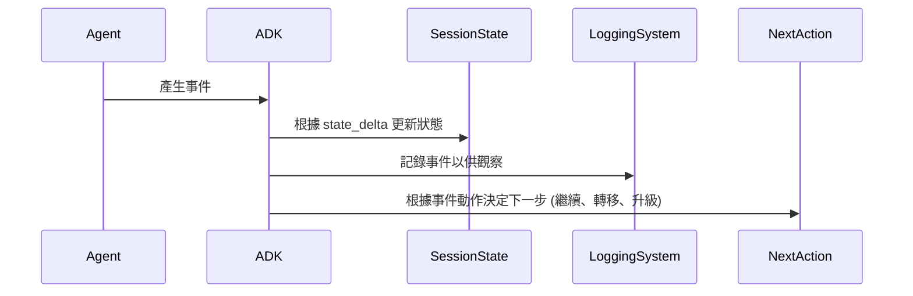

# 教學 18：事件與可觀察性 (Events & Observability)

該實作包括：
- ✅ 具備全面事件追蹤的 `CustomerServiceMonitor`
- ✅ `EventLogger`、`MetricsCollector` 和 `EventAlerter` 類別
- ✅ 49 個綜合測試（全部通過）
- ✅ 包含 `setup`、`dev`、`test`、`demo` 指令的 `Makefile`
- ✅ 包含使用範例的完整 `README`

快速開始：
```bash
cd tutorial_implementation/tutorial18
make setup
export GOOGLE_API_KEY=your_key
make dev
```

## 教學目標
**目標**：掌握事件追蹤和可觀察性模式，以監控 Agent 行為、除錯問題，並深入了解生產系統中 Agent 的決策過程。

**先決條件**：

- 教學 01 (Hello World Agent)
- 教學 06 (多 Agent 系統)
- 教學 09 (回呼與護欄)
- 對日誌記錄和監控概念的理解

**您將學到**：

- 理解 `Event` 類別和事件生命週期
- 使用 `EventActions` 進行狀態變更和 Agent 轉移
- 使用追蹤視圖實作可觀察性
- 追蹤長時間運行的工具操作
- 建立監控儀表板
- 使用事件日誌除錯 Agent 行為
- 生產可觀察性的最佳實踐

**完成時間**：55-70 分鐘

---

## 為何事件與可觀察性如此重要 (Why Events & Observability Matter)

**問題**：如果無法看到 Agent 的執行過程，除錯失敗和理解 Agent 行為將非常困難。

**解決方案**：**事件** 提供結構化的 Agent 活動日誌，而 **可觀察性** 工具使這些事件變得可操作。

**優點**：

- 🔍 **可見性 (Visibility)**：清楚看見 Agent 正在做什麼
- 🐛 **除錯 (Debugging)**：識別失敗和瓶頸
- 📊 **分析 (Analytics)**：追蹤效能指標
- [FLOW] **狀態追蹤 (State Tracking)**：監控隨時間變化的狀態
- 🎯 **最佳化 (Optimization)**：發現效率低下的地方
- 🚨 **警報 (Alerting)**：即時偵測異常

**事件捕捉的內容**：

- Agent 調用
- 工具呼叫
- 狀態修改
- Agent 轉移
- 錯誤和異常
- 時間資訊
- 身份驗證請求

---

## 1. 事件系統基礎 (Event System Basics)

### 什麼是事件？ (What is an Event?)

一個 **Event** 擴展了 `LlmResponse`，代表 Agent 執行期間的一個離散動作或狀態變更。

**來源**：`google/adk/events/event.py`

**事件結構**：

```python
from google.adk.events import Event, EventActions
from google.genai import types

event = Event(
    invocation_id='inv-123',           # 唯一的調用識別碼
    author='agent_name',                # 創建事件的 Agent
    content=types.Content(...),         # 事件內容/訊息
    actions=EventActions(               # 要執行的動作
        state_delta={'key': 'value'},   # 狀態變更
        artifact_delta={'file': 1},     # 工件變更
        escalate=False,                 # 升級給人類處理
        transfer_to_agent='other_agent' # 轉移給另一個 Agent
    )
)
```

### 事件生命週期 (Event Lifecycle)



---

## 2. EventActions：控制 Agent 流程 (EventActions: Controlling Agent Flow)

### 狀態差異 (State Delta)

修改會話狀態：

```python
from google.adk.events import EventActions

# 創建包含狀態變更的事件
actions = EventActions(
    state_delta={
        'user_preference': 'dark_mode',
        'last_query_time': '2025-10-08T14:30:00Z',
        'query_count': 5
    }
)

# 狀態將在會話中更新
# 可在後續的 Agent 呼叫中存取
```

### 工件差異 (Artifact Delta)

追蹤工件變更：

```python
actions = EventActions(
    artifact_delta={
        'report.pdf': 1,      # report.pdf 的版本 1 已創建
        'data.csv': 2,        # data.csv 的版本 2 已創建
        'image.png': 1        # image.png 的版本 1 已創建
    }
)

# 追蹤哪些工件被創建/修改
# 對於審計和來源追蹤很有用
```

### Agent 轉移 (Agent Transfer)

將控制權轉移給另一個 Agent：

```python
actions = EventActions(
    transfer_to_agent='specialized_agent',
    state_delta={'transfer_reason': 'requires_expertise'}
)

# 目前的 Agent 停止
# 控制權轉移給 'specialized_agent'
# 狀態被保留並傳遞下去
```

### 升級 (Escalation)

升級給人類審查：

```python
actions = EventActions(
    escalate=True,
    state_delta={'escalation_reason': 'ambiguous_request'}
)

# Agent 暫停
# 請求人類審查
# 通常用於：錯誤、敏感操作、低信度
```

### 跳過摘要 (Skip Summarization)

控制事件是否被摘要：

```python
actions = EventActions(
    skip_summarization=True
)

# 事件將不會被包含在內容摘要中
# 適用於：詳細日誌、中間狀態、除錯資訊
```

### 長時間運行的工具 (Long-Running Tools)

追蹤非同步操作：

```python
actions = EventActions(
    long_running_tool_ids=['tool_async_123', 'tool_async_456']
)

# 將工具標記為非同步運行
# 允許 Agent 在工具執行時繼續
# 結果在可用時整合
```

---

## 3. 真實世界範例：具備事件追蹤的客戶服務 (Real-World Example: Customer Service with Event Tracking)

讓我們建立一個具備全面事件追蹤和可觀察性的客戶服務系統。

### 完整實作 (Complete Implementation)

```python
"""
具備事件追蹤的客戶服務 Agent
監控所有 Agent 動作、狀態變更和升級。
"""

import asyncio
import os
from datetime import datetime
from typing import List, Dict
from google.adk.agents import Agent, Runner, Session
from google.adk.events import Event, EventActions
from google.adk.tools import FunctionTool
from google.genai import types

# 環境設定
os.environ['GOOGLE_GENAI_USE_VERTEXAI'] = '1'
os.environ['GOOGLE_CLOUD_PROJECT'] = 'your-project-id'
os.environ['GOOGLE_CLOUD_LOCATION'] = 'us-central1'


class CustomerServiceMonitor:
    """具備全面事件監控的客戶服務。"""

    def __init__(self):
        """初始化客戶服務系統。"""

        # 事件日誌儲存
        self.events: List[Dict] = []

        # 創建具備事件追蹤的工具

        def check_order_status(order_id: str) -> str:
            """檢查訂單狀態。"""
            self._log_tool_call('check_order_status', {'order_id': order_id})

            # 模擬訂單查詢
            status = {
                'ORD-001': 'shipped',
                'ORD-002': 'processing',
                'ORD-003': 'delivered'
            }.get(order_id, 'not_found')

            return f"訂單 {order_id} 狀態：{status}"

        def process_refund(order_id: str, amount: float) -> str:
            """處理退款請求。"""
            self._log_tool_call('process_refund', {
                'order_id': order_id,
                'amount': amount
            })

            # 金額大於 100 時會觸發升級
            if amount > 100:
                return "ESCALATE: 退款金額超過批准門檻"

            return f"訂單 {order_id} 的 ${amount} 退款已批准"

        def check_inventory(product_id: str) -> str:
            """檢查產品庫存。"""
            self._log_tool_call('check_inventory', {'product_id': product_id})

            # 模擬庫存檢查
            inventory = {
                'PROD-A': 150,
                'PROD-B': 5,
                'PROD-C': 0
            }.get(product_id, 0)

            return f"產品 {product_id} 庫存：{inventory} 單位"

        # 客戶服務 Agent
        self.agent = Agent(
            model='gemini-2.0-flash',
            name='customer_service',
            description='具備事件追蹤的客戶服務 Agent',
            instruction="""
            您是一位客戶服務 Agent，協助客戶處理：
            - 訂單狀態查詢
            - 退款請求
            - 庫存檢查
            - 一般問題

            指南：
            1. 始終保持禮貌和樂於助人
            2. 使用工具獲取準確資訊
            3. 對於超過 $100 的退款，升級給主管
            4. 在狀態中追蹤所有互動
            5. 記錄重要決策

            可用工具：
            - check_order_status：獲取訂單狀態
            - process_refund：處理退款（若 > $100 則升級）
            - check_inventory：檢查產品可用性
            """.strip(),
            tools=[
                FunctionTool(check_order_status),
                FunctionTool(process_refund),
                FunctionTool(check_inventory)
            ],
            generate_content_config=types.GenerateContentConfig(
                temperature=0.5,
                max_output_tokens=1024
            )
        )

        self.runner = Runner()

    def _log_tool_call(self, tool_name: str, args: Dict):
        """記錄工具調用。"""
        self.events.append({
            'timestamp': datetime.now().isoformat(),
            'type': 'tool_call',
            'tool': tool_name,
            'arguments': args
        })

    def _log_agent_event(self, event_type: str, data: Dict):
        """記錄 Agent 事件。"""
        self.events.append({
            'timestamp': datetime.now().isoformat(),
            'type': event_type,
            'data': data
        })

    async def handle_customer_query(self, customer_id: str, query: str):
        """
        處理具備完整事件追蹤的客戶查詢。

        Args:
            customer_id: 客戶識別碼
            query: 客戶查詢
        """

        print(f"\n{'='*70}")
        print(f"客戶：{customer_id}")
        print(f"查詢：{query}")
        print(f"{'='*70}\n")

        # 記錄查詢事件
        self._log_agent_event('customer_query', {
            'customer_id': customer_id,
            'query': query
        })

        # 創建包含客戶內容的會話
        session = Session()
        session.state['customer_id'] = customer_id
        session.state['query_time'] = datetime.now().isoformat()
        session.state['query_count'] = session.state.get('query_count', 0) + 1

        # 執行 Agent
        result = await self.runner.run_async(
            query,
            agent=self.agent,
            session=session
        )

        # 記錄回應
        response_text = result.content.parts[0].text

        self._log_agent_event('agent_response', {
            'customer_id': customer_id,
            'response': response_text
        })

        # 檢查是否升級
        if 'ESCALATE' in response_text:
            self._log_agent_event('escalation', {
                'customer_id': customer_id,
                'reason': response_text
            })
            print("🚨 已升級給主管\n")

        print(f"🤖 AGENT 回應：\n{response_text}\n")
        print(f"{'='*70}\n")

        return result

    def get_event_summary(self) -> str:
        """產生事件摘要報告。"""

        total_events = len(self.events)

        event_types = {}
        for event in self.events:
            event_type = event['type']
            event_types[event_type] = event_types.get(event_type, 0) + 1

        tool_calls = [e for e in self.events if e['type'] == 'tool_call']
        escalations = [e for e in self.events if e['type'] == 'escalation']

        summary = f"""
        事件摘要報告
        {'='*70}

        總事件數：{total_events}

        事件類型：
        """

        for event_type, count in event_types.items():
            summary += f"  - {event_type}: {count}\n"

        summary += f"\n工具呼叫：{len(tool_calls)}\n"

        if tool_calls:
            summary += "  使用的工具：\n"
            tool_usage = {}
            for call in tool_calls:
                tool = call['tool']
                tool_usage[tool] = tool_usage.get(tool, 0) + 1

            for tool, count in tool_usage.items():
                summary += f"    - {tool}: {count} 次呼叫\n"

        summary += f"\n升級次數：{len(escalations)}\n"

        if escalations:
            summary += "  升級原因：\n"
            for esc in escalations:
                summary += f"    - {esc['data']['reason']}\n"

        summary += f"\n{'='*70}"

        return summary

    def get_detailed_timeline(self) -> str:
        """獲取詳細的事件時間軸。"""

        timeline = f"\n詳細事件時間軸\n{'='*70}\n"

        for i, event in enumerate(self.events, 1):
            timeline += f"\n[{i}] {event['timestamp']}\n"
            timeline += f"    類型：{event['type']}\n"

            if event['type'] == 'tool_call':
                timeline += f"    工具：{event['tool']}\n"
                timeline += f"    參數：{event['arguments']}\n"
            elif event['type'] in ['customer_query', 'agent_response', 'escalation']:
                for key, value in event['data'].items():
                    timeline += f"    {key}: {value}\n"

        timeline += f"\n{'='*70}\n"

        return timeline


async def main():
    """主進入點。"""

    monitor = CustomerServiceMonitor()

    # 客戶 1：訂單狀態查詢
    await monitor.handle_customer_query(
        customer_id='CUST-001',
        query='我的訂單 ORD-001 的狀態是什麼？'
    )

    await asyncio.sleep(1)

    # 客戶 2：退款請求（小額）
    await monitor.handle_customer_query(
        customer_id='CUST-002',
        query='我想要為訂單 ORD-002 退款 $50'
    )

    await asyncio.sleep(1)

    # 客戶 3：退款請求（大額 - 觸發升級）
    await monitor.handle_customer_query(
        customer_id='CUST-003',
        query='我需要為訂單 ORD-003 退款 $150'
    )

    await asyncio.sleep(1)

    # 客戶 4：庫存檢查
    await monitor.handle_customer_query(
        customer_id='CUST-004',
        query='產品 PROD-B 有庫存嗎？'
    )

    # 產生報告
    print("\n" + monitor.get_event_summary())
    print(monitor.get_detailed_timeline())


if __name__ == '__main__':
    asyncio.run(main())
```

### 預期輸出 (Expected Output)

```
======================================================================
客戶：CUST-001
查詢：我的訂單 ORD-001 的狀態是什麼？
======================================================================

🤖 AGENT 回應：
您的訂單 ORD-001 已經出貨！您應該很快就會收到。

======================================================================

======================================================================
客戶：CUST-002
查詢：我想要為訂單 ORD-002 退款 $50
======================================================================

🤖 AGENT 回應：
我已經為您的訂單 ORD-002 處理了 $50 的退款。款項應在 3-5 個工作日內出現在您的帳戶中。

======================================================================

======================================================================
客戶：CUST-003
查詢：我需要為訂單 ORD-003 退款 $150
======================================================================

🚨 已升級給主管

🤖 AGENT 回應：
ESCALATE: 退款金額超過批准門檻。此請求需要主管批准。一位主管將在 24 小時內與您聯繫，處理您訂單 ORD-003 的 $150 退款。

======================================================================

======================================================================
客戶：CUST-004
查詢：產品 PROD-B 有庫存嗎？
======================================================================

🤖 AGENT 回應：
產品 PROD-B 目前有 5 個單位的庫存。可以購買，但庫存不多。如果您有興趣，建議您盡快下單！

======================================================================


事件摘要報告
======================================================================

總事件數：12

事件類型：
  - customer_query: 4
  - tool_call: 4
  - agent_response: 4

工具呼叫：4
  使用的工具：
    - check_order_status: 1 次呼叫
    - process_refund: 2 次呼叫
    - check_inventory: 1 次呼叫

升級次數：1
  升級原因：
    - ESCALATE: 退款金額超過批准門檻

======================================================================


詳細事件時間軸
======================================================================

[1] 2025-10-08T14:30:15.123456
    類型：customer_query
    customer_id: CUST-001
    query: 我的訂單 ORD-001 的狀態是什麼？

[2] 2025-10-08T14:30:15.234567
    類型：tool_call
    工具：check_order_status
    參數：{'order_id': 'ORD-001'}

[3] 2025-10-08T14:30:16.345678
    類型：agent_response
    customer_id: CUST-001
    response: 您的訂單 ORD-001 已經出貨！您應該很快就會收到。

[4] 2025-10-08T14:30:17.456789
    類型：customer_query
    customer_id: CUST-002
    query: 我想要為訂單 ORD-002 退款 $50

[5] 2025-10-08T14:30:17.567890
    類型：tool_call
    工具：process_refund
    參數：{'order_id': 'ORD-002', 'amount': 50.0}

[6] 2025-10-08T14:30:18.678901
    類型：agent_response
    customer_id: CUST-002
    response: 我已經為您的訂單 ORD-002 處理了 $50 的退款...

[7] 2025-10-08T14:30:19.789012
    類型：customer_query
    customer_id: CUST-003
    query: 我需要為訂單 ORD-003 退款 $150

[8] 2025-10-08T14:30:19.890123
    類型：tool_call
    工具：process_refund
    參數：{'order_id': 'ORD-003', 'amount': 150.0}

[9] 2025-10-08T14:30:20.901234
    類型：escalation
    customer_id: CUST-003
    reason: ESCALATE: 退款金額超過批准門檻

[10] 2025-10-08T14:30:20.912345
    類型：agent_response
    customer_id: CUST-003
    response: ESCALATE: 退款金額超過批准門檻...

[11] 2025-10-08T14:30:22.023456
    類型：customer_query
    customer_id: CUST-004
    query: 產品 PROD-B 有庫存嗎？

[12] 2025-10-08T14:30:22.134567
    類型：tool_call
    工具：check_inventory
    參數：{'product_id': 'PROD-B'}

======================================================================
```

---

## 4. ADK 網站追蹤視圖 (ADK Web Trace View)

ADK 提供了一個內建的網站 UI，用於查看追蹤和事件。

### 啟動追蹤視圖 (Starting Trace View)

```bash
# 啟動 ADK 網站介面
adk web

# 在瀏覽器中打開：
# http://localhost:8080

# 導航到 "Trace" 標籤
# 查看所有 Agent 執行、事件和狀態變更
```

### 追蹤視圖功能 (Trace View Features)

**事件標籤 (Event Tab)**：

- 所有事件按時間順序排列
- 事件類型過濾
- 事件內容查看
- 狀態差異視覺化

**請求標籤 (Request Tab)**：

- Agent 調用
- 輸入訊息
- 使用的配置
- 會話資訊

**回應標籤 (Response Tab)**：

- Agent 回應
- 工具呼叫結果
- 時間資訊
- Token 使用量

**圖表標籤 (Graph Tab)**：

- 視覺化工作流程表示
- Agent 轉換
- 子 Agent 呼叫
- 工具依賴關係

---

## 5. 進階可觀察性模式 (Advanced Observability Patterns)

### 模式 1：自訂事件記錄器 (Pattern 1: Custom Event Logger)

創建自訂事件記錄：

```python
import logging
from typing import List, Dict
from google.adk.events import Event

class EventLogger:
    """用於結構化日誌記錄的自訂事件記錄器。"""

    def __init__(self):
        self.logger = logging.getLogger('agent_events')
        self.logger.setLevel(logging.INFO)

        # 配置處理器
        handler = logging.FileHandler('agent_events.log')
        handler.setFormatter(logging.Formatter(
            '%(asctime)s - %(name)s - %(levelname)s - %(message)s'
        ))
        self.logger.addHandler(handler)

    def log_event(self, event: Event):
        """使用結構化數據記錄事件。"""
        self.logger.info({
            'invocation_id': event.invocation_id,
            'author': event.author,
            'content': event.content.parts[0].text if event.content else None,
            'actions': {
                'state_delta': event.actions.state_delta if event.actions else None,
                'escalate': event.actions.escalate if event.actions else None
            }
        })


# 使用方式
logger = EventLogger()

# 在 Agent 執行中：
# logger.log_event(event)
```

### 模式 2：指標收集 (Pattern 2: Metrics Collection)

收集效能指標：

```python
from dataclasses import dataclass
from typing import Dict, List
import time

@dataclass
class AgentMetrics:
    """Agent 效能指標。"""
    invocation_count: int = 0
    total_latency: float = 0.0
    tool_call_count: int = 0
    error_count: int = 0
    escalation_count: int = 0


class MetricsCollector:
    """收集 Agent 指標以進行監控。"""

    def __init__(self):
        self.metrics: Dict[str, AgentMetrics] = {}

    def track_invocation(self, agent_name: str, latency: float,
                        had_error: bool = False, escalated: bool = False):
        """追蹤 Agent 調用指標。"""

        if agent_name not in self.metrics:
            self.metrics[agent_name] = AgentMetrics()

        m = self.metrics[agent_name]
        m.invocation_count += 1
        m.total_latency += latency

        if had_error:
            m.error_count += 1
        if escalated:
            m.escalation_count += 1

    def get_summary(self, agent_name: str) -> Dict:
        """獲取 Agent 的指標摘要。"""

        if agent_name not in self.metrics:
            return {}

        m = self.metrics[agent_name]

        return {
            'invocations': m.invocation_count,
            'avg_latency': m.total_latency / m.invocation_count if m.invocation_count > 0 else 0,
            'error_rate': m.error_count / m.invocation_count if m.invocation_count > 0 else 0,
            'escalation_rate': m.escalation_count / m.invocation_count if m.invocation_count > 0 else 0
        }


# 使用方式
collector = MetricsCollector()

start = time.time()
# ... 執行 Agent ...
latency = time.time() - start

collector.track_invocation('customer_service', latency, had_error=False, escalated=True)

print(collector.get_summary('customer_service'))
```

### 模式 3：即時警報 (Pattern 3: Real-Time Alerting)

對特定事件模式發出警報：

```python
from typing import Callable, List
from google.adk.events import Event

class EventAlerter:
    """對特定事件模式發出警報。"""

    def __init__(self):
        self.rules: List[tuple[Callable, Callable]] = []

    def add_rule(self, condition: Callable[[Event], bool],
                 alert_fn: Callable[[Event], None]):
        """新增警報規則。"""
        self.rules.append((condition, alert_fn))

    def check_event(self, event: Event):
        """根據所有規則檢查事件。"""
        for condition, alert_fn in self.rules:
            if condition(event):
                alert_fn(event)


# 使用方式
alerter = EventAlerter()

# 對升級發出警報
alerter.add_rule(
    condition=lambda e: e.actions and e.actions.escalate,
    alert_fn=lambda e: print(f"🚨 警報：在 {e.author} 中發生升級")
)

# 對錯誤發出警報
alerter.add_rule(
    condition=lambda e: 'error' in str(e.content).lower(),
    alert_fn=lambda e: print(f"❌ 警報：在 {e.author} 中偵測到錯誤")
)

# 對高價值交易發出警報
alerter.add_rule(
    condition=lambda e: e.actions and e.actions.state_delta
                        and e.actions.state_delta.get('transaction_amount', 0) > 1000,
    alert_fn=lambda e: print(f"💰 警報：在 {e.author} 中發生高價值交易")
)

# 檢查事件
# alerter.check_event(event)
```

---

## 6. 最佳實踐 (Best Practices)

### ✅ DO：記錄重要的狀態變更 (Log Important State Changes)

```python
# ✅ 良好 - 追蹤關鍵狀態
actions = EventActions(
    state_delta={
        'order_status': 'shipped',
        'shipping_carrier': 'UPS',
        'tracking_number': '1Z999AA10123456784',
        'updated_at': '2025-10-08T14:30:00Z'
    }
)

# ❌ 不良 - 沒有狀態追蹤
# Agent 修改訂單但未記錄
```

### ✅ DO：適當使用升級 (Use Escalation Appropriately)

```python
# ✅ 良好 - 必要時升級
if refund_amount > 100:
    actions = EventActions(
        escalate=True,
        state_delta={'escalation_reason': 'high_value_refund'}
    )

# ❌ 不良 - 對於有風險的操作沒有升級
# 未經批准處理大額退款
```

### ✅ DO：追蹤長時間運行的操作 (Track Long-Running Operations)

```python
# ✅ 良好 - 標記非同步工具
actions = EventActions(
    long_running_tool_ids=['video_processing_123', 'report_generation_456']
)

# Agent 在工具運行時繼續
# 結果非同步整合

# ❌ 不良 - 阻塞長時間操作
# Agent 等待冗長的工具執行
```

### ✅ DO：在事件中包含上下文 (Include Context in Events)

```python
# ✅ 良好 - 豐富的上下文
event = Event(
    invocation_id='inv-123',
    author='customer_service',
    content=types.Content(
        parts=[types.Part.from_text('已處理退款')]
    ),
    actions=EventActions(
        state_delta={
            'action': 'refund_processed',
            'customer_id': 'CUST-123',
            'order_id': 'ORD-456',
            'amount': 50.00,
            'timestamp': '2025-10-08T14:30:00Z',
            'agent': 'customer_service'
        }
    )
)

# ❌ 不良 - 最少的上下文
event = Event(
    invocation_id='inv-123',
    author='agent',
    content=types.Content(parts=[types.Part.from_text('完成')])
)
```

---

## 7. 疑難排解 (Troubleshooting)

### 問題：「事件未出現在追蹤視圖中」("Events not appearing in trace view")

**解決方案**：

1.  **確保 ADK 網站正在運行**：

```bash
adk web
# 檢查 http://localhost:8080
```

2.  **驗證日誌記錄已啟用**：

```python
import logging
logging.basicConfig(level=logging.INFO)

# ADK 將記錄事件
```

3.  **檢查事件結構**：

```python
# 事件必須有必要的欄位
event = Event(
    invocation_id='inv-123',  # 必要
    author='agent_name',       # 必要
    content=types.Content(...)  # 必要
)
```

### 問題：「狀態在呼叫之間未持久化」("State not persisting across calls")

**解決方案**：使用會話：

```python
# ✅ 使用會話以實現狀態持久化
session = Session()

result1 = runner.run(query1, agent=agent, session=session)
result2 = runner.run(query2, agent=agent, session=session)  # 狀態被保留

# ❌ 沒有會話 - 狀態丟失
result1 = runner.run(query1, agent=agent)
result2 = runner.run(query2, agent=agent)  # 狀態重置
```

---

## 摘要 (Summary)

您已經掌握了事件和可觀察性：

**重點回顧**：

- ✅ `Event` 類別追蹤所有 Agent 動作
- ✅ `EventActions` 控制狀態、轉移、升級
- ✅ `state_delta` 用於狀態修改
- ✅ `artifact_delta` 追蹤檔案變更
- ✅ `escalate` 用於人類審查
- ✅ `transfer_to_agent` 用於 Agent 交接
- ✅ ADK 網站追蹤視圖用於視覺化
- ✅ 用於生產監控的自訂日誌記錄和指標

**生產清單**：

- [ ] 所有關鍵操作都記錄了事件
- [ ] 使用 `state_delta` 追蹤狀態變更
- [ ] 定義並測試了升級規則
- [ ] 配置了監控儀表板
- [ ] 針對異常的警報規則
- [ ] 追蹤視圖可用於除錯
- [ ] 收集了指標（延遲、錯誤、升級）
- [ ] 定義了事件保留策略

**資源**：

- [ADK 事件文件](https://google.github.io/adk-docs/events/)
- [可觀察性指南](https://google.github.io/adk-docs/observability/)
- [ADK 網站介面](https://google.github.io/adk-docs/tools/adk-web/)

---

## 程式碼實現 (Code Implementation)
- observability-agent：[程式碼連結](../../../python/agents/observability-agent/)
