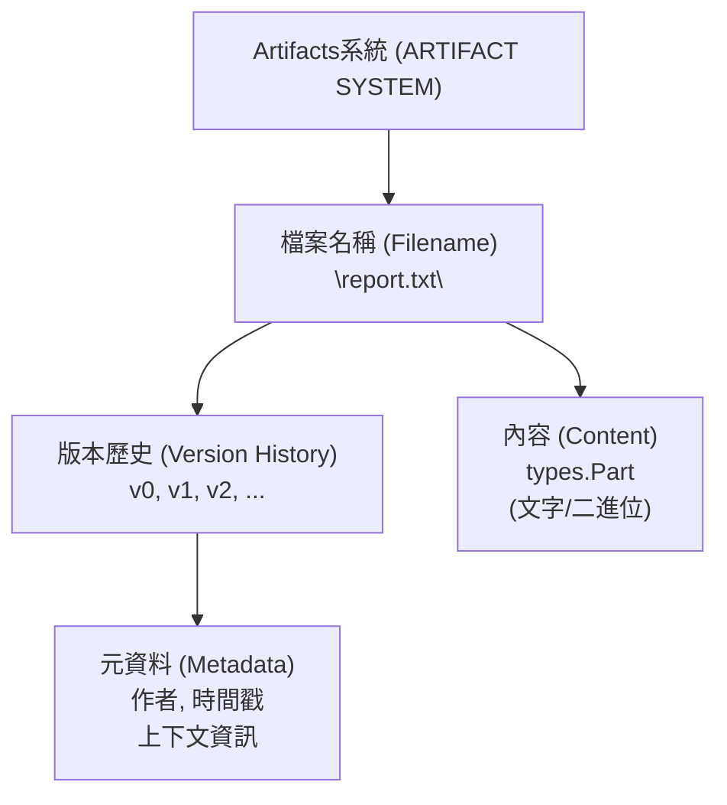
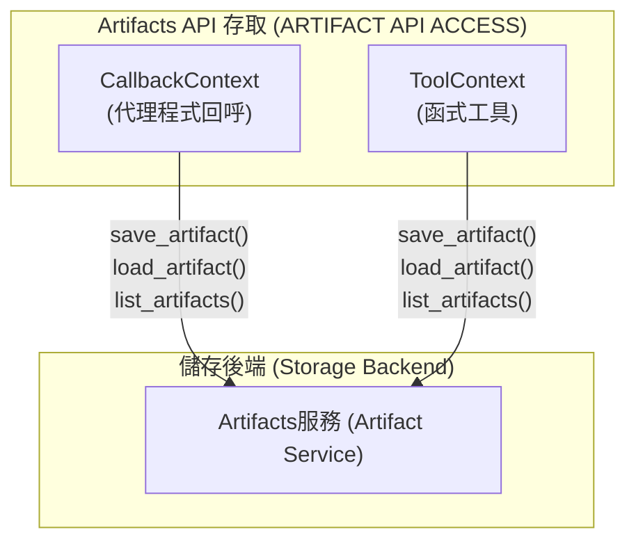
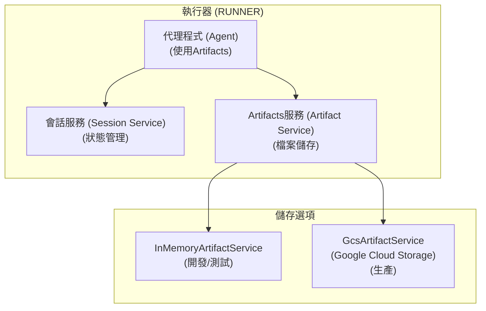
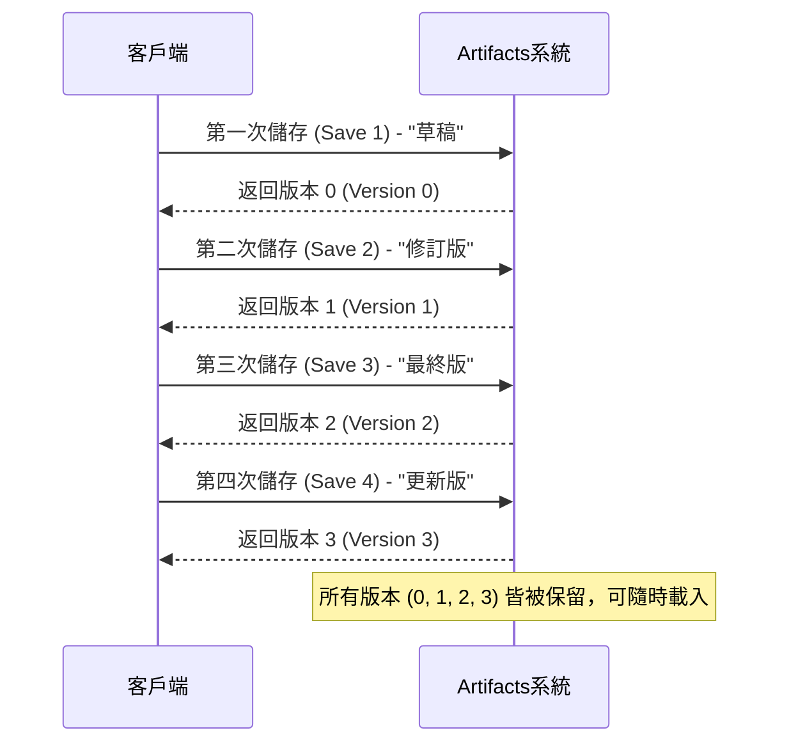
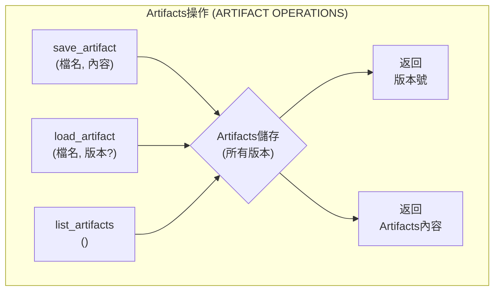
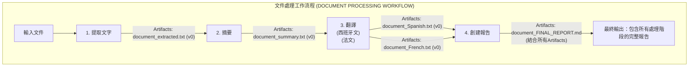
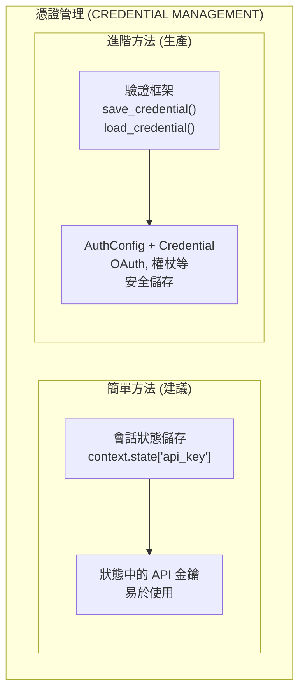
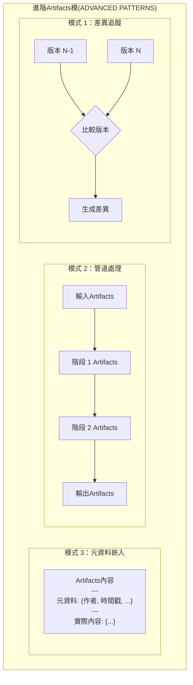

# 教學 19：Artifacts與檔案管理 (Tutorial 19: Artifacts & File Management)

**目標**：掌握Artifacts的儲存、版本控制和擷取，使代理程式能夠跨會話創建、管理和追蹤檔案，提供持久狀態和稽核追蹤。

**先決條件**：

- 教學 01 (Hello World 代理程式)
- 教學 08 (狀態與記憶體)
- 教學 09 (回呼與防護機制)
- 理解檔案 I/O 操作

**您將學到**：

- 使用 `save_artifact()` 儲存帶有版本控制的檔案
- 使用 `load_artifact()` 擷取Artifacts
- 使用 `list_artifacts()` 列出所有Artifacts
- 使用 `save_credential()` 和 `load_credential()` 管理憑證
- 使用Artifacts追蹤建構文件處理器
- 實作檔案來源和稽核追蹤
- 生產環境中Artifacts管理的最佳實踐

**完成時間**：45-60 分鐘

---

## 為何Artifacts如此重要 (Why Artifacts Matter)

**問題**：代理程式需要在不同會話之間創建並持久化檔案（報告、資料、圖片），並具備版本控制和稽核追蹤功能。

**解決方案**：**Artifacts (Artifacts)** 提供結構化的檔案儲存，具備自動版本控制和元資料追蹤功能。

**優點**：

- 💾 **持久性 (Persistence)**：檔案在代理程式會話之間持續存在
- 📝 **版本控制 (Versioning)**：每次儲存都會自動追蹤版本
- 🔍 **可發現性 (Discoverability)**：可列出並搜尋所有Artifacts
- 📊 **稽核追蹤 (Audit Trail)**：追蹤誰在何時創建了什麼
- 🔐 **憑證 (Credentials)**：安全儲存 API 金鑰和權杖
- 🎯 **上下文 (Context)**：代理程式可以引用先前創建的檔案

**使用案例**：

- 報告生成與封存
- 資料處理管道
- 文件創建工作流程
- 檔案轉換鏈
- 稽核與合規性記錄

---

## 1. Artifacts基礎 (Artifact Basics)

### 什麼是Artifacts？ (What is an Artifact?)

**Artifacts (artifact)** 是由代理程式系統儲存的帶有版本的檔案。每次儲存都會創建一個新版本，所有版本都會被保留。

**來源**：`google/adk/agents/callback_context.py`, `google/adk/tools/tool_context.py`

**Artifacts屬性**：

- **檔案名稱 (Filename)**：唯一識別碼
- **版本 (Version)**：從 0 開始自動遞增的整數 (0, 1, 2, ...)
- **內容 (Content)**：實際的檔案資料（格式為 `types.Part`）
- **元資料 (Metadata)**：作者、時間戳、上下文



```
ℹ️ 版本編號
Artifacts版本是**從 0 開始索引**的。第一次儲存返回版本 0，第二次返回版本 1，依此類推。
```

### 實作說明：使用 ToolContext 的非同步工具 (Implementation Note: Async Tools with ToolContext)

**所有Artifacts操作都是非同步的。** 在建構使用Artifacts的工具時，它們必須是接受 `ToolContext` 的非同步函式：

```python
# 匯入必要的模組
from google.adk.tools.tool_context import ToolContext
from google.genai import types

async def my_tool(param: str, tool_context: ToolContext) -> dict:
    """一個儲存Artifacts的工具。"""

    # 創建Artifacts內容
    content = f"已處理: {param}"
    artifact_part = types.Part.from_text(text=content)

    # 儲存Artifacts（注意：參數是 'artifact'，不是 'part'）
    version = await tool_context.save_artifact(
        filename='output.txt',
        artifact=artifact_part  # 正確的參數名稱
    )

    # 返回結構化的字典
    return {
        'status': 'success',
        'report': f'已儲存為版本 {version}',
        'data': {'version': version, 'filename': 'output.txt'}
    }
```

**關鍵點**：

- ✅ 工具函式使用 `async def`
- ✅ 接受 `tool_context: ToolContext` 參數
- ✅ 對 `save_artifact()`、`load_artifact()`、`list_artifacts()` 使用 `await`
- ✅ 在 ADK 1.16.0+ 中使用 `artifact=` 參數（而非 `part=`）
- ✅ 返回包含 `status`、`report` 和 `data` 欄位的結構化字典

### Artifacts的可用位置 (Where Artifacts are Available)

Artifacts可以在以下位置存取：



```python
# 1. 回呼上下文
from google.adk.agents import CallbackContext

async def my_callback(context: CallbackContext):
    # 儲存、載入、列出Artifacts
    version = await context.save_artifact('file.txt', part)
    artifact = await context.load_artifact('file.txt')
    files = await context.list_artifacts()

# 2. 工具上下文
from google.adk.tools.tool_context import ToolContext

async def my_tool(query: str, tool_context: ToolContext):
    # 儲存、載入、列出Artifacts
    version = await tool_context.save_artifact('data.json', part)
    artifact = await tool_context.load_artifact('data.json')
    files = await tool_context.list_artifacts()
```

### 設定Artifacts儲存 (Configuring Artifact Storage)

在使用Artifacts之前，請在您的 Runner 中設定Artifacts服務：



```python
# 匯入必要的模組
from google.adk.runners import Runner
from google.adk.artifacts import InMemoryArtifactService, GcsArtifactService
from google.adk.sessions import InMemorySessionService
from google.adk.agents import Agent

# 選項 1：記憶體內儲存 (開發/測試)
artifact_service = InMemoryArtifactService()

# 選項 2：Google Cloud Storage (生產)
# artifact_service = GcsArtifactService(bucket_name='your-gcs-bucket')

# 創建代理程式
agent = Agent(
    name='my_agent',
    model='gemini-2.0-flash',
    # ... 其他設定
)

# 使用Artifacts服務設定執行器
runner = Runner(
    agent=agent,
    app_name='my_app',
    session_service=InMemorySessionService(),
    artifact_service=artifact_service  # 啟用Artifacts儲存
)
```

```
⚠️ warning 必要設定
如果未設定 `artifact_service`，呼叫Artifacts方法將引發 `ValueError`。在使用Artifacts前，請務必設定Artifacts服務。
```

---

## 2. 儲存Artifacts (Saving Artifacts)

### 基本儲存 (Basic Save)

```python
# 匯入必要的模組
from google.adk.agents import CallbackContext
from google.genai import types

async def create_report(context: CallbackContext):
    """創建並儲存報告Artifacts。"""

    # 創建報告內容
    report_text = """
# 2025 年第三季銷售報告

總收入：$1,245,000
成長率：同比增長 15%

熱門產品：
1. 產品 A：$450,000
2. 產品 B：$320,000
3. 產品 C：$275,000
    """.strip()

    # 從文字創建 Part
    report_part = types.Part.from_text(report_text)

    # 儲存為Artifacts
    version = await context.save_artifact(
        filename='sales_report_q3_2025.md',
        part=report_part
    )

    print(f"報告已儲存為版本 {version}")
    return version
```

### 儲存二進位資料 (Save with Binary Data)

```python
async def save_image(context: CallbackContext, image_bytes: bytes):
    """儲存圖片Artifacts。"""

    # 從位元組創建 Part
    image_part = types.Part(
        inline_data=types.Blob(
            data=image_bytes,
            mime_type='image/png'
        )
    )

    # 儲存圖片
    version = await context.save_artifact(
        filename='chart.png',
        part=image_part
    )

    return version
```

### 版本控制行為 (Versioning Behavior)



```python
# 第一次儲存 - 創建版本 0
v1 = await context.save_artifact('report.txt', part1)
print(v1)  # 輸出: 0

# 第二次儲存 - 創建版本 1
v2 = await context.save_artifact('report.txt', part2)
print(v2)  # 輸出: 1

# 第三次儲存 - 創建版本 2
v3 = await context.save_artifact('report.txt', part3)
print(v3)  # 輸出: 2

# 所有版本都被保留且可存取 (0, 1, 2, ...)
```

---

## 3. 載入Artifacts (Loading Artifacts)



### 載入最新版本 (Load Latest Version)

```python
async def load_report(context: CallbackContext):
    """載入最新版本的報告。"""

    # 載入最新版本
    artifact = await context.load_artifact('sales_report_q3_2025.md')

    if artifact:
        # 提取文字內容
        text = artifact.text
        print(f"已載入報告：\n{text}")
    else:
        print("找不到報告")
```

### 載入特定版本 (Load Specific Version)

```python
async def load_version(context: CallbackContext, filename: str, version: int):
    """載入特定的Artifacts版本。"""

    # 載入檔案的版本 1 (第二次儲存)
    # 請記住：版本是從 0 開始索引的 (0=第一次, 1=第二次, 2=第三次)
    artifact = await context.load_artifact(
        filename=filename,
        version=version
    )

    if artifact:
        print(f"已載入 {filename} 版本 {version}")
        return artifact.text
    else:
        print(f"找不到版本 {version}")
        return None
```

### 處理遺失的Artifacts (Handle Missing Artifacts)

```python
async def safe_load(context: CallbackContext, filename: str):
    """安全地載入Artifacts並處理錯誤。"""

    try:
        artifact = await context.load_artifact(filename)

        if artifact is None:
            print(f"Artifacts {filename} 不存在")
            return None

        return artifact.text

    except Exception as e:
        print(f"載入 {filename} 時發生錯誤：{e}")
        return None
```

---

## 4. 列出Artifacts (Listing Artifacts)

### 列出所有Artifacts (List All Artifacts)

```python
async def show_all_artifacts(context: CallbackContext):
    """列出所有可用的Artifacts。"""

    artifacts = await context.list_artifacts()

    print("可用的Artifacts：")
    print("="*60)

    for filename in artifacts:
        print(f"  - {filename}")

    print(f"\n總計：{len(artifacts)} 個Artifacts")
```

### 依類型篩選Artifacts (Filter Artifacts by Type)

```python
async def list_by_extension(context: CallbackContext, extension: str):
    """依副檔名列出Artifacts。"""

    all_artifacts = await context.list_artifacts()

    filtered = [
        f for f in all_artifacts
        if f.endswith(extension)
    ]

    print(f"副檔名為 {extension} 的Artifacts：")
    for f in filtered:
        print(f"  - {f}")

    return filtered
```

### 內建Artifacts載入工具 (Built-in Artifact Loading Tool)

ADK 提供了一個內建工具，可自動將Artifacts載入到 LLM 上下文中：

```python
# 匯入必要的模組
from google.adk.tools.load_artifacts_tool import load_artifacts_tool
from google.adk.agents import Agent

# 將其加入您的代理程式工具中
agent = Agent(
    name='artifact_agent',
    model='gemini-2.0-flash',
    tools=[
        load_artifacts_tool,  # 內建Artifacts載入器
        # ... 您的其他工具
    ]
)
```

**它的作用**：

- 自動為代理程式列出可用的Artifacts
- 當 LLM 請求時載入Artifacts內容
- 處理會話範圍和使用者範圍的Artifacts
- 在對話上下文中提供Artifacts內容

**何時使用**：

- 當您希望 LLM 自動發現並使用Artifacts時
- 用於對儲存的檔案進行對話式存取
- 在建構文件問答或分析代理程式時

---

## 5. 真實世界範例：文件處理器 (Real-World Example: Document Processor)

讓我們建構一個具有完整Artifacts管理的文件處理管道。



### 完整實作 (Complete Implementation)

````python
"""
帶有Artifacts管理的文件處理器
透過多個階段處理文件，並具備版本控制和稽核追蹤。
"""

# 匯入必要的模組
import asyncio
import os
from datetime import datetime
from typing import Dict, Optional
from google.adk.agents import Agent, Runner, Session
from google.adk.tools import FunctionTool
from google.adk.tools.tool_context import ToolContext
from google.genai import types

# 環境設定
os.environ['GOOGLE_GENAI_USE_VERTEXAI'] = '1'
os.environ['GOOGLE_CLOUD_PROJECT'] = 'your-project-id'
os.environ['GOOGLE_CLOUD_LOCATION'] = 'us-central1'


class DocumentProcessor:
    """具有Artifacts追蹤的文件處理管道。"""

    def __init__(self):
        """初始化文件處理器。"""

        # 處理歷史記錄
        self.processing_log: list[Dict] = []

        # 創建處理工具

        async def extract_text(document: str, tool_context: ToolContext) -> str:
            """從文件中提取並清理文字。"""

            self._log_step('extract_text', document)

            # 模擬文字提取
            extracted = f"從 {document} 提取的文字\n\n"
            extracted += "這是清理和提取後的內容..."

            # 儲存提取的版本
            part = types.Part.from_text(extracted)
            version = await tool_context.save_artifact(
                filename=f"{document}_extracted.txt",
                part=part
            )

            return f"文字已提取並儲存為版本 {version}"

        async def summarize_document(document: str, tool_context: ToolContext) -> str:
            """生成文件摘要。"""

            self._log_step('summarize', document)

            # 載入原始文件
            artifact = await tool_context.load_artifact(f"{document}_extracted.txt")

            if not artifact:
                return "錯誤：找不到提取的文字"

            # 生成摘要
            summary = f"{document} 的摘要\n\n"
            summary += "重點：\n"
            summary += "- 重點 1：重要發現\n"
            summary += "- 重點 2：關鍵洞察\n"
            summary += "- 重點 3：主要建議\n"

            # 儲存摘要
            part = types.Part.from_text(summary)
            version = await tool_context.save_artifact(
                filename=f"{document}_summary.txt",
                part=part
            )

            return f"摘要已創建為版本 {version}"

        async def translate_document(document: str, language: str,
                                    tool_context: ToolContext) -> str:
            """將文件翻譯成目標語言。"""

            self._log_step('translate', f"{document} 到 {language}")

            # 載入提取的文字
            artifact = await tool_context.load_artifact(f"{document}_extracted.txt")

            if not artifact:
                return "錯誤：找不到來源文件"

            # 模擬翻譯
            translated = f"翻譯 ({language})：{document}\n\n"
            translated += f"[內容已翻譯成 {language}]"

            # 儲存翻譯
            part = types.Part.from_text(translated)
            version = await tool_context.save_artifact(
                filename=f"{document}_{language}.txt",
                part=part
            )

            return f"到 {language} 的翻譯已儲存為版本 {version}"

        async def create_report(document: str, tool_context: ToolContext) -> str:
            """從所有Artifacts創建綜合報告。"""

            self._log_step('create_report', document)

            # 列出此文件的所有Artifacts
            all_artifacts = await tool_context.list_artifacts()
            doc_artifacts = [a for a in all_artifacts if a.startswith(document)]

            # 建立報告
            report = f"""
            # 文件處理報告
            文件：{document}
            生成時間：{datetime.now().strftime('%Y-%m-%d %H:%M:%S')}

            ## 處理管道

            """

            # 載入並包含每個Artifacts
            for artifact_name in doc_artifacts:
                artifact = await tool_context.load_artifact(artifact_name)
                if artifact:
                    report += f"\n### {artifact_name}\n\n"
                    report += f"```\n{artifact.text[:200]}...\n```\n"

            report += f"\n## 已創建的Artifacts\n\n"
            report += f"總Artifacts數：{len(doc_artifacts)}\n"
            for name in doc_artifacts:
                report += f"- {name}\n"

            # 儲存最終報告
            part = types.Part.from_text(report)
            version = await tool_context.save_artifact(
                filename=f"{document}_FINAL_REPORT.md",
                part=part
            )

            return f"最終報告已創建為版本 {version}"

        async def list_all_documents(tool_context: ToolContext) -> str:
            """列出所有已處理的文件。"""

            artifacts = await tool_context.list_artifacts()

            # 提取唯一的文件名稱
            documents = set()
            for artifact in artifacts:
                # 移除 _extracted, _summary 等後綴
                base = artifact.split('_')[0]
                documents.add(base)

            result = "已處理的文件：\n"
            for doc in sorted(documents):
                result += f"- {doc}\n"

            return result

        # 創建文件處理器代理程式
        self.agent = Agent(
            model='gemini-2.0-flash',
            name='document_processor',
            description='透過多個階段處理文件',
            instruction="""
            您是一個文件處理代理程式，具備以下能力：

            **可用工具：**
            1. extract_text：從文件中提取並清理文字
            2. summarize_document：生成文件摘要
            3. translate_document：翻譯成目標語言
            4. create_report：創建綜合處理報告
            5. list_all_documents：列出所有已處理的文件

            **處理工作流程：**
            對於文件處理請求：
            1. 首先提取文字
            2. 創建摘要
            3. 如果請求，則進行翻譯
            4. 生成最終報告
            5. 報告所有已創建的Artifacts

            在每一步都要解釋您正在做什麼。
            """.strip(),
            tools=[
                FunctionTool(extract_text),
                FunctionTool(summarize_document),
                FunctionTool(translate_document),
                FunctionTool(create_report),
                FunctionTool(list_all_documents)
            ],
            generate_content_config=types.GenerateContentConfig(
                temperature=0.3,
                max_output_tokens=2048
            )
        )

        self.runner = Runner()
        self.session = Session()

    def _log_step(self, step: str, details: str):
        """記錄處理步驟。"""
        self.processing_log.append({
            'timestamp': datetime.now().isoformat(),
            'step': step,
            'details': details
        })

    async def process_document(self, document_name: str, operations: list[str]):
        """
        使用指定的操作處理文件。

        Args:
            document_name：要處理的文件名稱
            operations：操作列表 (extract, summarize, translate, report)
        """

        print(f"\n{'='*70}")
        print(f"正在處理：{document_name}")
        print(f"操作：{', '.join(operations)}")
        print(f"{'='*70}\n")

        # 建立查詢
        query = f"處理文件 '{document_name}'，操作：{', '.join(operations)}"

        if 'translate' in operations:
            query += " (翻譯成西班牙文和法文)"

        # 執行處理
        result = await self.runner.run_async(
            query,
            agent=self.agent,
            session=self.session
        )

        print("\n📄 處理結果：\n")
        print(result.content.parts[0].text)
        print(f"\n{'='*70}\n")

    def get_processing_log(self) -> str:
        """獲取處理日誌摘要。"""

        log = f"\n處理日誌\n{'='*70}\n"

        for entry in self.processing_log:
            log += f"\n[{entry['timestamp']}]\n"
            log += f"  步驟：{entry['step']}\n"
            log += f"  詳情：{entry['details']}\n"

        log += f"\n{'='*70}\n"
        log += f"總步驟數：{len(self.processing_log)}\n"

        return log


async def main():
    """主進入點。"""

    processor = DocumentProcessor()

    # 處理文件 1：完整管道
    await processor.process_document(
        document_name='contract_2025_Q3',
        operations=['extract', 'summarize', 'translate', 'report']
    )

    await asyncio.sleep(2)

    # 處理文件 2：僅提取和摘要
    await processor.process_document(
        document_name='technical_spec_v2',
        operations=['extract', 'summarize', 'report']
    )

    await asyncio.sleep(2)

    # 列出所有文件
    result = await processor.runner.run_async(
        "列出所有已處理的文件及其Artifacts",
        agent=processor.agent,
        session=processor.session
    )

    print("\n📊 所有文件：\n")
    print(result.content.parts[0].text)

    # 顯示處理日誌
    print(processor.get_processing_log())


if __name__ == '__main__':
    asyncio.run(main())
````

### 預期輸出 (Expected Output)

```
======================================================================
正在處理：contract_2025_Q3
操作：extract, summarize, translate, report
======================================================================

📄 處理結果：

我將透過完整的管道處理文件 'contract_2025_Q3'：

**步驟 1：文字提取**
文字已提取並儲存為版本 0

**步驟 2：摘要**
摘要已創建為版本 0

**步驟 3：翻譯成西班牙文**
到西班牙文的翻譯已儲存為版本 0

**步驟 4：翻譯成法文**
到法文的翻譯已儲存為版本 0

**步驟 5：最終報告**
最終報告已創建為版本 0

**處理完成！**

已創建的Artifacts：
- contract_2025_Q3_extracted.txt (v0)
- contract_2025_Q3_summary.txt (v0)
- contract_2025_Q3_Spanish.txt (v0)
- contract_2025_Q3_French.txt (v0)
- contract_2025_Q3_FINAL_REPORT.md (v0)

所有階段均已成功完成。文件已被提取、摘要、翻譯成西班牙文和法文，並生成了一份綜合報告。

======================================================================

======================================================================
正在處理：technical_spec_v2
操作：extract, summarize, report
======================================================================

📄 處理結果：

正在處理 'technical_spec_v2'：

**步驟 1：文字提取**
文字已提取並儲存為版本 0

**步驟 2：摘要**
摘要已創建為版本 0

**步驟 3：最終報告**
最終報告已創建為版本 0

**已創建的Artifacts：**
- technical_spec_v2_extracted.txt (v0)
- technical_spec_v2_summary.txt (v0)
- technical_spec_v2_FINAL_REPORT.md (v0)

處理完成。

======================================================================

📊 所有文件：

已處理的文件：
- contract_2025_Q3
  * contract_2025_Q3_extracted.txt
  * contract_2025_Q3_summary.txt
  * contract_2025_Q3_Spanish.txt
  * contract_2025_Q3_French.txt
  * contract_2025_Q3_FINAL_REPORT.md

- technical_spec_v2
  * technical_spec_v2_extracted.txt
  * technical_spec_v2_summary.txt
  * technical_spec_v2_FINAL_REPORT.md

總計：2 個文件，8 個Artifacts


處理日誌
======================================================================

[2025-10-08T14:30:15.123456]
  步驟：extract_text
  詳情：contract_2025_Q3

[2025-10-08T14:30:16.234567]
  步驟：summarize
  詳情：contract_2025_Q3

[2025-10-08T14:30:17.345678]
  步驟：translate
  詳情：contract_2025_Q3 到 Spanish

[2025-10-08T14:30:18.456789]
  步驟：translate
  詳情：contract_2025_Q3 到 French

[2025-10-08T14:30:19.567890]
  步驟：create_report
  詳情：contract_2025_Q3

[2025-10-08T14:30:22.678901]
  步驟：extract_text
  詳情：technical_spec_v2

[2025-10-08T14:30:23.789012]
  步驟：summarize
  詳情：technical_spec_v2

[2025-10-08T14:30:24.890123]
  步驟：create_report
  詳情：technical_spec_v2

======================================================================
總步驟數：8
```

---

## 6. 憑證管理 (Credential Management)

```
⚠️進階主題
ADK 中的憑證管理使用帶有 `AuthConfig` 物件的驗證框架。這比簡單的鍵值儲存更複雜。對於大多數使用案例，請考慮使用**會話狀態**來儲存 API 金鑰。
```



### 簡單 API 金鑰儲存 (建議) (Simple API Key Storage (Recommended))

對於簡單的 API 金鑰儲存，請使用會話狀態：

```python
# 匯入必要的模組
from google.adk.agents import CallbackContext

async def store_api_key(context: CallbackContext, service: str, key: str):
    """將 API 金鑰儲存在會話狀態中。"""

    # 儲存在會話狀態中
    context.state[f'{service}_api_key'] = key
    print(f"{service} 的 API 金鑰已儲存在會話中")

async def get_api_key(context: CallbackContext, service: str) -> Optional[str]:
    """從會話狀態中擷取 API 金鑰。"""

    # 從會話狀態中載入
    key = context.state.get(f'{service}_api_key')

    if key:
        print(f"已擷取 {service} 的 API 金鑰")
        return key
    else:
        print(f"找不到 {service} 的 API 金鑰")
        return None
```

### 在工具中使用 API 金鑰 (Using API Keys in Tools)

```python
# 匯入必要的模組
from google.adk.tools import FunctionTool
from google.adk.tools.tool_context import ToolContext

async def call_external_api(query: str, tool_context: ToolContext) -> str:
    """使用儲存的 API 金鑰呼叫外部 API。"""

    # 從狀態中載入 API 金鑰
    api_key = tool_context.state.get('openai_api_key')

    if not api_key:
        return "錯誤：未設定 API 金鑰"

    # 使用 API 金鑰進行外部呼叫
    # response = requests.post(
    #     url,
    #     headers={'Authorization': f'Bearer {api_key}'}
    # )

    return "API 呼叫成功"
```

### 進階：驗證框架 (Advanced: Authentication Framework)

對於生產環境中的憑證管理，包括 OAuth、API 權杖和安全儲存：

**官方憑證 API**：

```python
# 匯入必要的模組
from google.adk.agents import CallbackContext
from google.adk.auth.auth_credential import AuthCredential
from google.adk.tools import AuthConfig

async def save_credential_advanced(
    context: CallbackContext,
    auth_config: AuthConfig
):
    """使用驗證框架儲存憑證。"""
    await context.save_credential(auth_config)

async def load_credential_advanced(
    context: CallbackContext,
    auth_config: AuthConfig
) -> Optional[AuthCredential]:
    """使用驗證框架載入憑證。"""
    return await context.load_credential(auth_config)
```

```
ℹ️ 了解更多
有關完整的驗證模式，包括 OAuth、API 驗證和安全憑證儲存，請參閱：

- **教學 15**：驗證與安全 (即將推出)
- **官方文件**：[驗證指南](https://google.github.io/adk-docs/tools/authentication/)

憑證 API 需要理解 `AuthConfig` 的建構和驗證框架。對於簡單的使用案例，會話狀態已足夠。
```

---

## 7. 最佳實踐 (Best Practices)

### ✅ 要：使用描述性檔名 (DO: Use Descriptive Filenames)

```python
# ✅ 良好 - 清晰、描述性的名稱
await context.save_artifact('sales_report_2025_Q3.pdf', part)
await context.save_artifact('customer_data_export_2025_10_08.csv', part)
await context.save_artifact('product_image_SKU_12345.png', part)

# ❌ 不良 - 不清楚的名稱
await context.save_artifact('report.pdf', part)
await context.save_artifact('data.csv', part)
await context.save_artifact('image.png', part)
```

### ✅ 要：處理遺失的Artifacts (DO: Handle Missing Artifacts)

```python
# ✅ 良好 - 檢查是否存在
artifact = await context.load_artifact('report.txt')

if artifact:
    process(artifact.text)
else:
    print("找不到Artifacts，正在創建新的")
    # 創建新Artifacts

# ❌ 不良 - 沒有錯誤處理
artifact = await context.load_artifact('report.txt')
process(artifact.text)  # 如果Artifacts為 None，將會崩潰
```

### ✅ 要：追蹤Artifacts來源 (DO: Track Artifact Provenance)

```python
# ✅ 良好 - 在內容中包含元資料
report = f"""
# 銷售報告

生成者：{agent_name}
日期：{datetime.now().isoformat()}
版本：{version}
來源資料：orders_2025_Q3.csv

[報告內容...]
"""

await context.save_artifact('report.md', types.Part.from_text(report))

# ❌ 不良 - 沒有來源資訊
report = "[報告內容...]"
await context.save_artifact('report.md', types.Part.from_text(report))
```

### ✅ 要：策略性地使用版本控制 (DO: Use Versioning Strategically)

```python
# ✅ 良好 - 在有意義的檢查點儲存
v1 = await context.save_artifact('analysis.txt', draft_part)
# ... 使用者審查 ...
v2 = await context.save_artifact('analysis.txt', revised_part)
# ... 最終審查 ...
v3 = await context.save_artifact('analysis.txt', final_part)

# 每個版本代表一個重要的狀態

# ❌ 不良 - 過度版本控制
for i in range(1000):
    await context.save_artifact('data.txt', part)  # 1000 個版本！
```

### ✅ 要：清理敏感資料 (DO: Clean Up Sensitive Data)

```python
# ✅ 良好 - 不要在Artifacts中儲存敏感資料
sanitized_data = remove_pii(raw_data)
await context.save_artifact('data.csv', types.Part.from_text(sanitized_data))

# 單獨儲存憑證
await context.save_credential('api_key', secret_key)

# ❌ 不良 - Artifacts中包含敏感資料
await context.save_artifact('data.csv', types.Part.from_text(raw_data_with_pii))
```

---

## 8. 進階模式 (Advanced Patterns)



### 模式 1：Artifacts差異追蹤 (Pattern 1: Artifact Diff Tracking)

```python
async def track_changes(context: CallbackContext, filename: str):
    """追蹤Artifacts版本之間的變更。"""

    # 載入當前和前一個版本
    current = await context.load_artifact(filename)

    if not current:
        return "找不到Artifacts"

    # 假設當前版本是 3，載入版本 2
    current_version = 3  # 在生產中，追蹤此版本
    previous = await context.load_artifact(filename, version=current_version - 1)

    if previous:
        # 比較版本
        changes = compare_text(previous.text, current.text)
        return f"變更：{changes}"
    else:
        return "第一個版本"
```

### 模式 2：Artifacts管道 (Pattern 2: Artifact Pipeline)

```python
async def process_pipeline(context: CallbackContext, input_file: str):
    """透過多個階段處理檔案。"""

    # 階段 1：載入輸入
    input_artifact = await context.load_artifact(input_file)

    # 階段 2：轉換
    transformed = transform(input_artifact.text)
    v1 = await context.save_artifact(f"{input_file}_transformed",
                                     types.Part.from_text(transformed))

    # 階段 3：分析
    analyzed = analyze(transformed)
    v2 = await context.save_artifact(f"{input_file}_analyzed",
                                     types.Part.from_text(analyzed))

    # 階段 4：報告
    report = generate_report(analyzed)
    v3 = await context.save_artifact(f"{input_file}_report",
                                     types.Part.from_text(report))

    return f"管道完成：{v1}, {v2}, {v3}"
```

### 模式 3：Artifacts元資料 (Pattern 3: Artifact Metadata)

```python
# 匯入 json 模組
import json

async def save_with_metadata(context: CallbackContext, filename: str,
                            content: str, metadata: dict):
    """儲存帶有嵌入元資料的Artifacts。"""

    # 在內容中嵌入元資料
    wrapped = {
        'metadata': metadata,
        'content': content
    }

    json_str = json.dumps(wrapped, indent=2)
    part = types.Part.from_text(json_str)

    version = await context.save_artifact(filename, part)

    return version


async def load_with_metadata(context: CallbackContext, filename: str):
    """載入Artifacts並提取元資料。"""

    artifact = await context.load_artifact(filename)

    if not artifact:
        return None, None

    data = json.loads(artifact.text)

    return data['content'], data['metadata']
```

---

## 9. 疑難排解 (Troubleshooting)

### 問題：「Artifacts分頁是空的」(UI 顯示問題) (Issue: "Artifacts Tab is Empty" (UI Display Issue))

```
ℹ️ 預期行為
**這是最常見的「問題」——但實際上不是問題！**

使用 `InMemoryArtifactService` 時，Artifacts分頁會顯示為空，但您的Artifacts**已正確儲存**。這是 UI 顯示的限制，不是功能問題。
```

**發生了什麼**：

- ✅ Artifacts正在儲存（檢查伺服器日誌中的 HTTP 200 回應）
- ✅ Artifacts正在正確擷取
- ✅ REST API 運作正常
- ❌ Artifacts側邊欄未填入（僅為 UI 限制）

**如何驗證Artifacts是否正常運作**：

1.  **檢查伺服器日誌** - 查看成功的儲存記錄：

    ```
    INFO: GET .../artifacts/document_extracted.txt/versions/0 HTTP/1.1" 200 OK
    INFO: GET .../artifacts/document_summary.txt/versions/0 HTTP/1.1" 200 OK
    ```

2.  **在聊天中尋找藍色按鈕** - 代理程式會創建類似「顯示 document_extracted.txt」的按鈕

    - 這些按鈕運作正常
    - 點擊它們以查看Artifacts內容
    - 這是開發中存取Artifacts的**主要方式**

3.  **詢問代理程式** - 使用對話式存取：
    ```
    "顯示所有已儲存的Artifacts"
    "載入 document_extracted.txt"
    "已創建了哪些Artifacts？"
    ```

**為什麼會這樣？**

ADK Web UI 的Artifacts側邊欄需要 `InMemoryArtifactService` 未提供的特定元資料掛鉤。Artifacts存在於記憶體中，並可透過以下方式完全運作：

- ✅ REST API 端點（由日誌確認）
- ✅ 藍色按鈕顯示（由 UI 確認）
- ✅ 代理程式工具呼叫（由實作確認）
- ✅ 程式化存取（由測試確認）

**生產部署**：

在生產環境中使用 `GcsArtifactService` 時，Artifacts側邊欄**將會正確填入**，因為雲端後端提供了必要的元資料索引。

```python
# 匯入 GcsArtifactService
from google.adk.artifacts import GcsArtifactService

# 生產設定 - 側邊欄將正常運作
artifact_service = GcsArtifactService(bucket_name='your-bucket')
```

ℹ️ 解決方法摘要

1.  **主要**：點擊聊天中的藍色Artifacts按鈕
2.  **次要**：詢問代理程式「顯示所有已儲存的Artifacts」
3.  **再次**：檢查伺服器日誌以確認
4.  **生產**：使用 GcsArtifactService 以獲得完整的 UI 支援

---

### 問題：「找不到Artifacts」 (Issue: "Artifact not found")

**解決方案**：

1.  **檢查檔名拼寫**：

    ```python
    # 列出所有Artifacts以驗證名稱
    artifacts = await context.list_artifacts()
    print("可用的：", artifacts)
    ```

2.  **驗證Artifacts是否已儲存**：

    ```python
    # 檢查儲存的返回值
    version = await context.save_artifact('file.txt', part)
    if version is not None:
        print(f"成功儲存為版本 {version}")
    else:
        print("儲存失敗")
    ```

3.  **檢查會話範圍**：
    ```python
    # Artifacts的作用域是會話
    # 確保您在同一個會話中
    print(f"當前會話：{context.session.id}")
    ```

---

### 問題：「版本衝突」 (Issue: "Version conflict")

**解決方案**：始終使用返回的版本：

```python
# ✅ 良好
v1 = await context.save_artifact('file.txt', part1)
v2 = await context.save_artifact('file.txt', part2)
# v1 = 0, v2 = 1 (從 0 開始索引的版本)

# 載入特定版本
artifact = await context.load_artifact('file.txt', version=v1)
```

---

### 問題：「TypeError: save_artifact() 得到未預期的關鍵字參數」 (Issue: "TypeError: save_artifact() got unexpected keyword argument")

**解決方案**：使用正確的參數名稱（在 ADK 1.16.0+ 中已更改）：

```python
# ✅ 正確 - 使用 'artifact' 參數
await tool_context.save_artifact(
    filename='document.txt',
    artifact=types.Part.from_text(text)
)

# ❌ 錯誤 - 舊的 'part' 參數
await tool_context.save_artifact(
    filename='document.txt',
    part=types.Part.from_text(text)  # 這將會失敗
)
```

---

### 問題：「未設定Artifacts服務」 (Issue: "Artifact service not configured")

**解決方案**：確保將Artifacts服務傳遞給 Runner：

```python
# 匯入 InMemoryArtifactService
from google.adk.artifacts import InMemoryArtifactService

# ✅ 良好 - 已設定Artifacts服務
runner = Runner(
    agent=agent,
    artifact_service=InMemoryArtifactService()
)

# ❌ 不良 - 沒有Artifacts服務
runner = Runner(agent=agent)  # 呼叫Artifacts方法時將會失敗
```

---

## 摘要 (Summary)

您已掌握Artifacts和檔案管理：

**重點回顧**：

- ✅ `save_artifact()` 儲存帶有自動版本控制的檔案
- ✅ `load_artifact()` 擷取特定或最新版本
- ✅ `list_artifacts()` 發現所有儲存的檔案
- ✅ `save_credential()` 和 `load_credential()` 用於機密資料
- ✅ 可在 `CallbackContext` 和 `ToolContext` 中使用
- ✅ 所有版本都保留以供稽核追蹤
- ✅ 非常適合文件管道和報告

**生產檢查清單**：

- [ ] 使用描述性、唯一的檔名
- [ ] 處理遺失Artifacts的錯誤
- [ ] 包含來源元資料
- [ ] 單獨處理敏感資料（憑證）
- [ ] 定義版本追蹤策略
- [ ] 建立Artifacts保留政策
- [ ] 定期清理過時的版本
- [ ] 監控Artifacts儲存使用情況

**資源**：

- [ADK Artifacts文件](https://google.github.io/adk-docs/artifacts/)
- [回呼上下文 API](https://google.github.io/adk-docs/api/callback-context/)
- [工具上下文 API](https://google.github.io/adk-docs/api/tool-context/)

---

## 程式碼實現 (Code Implementation)

- artifact-agent：[程式碼連結](../../../python/agents/artifact-agent/)
