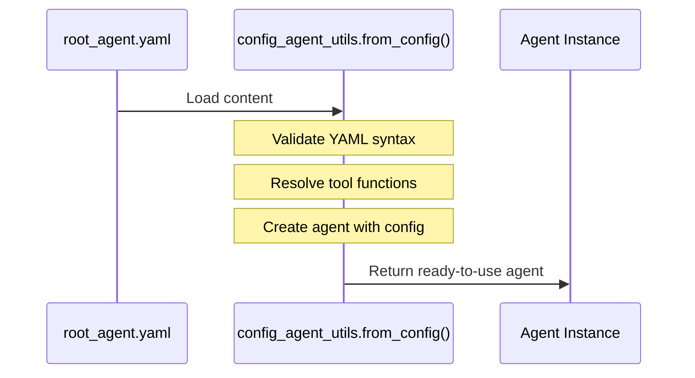
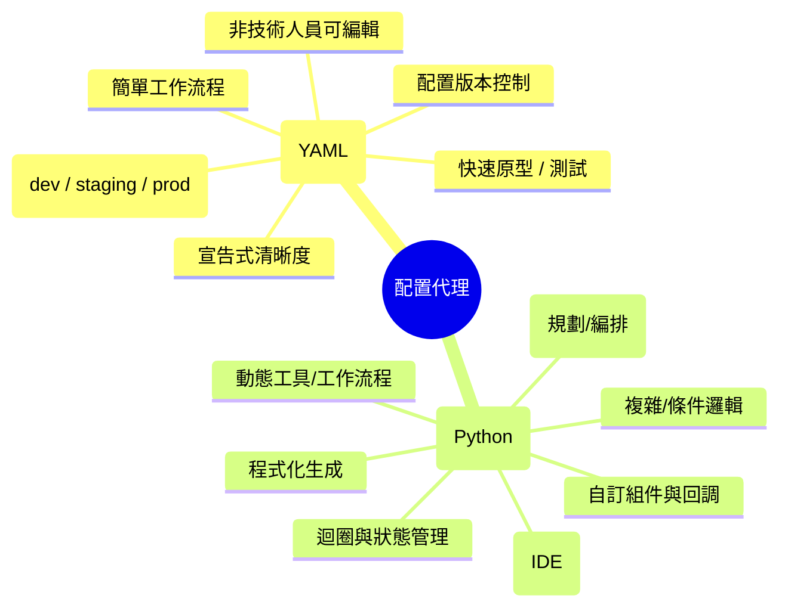
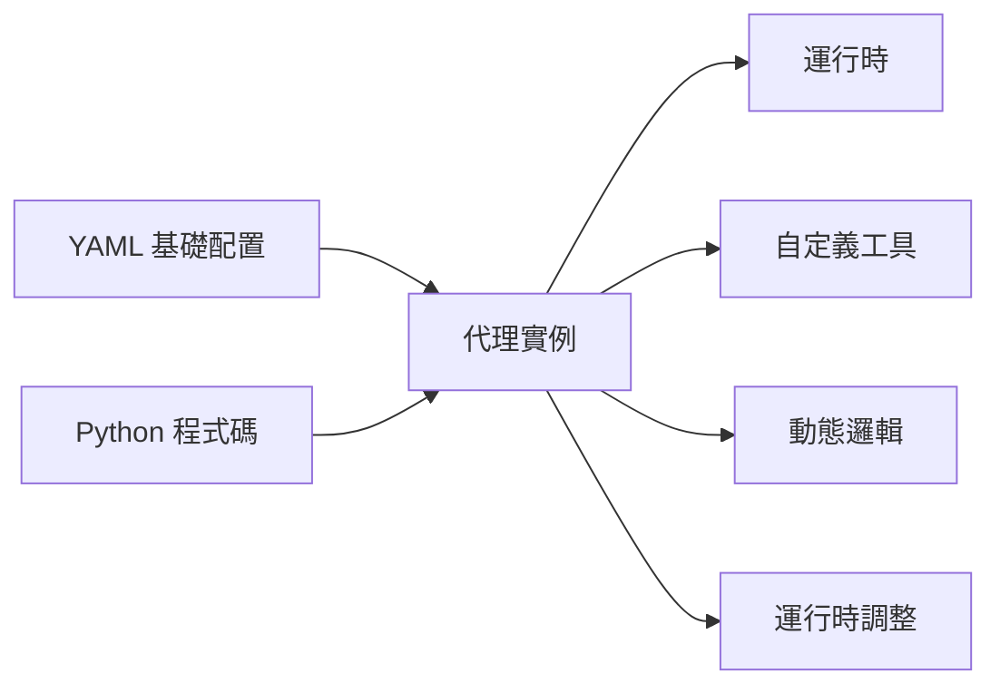

# 教學 20：YAML 代理配置 (Tutorial 20: Agent Configuration with YAML)

**目標**：掌握使用 YAML 檔案進行宣告式代理配置，無需編寫 Python 程式碼即可定義代理、工具和行為，實現快速原型設計和配置管理。

**先決條件**：

- 教學 01 (Hello World Agent)
- 教學 02 (Function Tools)
- 教學 06 (Multi-Agent Systems)
- 基本的 YAML 語法知識

**你將學到**：

- 使用 `root_agent.yaml` 建立代理配置
- 理解 `AgentConfig` 和 `LlmAgentConfig` 架構
- 在 YAML 中配置工具、模型和指令
- 配置檔中的多代理系統
- 何時使用 YAML 與 Python 程式碼
- 載入和驗證配置
- 配置管理的最佳實踐

**完成時間**：45 分鐘

---

## 為什麼 YAML 配置很重要 (Why YAML Configuration Matters)

**問題**：為每個代理配置編寫 Python 程式碼需要開發專業知識，並且使得快速迭代變得困難。

**解決方案**：**YAML 配置** 啟用宣告式代理定義，無需更改程式碼即可進行編輯。

**好處**：

- 🚀 **快速原型設計**：無需編碼即可更改配置
- 📝 **可讀性**：人類友好的格式
- [FLOW] **版本控制**：易於追蹤配置變更
- 🎯 **分離**：配置與實作分離
- 👥 **可訪問性**：非開發人員可以修改代理
- 🔧 **可重用**：跨專案共享配置

**使用案例**：

- 快速代理原型設計
- 配置驅動的部署
- 多環境設置（開發、預備、生產）
- 代理市場/模板
- 非技術團隊成員修改

**狀態**：YAML 配置在 ADK 中標記為 `@experimental`。API 可能會更改。

---

ℹ️ API 驗證

**來源驗證**：官方 ADK 原始碼 (版本 1.16.0+)

**正確 API**：`config_agent_utils.from_config(config_path)`

**常見錯誤**：使用 `AgentConfig.from_yaml_file()` - 此方法 **不存在**。請改用 `config_agent_utils.from_config()`，它會載入 YAML 檔案並返回一個可立即使用的代理實例。

**驗證日期**：2025 年 10 月

---

## 1. YAML 配置基礎 (1. YAML Configuration Basics)

### 什麼是 root_agent.yaml？ (What is root_agent.yaml?)

**`root_agent.yaml`** 是宣告式定義代理及其子代理的主要配置檔案。

**位置**：放置在專案根目錄或明確指定路徑。

**基本結構**：

```text
root_agent.yaml
├── name (required)
├── model (required)
├── description (optional)
├── instruction (optional)
├── generate_content_config (optional)
│   ├── temperature
│   ├── max_output_tokens
│   ├── top_p
│   └── top_k
├── tools (optional)
│   └── [tool_name, ...]
└── sub_agents (optional)
    └── [agent_config, ...]
```

```yaml
# root_agent.yaml

name: my_agent
model: gemini-2.0-flash
description: A helpful agent
instruction: |
  You are a helpful assistant that answers questions
  accurately and concisely.

generate_content_config:
  temperature: 0.7
  max_output_tokens: 1024

tools:
  - type: function
    name: get_weather
    description: Get current weather for a location

sub_agents:
  - name: specialized_agent
    model: gemini-2.0-flash
    description: Specialized agent for specific tasks
```

### 建立配置專案 (Creating Configuration Project)

```bash
# 建立新的基於配置的專案
adk create --type=config my_agent_config

# 建立的目錄結構：
# my_agent_config/
#   root_agent.yaml      # 代理配置
#   tools/               # 自定義工具實作
#   README.md
```

---

## 2. AgentConfig 架構 (2. AgentConfig Schema)

### 核心欄位 (Core Fields)

**來源**：`google/adk/agents/agent_config.py`

```yaml
# 必填欄位
name: agent_name # 唯一識別符
model: gemini-2.0-flash # 使用的模型

# 選填欄位
description: "Agent purpose" # 簡短描述
instruction: | # 系統指令
  Multi-line instruction
  for the agent

# 內容生成配置
generate_content_config:
  temperature: 0.7 # 0.0-1.0 (創造力)
  max_output_tokens: 2048 # 最大回應長度
  top_p: 0.95 # 核取樣 (Nucleus sampling)
  top_k: 40 # Top-k 取樣

# 工具配置
tools:
  - type: function
    name: tool_name
    # ... 工具配置

# 子代理
sub_agents:
  - name: sub_agent_1
    # ... 代理配置
```

### 模型選項 (Model Options)

```yaml
# Gemini 2.0 模型 (推薦)
model: gemini-2.0-flash        # 快速、高效
model: gemini-2.0-flash-thinking  # 具備思考能力

# Gemini 1.5 模型
model: gemini-1.5-flash        # 快速、具成本效益
model: gemini-1.5-pro          # 高品質

# Live API 模型
model: gemini-2.0-flash-live-preview-04-09  # Vertex AI Live
model: gemini-live-2.5-flash-preview        # AI Studio Live
```

---

## 3. 真實範例：客戶支援系統 (3. Real-World Example: Customer Support System)

讓我們使用 YAML 配置構建一個完整的客戶支援系統。

### 完整配置 (Complete Configuration)

```yaml
# root_agent.yaml

name: customer_support
model: gemini-2.0-flash
description: Customer support agent with various tools

instruction: |
  You are a customer support agent. Your role is to:

  1. Understand customer inquiries
  2. Use available tools to provide accurate information
  3. Provide comprehensive solutions

  Available tools:
  - check_customer_status: Check if customer is premium member
  - log_interaction: Log customer interaction for records
  - get_order_status: Get status of an order by ID
  - track_shipment: Get shipment tracking information
  - cancel_order: Cancel an order (requires authorization)
  - search_knowledge_base: Search technical documentation
  - run_diagnostic: Run diagnostic tests
  - create_ticket: Create support ticket for escalation
  - get_billing_history: Retrieve billing history
  - process_refund: Process refund (requires approval for amounts > $100)
  - update_payment_method: Update stored payment method

  Guidelines:
  - Always be polite and professional
  - Provide specific information when available
  - Escalate complex issues when necessary

generate_content_config:
  temperature: 0.5
  max_output_tokens: 2048

tools:
  - name: customer_support.tools.check_customer_status
  - name: customer_support.tools.log_interaction
  - name: customer_support.tools.get_order_status
  - name: customer_support.tools.track_shipment
  - name: customer_support.tools.cancel_order
  - name: customer_support.tools.search_knowledge_base
  - name: customer_support.tools.run_diagnostic
  - name: customer_support.tools.create_ticket
  - name: customer_support.tools.get_billing_history
  - name: customer_support.tools.process_refund
  - name: customer_support.tools.update_payment_method
```

### 工具實作 (Tool Implementations)

```python
# tools/customer_tools.py

"""
客戶支援系統的工具實作。
這些函式由 root_agent.yaml 中的名稱引用。
"""

def check_customer_status(customer_id: str) -> Dict[str, Any]:
    """
    檢查客戶是否為高級會員。

    Args:
        customer_id: 客戶識別符

    Returns:
        包含狀態、報告和客戶等級資訊的字典
    """
    # 模擬查詢 - 在生產環境中會查詢資料庫
    premium_customers = ['CUST-001', 'CUST-003', 'CUST-005']

    is_premium = customer_id in premium_customers
    tier = 'premium' if is_premium else 'standard'

    return {
        'status': 'success',
        'report': f'Customer {customer_id} is {tier} member',
        'data': {
            'customer_id': customer_id,
            'tier': tier,
            'is_premium': is_premium
        }
    }


def log_interaction(customer_id: str, interaction_type: str, summary: str) -> Dict[str, Any]:
    """
    記錄客戶互動以供備查。

    Args:
        customer_id: 客戶識別符
        interaction_type: 互動類型（詢問、投訴等）
        summary: 互動簡要摘要

    Returns:
        包含狀態和確認的字典
    """
    # 在生產環境中，會記錄到資料庫或 CRM 系統
    print(f"[LOG] {customer_id} - {interaction_type}: {summary}")

    return {
        'status': 'success',
        'report': 'Interaction logged successfully',
        'data': {
            'customer_id': customer_id,
            'interaction_type': interaction_type,
            'summary': summary,
            'timestamp': '2025-10-13T10:00:00Z'  # 應為實際時間戳記
        }
    }


def get_order_status(order_id: str) -> Dict[str, Any]:
    """
    透過 ID 獲取訂單狀態。

    Args:
        order_id: 訂單識別符

    Returns:
        包含訂單狀態資訊的字典
    """
    # 模擬訂單查詢 - 在生產環境中會查詢訂單資料庫
    orders = {
        'ORD-001': {'status': 'shipped', 'date': '2025-10-08'},
        'ORD-002': {'status': 'processing', 'date': '2025-10-10'},
        'ORD-003': {'status': 'delivered', 'date': '2025-10-07'},
        'ORD-004': {'status': 'cancelled', 'date': '2025-10-09'}
    }

    order = orders.get(order_id)
    if not order:
        return {
            'status': 'error',
            'error': f'Order {order_id} not found',
            'report': f'No order found with ID {order_id}'
        }

    return {
        'status': 'success',
        'report': f'Order {order_id} status: {order["status"]}',
        'data': {
            'order_id': order_id,
            'status': order['status'],
            'order_date': order['date']
        }
    }


def track_shipment(order_id: str) -> Dict[str, Any]:
    """
    獲取貨物追蹤資訊。

    Args:
        order_id: 訂單識別符

    Returns:
        包含追蹤資訊的字典
    """
    # 模擬追蹤查詢 - 在生產環境中會查詢物流 API
    tracking = {
        'ORD-001': {
            'carrier': 'UPS',
            'tracking_number': '1Z999AA10123456784',
            'estimated_delivery': '2025-10-10',
            'status': 'In transit'
        },
        'ORD-003': {
            'carrier': 'FedEx',
            'tracking_number': '7898765432109',
            'estimated_delivery': 'Delivered on 2025-10-07',
            'status': 'Delivered'
        }
    }

    info = tracking.get(order_id)
    if not info:
        return {
            'status': 'error',
            'error': f'No tracking available for order {order_id}',
            'report': f'No tracking information found for {order_id}'
        }

    return {
        'status': 'success',
        'report': f'Tracking: {info["carrier"]} {info["tracking_number"]}, ETA: {info["estimated_delivery"]}',
        'data': {
            'order_id': order_id,
            'carrier': info['carrier'],
            'tracking_number': info['tracking_number'],
            'estimated_delivery': info['estimated_delivery'],
            'status': info['status']
        }
    }


def cancel_order(order_id: str, reason: str) -> Dict[str, Any]:
    """
    取消訂單（需要授權）。

    Args:
        order_id: 訂單識別符
        reason: 取消原因

    Returns:
        包含取消狀態的字典
    """
    # 模擬訂單取消 - 在生產環境中會有授權檢查
    cancellable_orders = ['ORD-001', 'ORD-002']  # 只有處理中/已發貨的訂單可以取消

    if order_id not in cancellable_orders:
        return {
            'status': 'error',
            'error': f'Order {order_id} cannot be cancelled',
            'report': f'Order {order_id} is not eligible for cancellation'
        }

    return {
        'status': 'success',
        'report': f'Order {order_id} cancelled. Reason: {reason}',
        'data': {
            'order_id': order_id,
            'reason': reason,
            'refund_status': 'pending',
            'cancelled_at': '2025-10-13T10:00:00Z'
        }
    }


def search_knowledge_base(query: str) -> Dict[str, Any]:
    """
    搜尋技術文件。

    Args:
        query: 搜尋查詢

    Returns:
        包含相關文件的字典
    """
    # 模擬知識庫搜尋 - 在生產環境中會查詢文件系統
    kb = {
        'login': 'To reset password, go to Settings > Security > Reset Password',
        'connection': 'Check internet connection and restart the app',
        'error': 'Clear app cache: Settings > Apps > Clear Cache',
        'update': 'Go to Settings > Updates > Check for Updates',
        'sync': 'Ensure device is connected and try Settings > Sync > Sync Now'
    }

    query_lower = query.lower()
    results = []

    for key, value in kb.items():
        if key in query_lower:
            results.append({
                'topic': key,
                'solution': value
            })

    if not results:
        return {
            'status': 'success',
            'report': 'No matching article found',
            'data': {
                'query': query,
                'results': [],
                'suggestion': 'Try searching for: login, connection, error, update, sync'
            }
        }

    return {
        'status': 'success',
        'report': f'Found {len(results)} relevant article(s)',
        'data': {
            'query': query,
            'results': results
        }
    }


def run_diagnostic(issue_type: str) -> Dict[str, Any]:
    """
    執行診斷測試。

    Args:
        issue_type: 要診斷的問題類型

    Returns:
        包含診斷結果的字典
    """
    # 模擬診斷 - 在生產環境中會執行實際的診斷測試
    diagnostics = {
        'connection': {
            'tests': ['Network connectivity', 'Server response', 'DNS resolution'],
            'result': 'All systems operational',
            'recommendation': 'Clear cache and restart'
        },
        'performance': {
            'tests': ['Memory usage', 'CPU usage', 'Disk space'],
            'result': 'Performance within normal range',
            'recommendation': 'Close unused applications'
        },
        'login': {
            'tests': ['Authentication service', 'Session management', 'Password validation'],
            'result': 'Authentication systems operational',
            'recommendation': 'Check password and try again'
        }
    }

    diagnostic = diagnostics.get(issue_type.lower())
    if not diagnostic:
        return {
            'status': 'error',
            'error': f'Unknown issue type: {issue_type}',
            'report': f'No diagnostic available for {issue_type}'
        }

    return {
        'status': 'success',
        'report': f'Diagnostic for {issue_type}: {diagnostic["result"]}. Suggested: {diagnostic["recommendation"]}',
        'data': {
            'issue_type': issue_type,
            'tests_run': diagnostic['tests'],
            'result': diagnostic['result'],
            'recommendation': diagnostic['recommendation']
        }
    }


def create_ticket(customer_id: str, issue: str, priority: str) -> Dict[str, Any]:
    """
    建立升級支援工單。

    Args:
        customer_id: 客戶識別符
        issue: 問題描述
        priority: 優先順序 (low, medium, high, urgent)

    Returns:
        包含工單資訊的字典
    """
    # 模擬工單建立 - 在生產環境中會在工單系統中建立
    import random
    ticket_id = f"TKT-{random.randint(1000, 9999):04d}"

    valid_priorities = ['low', 'medium', 'high', 'urgent']
    if priority.lower() not in valid_priorities:
        priority = 'medium'  # 預設為中等

    return {
        'status': 'success',
        'report': f'Support ticket {ticket_id} created with {priority} priority',
        'data': {
            'ticket_id': ticket_id,
            'customer_id': customer_id,
            'issue': issue,
            'priority': priority,
            'status': 'open',
            'created_at': '2025-10-13T10:00:00Z',
            'estimated_response': '2 hours' if priority in ['high', 'urgent'] else '24 hours'
        }
    }


def get_billing_history(customer_id: str) -> Dict[str, Any]:
    """
    檢索帳單歷史記錄。

    Args:
        customer_id: 客戶識別符

    Returns:
        包含帳單歷史記錄的字典
    """
    # 模擬帳單查詢 - 在生產環境中會查詢帳單資料庫
    billing_history = {
        'CUST-001': [
            {'date': '2025-09-01', 'amount': 49.99, 'description': 'Monthly subscription'},
            {'date': '2025-08-01', 'amount': 49.99, 'description': 'Monthly subscription'},
            {'date': '2025-07-15', 'amount': 29.99, 'description': 'One-time purchase'}
        ],
        'CUST-002': [
            {'date': '2025-09-15', 'amount': 19.99, 'description': 'Basic plan'},
            {'date': '2025-08-15', 'amount': 19.99, 'description': 'Basic plan'}
        ]
    }

    history = billing_history.get(customer_id, [])

    if not history:
        return {
            'status': 'error',
            'error': f'No billing history found for {customer_id}',
            'report': f'No billing records found for customer {customer_id}'
        }

    total = sum(item['amount'] for item in history)

    return {
        'status': 'success',
        'report': f'Found {len(history)} billing records for {customer_id}',
        'data': {
            'customer_id': customer_id,
            'transactions': history,
            'total_amount': total,
            'currency': 'USD'
        }
    }


def process_refund(order_id: str, amount: float) -> Dict[str, Any]:
    """
    處理退款（金額 > 100 美元需要批准）。

    Args:
        order_id: 訂單識別符
        amount: 退款金額

    Returns:
        包含退款狀態的字典
    """
    if amount > 100:
        return {
            'status': 'error',
            'error': 'REQUIRES_APPROVAL',
            'report': f'Refund of ${amount} for {order_id} needs manager approval',
            'data': {
                'order_id': order_id,
                'amount': amount,
                'status': 'pending_approval',
                'approval_required': True
            }
        }

    return {
        'status': 'success',
        'report': f'Refund of ${amount} approved for {order_id}. Funds will appear in 3-5 business days.',
        'data': {
            'order_id': order_id,
            'amount': amount,
            'status': 'approved',
            'processing_time': '3-5 business days',
            'refund_id': f'REF-{order_id}-{amount:.0f}'
        }
    }


def update_payment_method(customer_id: str, payment_type: str) -> Dict[str, Any]:
    """
    更新儲存的付款方式。

    Args:
        customer_id: 客戶識別符
        payment_type: 新付款方式類型

    Returns:
        包含更新確認的字典
    """
    # 模擬付款方式更新 - 在生產環境中會更新支付系統
    valid_types = ['credit_card', 'debit_card', 'paypal', 'bank_transfer']

    if payment_type.lower() not in valid_types:
        return {
            'status': 'error',
            'error': f'Invalid payment type: {payment_type}',
            'report': f'Payment type must be one of: {", ".join(valid_types)}'
        }

    return {
        'status': 'success',
        'report': f'Payment method for {customer_id} updated to {payment_type}',
        'data': {
            'customer_id': customer_id,
            'payment_type': payment_type,
            'updated_at': '2025-10-13T10:00:00Z',
            'verification_required': True,
            'status': 'pending_verification'
        }
    }
```

### 載入並執行配置 (Loading and Running Configuration)

**流程圖 (Process Flow)**：



```python
# run_agent.py

"""
從 YAML 配置載入並執行代理。
"""

import asyncio
import os
from google.adk.agents import Runner, Session
from google.adk.agents import config_agent_utils

# 環境設置
os.environ['GOOGLE_GENAI_USE_VERTEXAI'] = '1'
os.environ['GOOGLE_CLOUD_PROJECT'] = 'your-project-id'
os.environ['GOOGLE_CLOUD_LOCATION'] = 'us-central1'


async def main():
    """載入配置並執行代理。"""

    # 從 YAML 配置載入代理
    agent = config_agent_utils.from_config('root_agent.yaml')

    # 建立執行器和工作階段
    runner = Runner()
    session = Session()

    # 測試查詢
    queries = [
        "I'm customer CUST-001 and I want to check my order ORD-001",
        "I need help with a login error",
        "I'd like a refund of $75 for order ORD-002"
    ]

    for query in queries:
        print(f"\n{'='*70}")
        print(f"QUERY: {query}")
        print(f"{'='*70}\n")

        result = await runner.run_async(
            query,
            agent=agent,
            session=session
        )

        print("RESPONSE:")
        print(result.content.parts[0].text)
        print(f"\n{'='*70}")

        await asyncio.sleep(2)


if __name__ == '__main__':
    asyncio.run(main())
```

### 預期輸出 (Expected Output)

```
======================================================================
查詢：檢查客戶 CUST-001 的狀態
======================================================================

回應：
您好！我可以幫您查詢客戶狀態。讓我為您查詢一下。

客戶 CUST-001 是高級會員

還有什麼我可以幫您的嗎？

======================================================================

======================================================================
查詢：訂單 ORD-001 的狀態是什麼？
======================================================================

回應：
我很樂意為您查詢訂單狀態。讓我查一下。

訂單 ORD-001 狀態：已發貨

如果您需要追蹤資訊或對此訂單有任何其他問題，請告訴我！

======================================================================

======================================================================
查詢：您能追蹤訂單 ORD-001 的貨物嗎？
======================================================================

回應：
我會幫您追蹤該貨物。讓我獲取追蹤詳情。

追蹤資訊：UPS 1Z999AA10123456784，預計送達時間：2025-10-10

您的包裹目前正在運送中，預計將於 2025 年 10 月 10 日送達。您可以使用上述追蹤號碼直接在 UPS 網站上追蹤。

======================================================================
```

---

## 4. YAML 與 Python：何時使用 (4. YAML vs Python: When to Use Each)

### 決策流程：YAML 還是 Python？ (Decision Flow: YAML or Python?)

心智圖：YAML 與 Python 選擇



### 何時使用 YAML 配置： (Use YAML Configuration When:)

✅ **快速原型設計** - 測試不同的代理配置

✅ **非技術編輯者** - 允許團隊成員修改代理

✅ **配置管理** - 將配置與程式碼分離

✅ **多環境** - 開發、預備、生產配置

✅ **簡單工作流程** - 標準代理模式

✅ **版本控制** - 輕鬆追蹤配置變更

### 何時使用 Python 程式碼： (Use Python Code When:)

✅ **複雜邏輯** - 條件工具選擇、動態工作流程

✅ **自定義組件** - 自定義規劃器、執行器、回調

✅ **進階模式** - 循環、複雜狀態管理

✅ **程式化生成** - 動態建立代理

✅ **測試** - 單元測試、整合測試

✅ **IDE 支援** - 類型檢查、自動完成、重構

### 混合方法（最佳實踐） (Hybrid Approach (Best Practice))

**架構**：結合 YAML 宣告式配置與 Python 程式化自定義。



```python
from google.adk.agents import config_agent_utils

# 從 YAML 載入基礎配置
agent = config_agent_utils.from_config('base_agent.yaml')

# 程式化自定義
agent.tools.append(custom_complex_tool)
agent.instruction += "\n\nAdditional dynamic instructions"

# 使用自定義邏輯執行
if user_is_premium:
    agent.tools.append(premium_tool)

runner.run(query, agent=agent)
```

---

## 5. 最佳實踐 (5. Best Practices)

### ✅ 要做：使用特定於環境的配置 (DO: Use Environment-Specific Configs)

**目錄結構**：

```text
config/
├── dev/
│   ├── root_agent.yaml     # 開發配置
│   └── secrets.yaml        # 開發秘密
├── staging/
│   ├── root_agent.yaml     # 預備配置
│   └── secrets.yaml        # 預備秘密
└── prod/
    ├── root_agent.yaml     # 生產配置
    └── secrets.yaml        # 生產秘密
```

```yaml
# config/dev/root_agent.yaml
name: support_agent_dev
model: gemini-2.0-flash
generate_content_config:
  temperature: 0.8  # 更有創意用於測試

# config/prod/root_agent.yaml
name: support_agent_prod
model: gemini-2.0-flash
generate_content_config:
  temperature: 0.3  # 更一致用於生產
```

### ✅ 要做：文件化配置 (DO: Document Configuration)

```yaml
# root_agent.yaml

# Customer Support Orchestrator
# Maintainer: support-team@example.com
# Last Updated: 2025-10-08
#
# This agent routes customer inquiries to specialized agents:
# - order_agent: Order management
# - technical_agent: Technical support
# - billing_agent: Payment issues

name: customer_support
model: gemini-2.0-flash

instruction: |
  [Clear instruction here]
```

### ✅ 要做：驗證配置 (DO: Validate Configuration)

```python
from google.adk.agents import config_agent_utils

def validate_config(yaml_path: str) -> bool:
    """驗證代理配置。"""

    try:
        agent = config_agent_utils.from_config(yaml_path)
        print(f"✅ Configuration valid: {agent.name}")
        return True

    except Exception as e:
        print(f"❌ Configuration error: {e}")
        return False


# 部署前驗證
validate_config('root_agent.yaml')
```

### ✅ 要做：配置版本控制 (DO: Version Control Configuration)

```bash
# .gitignore - 不要提交秘密
config/secrets.yaml
*.env

# Git 提交配置變更
git add root_agent.yaml
git commit -m "Update customer_support agent temperature to 0.5"
```

### ❌ 不要做：硬編碼秘密 (DON'T: Hardcode Secrets)

```yaml
# ❌ 糟糕 - 配置中有秘密
tools:
  - type: api
    api_key: "sk-proj-abc123..."  # 絕對不要這樣做

# ✅ 良好 - 引用環境變數
tools:
  - type: api
    api_key: "${API_KEY}"  # 從環境載入
```

---

## 6. 進階配置模式 (6. Advanced Configuration Patterns)

### 模式 1：條件子代理 (Pattern 1: Conditional Sub-Agents)

```yaml
# 不同層級的不同子代理
name: support_agent

sub_agents:
  # 基本支援（所有層級）
  - name: faq_agent
    model: gemini-2.0-flash
    description: FAQ and basic questions

  # 僅限高級支援（在程式碼中過濾）
  - name: premium_support_agent
    model: gemini-2.0-flash
    description: Premium customer support
    # 僅在程式碼中為高級客戶啟用
```

### 模式 2：配置繼承 (Pattern 2: Configuration Inheritance)

```python
from google.adk.agents import config_agent_utils

# 載入基礎配置
specialized_agent = config_agent_utils.from_config('config/base.yaml')

# 建立專用變體
specialized_agent.instruction += "\n\nSpecialized for domain X"
specialized_agent.tools.append(domain_specific_tool)
```

### 模式 3：動態工具註冊 (Pattern 3: Dynamic Tool Registration)

```python
from google.adk.agents import config_agent_utils

# 載入配置
agent = config_agent_utils.from_config('root_agent.yaml')

# 根據使用者權限動態新增工具
if user.has_permission('admin'):
    agent.tools.append(FunctionTool(admin_tool))

if user.has_permission('data_export'):
    agent.tools.append(FunctionTool(export_tool))
```

---

## 7. 故障排除 (7. Troubleshooting)

### 問題：「找不到配置檔案」 (Issue: "Configuration file not found")

**解決方案**：

1. **檢查檔案路徑**：

```python
import os
config_path = 'root_agent.yaml'
print(f"Looking for: {os.path.abspath(config_path)}")
print(f"Exists: {os.path.exists(config_path)}")
```

2. **指定絕對路徑**：

```python
from google.adk.agents import config_agent_utils

agent = config_agent_utils.from_config('/full/path/to/root_agent.yaml')
```

### 問題：「無效的 YAML 語法」 (Issue: "Invalid YAML syntax")

**解決方案**：驗證 YAML 語法：

```bash
# 安裝 yamllint
pip install yamllint

# 驗證配置
yamllint root_agent.yaml
```

### 問題：「找不到工具函式」 (Issue: "Tool function not found")

**解決方案**：確保工具函式可匯入：

```python
# tools/__init__.py
from .customer_tools import (
    check_customer_status,
    log_interaction,
    get_order_status
)

__all__ = [
    'check_customer_status',
    'log_interaction',
    'get_order_status'
]
```

---

## 總結 (Summary)

你已經掌握了 YAML 代理配置：

**重點摘要**：

- ✅ `root_agent.yaml` 用於宣告式代理定義
- ✅ `config_agent_utils.from_config()` 用於載入配置
- ✅ YAML 用於快速原型設計和配置管理
- ✅ Python 程式碼用於複雜邏輯和自定義
- ✅ 混合方法結合了兩者的優點
- ✅ 開發/預備/生產的環境特定配置
- ✅ 用於配置追蹤的版本控制

**生產清單**：

- [ ] 配置檔案版本控制
- [ ] 從環境變數載入秘密
- [ ] CI/CD 中的配置驗證
- [ ] 環境特定配置（開發/預備/生產）
- [ ] YAML 註釋中的文件
- [ ] 工具函式已正確註冊
- [ ] 部署前測試配置
- [ ] 生產配置的備份

**資源**：

- [ADK Configuration Documentation](https://google.github.io/adk-docs/configuration/)
- [AgentConfig API Reference](https://google.github.io/adk-docs/api/agent-config/)
- [YAML Specification](https://yaml.org/spec/)

---

## 程式碼實現 (Code Implementation)

- YAML Configuration：[程式碼連結](../../../python/agents/yaml-configuration/)
