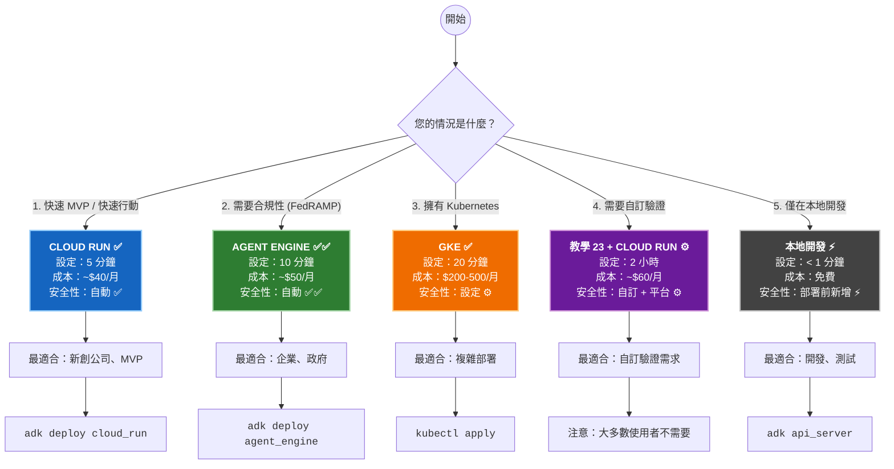
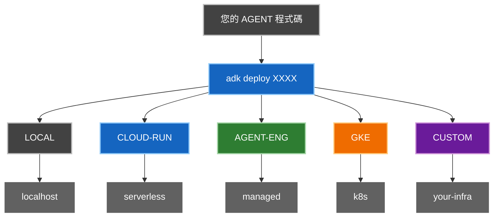
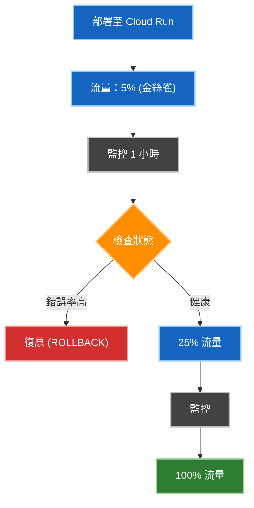
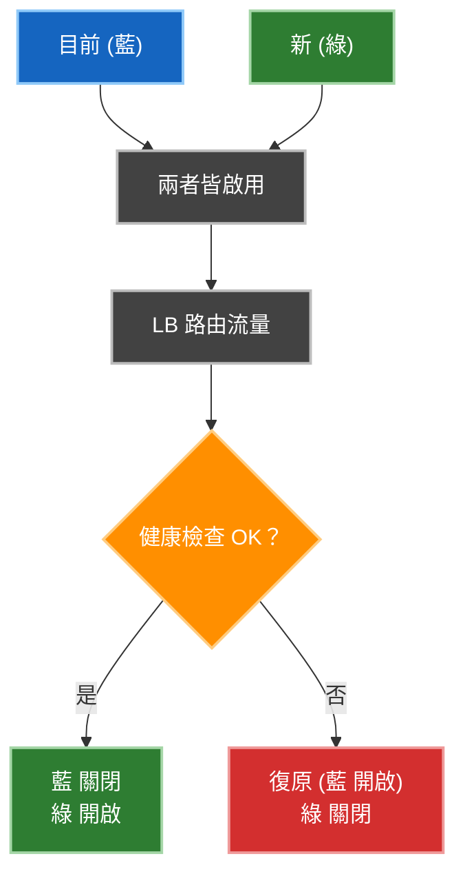

# 教學 23：生產部署策略 (Tutorial 23: Production Deployment Strategies)

**目標**: 了解 ADK 部署選項，並實作具有自訂驗證、監控和可靠性模式的生產級 Agent。

**先決條件**:

- 教學 01 (Hello World Agent)
- Google Cloud Platform 帳戶
- 基本 Docker 知識 (有幫助)
- 了解 FastAPI (有幫助)

**您將學到**:

- ✅ 使用 ADK 內建伺服器部署 Agent (5 分鐘)
- 🏗️ 建立具備自訂模式的生產級 FastAPI 伺服器 (需要時)
- 📊 實作自訂監控與可觀察性
- 🔐 新增驗證與安全性模式
- 📈 跨平台自動擴展
- 🛡️ 了解何時使用 ADK vs 自訂伺服器

**快速決策框架**:

- **5 分鐘內上線？** → Cloud Run ✅
- **需要 FedRAMP 合規性？** → Agent Engine ✅✅
- **擁有 Kubernetes？** → GKE ✅
- **需要自訂驗證？** → 教學 23 + Cloud Run ⚙️
- **僅在本地測試？** → 本地開發 ⚡

**完成時間**: 5 分鐘 (Cloud Run) 到 2 小時以上 (自訂模式)

---

## 🎯 決策框架：選擇您的平台 (DECISION FRAMEWORK: Choose Your Platform)

### 您的情況是什麼？





**→ 選擇符合您情況的選項。這就是您的平台。**

---

## ⚠️ 重要：了解 ADK 的部署模型 (Important: Understanding ADK's Deployment Model)

### 關鍵見解：安全性以平台為優先

ADK 的內建伺服器**設計上故意保持極簡**。原因如下：

- ✅ **ADK 提供**: 輸入驗證、工作階段管理、錯誤處理
- ✅ **平台提供**: TLS/HTTPS、DDoS 防護、驗證、合規性
- ✅ **結果**: 零自訂安全程式碼的安全生產部署

**參閱**: [安全研究摘要](https://github.com/raphaelmansuy/adk_training/blob/main/tutorial_implementation/tutorial23/SECURITY_RESEARCH_SUMMARY.md) 以取得每個平台自動保護功能的完整分析。

### 自訂伺服器 (教學 23) 為進階且選用

**只有在以下情況下，您才需要自訂 FastAPI 伺服器**：

- 您需要自訂驗證 (LDAP, Kerberos 等)
- 您需要超出平台預設的進階日誌記錄
- 您有特定的業務邏輯端點
- 您不使用 Google Cloud 基礎架構

**大多數生產部署使用 Cloud Run + ADK 內建伺服器。不需要自訂伺服器。**

### 平台比較

| 平台 | 安全性 | 設定 | 成本 | 最適合 | 需要自訂伺服器？ |
| --- | --- | --- | --- | --- | --- |
| **Cloud Run** | 自動 ✅ | 5 分鐘 | 按使用量付費 | 大多數應用程式 | ❌ 否 |
| **Agent Engine** | 自動 ✅✅ | 10 分鐘 | 按使用量付費 | 企業 | ❌ 否 |
| **GKE** | 設定 ⚙️ | 20 分鐘 | 每小時 | 複雜環境 | ❌ 否 |
| **自訂 + Cloud Run** | 混合 ⚙️ | 2 小時 | 按使用量付費 | 特殊需求 | ✅ 是 |
| **本地開發** | 極簡 | < 1 分鐘 | 免費 | 開發 | ✅ 是 (本地新增) |

**參閱**: [完整安全性分析](https://github.com/raphaelmansuy/adk_training/blob/main/tutorial_implementation/tutorial23/SECURITY_ANALYSIS_ALL_DEPLOYMENT_OPTIONS.md) 以取得每個平台的詳細安全性細分。

---

## 🔐 安全優先：自動 vs 手動 (Security First: What's Automatic vs Manual)

**重要發現**: 每個平台提供不同層級的自動安全性。

### 依平台區分的安全性 (快速參考)

| 安全功能 | Cloud Run | Agent Engine | GKE | 本地 |
| --- | --- | --- | --- | --- |
| **HTTPS/TLS** | ✅ 自動 | ✅ 自動 | ✅ 手動 | ❌ |
| **DDoS 防護** | ✅ 自動 | ✅ 自動 | ❌ | ❌ |
| **驗證** | ✅ 自動 (IAM) | ✅ 自動 (OAuth) | ⚙️ 手動 | ❌ |
| **靜態加密** | ✅ 自動 | ✅ 自動 | ✅ 手動 | ❌ |
| **稽核日誌** | ✅ 自動 | ✅ 自動 | ✅ 手動 | ❌ |
| **合規性就緒** | ✅ HIPAA, PCI | ✅✅ **FedRAMP** | ✅ 全部 | ❌ |

**關鍵訊息**: Cloud Run 和 Agent Engine 提供**無需設定的生產級安全性**。所有安全性皆為自動。

### 閱讀完整安全性分析

有關所有平台的安全性的詳細資訊：

- 📄 [**SECURITY_RESEARCH_SUMMARY.md**](https://github.com/raphaelmansuy/adk_training/blob/main/SECURITY_RESEARCH_SUMMARY.md) - 執行摘要 (5 分鐘閱讀)
  - ADK 提供什麼 vs 平台提供什麼
  - 何時真正需要自訂驗證
  - 平台安全性能力比較
  - 真實使用情境建議

- 📋 [**SECURITY_ANALYSIS_ALL_DEPLOYMENT_OPTIONS.md**](https://github.com/raphaelmansuy/adk_training/blob/main/SECURITY_ANALYSIS_ALL_DEPLOYMENT_OPTIONS.md) - 全面性分析 (20 分鐘閱讀)
  - 每個平台的詳細安全性細分
  - 合規性認證
  - 特定平台的安全性檢查清單
  - 安全性驗證步驟
  - 何時使用自訂伺服器

**底線**: 「ADK 的內建伺服器設計上是安全的，因為平台安全性是基礎。」

---

## 快速參考：了解 ADK 的部署 (Quick Reference: Understanding ADK's Deployment)

### 當您執行 `adk deploy cloud_run` 時會發生什麼？

```
您的 Agent 程式碼
       ↓
[ADK 產生]
├── Dockerfile
├── main.py (使用 ADK 的 get_fast_api_app())
└── requirements.txt
       ↓
[建置容器]
       ↓
[部署至 Cloud Run]
       ↓
✅ 線上 FastAPI 伺服器
   (僅具備基本端點)
```

### ADK 內建伺服器包含什麼？

**由 `get_fast_api_app()` 提供:**

- ✅ `GET /` - API 資訊
- ✅ `GET /health` - 健康檢查
- ✅ `GET /agents` - 列出 Agents
- ✅ `POST /invoke` - 執行 Agent
- ✅ 工作階段管理

**不提供:**

- ❌ 自訂驗證
- ❌ 自訂日誌記錄
- ❌ 自訂指標
- ❌ 速率限制
- ❌ 斷路器

### 何時需要自訂伺服器

本儲存庫中的自訂伺服器 (教學 23) 新增：

- ✅ 自訂驗證
- ✅ 具備請求追蹤的結構化日誌
- ✅ 具備真實指標的健康檢查
- ✅ 請求逾時與斷路器
- ✅ 自訂錯誤處理
- ✅ 完整的可觀察性

**參閱**: `DEPLOYMENT_OPTIONS_EXPLAINED.md` 以取得完整詳細資訊

**完成時間**: 45 分鐘

---

## 🌍 真實世界場景：哪種平台適合哪種情況？ (Real-World Scenarios: Which Platform for Which Situation?)

### 場景 1：新創公司建立 MVP

**您的情況**: 快速行動，資源有限，希望本週部署。

**您的需求**:

- 5 分鐘內部署
- 自動安全性 (不想管理這個)
- 僅按使用量付費
- 可以快速迭代

**建議**: ✅ **Cloud Run**

**原因**:

- 最快上市時間 (5 分鐘！)
- 預設安全 (HTTPS, DDoS, IAM)
- 具成本效益 (~$40/月，100 萬次請求)
- 無需管理基礎架構

**部署**:

```bash
adk deploy cloud_run \
  --project your-project-id \
  --region us-central1
```

**成本**: ~$40/月 (100 萬次請求) + $0.30/CPU-月

**下一步**: 隨著成長，考慮使用 Agent Engine 以獲得更好的合規性。

---

### 場景 2：企業系統 (需要合規性)

**您的情況**: 為企業客戶建立系統，需要 FedRAMP 或 HIPAA 合規性。

**您的需求**:

- FedRAMP 合規性 (政府就緒)
- HIPAA/PCI-DSS 認證
- 零基礎架構管理
- 不可變稽核日誌
- 沙箱執行環境

**建議**: ✅✅ **Agent Engine (唯一具備 FedRAMP 的平台)**

**原因**:

- 唯一內建 FedRAMP 合規性的平台
- Google 管理所有安全性/合規性
- 無需設定
- 最適合高度受監管的產業

**部署**:

```bash
adk deploy agent_engine \
  --project your-project-id \
  --region us-central1 \
  --agent-name my-agent
```

**成本**: ~$50/月 (100 萬次請求) + 使用量

**優點**:

- FedRAMP 合規性
- SOC 2 Type II 認證
- 自動稽核日誌
- 內容安全過濾器
- 無維運負擔

**下一步**: 已準備好生產。專注於 Agent 安全性。

---

### 場景 3：Kubernetes 環境

**您的情況**: 貴公司執行 Kubernetes 基礎架構，希望在該環境中使用 ADK。

**您的需求**:

- 部署在現有 Kubernetes 叢集
- 對設定的完全控制
- 用於流量控制的 NetworkPolicy
- 工作負載身分整合
- Pod 資源限制

**建議**: ✅ **GKE (或任何 Kubernetes)**

**原因**:

- 利用現有基礎架構
- 完全控制安全性設定
- 支援複雜網路
- 進階可觀察性

**部署**:

```bash
kubectl apply -f deployment.yaml
```

**成本**: $200-500+/月 (根據叢集規模)

**需要**:

- Kubernetes 專業知識
- 手動安全性設定
- Pod 安全性設定
- RBAC 設定

**下一步**: 使用 GKE Autopilot 簡化安全性。

---

### 場景 4：需要自訂驗證

**您的情況**: 您需要 LDAP, Kerberos 或其他平台未提供的自訂驗證。

**您的需求**:

- 自訂驗證提供者
- 自訂 API 端點
- 進階日誌記錄
- 特定的業務邏輯

**建議**: ⚙️ **教學 23 自訂伺服器 + Cloud Run**

**原因**:

- Cloud Run 提供平台安全性
- 教學 23 提供自訂驗證
- 結合 = 安全 + 自訂

**部署**:

```bash
# 1. 使用教學 23 的自訂伺服器
cd tutorial_implementation/tutorial23

# 2. 部署至 Cloud Run
adk deploy cloud_run \
  --project your-project-id \
  --region us-central1
```

**成本**: ~$60/月 (在 Cloud Run 上) + 自訂伺服器複雜度

**注意**: **大多數使用者不需要這個**

- 使用 Cloud Run IAM 進行標準驗證
- 使用 Agent Engine OAuth 進行標準驗證
- 僅在平台不支援您的驗證方法時使用此選項

**工作量**: 2 小時以上實作自訂伺服器

---

### 場景 5：本地開發

**您的情況**: 在部署前在本地建立和測試。

**您的需求**:

- 快速迭代迴圈
- 程式碼變更時熱重載 (Hot reload)
- 易於測試
- 無需基礎架構

**建議**: ⚡ **本地開發 (部署前新增安全性)**

**原因**:

- 零設定時間
- 即時回饋
- 免費
- 非常適合開發

**本地執行**:

```bash
# 啟動開發伺服器
adk api_server

# 或使用自訂伺服器
python -m uvicorn production_agent.server:app --reload
```

**生產前**:

- 新增驗證層
- 使用 HTTPS 測試 (使用 ngrok)
- 驗證安全性設定
- 遷移至 Cloud Run

**成本**: 免費 (本地)

**下一步**: 準備好生產時部署至 Cloud Run。

---

## 路徑 1：簡單部署 (建議) (Path 1: Simple Deployment (Recommended))

### 使用 ADK 內建伺服器的 5 分鐘快速入門

**想立即部署？** 使用此指令：

```bash
# Cloud Run
adk deploy cloud_run \
  --project your-project-id \
  --region us-central1 \
  ./your_agent_directory

# GKE
adk deploy gke \
  --project your-project-id \
  --cluster_name my-cluster \
  --region us-central1 \
  ./your_agent_directory

# Agent Engine
adk deploy agent_engine \
  --project your-project-id \
  --region us-central1 \
  ./your_agent_directory
```

✅ **就這樣！** 您的 Agent 在 5 分鐘內上線。

**您將獲得：**

- 自動容器建置
- 具有基本端點的 FastAPI 伺服器
- 自動擴展
- 公開 HTTPS URL
- 工作階段管理
- `/health` 端點
- 無需自訂程式碼

---

## 🏗️ 進階：當您需要自訂 FastAPI 伺服器時 (Advanced: When You Need a Custom FastAPI Server)

### ⚠️ 重要：大多數使用者不需要這個

**首先檢查**：您真的需要自訂伺服器嗎？

- ✅ **使用 Cloud Run + ADK 內建** 如果您需要標準驗證 (IAM, OAuth)
- ✅ **使用 Agent Engine** 如果您需要合規性/安全性
- ✅ **使用 GKE** 如果您需要 Kubernetes 控制
- ⚙️ **使用自訂伺服器** 只有當您有以下特殊需求時

### 何時真正需要自訂伺服器

您需要教學 23 的自訂伺服器 IF：

1. **自訂驗證** (LDAP, Kerberos, API keys)

   - Cloud Run IAM 不支援
   - Agent Engine OAuth 不適合您
   - 您有專有的驗證系統

2. **進階日誌/可觀察性** 超出平台預設

   - 自訂請求關聯 ID
   - 業務事件追蹤
   - 自訂指標

3. **額外的 API 端點** 用於業務邏輯

   - Webhooks
   - 自訂健康檢查
   - 整合端點

4. **非 Google 基礎架構**
   - 在 AWS, Azure, 地端環境執行
   - 需要可攜式解決方案

**如果以上都不適用**：使用 Cloud Run 或 Agent Engine。簡單得多。

### 教學 23 提供的內容

本教學包含**完整的生產級實作**：

```
tutorial23/
├── production_agent/
│   ├── agent.py              # 具有 3 個工具的 Agent
│   └── server.py             # FastAPI 伺服器 (488 行)
├── tests/                    # 40 個綜合測試
├── Makefile                  # 指令：setup, dev, test, demo
├── FASTAPI_BEST_PRACTICES.md # 7 個核心模式指南
└── README.md                 # 完整文件
```

**主要功能** (如果您需要自訂伺服器):

- ✅ 使用 API 金鑰的自訂驗證
- ✅ 具備請求追蹤的結構化日誌
- ✅ 具備真實指標的健康檢查
- ✅ 錯誤處理與驗證
- ✅ 請求逾時與斷路器
- ✅ 40 個通過的測試 (93% 覆蓋率)
- ✅ 生產級模式

📖 **完整實作**: [在 GitHub 上檢視 →](https://github.com/raphaelmansuy/adk_training/tree/main/tutorial_implementation/tutorial23)

**安全性注意事項**: 教學 23 是進階模式。它新增了應用層功能，但依賴 Cloud Run 或您的基礎架構的平台層安全性。

---

## 快速入門 (5 分鐘) (Quick Start (5 minutes))

```bash
cd tutorial_implementation/tutorial23

# 設定
make setup

# 執行開發伺服器
export GOOGLE_API_KEY=your_key
make dev

# 執行測試
make test

# 查看展示
make demo-info
```

**開啟** `http://localhost:8000` 並從下拉選單選擇 `production_deployment_agent`。

---

## 部署策略 (Deployment Strategies)

ADK 支援多種部署路徑。根據您的需求選擇：

### 比較矩陣

| 策略 | 設定時間 | 擴展 | 成本 | 最適合 |
| --- | --- | --- | --- | --- |
| **本地** | < 1 分鐘 | 手動 | 免費 | 開發 |
| **Cloud Run** | 5 分鐘 | 自動 | 按使用量付費 | 大多數應用程式 |
| **Agent Engine** | 10 分鐘 | 自動 | 按使用量付費 | 企業 |
| **GKE** | 20 分鐘 | 手動 | 每小時 | 複雜環境 |

---

## 1. 本地開發 (Local Development)

**最適合**: 快速測試與迭代

```bash
# 啟動 FastAPI 伺服器
adk api_server

# 自訂連接埠
adk api_server --port 8090
```

測試它：

```bash
curl http://localhost:8080/health
curl -X POST http://localhost:8080/invoke \
  -H "Content-Type: application/json" \
  -d '{"query": "Hello!"}'
```

**功能**:

- 🔄 開發期間熱重載 (Hot reload)
- 📖 `/docs` 自動產生的 API 文件
- ⚡ 即時回饋迴圈

參閱 [教學實作](https://github.com/raphaelmansuy/adk_training/tree/main/tutorial_implementation/tutorial23) 以取得自訂伺服器程式碼。

---

## 2. Cloud Run (建議大多數應用程式使用) (Cloud Run (Recommended for Most Apps))

**最適合**: 具有極簡維運的無伺服器自動擴展

```bash
# 一個指令部署
adk deploy cloud_run \
  --project your-project-id \
  --region us-central1 \
  --service-name my-agent
```

就這樣！ADK 處理：

- ✅ 建置容器映像
- ✅ 推送至 Container Registry
- ✅ 部署至 Cloud Run
- ✅ 設定自動擴展

**手動替代方案**:

```bash
# 1. 建置
gcloud builds submit --tag gcr.io/YOUR_PROJECT/agent

# 2. 部署
gcloud run deploy agent \
  --image gcr.io/YOUR_PROJECT/agent \
  --platform managed \
  --region us-central1 \
  --memory 2Gi \
  --max-instances 100
```

**成本**: ~$0.40 每百萬次請求 + 運算費用

---

## 3. Vertex AI Agent Engine (Vertex AI Agent Engine)

**最適合**: 具有內建版本控制的託管 Agent 基礎架構

```bash
# 部署至託管服務
adk deploy agent_engine \
  --project your-project-id \
  --region us-central1 \
  --agent-name my-agent
```

**優點**:

- 📦 託管基礎架構
- 🎯 版本控制
- 🔄 A/B 測試
- 📊 內建監控
- 🔐 企業級安全性

---

## 4. Google Kubernetes Engine (GKE) (Google Kubernetes Engine (GKE))

**最適合**: 需要完全控制的複雜部署

```bash
# 建立叢集
gcloud container clusters create agent-cluster \
  --region us-central1 \
  --machine-type n1-standard-2 \
  --num-nodes 3

# 取得憑證
gcloud container clusters get-credentials agent-cluster \
  --region us-central1

# 部署
kubectl apply -f deployment.yaml
```

**何時使用 GKE**:

- 需要進階網路
- 執行多個服務
- 現有 Kubernetes 專業知識
- 自訂協調需求

參閱教學實作以取得完整的 Kubernetes 資訊清單。

---

## 部署流程圖 (Deployment Flow Diagram)



---

## 生產環境設定 (Production Setup)

### 環境設定 (Environment Configuration)

建立 `.env` 檔案 (永遠不要提交！):

```bash
# Google Cloud
GOOGLE_CLOUD_PROJECT=your-project-id
GOOGLE_CLOUD_LOCATION=us-central1
GOOGLE_GENAI_USE_VERTEXAI=1

# 應用程式
MODEL=gemini-2.0-flash
TEMPERATURE=0.5
MAX_TOKENS=2048

# 安全性
API_KEY=your-secret-key
ALLOWED_ORIGINS=https://yourdomain.com

# 監控
LOG_LEVEL=INFO
ENABLE_TRACING=true
```

### 健康檢查 (Health Checks)

所有部署應公開 `/health` 端點：

```json
GET /health

{
  "status": "healthy",
  "uptime_seconds": 3600,
  "request_count": 1250,
  "error_count": 3,
  "error_rate": 0.0024,
  "metrics": {
    "successful_requests": 1247,
    "timeout_count": 0
  }
}
```

**在協調器中設定**:

- **Cloud Run**: 自動偵測
- **GKE**: 設定為存活探針 (liveness probe)
- **Agent Engine**: 內建

### 秘密管理 (Secrets Management)

**永遠不要**將 API 金鑰提交到程式碼中。使用 Google Secret Manager：

```python
from google.cloud import secretmanager

def get_secret(secret_id: str) -> str:
    client = secretmanager.SecretManagerServiceClient()
    project = os.environ['GOOGLE_CLOUD_PROJECT']
    name = f"projects/{project}/secrets/{secret_id}/versions/latest"
    response = client.access_secret_version(request={"name": name})
    return response.payload.data.decode('UTF-8')

# 用法
api_key = get_secret('api-key')
```

---

## 監控與可觀察性 (Monitoring & Observability)

### 追蹤的關鍵指標 (Key Metrics to Track)

| 指標 | 目標 | 警報門檻 |
| --- | --- | --- |
| 錯誤率 | < 0.5% | > 5% |
| P99 延遲 | < 2 秒 | > 5 秒 |
| 可用性 | > 99.9% | < 99% |
| 請求計數 | 追蹤 | N/A |

### 結構化日誌 (Structured Logging)

所有生產伺服器應將 JSON 記錄到 stdout：

```json
{
  "timestamp": "2025-01-17T10:30:45Z",
  "severity": "INFO",
  "message": "invoke_agent.success",
  "request_id": "550e8400-e29b",
  "tokens": 245,
  "latency_ms": 1230
}
```

Cloud Logging 會自動解析並索引這些欄位。

---

## 💰 成本細分：根據預算選擇 (Cost Breakdown: Choose Based on Budget)

### 每月成本估算 (以每月 100 萬次請求計算)

| 平台 | 基礎 | 每次請求 | 設定 | 每月總計 | 最適合 |
| --- | --- | --- | --- | --- | --- |
| **Cloud Run** | $0 | ~$0.40 | 5 分鐘 | ~$40 | 大多數應用程式 |
| **Agent Engine** | $0 | ~$0.50 | 10 分鐘 | ~$50 | 企業 |
| **GKE** | $50+ | 變動 | 20 分鐘 | $200-500+ | 複雜環境 |
| **自訂 + Cloud Run** | $0 | ~$0.40 | 2 小時 | ~$60 | 特殊需求 |
| **本地開發** | $0 | $0 | < 1 分鐘 | $0 | 開發 |

**注意**:

- 成本基於美國定價 (可能因地區而異)
- 包含運算 + 儲存估算
- 實際成本取決於模型、記憶體、CPU 使用量
- Agent Engine 包含託管基礎架構開銷
- GKE 包含叢集基礎成本 + 節點成本

**ROI 分析**:

- **新創公司**: 從 Cloud Run ($40/月) 開始，如果需要合規性則移至 Agent Engine ($50/月)
- **企業**: 從 Agent Engine ($50/月) 開始，包含合規性
- **現有 K8s**: 使用 GKE ($200+/月)，利用現有基礎架構

---

## ✅ 部署驗證：如何驗證其運作 (Deployment Verification: How to Verify It Works)

### 部署至 Cloud Run 後

```bash
# 1. 取得您的服務 URL
SERVICE_URL=$(gcloud run services describe my-agent \
  --region us-central1 \
  --format 'value(status.url)')

# 2. 測試健康端點
curl $SERVICE_URL/health

# 3. 測試 Agent 呼叫
curl -X POST $SERVICE_URL/invoke \
  -H "Content-Type: application/json" \
  -d '{"query": "Hello agent!", "temperature": 0.5}'

# 4. 檢查指標
curl $SERVICE_URL/health | jq '.metrics'
```

### 部署至 Agent Engine 後

```bash
# Agent Engine 儀表板: https://console.cloud.google.com/vertex-ai/
# 檢查:
# - ✅ Agent 已部署
# - ✅ 端點有回應
# - ✅ 呼叫成功
# - ✅ 稽核日誌出現
```

### 安全性驗證檢查清單

- [ ] HTTPS/TLS 運作正常 (curl 顯示 https://)
- [ ] 驗證已啟用 (未驗證呼叫獲得 401)
- [ ] CORS 已設定 (檢查標頭)
- [ ] 健康檢查有回應 (GET /health)
- [ ] 記錄至 Cloud Logging (檢查主控台)
- [ ] 日誌中無 API 金鑰 (驗證秘密未暴露)
- [ ] 請求逾時運作正常 (測試長時間執行查詢)
- [ ] 錯誤處理運作正常 (測試無效輸入)

**參閱**: [DEPLOYMENT_CHECKLIST.md](https://github.com/raphaelmansuy/adk_training/blob/main/tutorial_implementation/tutorial23/DEPLOYMENT_CHECKLIST.md) 以取得完整驗證步驟。

---

## ✨ 生產部署的最佳實踐 (Best Practices for Production Deployment)

### 🔐 安全性 (平台自動提供大部分功能)

**Cloud Run/Agent Engine 自動提供的功能**:

- ✅ HTTPS/TLS 加密 (由平台處理)
- ✅ DDoS 防護 (包含)
- ✅ 靜態加密 (Google 管理)
- ✅ 非 root 容器執行 (強制執行)
- ✅ 二進位漏洞掃描 (包含)

**您必須設定的項目**:

- [ ] 使用 Secret Manager 管理 API 金鑰 (永遠不要硬編碼)
- [ ] 在 Cloud Run 主控台啟用驗證
- [ ] 設定具有特定來源的 CORS (永遠不要使用萬用字元 `*`)
- [ ] 設定資源限制 (記憶體, CPU)
- [ ] 將秘密儲存在 Secret Manager 中 (而非 .env)
- [ ] 監控錯誤率和延遲

**對於自訂伺服器**:

- [ ] 實作請求驗證 (參閱教學 23 範例)
- [ ] 使用 Bearer token 驗證
- [ ] 實作逾時保護
- [ ] 驗證輸入大小
- [ ] 安全地處理錯誤 (不暴露內部細節)

### 📊 可觀察性

- [ ] 將日誌匯出至 Cloud Logging
- [ ] 使用 Error Reporting 設定錯誤追蹤
- [ ] 使用 Cloud Monitoring 監控指標
- [ ] 使用請求 ID 進行追蹤
- [ ] 記錄重要業務事件

### ⚡ 可靠性

- [ ] 設定請求逾時 (建議 30 秒)
- [ ] 實作健康檢查
- [ ] 適當地設定自動擴展
- [ ] 使用負載平衡
- [ ] 規劃災難復原

### 📈 效能

- [ ] 使用連線池
- [ ] 盡可能串流回應
- [ ] 快取 Agent 設定
- [ ] 監控記憶體使用量
- [ ] 使用多個工作程序 (workers)

---

## FastAPI 最佳實踐 (FastAPI Best Practices)

此實作展示了 **7 個核心生產模式**：

1. **組態管理** - 基於環境的設定
2. **驗證與安全性** - Bearer token 驗證
3. **健康檢查** - 基於真實指標的狀態
4. **請求生命週期** - 逾時保護
5. **錯誤處理** - 具類型的例外
6. **日誌與可觀察性** - 請求追蹤
7. **指標與監控** - 可觀察的系統

📖 **完整指南**: [ADK Agents 的 FastAPI 最佳實踐 →](https://github.com/raphaelmansuy/adk_training/blob/main/tutorial_implementation/tutorial23/FASTAPI_BEST_PRACTICES.md)

此指南包含：

- ✅ 每個模式的程式碼範例
- ✅ 顯示流程的 ASCII 圖表
- ✅ 生產檢查清單
- ✅ 常見陷阱 (❌ 不要 / ✅ 務必)
- ✅ 部署範例

---

## 常見模式 (Common Patterns)

### 模式：漸進式發布 (Gradual Rollout)



### 模式：零停機部署 (Zero-Downtime Deployment)

**藍綠部署**:



---

## 疑難排解 (Troubleshooting)

### 下拉選單中找不到 Agent

**問題**: `adk web agent_name` 失敗

**解決方案**: 先安裝為套件

```bash
pip install -e .
adk web  # 然後從下拉選單選擇
```

### `GOOGLE_API_KEY Not Set`

```bash
export GOOGLE_API_KEY=your_key
# 或在 Cloud Run 中：在 Cloud Console 設定環境變數
```

### 高延遲

檢查：

1. 請求逾時設定
2. Agent 複雜度 (使用串流)
3. 資源限制 (增加 CPU)
4. 模型選擇 (嘗試 `gemini-2.0-flash`)

### 記憶體問題

- 減少 max_tokens
- 啟用請求串流
- 使用連線池
- 使用 Cloud Profiler 監控

---

## 快速參考 (Quick Reference)

### CLI 指令

```bash
# 本地
adk api_server --port 8080

# 部署
adk deploy cloud_run --project PROJECT --region REGION
adk deploy agent_engine --project PROJECT --region REGION
adk deploy gke

# 列出部署
adk list deployments
```

### 環境變數

```
GOOGLE_CLOUD_PROJECT       # GCP 專案 ID
GOOGLE_CLOUD_LOCATION      # 區域 (us-central1)
GOOGLE_GENAI_USE_VERTEXAI  # 使用 Vertex AI (1 或 0)
MODEL                      # 模型名稱
API_KEY                    # 驗證用秘密金鑰
REQUEST_TIMEOUT            # 逾時秒數
```

### 端點

```
GET  /                  # API 資訊
GET  /health            # 健康檢查 + 指標
POST /invoke            # Agent 呼叫
GET  /docs              # OpenAPI 文件
```

---

## 摘要 (Summary)

**您現在知道**：

- ✅ 在本地部署以進行開發
- ✅ 部署至 Cloud Run 以適用於大多數生產應用程式
- ✅ 使用 Agent Engine 以獲得託管基礎架構
- ✅ 使用 GKE 進行複雜部署
- ✅ 設定與保護生產系統
- ✅ 監控與觀察 Agent 系統
- ✅ 實作可靠性模式

**部署檢查清單**:

- [ ] 環境變數已設定
- [ ] 秘密在 Secret Manager 中
- [ ] 健康檢查運作正常
- [ ] 監控/日誌已設定
- [ ] 自動擴展已設定
- [ ] CORS 已正確設定
- [ ] 速率限制已啟用
- [ ] 錯誤處理已測試
- [ ] 災難復原已規劃

---

## 支援資源 (Supporting Resources)

### 綜合指南

- 🔐 [安全性驗證指南 →](https://github.com/raphaelmansuy/adk_training/blob/main/tutorial_implementation/tutorial23/SECURITY_VERIFICATION.md) - 每個平台的逐步驗證
- 🚀 [遷移指南 →](https://github.com/raphaelmansuy/adk_training/blob/main/tutorial_implementation/tutorial23/MIGRATION_GUIDE.md) - 平台之間的安全遷移
- 💰 [成本細分分析 →](https://github.com/raphaelmansuy/adk_training/blob/main/tutorial_implementation/tutorial23/COST_BREAKDOWN.md) - 預算規劃的詳細定價
- ✅ [部署檢查清單 →](https://github.com/raphaelmansuy/adk_training/blob/main/tutorial_implementation/tutorial23/DEPLOYMENT_CHECKLIST.md) - 部署前/中/後驗證

### 安全性研究

- 📋 [安全研究摘要 →](https://github.com/raphaelmansuy/adk_training/blob/main/SECURITY_RESEARCH_SUMMARY.md) - 平台安全性執行摘要
- 🔍 [詳細安全性分析 →](https://github.com/raphaelmansuy/adk_training/blob/main/SECURITY_ANALYSIS_ALL_DEPLOYMENT_OPTIONS.md) - 每個平台的安全性細分

### 額外資源

- 📚 [教學實作 →](https://github.com/raphaelmansuy/adk_training/tree/main/tutorial_implementation/tutorial23)
- 📖 [FastAPI 最佳實踐指南 →](https://github.com/raphaelmansuy/adk_training/blob/main/tutorial_implementation/tutorial23/FASTAPI_BEST_PRACTICES.md)
- 🌐 [Cloud Run 文件](https://cloud.google.com/run/docs)
- 🤖 [Agent Engine 文件](https://cloud.google.com/vertex-ai/docs/agent-engine)
- ⚙️ [GKE 文件](https://cloud.google.com/kubernetes-engine/docs)
- 🔐 [Secret Manager](https://cloud.google.com/secret-manager/docs)

---

## 程式碼實現 (Code Implementation)
- production-agent：[程式碼連結](../../../python/agents/production-agent/)
