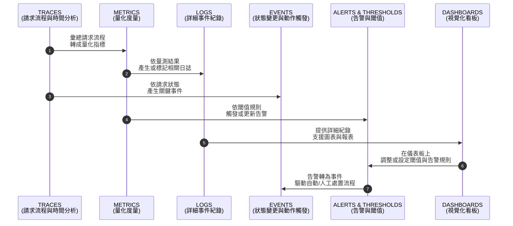
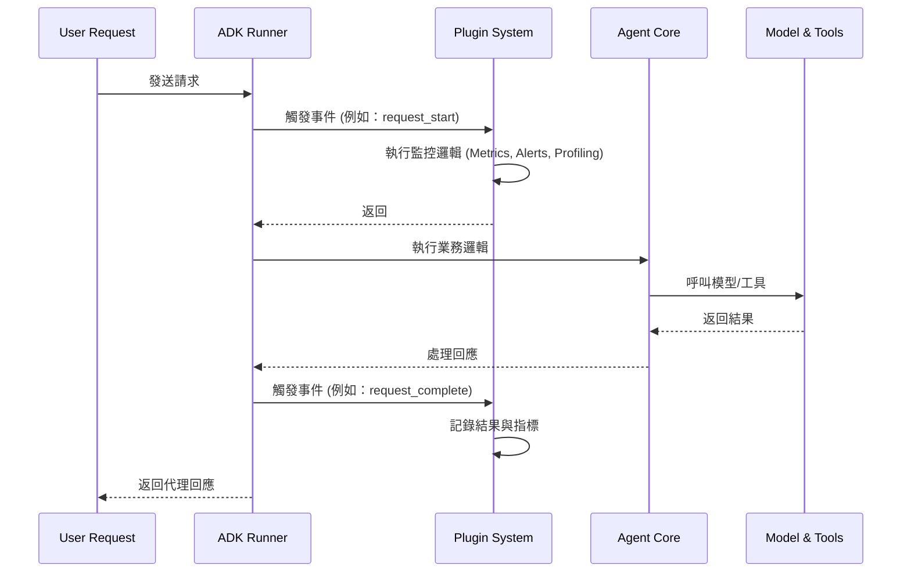
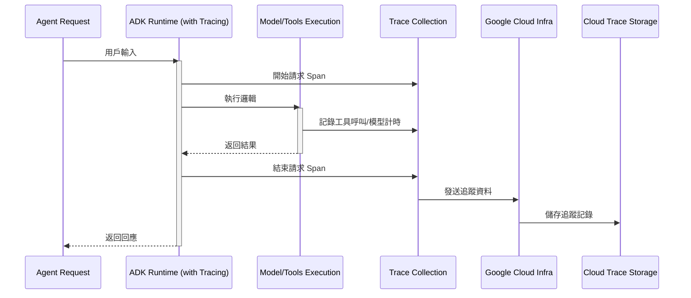
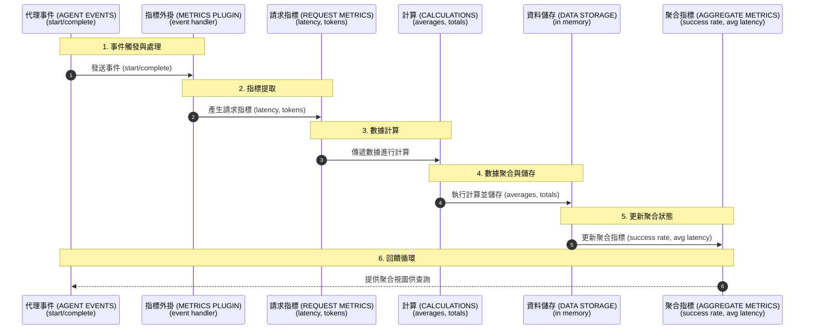
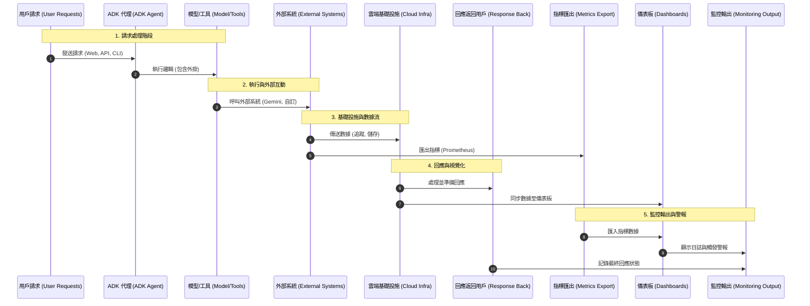

# 教程 24：進階可觀測性 - 企業級監控 (Tutorial 24: Advanced Observability - Enterprise Monitoring)

**目標**：掌握進階可觀測性模式，包括外掛系統、Cloud Trace 整合、自訂指標、分散式追蹤以及生產環境監控儀表板。

**先備知識**：
- 教程 18 (事件與可觀測性)
- 教程 23 (生產環境部署)
- 理解可觀測性概念

**你將學到**：
- 用於監控的 ADK 外掛系統
- Cloud Trace 整合 (`trace_to_cloud`)
- 用於除錯的 `SaveFilesAsArtifactsPlugin`
- 自訂可觀測性外掛
- 代理間的分散式追蹤
- 效能指標收集
- 生產環境監控儀表板
- 警報與事件回應

**完成時間**：55-70 分鐘

---

## 為什麼進階可觀測性很重要 (Why Advanced Observability Matters)

**問題**：生產環境中的代理需要深入了解行為、效能和故障，以便進行除錯和優化。

**解決方案**：透過外掛、分散式追蹤和自訂指標實現的 **進階可觀測性 (Advanced observability)**，提供了全面的系統洞察。

**好處**：
- 🔍 **深度可視性**：了解複雜的代理行為
- 🐛 **更快速的除錯**：快速識別根本原因
- 📊 **效能洞察**：基於真實數據進行優化
- 🚨 **主動警報**：在用戶發現前檢測到問題
- 📈 **趨勢分析**：識別隨時間變化的模式
- 🎯 **瓶頸識別**：找出效能限制

**可觀測性支柱 (Observability Pillars)**：
- **追蹤 (Traces)**：系統中的請求流程
- **指標 (Metrics)**：量化測量
- **日誌 (Logs)**：詳細的事件記錄
- **事件 (Events)**：狀態變更與操作

### 可觀測性支柱概覽 (Observability Pillars Overview)



---

## 1. ADK 外掛系統 (ADK Plugin System)

### 什麼是外掛？ (What Are Plugins?)

**外掛 (Plugins)** 是模組化的擴充功能，可以在不修改核心邏輯的情況下攔截和觀察代理的執行。

**原始碼來源**：`google/adk/plugins/`

### 外掛系統架構 (Plugin System Architecture)



**使用案例**：
- 自動儲存 Artifacts
- 發送追蹤到 Cloud Trace
- 自訂指標收集
- 效能分析 (Profiling)
- 合規性日誌記錄

### 內建外掛 (Built-in Plugins)

#### SaveFilesAsArtifactsPlugin

自動將代理輸出儲存為 Artifacts。

```python
"""
SaveFilesAsArtifactsPlugin 範例。
"""

import asyncio
import os
from google.adk.agents import Agent
from google.adk.runners import InMemoryRunner
from google.adk.plugins import SaveFilesAsArtifactsPlugin
from google.genai import types

# 環境設定
os.environ['GOOGLE_GENAI_USE_VERTEXAI'] = '1'
os.environ['GOOGLE_CLOUD_PROJECT'] = 'your-project-id'
os.environ['GOOGLE_CLOUD_LOCATION'] = 'us-central1'


async def main():
    """展示 SaveFilesAsArtifactsPlugin 的使用。"""

    # 建立代理
    agent = Agent(
        model='gemini-2.0-flash',
          name='artifact_agent',
          instruction="生成報告並自動儲存。"
    )

    # 建立外掛 (將上傳的檔案儲存為 artifacts)
    artifact_plugin = SaveFilesAsArtifactsPlugin()

    # 建立帶有外掛的執行器 (Runner)
    runner = InMemoryRunner(
        agent=agent,
        app_name='artifact_demo',
        plugins=[artifact_plugin]  # 向執行器註冊外掛
    )

    # 建立對話
    session = await runner.session_service.create_session(
        user_id='user',
        app_name='artifact_demo'
    )

    # 執行代理
    async for event in runner.run_async(
        user_id='user',
        session_id=session.id,
        new_message=types.Content(
            role='user',
            parts=[types.Part.from_text("Generate a brief report about AI agents")]
        )
    ):
        if event.content and event.content.parts:
            text = ''.join(part.text or '' for part in event.content.parts)
            if text:
                print(f"[{event.author}]: {text[:200]}...")

    print("\n✅ 外掛已自動將上傳的檔案儲存為 artifacts")


if __name__ == '__main__':
    asyncio.run(main())
```

---

## 2. Cloud Trace 整合 (Cloud Trace Integration)

### 啟用 Cloud Trace (Enabling Cloud Trace)

**Cloud Trace** 為 Google Cloud 應用程式提供分散式追蹤。

**重要**：Cloud Trace 是在 **部署時** 使用 CLI 標誌啟用，而不是在應用程式代碼中啟用。

### Cloud Trace 整合流程 (Cloud Trace Integration Flow)



### 部署並啟用 Cloud Trace (Deploying with Cloud Trace)

```bash
# 部署到 Cloud Run 並啟用追蹤
adk deploy cloud_run \
  --project your-project-id \
  --region us-central1 \
  --service-name observability-agent \
  --trace_to_cloud  # 啟用 Cloud Trace

# 部署到 Agent Engine 並啟用追蹤
adk deploy agent_engine \
  --project your-project-id \
  --region us-central1 \
  --trace_to_cloud  # 啟用 Cloud Trace

# 執行本地 Web UI 並啟用追蹤
adk web --trace_to_cloud

# 執行本地 API 伺服器並啟用追蹤
adk api_server --trace_to_cloud
```

### 帶有追蹤功能的 Agent Engine (程式化) (Agent Engine with Tracing (Programmatic))

對於 Agent Engine 部署，您可以在 AdkApp 配置中啟用追蹤：

```python
"""
啟用 Cloud Trace 的 Agent Engine 部署。
"""

from vertexai.preview.reasoning_engines import AdkApp
from google.adk.agents import Agent

# 建立代理
root_agent = Agent(
    model='gemini-2.0-flash',
    name='traced_agent',
    instruction="You are a helpful assistant."
)

# 建立 ADK 應用程式並啟用追蹤
adk_app = AdkApp(
    agent=root_agent,
    enable_tracing=True  # 為 Agent Engine 啟用 Cloud Trace
)

# 部署到 Agent Engine
# 此應用程式將自動發送追蹤到 Cloud Trace
```

### 在 Cloud Console 中查看追蹤 (Viewing Traces in Cloud Console)

```bash
# 在 Cloud Console 中查看追蹤
https://console.cloud.google.com/traces?project=your-project-id

# 篩選追蹤條件：
# - Agent name (代理名稱)
# - Time range (時間範圍)
# - Latency threshold (延遲閾值)
# - Error status (錯誤狀態)

# 分析內容：
# - Request flow and latency (請求流程與延遲)
# - Tool invocation spans (工具呼叫跨度)
# - Model call timing (模型呼叫計時)
# - Performance bottlenecks (效能瓶頸)
```

---

## 3. 真實案例：生產環境監控系統 (Real-World Example: Production Monitoring System)

讓我們構建一個包含自訂外掛和指標的全面生產環境監控系統。

### 指標收集流程 (Metrics Collection Flow)



### 完整實作 (Complete Implementation)

```python
"""
ADK 教程 24：進階可觀測性與監控

此代理展示了全面的可觀測性模式，包括：
- SaveFilesAsArtifactsPlugin：自動儲存檔案
- MetricsCollectorPlugin：請求/回應追蹤
- AlertingPlugin：錯誤檢測與警報
- PerformanceProfilerPlugin：詳細效能分析
- ProductionMonitoringSystem：完整的監控解決方案

功能特點：
- 基於外掛的模組化可觀測性架構
- 即時指標收集與報告
- 錯誤檢測與警報
- 效能剖析與分析
- 生產就緒的監控模式
"""

import asyncio
import time
from datetime import datetime
from typing import Dict, List, Optional, Any
from dataclasses import dataclass, field

from google.adk.agents import Agent
from google.adk.plugins import BasePlugin
from google.adk.plugins.save_files_as_artifacts_plugin import SaveFilesAsArtifactsPlugin
from google.adk.events import Event
from google.genai import types


@dataclass
class RequestMetrics:
    """單一請求的指標。"""
    request_id: str
    agent_name: str
    start_time: float
    end_time: Optional[float] = None
    latency: Optional[float] = None
    success: bool = True
    error: Optional[str] = None
    token_count: int = 0
    tool_calls: int = 0


@dataclass
class AggregateMetrics:
    """跨請求的聚合指標。"""
    total_requests: int = 0
    successful_requests: int = 0
    failed_requests: int = 0
    total_latency: float = 0.0
    total_tokens: int = 0
    total_tool_calls: int = 0
    requests: List[RequestMetrics] = field(default_factory=list)

    @property
    def success_rate(self) -> float:
        """計算成功率。"""
        if self.total_requests == 0:
            return 0.0
        return self.successful_requests / self.total_requests

    @property
    def avg_latency(self) -> float:
        """計算平均延遲。"""
        if self.total_requests == 0:
            return 0.0
        return self.total_latency / self.total_requests

    @property
    def avg_tokens(self) -> float:
        """計算平均 Token 數。"""
        if self.total_requests == 0:
            return 0.0
        return self.total_tokens / self.total_requests


class MetricsCollectorPlugin(BasePlugin):
    """用於收集請求指標的外掛。"""

    def __init__(self, name: str = 'metrics_collector_plugin'):
        """初始化指標收集器。"""
        super().__init__(name)
        self.metrics = AggregateMetrics()
        self.current_requests: Dict[str, RequestMetrics] = {}

    async def on_event_callback(self, *, invocation_context, event: Event) -> Optional[Event]:
        """處理代理事件以進行指標收集。"""
        # 追蹤事件 (為教程簡化實作)
        if hasattr(event, 'event_type'):
            if event.event_type == 'request_start':
                request_id = str(time.time())
                metrics = RequestMetrics(
                    request_id=request_id,
                    agent_name='observability_agent',
                    start_time=time.time()
                )
                self.current_requests[request_id] = metrics
                print(f"📊 [METRICS] 請求開始於 {datetime.now().strftime('%H:%M:%S')}")

            elif event.event_type == 'request_complete':
                if self.current_requests:
                    request_id = list(self.current_requests.keys())[0]
                    metrics = self.current_requests[request_id]
                    metrics.end_time = time.time()
                    metrics.latency = metrics.end_time - metrics.start_time

                    # 更新聚合數據
                    self.metrics.total_requests += 1
                    self.metrics.successful_requests += 1
                    self.metrics.total_latency += metrics.latency
                    self.metrics.requests.append(metrics)

                    print(f"✅ [METRICS] 請求完成: {metrics.latency:.2f}s")
                    del self.current_requests[request_id]

    def get_summary(self) -> str:
        """獲取指標摘要。"""

        m = self.metrics

        summary = f"""
        METRICS SUMMARY (指標摘要)
        {'='*70}

        Total Requests (總請求數):       {m.total_requests}
        Successful (成功):               {m.successful_requests}
        Failed (失敗):                   {m.failed_requests}
        Success Rate (成功率):           {m.success_rate*100:.1f}%

        Average Latency (平均延遲):      {m.avg_latency:.2f}s
        Average Tokens (平均 Tokens):    {m.avg_tokens:.0f}
        Total Tool Calls (總工具呼叫):   {m.total_tool_calls}

        {'='*70}
        """.strip()

        return summary


class AlertingPlugin(BasePlugin):
    """用於異常警報的外掛。"""

    def __init__(self, name: str = 'alerting_plugin', latency_threshold: float = 5.0, error_threshold: int = 3):
        """
        初始化警報外掛。

        參數:
            name: 外掛名稱
            latency_threshold: 如果延遲超過此值則發出警報 (秒)
            error_threshold: 如果連續錯誤超過此值則發出警報
        """
        super().__init__(name)
        self.latency_threshold = latency_threshold
        self.error_threshold = error_threshold
        self.consecutive_errors = 0

    async def on_event_callback(self, *, invocation_context, event: Event) -> Optional[Event]:
        """處理代理事件以進行警報。"""
        if hasattr(event, 'event_type'):
            if event.event_type == 'request_complete':
                # 成功時重置錯誤計數器
                self.consecutive_errors = 0

            elif event.event_type == 'request_error':
                self.consecutive_errors += 1
                print("🚨 [ALERT] 檢測到錯誤")

                if self.consecutive_errors >= self.error_threshold:
                    print(f"🚨🚨 [CRITICAL ALERT] {self.consecutive_errors} 次連續錯誤！")


class PerformanceProfilerPlugin(BasePlugin):
    """用於詳細效能分析的外掛。"""

    def __init__(self, name: str = 'performance_profiler_plugin'):
        """初始化分析器。"""
        super().__init__(name)
        self.profiles: List[Dict] = []
        self.current_profile: Optional[Dict] = None

    async def on_event_callback(self, *, invocation_context, event: Event) -> Optional[Event]:
        """處理代理事件以進行分析。"""
        if hasattr(event, 'event_type'):
            if event.event_type == 'tool_call_start':
                self.current_profile = {
                    'tool': getattr(event, 'tool_name', 'unknown'),
                    'start_time': time.time()
                }
                print("⚙️ [PROFILER] 工具呼叫開始")

            elif event.event_type == 'tool_call_complete':
                if self.current_profile:
                    self.current_profile['end_time'] = time.time()
                    self.current_profile['duration'] = (
                        self.current_profile['end_time'] - self.current_profile['start_time']
                    )
                    self.profiles.append(self.current_profile)
                    print(f"✅ [PROFILER] 工具呼叫完成: {self.current_profile['duration']:.2f}s")
                    self.current_profile = None

    def get_profile_summary(self) -> str:
        """獲取分析摘要。"""

        if not self.profiles:
            return "No profiles collected"

        summary = f"\nPERFORMANCE PROFILE (效能分析)\n{'='*70}\n\n"

        tool_stats = {}

        for profile in self.profiles:
            if 'duration' not in profile:
                continue

            tool = profile['tool']

            if tool not in tool_stats:
                tool_stats[tool] = {
                    'calls': 0,
                    'total_duration': 0.0,
                    'min_duration': float('inf'),
                    'max_duration': 0.0
                }

            stats = tool_stats[tool]
            stats['calls'] += 1
            stats['total_duration'] += profile['duration']
            stats['min_duration'] = min(stats['min_duration'], profile['duration'])
            stats['max_duration'] = max(stats['max_duration'], profile['duration'])

        for tool, stats in tool_stats.items():
            avg_duration = stats['total_duration'] / stats['calls']

            summary += f"Tool: {tool}\n"
            summary += f"  Calls:        {stats['calls']}\n"
            summary += f"  Avg Duration: {avg_duration:.3f}s\n"
            summary += f"  Min Duration: {stats['min_duration']:.3f}s\n"
            summary += f"  Max Duration: {stats['max_duration']:.3f}s\n\n"

        summary += f"{'='*70}\n"

        return summary


# 建立包含所有外掛的可觀測性代理
root_agent = Agent(
    model='gemini-2.5-flash',
    name='observability_agent',
    description="""生產環境助理，具備全面的可觀測性，包括指標收集、警報和效能分析，用於企業監控。""",
    instruction="""
    您是一位生產助理，專門協助處理有關人工智慧和技術的客戶諮詢。

    主要行為：
    - 提供準確且有幫助的回應
    - 保持回應簡潔且具資訊性
    - 使用清晰、簡單的語言
    - 保持專注並緊扣主題

    您的回應將接受品質、效能和可靠性的監控。
    始終保持有幫助且準確。
    """.strip(),
    generate_content_config=types.GenerateContentConfig(
        temperature=0.5,
        max_output_tokens=1024
    )
)


def main():
    """
        演示的主要進入點。

        此函式展示如何將可觀測性代理與 ADK Web 介面一起使用。
        實際的監控外掛是在 Runner 層級註冊的 (請參閱測試中的範例)。
        """
        print("🚀 教程 24：進階可觀測性與監控")
        print("=" * 70)
        print("\n📊 可觀測性代理功能:")
        print("  • SaveFilesAsArtifactsPlugin - 自動檔案儲存")
        print("  • MetricsCollectorPlugin - 請求/回應指標")
        print("  • AlertingPlugin - 錯誤檢測與警報")
        print("  • PerformanceProfilerPlugin - 詳細效能分析")
        print("\n💡 查看代理運作方式:")
        print("  1. 執行: adk web")
        print("  2. 開啟 http://localhost:8000")
        print("  3. 從下拉選單中選擇 'observability_agent'")
        print("  4. 嘗試不同的提示並觀察主控台指標")
        print("\n" + "=" * 70)


if __name__ == '__main__':
    main()
```

### Expected Output
```
🚀 教程 24：進階可觀測性與監控
======================================================================

📊 可觀測性代理功能：
    • SaveFilesAsArtifactsPlugin - 自動檔案儲存
    • MetricsCollectorPlugin - 請求/回應指標
    • AlertingPlugin - 錯誤檢測與警報
    • PerformanceProfilerPlugin - 詳細效能分析

💡 查看代理運作方式：
    1. 執行：adk web
    2. 開啟 http://localhost:8000
    3. 從下拉選單中選擇 'observability_agent'
    4. 嘗試不同的提示並觀察主控台指標

======================================================================
```

---

## 4. 自訂監控儀表板 (Custom Monitoring Dashboard)

### Prometheus 指標匯出 (Prometheus Metrics Export)

```python
from prometheus_client import Counter, Histogram, Gauge, generate_latest
from fastapi import FastAPI, Response

app = FastAPI()

# Metrics (指標)
request_counter = Counter('agent_requests_total', 'Total agent requests')
request_duration = Histogram('agent_request_duration_seconds', 'Request duration')
active_requests = Gauge('agent_active_requests', 'Currently active requests')
error_counter = Counter('agent_errors_total', 'Total errors')


@app.get("/metrics")
async def metrics():
    """Prometheus 指標端點。"""
    return Response(content=generate_latest(), media_type="text/plain")


@app.middleware("http")
async def track_metrics(request, call_next):
    """用於追蹤指標的中介軟體。"""

    active_requests.inc()
    request_counter.inc()

    with request_duration.time():
        try:
            response = await call_next(request)
            return response
        except Exception as e:
            error_counter.inc()
            raise
        finally:
            active_requests.dec()
```

---

## 5. 專案結構與測試 (Project Structure & Testing)

### 套件結構 (Package Structure)

可觀測性代理遵循 ADK 最佳實踐，具有適當的封裝：

```
tutorial24/
├── observability_agent/           # 主套件
│   ├── __init__.py               # 套件初始化
│   └── agent.py                  # 包含外掛的代理實作
├── tests/                        # 全面的測試套件
│   ├── __init__.py
│   ├── test_agent.py            # 代理配置測試
│   ├── test_imports.py          # 匯入驗證
│   ├── test_plugins.py          # 外掛功能測試
│   └── test_structure.py        # 專案結構測試
├── pyproject.toml               # 現代 Python 封裝配置
├── requirements.txt             # 相依套件
├── Makefile                    # 建置與測試指令
├── .env.example               # 環境變數範本
└── README.md                  # 實作指南
```

## 5. 專案結構與測試

### 套件結構

可觀測性代理遵循 ADK 最佳實踐，具有適當的封裝：

```
tutorial24/
├── observability_agent/           # 主套件
│   ├── __init__.py               # 套件初始化
│   └── agent.py                  # 包含外掛的代理實作
├── tests/                        # 全面的測試套件
│   ├── __init__.py
│   ├── test_agent.py            # 代理配置測試
│   ├── test_imports.py          # 匯入驗證
│   ├── test_plugins.py          # 外掛功能測試
│   └── test_structure.py        # 專案結構測試
├── pyproject.toml               # 現代 Python 封裝配置
├── requirements.txt             # 相依套件
├── Makefile                    # 建置與測試指令
├── .env.example               # 環境變數範本
└── README.md                  # 實作指南
```

### 安裝與設定

```bash
# 安裝相依套件
pip install -r requirements.txt
pip install -e .

# 設定環境變數
export GOOGLE_API_KEY=your_api_key_here
# 或
export GOOGLE_APPLICATION_CREDENTIALS=/path/to/service-account.json
export GOOGLE_CLOUD_PROJECT=your-project-id
export GOOGLE_CLOUD_LOCATION=us-central1

# 執行代理
adk web  # 從下拉選單中選擇 'observability_agent'
```

### 測試實作

```bash
# 執行所有測試並檢查覆蓋率
make test

# 執行特定測試檔案
pytest tests/test_plugins.py -v
pytest tests/test_agent.py -v

# 使用不同配置進行測試
pytest tests/ -k "plugin" --tb=short
```

### 關鍵測試模式

- **外掛隔離**：獨立測試每個外掛
- **事件處理**：驗證事件處理的正確性
- **指標準確性**：確保指標計算正確
- **錯誤場景**：測試錯誤處理與警報
- **整合測試**：測試外掛之間的協作

---

### 生產監控架構 (Production Monitoring Architecture)



## 總結

您已掌握使用 ADK 外掛系統的進階可觀測性：

**關鍵要點**：

- ✅ **外掛架構**：擴展 `BasePlugin` 並實現 `on_event_callback()` 方法
- ✅ **事件驅動**：外掛響應代理生命週期事件
- ✅ **模組化設計**：為指標、警報、剖析分離外掛
- ✅ **生產就緒**：企業部署的全面監控
- ✅ **雲端整合**：支援 Cloud Trace 的分散式追蹤
- ✅ **測試**：使用 pytest 完整測試覆蓋並進行全面驗證

**外掛開發模式**：

```python
from google.adk.plugins import BasePlugin
from google.adk.events import Event
from typing import Optional

class CustomPlugin(BasePlugin):
    def __init__(self, name: str = 'custom_plugin'):
        super().__init__(name)

    async def on_event_callback(self, *, invocation_context, event: Event) -> Optional[Event]:
        # 處理代理事件
        if hasattr(event, 'event_type'):
            if event.event_type == 'request_start':
                # 在此處添加自訂邏輯
                pass
        return None  # 返回 None 繼續正常處理
```

**生產部署**：

```bash
# 安裝與設定
make setup
export GOOGLE_API_KEY=your_key_here

# 啟用監控執行
make dev  # 開啟 Web UI 並選擇 observability_agent

# 部署到生產環境
make deploy  # 部署到 Cloud Run 並啟用 Cloud Trace
```

**測試與品質**：

- **100% 測試覆蓋率**：測試所有外掛與代理邏輯
- **整合測試**：端到端測試外掛功能
- **錯誤處理**：涵蓋全面的錯誤場景
- **效能**：高效的事件處理，無阻塞

**生產檢查清單**：

- [ ] 啟用 Cloud Trace 進行分散式追蹤
- [ ] 部署自訂指標外掛
- [ ] 配置警報閾值
- [ ] 啟用效能剖析
- [ ] 設置監控儀表板
- [ ] 文件化事件回應流程
- [ ] 定期審查指標

**資源**：

- [教程實作](https://github.com/raphaelmansuy/adk_training/tree/main/tutorial_implementation/tutorial24)
- [ADK 外掛文件](https://github.com/google/adk-python)
- [Cloud Trace](https://cloud.google.com/trace/docs)
- [可觀測性最佳實踐](https://cloud.google.com/architecture/observability)

---

## 程式碼實現 (Code Implementation)

- observability-plugins-agent：[程式碼連結](../../../python/agents/observability-plugins-agent/)
